大家好，我是 **陌溪**

今天，打开 **Gitee** 的时候，偶然翻到了博客系统这个类目，突然发现蘑菇博客竟然登顶了~

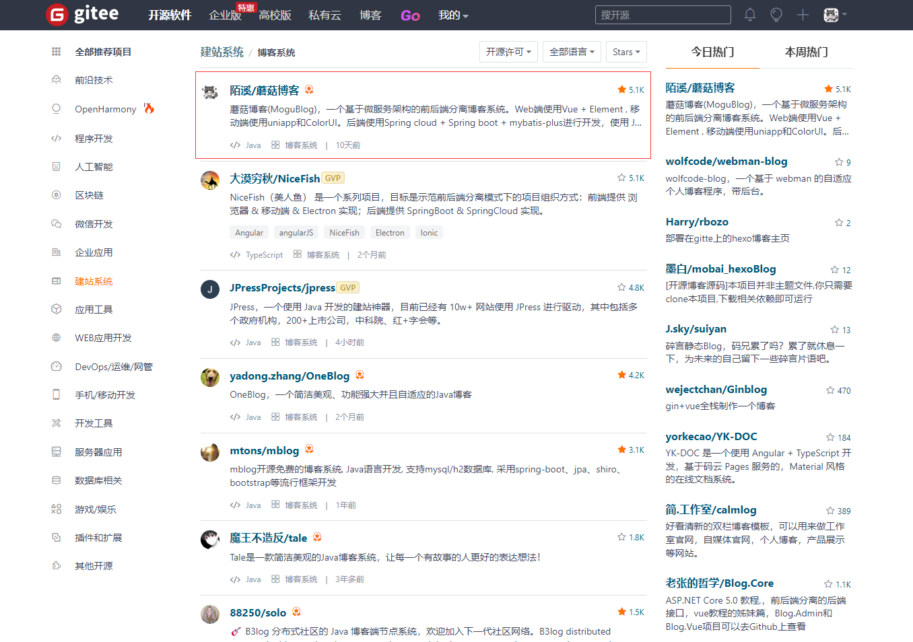

虽然 **5.1K** 的 **Star** 相比于其它的热门开源项目来说不算什么。

但是作为博客这一个小类目来说，关注这个类目的群体本身也不会太多，所以能够一步步登顶还是挺让我开心的，毕竟在蘑菇博客中，也见证了我的一步步成长。

本期，就让我来一起聊一聊蘑菇博客成长史吧~

蘑菇博客诞生于 **2018** 年 **9** 月 **8** 日，也就是我在读研的第一天，在实验室里提交了蘑菇的第一行代码~

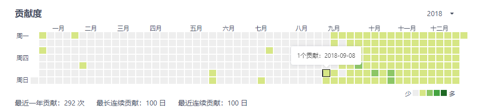

如果细心的小伙伴可能会发现，蘑菇博客的仓库名是 **mogu_blog_v2**。为啥会叫 **v2** ？

```bash
https://gitee.com/moxi159753/mogu_blog_v2
```

是因为早在开源的蘑菇博客之前，陌溪还写过一个蘑菇博客，我们就叫他 **蘑菇V1**。

## 蘑菇V1

蘑菇博客V1诞生的背景：在 **2017**年，我去一家小公司实习的时候，用的是 **SSM** 框架，为了能够加深对使用框架的学习，所以就自己搭建了一套博客框架，采用的是 **Spring**、**SpringMVC**、**MyBatis**，同时前端框架使用的是 **EasyUi**  和 **FreeMark**，全文检索使用的是 **Solr**。

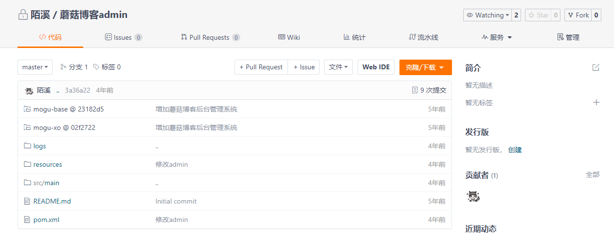

喏，下面就是 **蘑菇V1** 运行起来的样子，就是下面的样子：

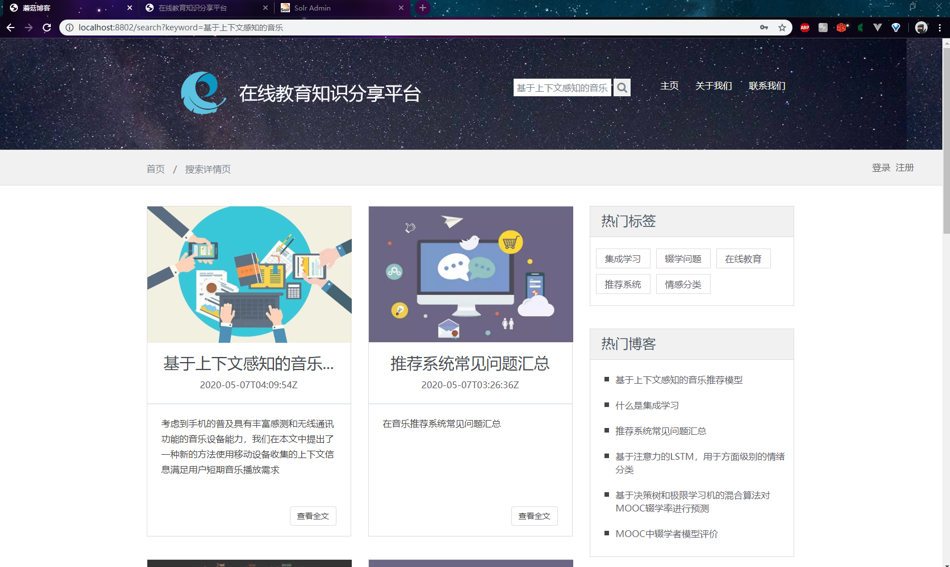

下面是 **蘑菇V1** 的后台管理页面，也是找了个花里胡哨的背景

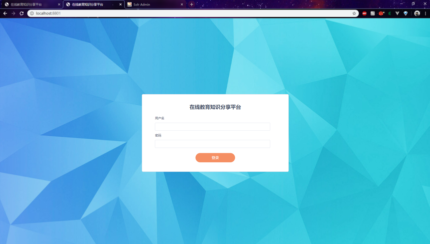

但是，不得不吐槽一下，那会用 **EasyUI** 的做出来的后台样式实在不太好看

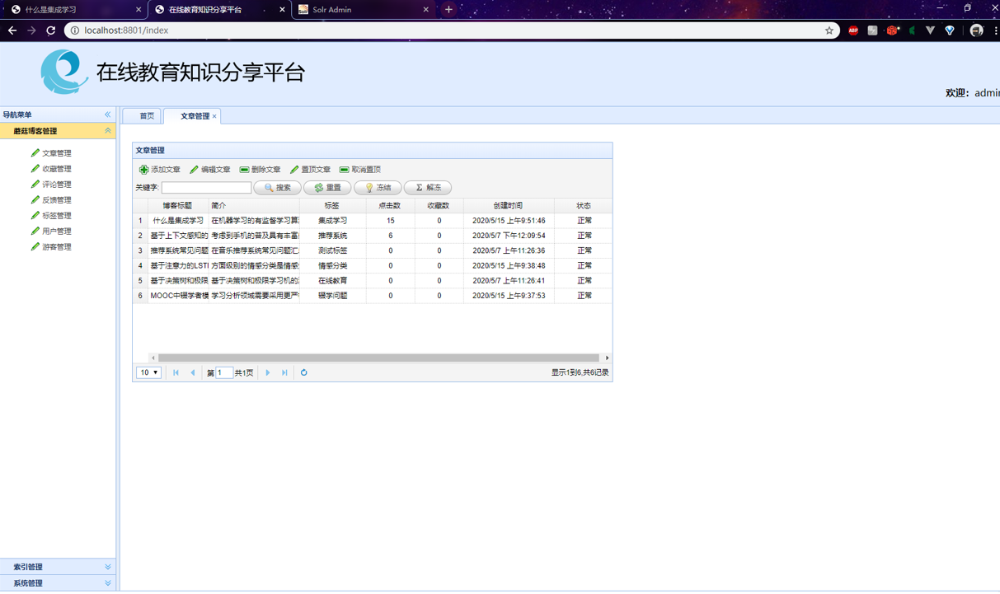

在读研期间，陌溪也是把压箱底的 **蘑菇V1** 拿了出来，整理了一波**软件源码**、**软件说明书**、**申请书** 等材料，用来申请了软件著作权，成功混了一波奖学金

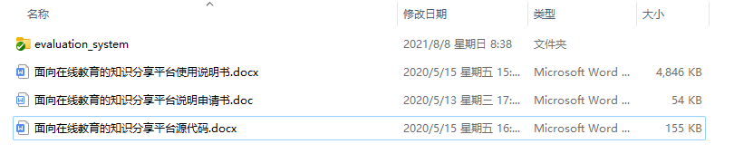


由于，当时还怎么会使用 **Git**，并且也没有开源的意识，所以 **蘑菇V1** 就这样被封存起来了。

## 蘑菇V2诞生

**2018** 年的时候，**SpringBoot** 和 **Vue** 已经慢慢火起来了，并且微服务架构也慢慢变得流行，那会迫切想要去了解和掌握这些技术，因此就想寻找切入点。

于是，**蘑菇博客V2** 就诞生了，因为之前给蘑菇博客的定位就是一个学习项目。因此，项目的技术选型都是当时比较新颖的技术，可能这些技术并不一定适用于博客系统。

 **Web** 端使用 **Vue + Element** ，移动端使用 **uniapp** 和 **ColorUI**。后端使用 **Spring Cloud** 、**Spring Boot** 、**Mybatis-Plus** 进行开发，使用 **JWT** 、**Spring Security** 做登录验证和权限校验，使用 **ElasticSearch** 和 **Solr** 作为全文检索服务，使用 **Github Actions** 完成博客的持续集成，使用 **ELK** 收集博客日志，文件支持上传七牛云和 **Minio**，支持 **Docker Compose** 脚本一键部署。

当然，给蘑菇博客用上这些微服务技术，也被不少人笑话，毕竟**杀鸡焉用牛刀** ？

不过我的定位也非常明确，就是给蘑菇堆料，把没有用过的技术在蘑菇中找到使用场景，并把它运用起来。如果这个技术不懂的话，那就去 **B** 站学习

所以在研一的时候，基本上没有课程的时候，就会打开 **B** 站，在里面快乐的学习，然后学完之后，在蘑菇上进行实践，每天乐此不疲~

那会学习了 **SpringCloud** 技术栈的时候，学习了 **Eureka**、**Ribbon**、**Feign**、**Config**，但是准备学 **Gateway** 的时候，发现视频下架了！

后面也偷懒了，想着多一个服务，多占一份服务器资源，就没有继续看 **Gateway** 相关的内容了

因此，细心的小伙伴可能会发现，蘑菇早期的版本，是没有 **mogu-gateway** 服务的，前端是直接请求各自的资源服务。

就这样，不断的在学习、写蘑菇中度过了一年的时光，在 **2019** 年 **12** 月 **14** 日的时候，蘑菇第一次成为了**推荐项目**，上了一次 **Gitee** 的推荐排行榜。因为在这一年的时光里，蘑菇博客页没怎么宣传，所以只有 **55** 个 **Star**。


在 **Gitee** 推荐霸榜的一段时间里，蘑菇的 **Star** 数也比之前一年的都多，一下就涨到了 **300** 多的 **Star**，那会看着 **Star** 数量在增加，还是挺开心的。


当然，随着而来的烦恼也过来了，就是越来越多的小伙伴想要在自己的电脑上搭建蘑菇，但是那会蘑菇基本上没有啥文档，全靠自己摸索，所以在搭建的时候也遇到各种各样的坑。

为了帮忙小伙伴们能够顺利搭建起蘑菇环境，使用 **docsify** 搭建了蘑菇开源文档

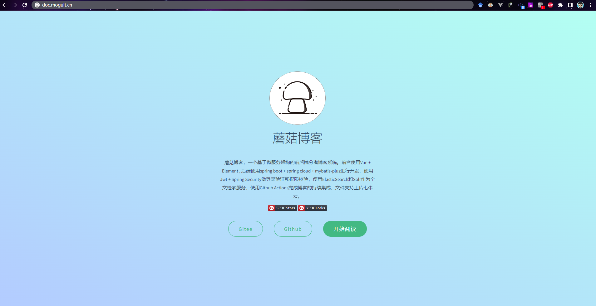

在蘑菇文档中，把 **Windows** 搭建，**Linux** 部署、**Docker** 部署都写了进去，文档写的比较详细，也受到不少小伙伴的支持~

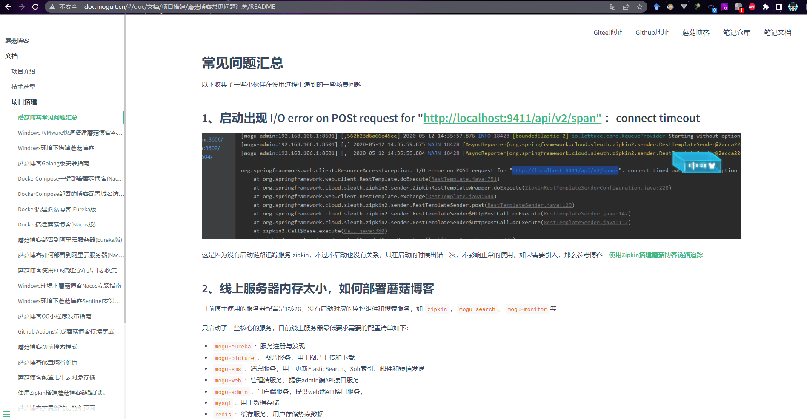

就这样，**2020**年 **7** 月 **28** 日，蘑菇博客成功达到 **1000** **Star**，也完成了之前给自己设定的小目标

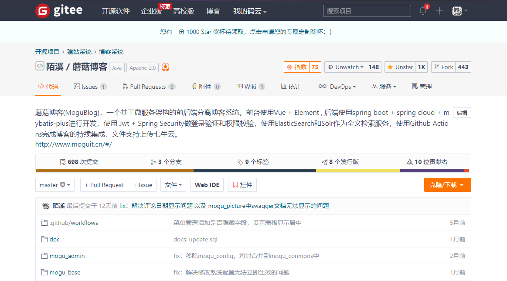

收到了 **Gitee** 官方邮寄过来的奖杯~

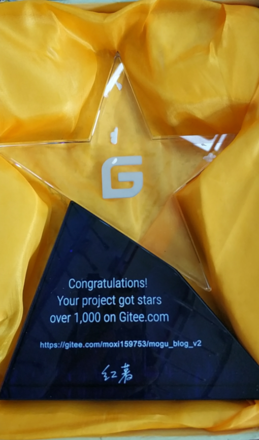

## 通过做开源学到了什么？

说实话，做开源项目其实是一件挺累的事情，因为有各种各样的小伙伴，可能会遇到不同的问题，然后都在 **@** 你进行提问。虽然有很多问题都是在上面的文档中有讲到，我也很想回复一句：  


但是，想着这个小伙伴可能真的没找到在哪里，所以我也会主动把文档的第几页贴给他，帮忙踩坑。

同时我也希望在遇到问题的时候，能够多看看官方文档，以及对应的 **issue** 搜索一下，掌握提问的智慧：[为什么我向开源项目作者提问，他却不理我？](https://mp.weixin.qq.com/s?__biz=MzkyMzE5NTYzMA==&mid=2247487276&idx=1&sn=e786d5849fec6d05c7feaded2fb38727&chksm=c1e98eadf69e07bbb7fcf900aa6a4a5fddfb13c8d857a20542856b766b6fe89ebfde2451247a#rd)

其实，在给别人解决问题，也是一个学习的过程，能够处理各种疑难杂症，并输出文档帮助后面的小伙伴顺利完成搭建。

早期的蘑菇搭建其实是特别复杂的，需要自己去安装各种环境：为了帮助小伙伴能够快速搭建，学习了 **Docker**、**Docker-Compose**，并且最终实现了**一条命令一键部署**。

通过做开源项目，最主要的是可以认识到更多志同相合的小伙伴，一起给蘑菇添砖加瓦。蘑菇能一路走来，其实也离不开各位同学的贡献~

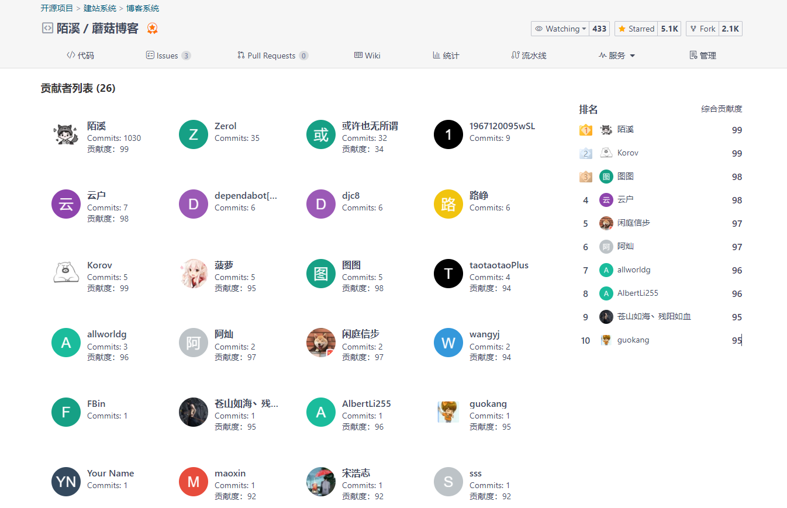

在做开源的过程，也是一个自我学习，因为能够自驱的让自己处于持续充电的状态，不断的学习和借鉴别人优秀的开源作品，来打磨自己的项目，和公司中的项目不同的是，自己做开源项目是没有 **KPI** 压力的，也没有人催着你的进度，完全是靠兴趣去学习的，所以你可能会做的很快乐。

有开源作品，一方面是可以提高自己的行业影响力，让自己在面试的时候能够更加突出。

例如：原来我在校招的时候，面试的字节跳动、滴滴出行、京东 等公司，基本上在 **一面**、二面、甚至在**三面**的时候，都对我的蘑菇博客项目感兴趣，然后在蘑菇上挖掘了比较多的知识点进行讲解，所以说在校期间有一个自己的开源项目，是挺加分的。

印象比较深刻的一件事，是在面试滴滴的时候，二面的面试官直接就打开：**蘑菇博客** 仓库，然后跟着蘑菇的架构图中的知识点来进行一顿提问。


面完之后，我们一起聊了一下做开源的事情，也对做这件事情表示了肯定，同时希望我能够不断坚持下去~

最后，我也希望现在在校的同学们，也能够动手做一个自己的开源项目。

好了，我是陌溪，我们下期再见。

