大家好，我是**陌溪**

周末的时候，陌溪兴高采烈的准备开始创作（水文），打开 **Typora** 就弹出下面一段内容

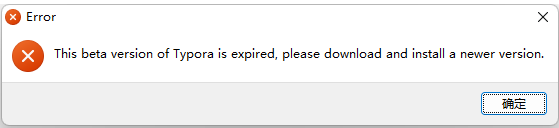

**Typora** 的老版本也不能用了？要强制收费了？？

因为去年 **11** 月份的时候，**Typora** 推出 **1.0** 版本，然后开始进行收费，但是针对老版本来说，还是可以继续使用的，所以很多升级后的小伙伴，陆陆续续的又降级到老版本继续使用，毕竟对于 **Typora** 的新版本的更新日志，并没有看到亮眼和值得更新的功能，毕竟谁能拒绝白嫖呢。

而今天，**Typora** 老版本也不能白嫖了，打开就提示需要下载更新最新的版本，然后进行付费购买才能继续使用，嗯。。 **89** 块能在三个设备上使用。。

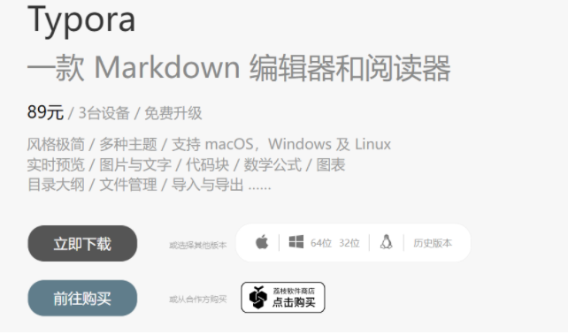

既然不能继续使用了，那就再见了 **Typora** ！

## MarkText

陌溪开始去外面寻找新的桌面版 **Markdown** 编辑器。终于找到了一款 **Github** 上 **Star** **33.7K** 的编辑器： **MarkText** ，一个简单优雅的 **markdown** 编辑器，适用于 **Linux**, **macOS** 和 **Windows** 。

> 官网：https://github.com/marktext/marktext

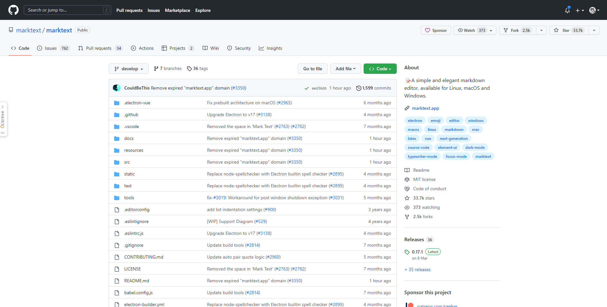

此外，**MarkText** 具备如下特性

- 对数学表达（KaTeX）、front matter 等进行了扩展；

- 支持段落和行内样式快捷方式，以提高用户写作效率；

- 可以输出 HTML 、PDF 文件；

- 支持 Cadmium Light、Material Dark 等 6 种主题；

- 支持 3 种编辑模式：源码模式、打字机模式和专注模式；

- 可以直接从剪贴板粘贴图像。

在 **Github** 的 **release** 页面上，可以下载对应的版本

> https://github.com/marktext/marktext/releases

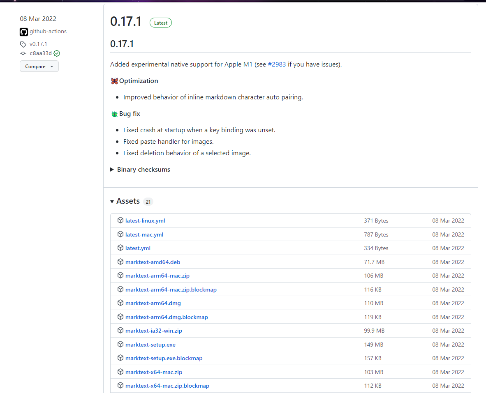

如果小伙伴访问 **Github** 比较卡的话，陌溪也给小伙伴们提前下载好了放在网盘了，在公众号回复：**MarkText** ，即可下载对应的安装包。

下面，可以看一下 **MarkText** 的界面，现在小伙伴们看到的这篇文章，其实就是使用 **MarkText** 书写的。。

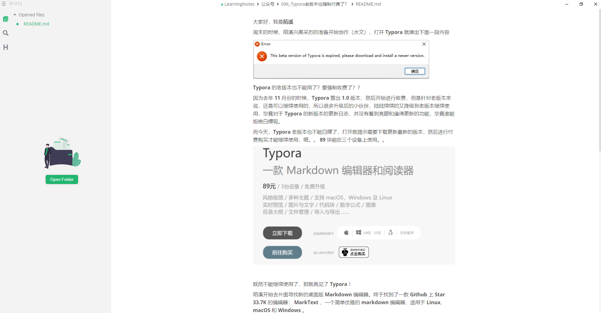

界面看起来，还是比较清爽的，和 **Typora** 比较相似，同时针对每一行来说，都是一个**小块**，有点像字节的飞书文档那样，可以通过块来操作，添加各种内容。

我们点击右边的小图标的时候，就可以有对应的 **Markdown** 命令，以及快捷键提示，也非常使用新手小伙伴（记不住命令的。。）

比如，平时在公司写技术文档的时候，**陌溪**就喜欢用 **PlantUML** 来写业务流程图，点击左侧小图标，就可以快速插入一个 **PlantUML** 了

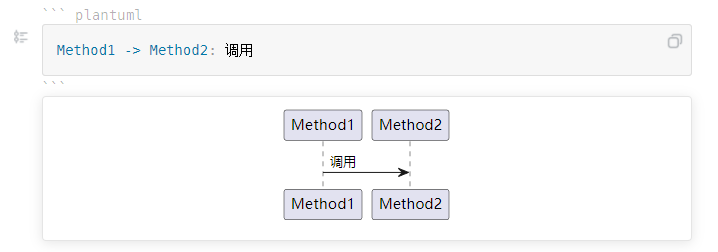

在写错的时候，竟然下面还会出现提示样例，就很棒~

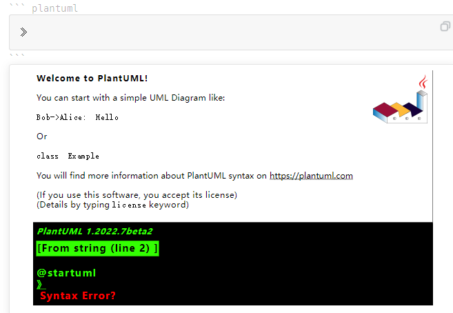

## 修改设置

为了在使用体验上，更加接近 **Typora** ，我们还需要修改一些快捷键，比如

- 使用 ctrl + 1 设置一级标题

- 使用 ctrl + 2 设置二级标题

- ....

首先，点击 **MarkText** 左上角的三条杠，选择 **Feil -> Preferences**，打开系统设置，找到 **Key Bindings** 进行快捷键的修改

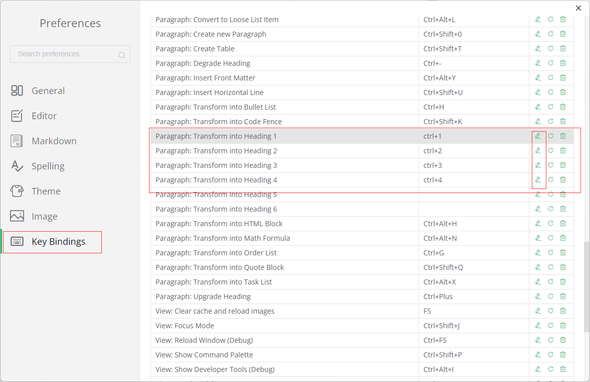

选择编辑图标，将其修改成 **Typora** 对应的快捷键即可

如果在配置的时候，提示冲突了

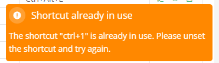

可以在上方，找到对应冲突的快捷键，点击 **reset** 重置按钮，然后重新配置即可

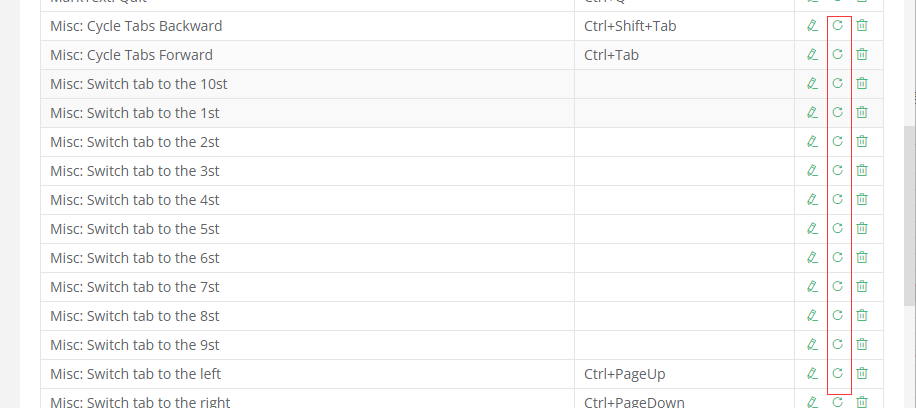

同时，陌溪也习惯将每篇文章对应的图片，都存放在该文章对应的同级目录下

在 **Image** 设置中，可以选择将图片 **Copy** 到全局目录，或者相对目录

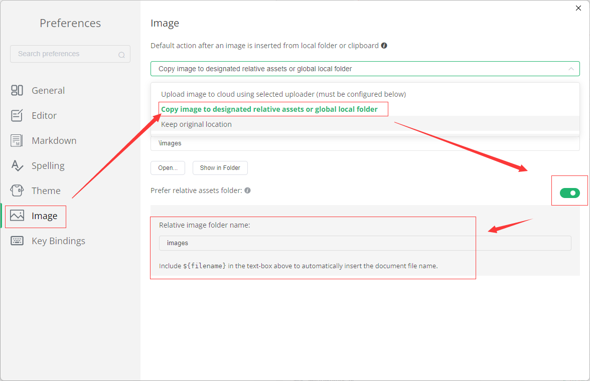

通过上述设置，每次粘贴图片的时候，会在 **Markdown** 文件的同级目录，创建一个 **images** 文件夹中，存放该文章对应的图片

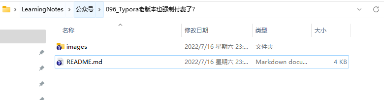

如果打算将图片存储到远程的，**MarkText** 也提供了三种途径，一个是通过 **Picgo**、或者直接推送 **Github**，或者是命令行脚本。

至于为啥没有了 **Gitee**，可能是因为前阵子 **Gitee** 升级防盗链，导致很多号主的文章都没办法正常查看了。。也就是 **Gitee** 现在不能用作 **图床** 的仓库

不过目前还是可以使用 **Github** 作为图床的，目前还没有出现整治的动作

## 主题

在主题方面，**MarkText** 内置了 **6** 种主题，应该可以满足基本的使用了

同时，下方还可以选择是否跟随操作系统自动调节应用主题，下方就是暗黑主题

 

## 不足之处

首先是，没有适配中文，设置都是全英文的，可能对有些小伙伴来说不太友好~

另外就是左侧的大纲栏，每次打开的是都需要重新设置，没有全局生效

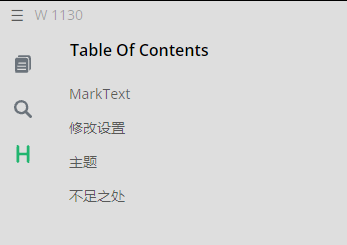

另外一个，就是我在写这篇文章发现的**BUG**，如果使用 ctrl + B 进行加粗的时候，如果左右带了空格，那就不会进行加粗了，变成下面这样~

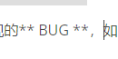

使用了几天来说，整体感觉还算不错，可以作为替换 **Typora** 的主力书写工具使用~

关于 **MarkText** 的更多功能，也欢迎小伙伴下载体验~

好了，本期的软件安利环节就到这里了

我是陌溪，我们下期再见~
