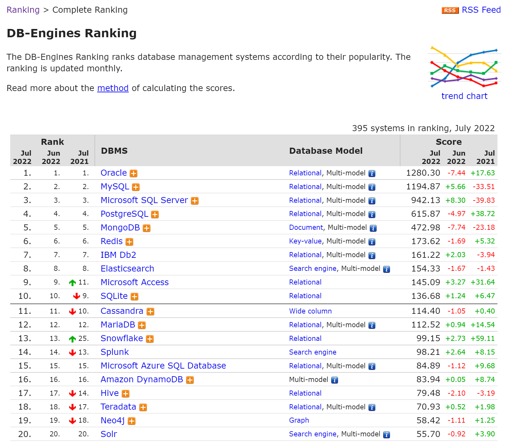
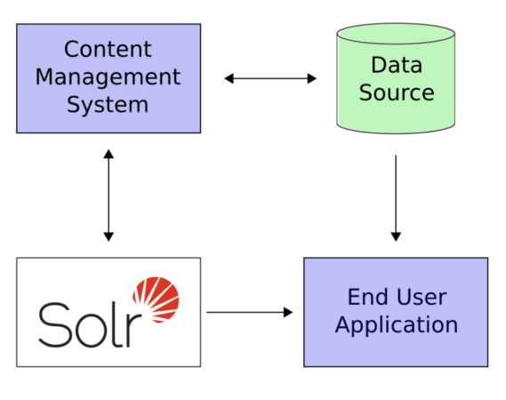
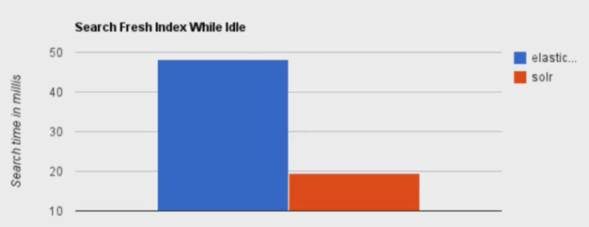

# **ElasticSearch** 原理 & 最佳实践

## 全文检索的起源

互联网的飞速发展使人类进入了信息大爆炸的时代，在信息的海洋里获取想要的信息变得更加困难。

为了解决信息过载的问题，无数科学家和工程师提出了很多解决方案，其中最具代表性的是 **分类目录** 和 **搜索引擎**

分类目录是将网站信息系统地分类整理，提供一个按类别编排的网站目录，比如：早期的一些门户、网站导航

**Elasticsearch**  是用 **Java** 开发并且是当前最流行的开源的企业级搜索引擎。能够达到近实时搜索，稳定，可靠，快速，安装使用方便。

客户端支持 **Java** 、**.NET** ( **C#** )、**PHP**、**Python**、**Ruby** 等多种语言。

目前，主要用作： **全文检索**、**结构化搜索**、**分析**

>  官方地址：https://www.elastic.co

**Elastic** 创始人：**Shay Banon** (谢巴农)

> Elastic 背后的小故事：
>
> 许多年前，一个刚结婚的名叫 **Shay Banon** 的失业开发者，跟着他的妻子去了伦敦，他的妻子在那里学习厨 师。 在寻找一个赚钱的工作的时候，为了给他的妻子做一个食谱搜索引擎，他开始使用 **Lucene** 的一个早期版本。
>
> 直接使用 **Lucene** 是很难的，因此 **Shay** 开始做一个抽象层，提供了 **Http** 接口。**Java** 开发者使用它可以很简单的给他们的程序添加搜索功能。 他发布了他的第一个开源项目 **Compass**。
>
> 后来 **Shay** 获得了一份工作，主要是高性能，分布式环境下的内存数据网格。这个对于高性能，实时，分布式搜索引擎的需求尤为突出， 他决定重写 **Compass**，把它变为一个独立的服务并取名 **Elasticsearch**。

## 为什么学习 ElasticSearch？

根据 [**DB Engine**](https://db-engines.com/en/ranking) 的排名，可以看出目前 **ElasticSearch** 是最受欢迎的 **企业级搜索引擎**。

## 什么是 Lucene ？

**Lucene** 作为 **Apache** 的顶级项目，有大量研发人员贡献源码，经过十几年的发展，目前 **Lucene** 已经非常成熟，可以被认为是迄今为止最先进、性能最好的、功能最全的搜索引擎库（框架）

但是想要使用 **Lucene**，必须使用 **Java** 来作为开发语言并将其直接集成到你的应用中，并且 **Lucene** 的配置及使用非常复杂，你需要深入了解检索的相关知识来理解它是如何工作的。

- 只能在 **Java** 项目中使用，并且要以 **jar** 包的方式直接集成项目中.
- 使用非常复杂-创建索引和搜索索引代码繁杂
- 不支持集群环境，索引数据不同步（不支持大型项目）
- 索引数据如果太多就不行，索引库和应用所在同一个服务器，共同占用硬盘，共用空间少.

## 什么是 Solr ？

**Solr** 也是基于 **Lucene** 的流行，高性能的开源企业搜索平台，能独立地提供全文搜索服务。

**Solr** 是一个独立的企业级搜索应用服务器，它对外提供类似于 **Web-service** 的 **API** 接口。用户可以通过 **http** 请求，向搜索引擎服务器提交一定格式的 **XML** 文件，生成索引 也可以通过 **Http Get** 操作提出查找请求，并得到 **XML** 格式的返回结果。

- 独立的企业级搜索服务，基于 **HTTP** 以类 **REST API** 对外提供服务
- 近实时的索引能力，文档数据提交索引后，立马就可看到。
- 先进的全文检索能力，基于 **Lucene** 的强大搜索能力，支持任意数据类型的短语、通配、连接、分组等等查询。
- 综合的管理界面，**Slor** 内建了综合的管理用户界面，让你方便的管理你的 **Solr** 实例。
- 通过简单的配置方式来提供高灵活性、适用性
- 高伸缩和容错能力，基于 **Zookeeper**，**Solr** 支持分布式、备份、再平衡，来提供高伸缩和容错能力。
- 插件体系架构，易扩展，**Solr** 发布了许多定义良好的扩展点，这使得插件很容易插入索引和查询时的过程中。

## Solr 和 ElasticSearch 对比

若单纯的对已有数据进行搜索时，**Solr** 的速度更快

当实时实时建立索引时，Solr 会产生 **IO** 阻塞，查询性能比较差， ElasticSearch 具有明显的优势

可以被认为是迄今为止最先进、性能最好的、功能最全的搜索引擎库（框架）
