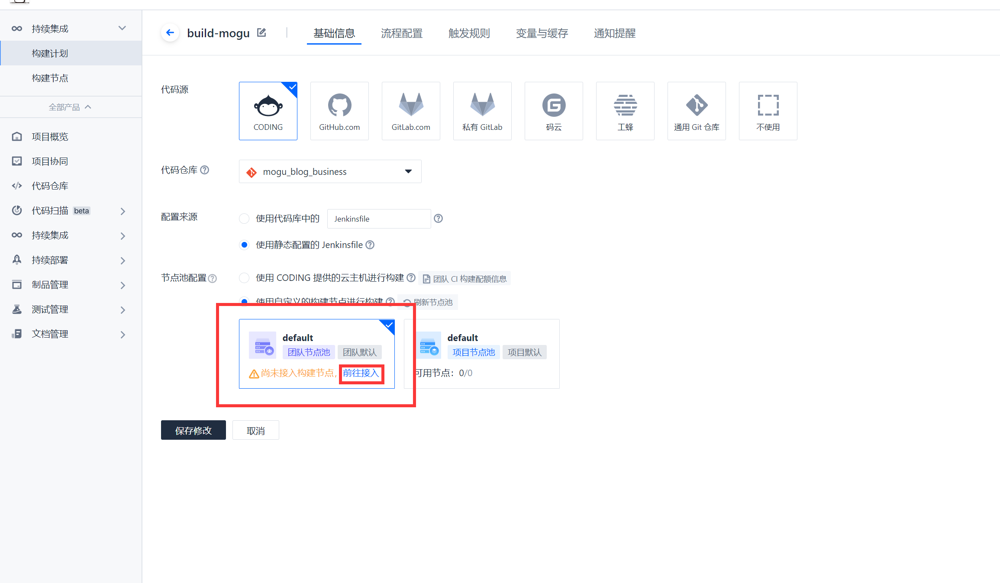
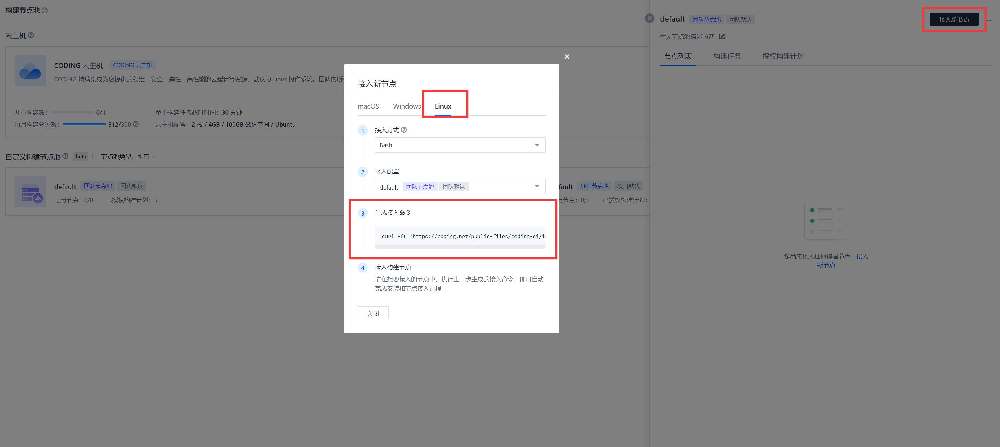
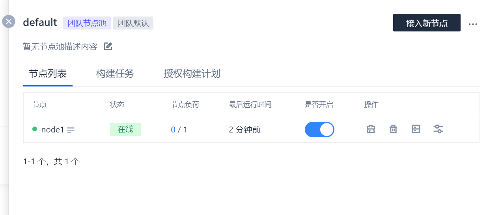

# Coding自建Devops构建空间

由于Coding每个月都有使用限额 300 分钟，超过后将无法正常的使用


不过，**Coding** 支持使用自建节点进行构建，在构建计划中，选择 自定义的构建节点进行构建



然后选择接入，然后找到 Linux 接入方式，复制一键接入命令



然后打开自己的机器，首先需要安装 **JDK** 环境

```bash
yum -y install java-1.8.0-openjdk-devel.x86_64 
```

Git版本需要 2.8 以上，由于阿里源默认都是 1.18.3，需要进行卸载

```bash
# 卸载git
yum remove -y git
# 安装其它源
yum install http://opensource.wandisco.com/centos/7/git/x86_64/wandisco-git-release-7-2.noarch.rpm
# 安装
yum install git -y
# 查看版本
git version
```

已经成功安装 2.13.x

然后安装 maven

```
yum install maven
```

接下来，安装 docker

首先，配置 docker 源

```bash
cat >>/etc/yum.repos.d/docker.repo<<EOF
[docker-ce-edge]
name=Docker CE Edge - \$basearch
baseurl=https://mirrors.aliyun.com/docker-ce/linux/centos/7/\$basearch/edge
enabled=1
gpgcheck=1
gpgkey=https://mirrors.aliyun.com/docker-ce/linux/centos/gpg
EOF
```

然后安装 docker

```bash
# yum安装
yum -y install docker-ce

#查看docker版本
docker --version  

# 设置开机自启
systemctl enable docker

# 启动docker
systemctl start docker
```

安装指定版本的 node

```bash
curl -sL https://rpm.nodesource.com/setup_14.x | bash -
# 执行下面脚本安装即可
yum install -y nodejs
```

然后执行一键部署脚本，粘贴自己上面的一键接入的命令

```bash
curl -fL 'https://coding.net/public-files/coding-ci/install/linux/install.sh?version=2022.03.22-b3bd8b2ac67f552c7be7bf82c311f6c11083f619' | XXXX
```

执行后，在右侧看到自己接入的节点了

