大家好，我是**陌溪**

最近，陌溪在登录蘑菇社区后台的时候，发现当我输入账号和密码后，竟然卡在了 **Loading** 页面，等了足足 **10S** 才进去后台


通过 **F12**，打开 **Network** 网络请求一看，竟然是因为有两个接口返回的数据太慢了，最慢的一个接口竟然耗时 **7.35 **秒！

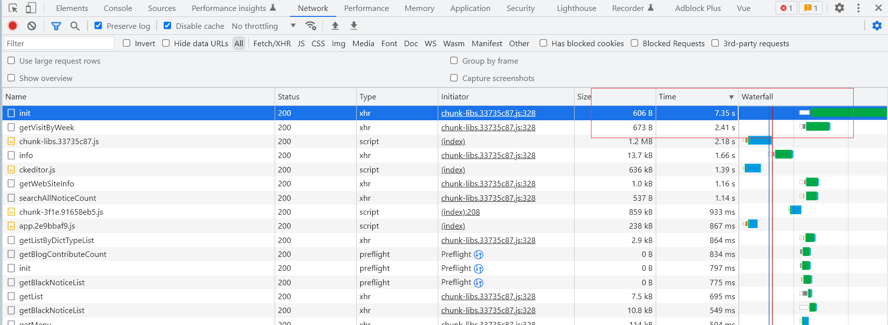

通过查看接口的实现代码可以看到，**init** 接口其实是做仪表盘的数据展示的，需要从 **博客表**、**评论表**、**用户表** 以及 **用户访问表** 中查询数据进行展示。

```java
@ApiOperation(value = "首页初始化数据", notes = "首页初始化数据", response = String.class)
@RequestMapping(value = "/init", method = RequestMethod.GET)
public String init() {
    Map<String, Object> map = new HashMap<>(Constants.NUM_FOUR);
    map.put(SysConf.BLOG_COUNT, blogService.getBlogCount(EStatus.ENABLE));
    CommentVO commentVO = new CommentVO();
    map.put(SysConf.COMMENT_COUNT, commentService.getCommentCount(commentVO));
    map.put(SysConf.USER_COUNT, userService.getUserCount(EStatus.ENABLE));
    map.put(SysConf.VISIT_COUNT, webVisitService.getWebVisitCount());
    return ResultUtil.result(SysConf.SUCCESS, map);
}
```

如果要一步步分析是哪里比较慢的话，最简单的方法，就是查看每个方法的具体实现，然后对源码进行分析找出具体的问题。同时这些接口查询的时候，也可以通过 **Redis** 做缓存，也可以提高查询的效率。

今天，我们就从另外一个角度来解决这个慢查询问题~

如果有认真看过蘑菇博客的系统架构图的小伙伴，应该在上方看到有数据库 **SQL** 性能监控 **Druid** 连接池


在讲 **Druid** 之前，我们先介绍一下连接池~

## 什么是连接池？

连接池的诞生是因为数据库连接是一种资源，而用户在使用该资源的时候必须先创建，但是创建的过程存在比较大的时间和空间花销。

如果每次在执行数据库操作的时候，都需要先创建连接，使用，关闭连接的话，这个过程必然是效率比较低下的。

对于刚刚学习 **MySQL** 操作的同学来说，下面的这些模板代码简直是初学者的噩梦，原来陌溪在学 **JDBC** 连接数据库的时候，这些模板代码都默写了好几遍~

```java
public class TEST {

    // JDBC 驱动名 及数据库 URL
    static String JDBC_DRIVER = "com.mysql.jdbc.Driver";
    static String DB_URL = "jdbc:mysql://localhost:3306/webcourse";

    // 数据库的用户名与密码，需要根据自己的设置
    static String USER = "root";
    static String PASS = "121314";

    public static void main(String[] args) throws Exception {
        Connection conn = null;
        Statement stmt = null;
        try {
            // 注册 JDBC 驱动
            // 把Driver类装载进jvm
            Class.forName("com.mysql.jdbc.Driver");

            // 打开链接
            System.out.println("连接数据库...");
            conn = (Connection) DriverManager.getConnection(DB_URL, USER, PASS);

            // 执行查询
            System.out.println(" 实例化Statement对...");
            stmt = (Statement) conn.createStatement();
            String sql = "SELECT * FROM bbs";
            ResultSet rs = stmt.executeQuery(sql);

            while (rs.next()) {
                // 通过字段检索
                int id = rs.getInt("id");
                String name = rs.getString("name");
                String content = rs.getString("content");
                // 输出数据
                System.out.print("ID: " + id);
                System.out.print(",姓名: " + name);
                System.out.print(",内容: " + content);
                System.out.print("\n");
            }

            // 完成后关闭
            rs.close();
            stmt.close();
            conn.close();
        } catch (SQLException se) {
            // 处理 JDBC 错误
            se.printStackTrace();
        } catch (Exception e) {
            // 处理 Class.forName 错误
            e.printStackTrace();
        } finally {
            // 关闭资源
            if (stmt != null)
                stmt.close();
            if (conn != null)
                conn.close();
        }
        System.out.println("测试结束");
    }
}

```

因此，在实际的开发过程中，是会考虑在数据库操作前，先提前创建并维护一批的数据库连接对象，当我们需要使用的时候，就从这批对象中获取一个连接，用完之后再返还，通过这一系列的操作，从而避免了不必要的时间开销，从而提高了运行效率，这种技术在 **JDBC** 中被称为连接池技术（**Connection Pool**）

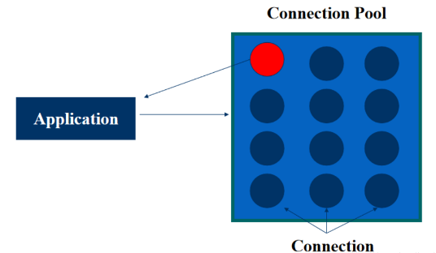

## Druid 连接池

**Druid** 连接池是阿里巴巴开源的数据库连接池项目。Druid连接池为监控而生，内置强大的监控功能，监控特性不影响性能。功能强大，能防 **SQL** 注入，被誉为：**Java** 语言中最好的数据库连接池。

>  Github：https://github.com/alibaba/druid

目前比较常见的连接池技术包含

- **C3P0**
- **BDCP**
- **Tomcat-JDBC**
- **Druid**

通过下图的的竞品对比，**Druid** 连接池在性能、监控、诊断、安全、扩展性这些方面远远超出竞品。

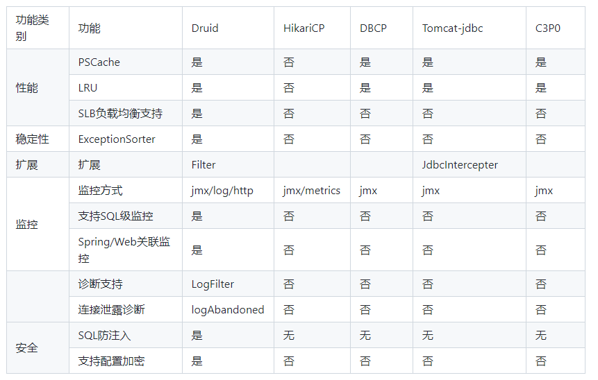

## 如何使用Druid监控

**Druid** 连接池最初就是为监控系统采集 **JDBC** 运行信息而生的，**Druid** 连接池内置了一个监控页面，提供了非常完备的监控信息，可以快速诊断系统的瓶颈。

好了，经过上述的一顿铺垫，相信小伙伴们对 **Druid** 连接池已经有一定的了解了，下面我们就通过 **Druid** 的监控，来看看蘑菇存在的 **SQL** 性能问题

通过在后端端口加上 **/druid/index.html** 即可打开 **Druid** 的内置的监控页面

```bash
http://localhost:8601/druid/index.html
```

此时输入账号和密码：**admin**  **123456** （密码是可以配置的，后面在集成的时候可以看到）

这个时候，会进入到 **Druid Monitor** 的主页，这里能够查看到对应版本、驱动，以及 **Java** 版本

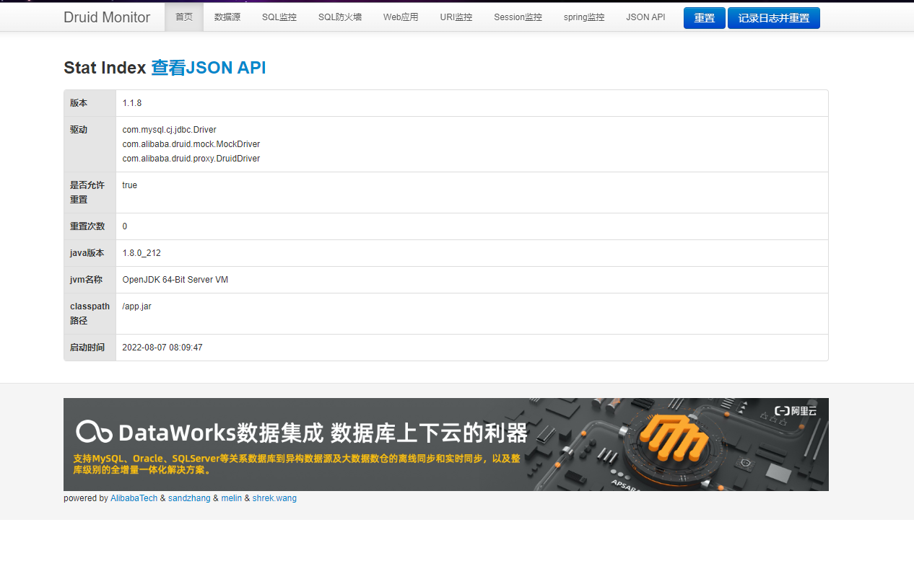

切换到数据源的 **Tab** 页面，能够看到我们配置的数据库连接池的各个参数

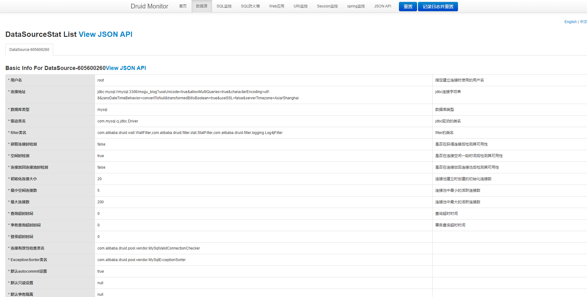

下面，我们切换到 **SQL** 监控，是可以看到目前运行的所有 **SQL** 的执行情况，按时间排序即可看到，最慢的 **SQL** 执行时间到达了 **8S**

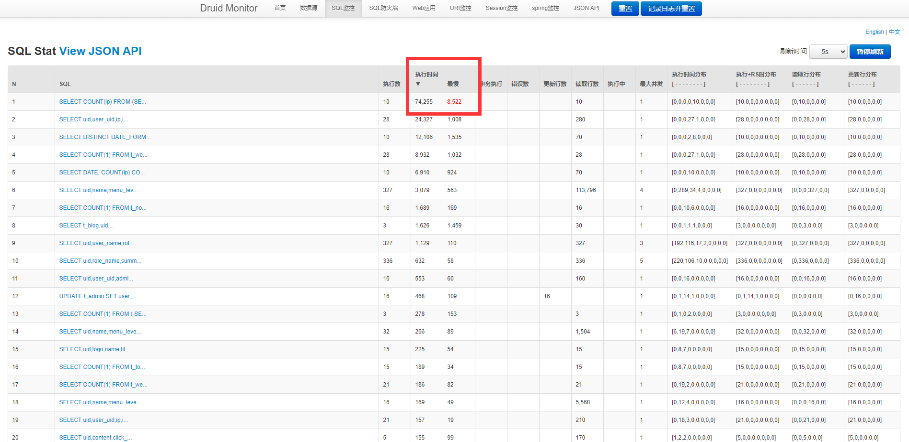

我们点击左侧的 **SQL** 语句，即可看到完整的 **SQL** 详情页，这里面记录了几个关键的信息，包括：慢**SQL**语句、执行耗时、发生时间、**SQL** 参数

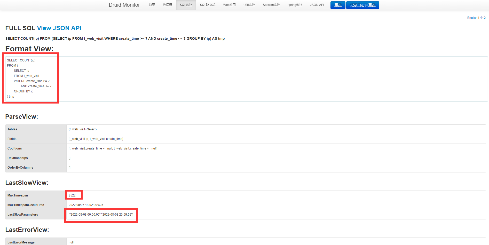

其实这个 **SQL** 对应的就是 **init** 中，用来查询用户 **UV** 的，即从日志表中查看有多少用户访问了蘑菇

```sql
SELECT COUNT(ip)
FROM (
	SELECT ip
	FROM t_web_visit
	WHERE create_time >= "2022-08-08 00:00:00"
		AND create_time <= "2022-08-08 23:59:59"
	GROUP BY ip
) tmp
```

我们把 **SQL** 复制到 **SQLyog** 执行，好家伙，这次执行花了 **10** S

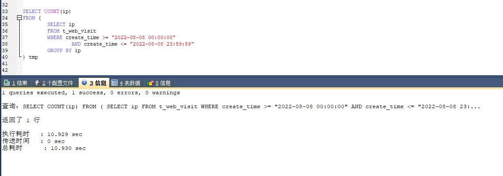

上面 **SQL** 脚本的思路，其实是就是查询出单天内不同的 **ip**，但是用到了 **group by** 进行分组去重，最后统计 **ip** 的次数

我们可以针对上面的 **SQL** 进行优化，使用 **SQL** 内置的 **DISTINCT()** 函数进行去重

```sql
SELECT COUNT(DISTINCT(ip)) FROM t_web_visit WHERE create_time >= "2022-08-08 00:00:00" AND create_time <= "2022-08-08 23:59:59";
```

优化后的 SQL，可以看到执行时间已经从原来的 **10** S -> **0.57 S**


我们通过 **explain** 再次查看该 **SQL** 的索引执行情况

```sql
EXPLAIN SELECT COUNT(DISTINCT(ip)) FROM t_web_visit WHERE create_time >= "2022-08-03 00:00:00" AND create_time <= "2022-08-03 23:59:59";
```

通过输出结果可以看到，该语句没有走索引，进行了全表的扫描，同时查询了 **658559** 行数据

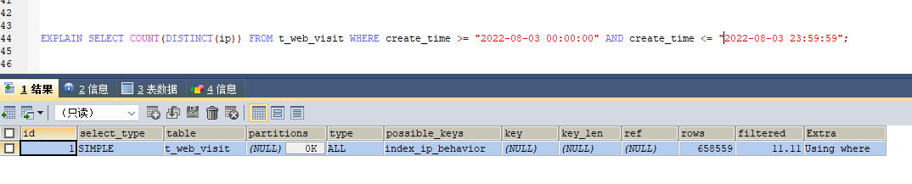

我们分析这次查询参数，主要是使用了 **create_time** 进行范围查询，可以接着对查询进行优化，给 **create_time** 新增索引

```sql
ALTER TABLE t_web_visit ADD INDEX _create_time( `create_time` );
```

再次执行第一条 **SQL** 语句，可以看到查询时间有了大幅度的提升，直接从原来的 **10S** -> **0.18S**

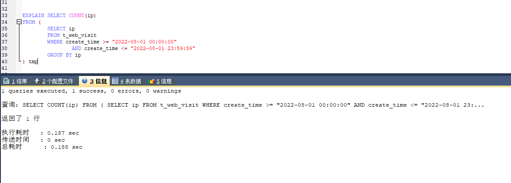

在看第二条 **SQL**，时间也有了很大的提升，从 **0.57 S** -> **0.046 S**

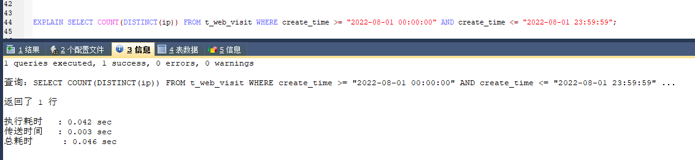

最后通过 **explain** 分析 **SQL**，可以看到，优化后的 **SQL** ，使用了 **create_time** 索引，只需要查询 **871** 条数据 

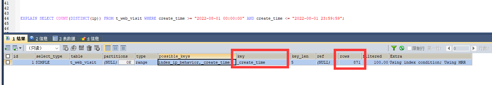

优化后的 **SQL** 后，我们再打开蘑菇后台页面，可以看到页面从原来的 **10S** 变成了 **0.9S**~

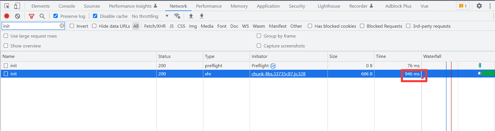

下面，让我们一起来看看如何给自己的网站，集成 **Druid** 连接池，用来检测网站 **SQL** 性能吧~

## SpringBoot如何集成Druid？

首先，需要添加依赖，在 **pom.xml** 文件中加入

```pom
<!-- 引入druid数据源 -->
<dependency>
<groupId>com.alibaba</groupId>
<artifactId>druid</artifactId>
<version>1.1.8</version>
</dependency>
```

然后在 **application.yml** 中，添加配置

```yml
#spring
spring:
  # DATABASE CONFIG
  datasource:
    username: root
    password: root
    url: jdbc:mysql://localhost:3306/mogu_blog_business?useUnicode=true&allowMultiQueries=true&characterEncoding=utf-8&zeroDateTimeBehavior=convertToNull&transformedBitIsBoolean=true&useSSL=false&serverTimezone=Asia/Shanghai
    driver-class-name: com.mysql.cj.jdbc.Driver
    type: com.alibaba.druid.pool.DruidDataSource

    # 初始化大小，最小，最大
    initialSize: 20
    minIdle: 5
    maxActive: 200
    #连接等待超时时间
    maxWait: 60000
    #配置隔多久进行一次检测(检测可以关闭的空闲连接)
    timeBetweenEvictionRunsMillis: 60000
    #配置连接在池中的最小生存时间
    minEvictableIdleTimeMillis: 300000
    validationQuery: SELECT 1 FROM DUAL
    dbcp:
      remove-abandoned: true
      #泄露的连接可以被删除的超时时间（秒），该值应设置为应用程序查询可能执行的最长时间
      remove-abandoned-timeout: 180
    testWhileIdle: true
    testOnBorrow: false
    testOnReturn: false
    poolPreparedStatements: true
    #配置监控统计拦截的filters，去掉后监控界面sql无法统计，'wall'用于防火墙
    filters: stat,wall,log4j
    maxPoolPreparedStatementPerConnectionSize: 20
    useGlobalDataSourceStat: true
    connectionProperties: druid.stat.mergeSql=true;druid.stat.slowSqlMillis=500
```

在创建配置 **DruidConfig.java**，创建 **DataSource** 数据源，同时配置监控页面的登录账号和密码

```java
package com.moxi.mogublog.admin.config;

import com.alibaba.druid.filter.Filter;
import com.alibaba.druid.pool.DruidDataSource;
import com.alibaba.druid.support.http.StatViewServlet;
import com.alibaba.druid.support.http.WebStatFilter;
import com.alibaba.druid.wall.WallConfig;
import com.alibaba.druid.wall.WallFilter;
import com.moxi.mougblog.base.global.Constants;
import lombok.extern.slf4j.Slf4j;
import org.springframework.beans.factory.annotation.Value;
import org.springframework.boot.web.servlet.FilterRegistrationBean;
import org.springframework.boot.web.servlet.ServletRegistrationBean;
import org.springframework.context.annotation.Bean;
import org.springframework.context.annotation.Configuration;
import org.springframework.context.annotation.Primary;

import javax.sql.DataSource;
import java.sql.SQLException;
import java.util.*;

/**
 * DruidConfig
 *
 * @author Administrator
 * @Date 2020年1月9日19:06:23
 */
@Slf4j
@Configuration
public class DruidConfig {
    @Value("${spring.datasource.url}")
    private String dbUrl;
    @Value("${spring.datasource.username}")
    private String username;
    @Value("${spring.datasource.password}")
    private String password;
    @Value("${spring.datasource.driver-class-name}")
    private String driverClassName;
    @Value("${spring.datasource.initialSize}")
    private int initialSize;
    @Value("${spring.datasource.minIdle}")
    private int minIdle;
    @Value("${spring.datasource.maxActive}")
    private int maxActive;
    @Value("${spring.datasource.maxWait}")
    private int maxWait;
    @Value("${spring.datasource.timeBetweenEvictionRunsMillis}")
    private int timeBetweenEvictionRunsMillis;
    @Value("${spring.datasource.minEvictableIdleTimeMillis}")
    private int minEvictableIdleTimeMillis;
    @Value("${spring.datasource.validationQuery}")
    private String validationQuery;
    @Value("${spring.datasource.testWhileIdle}")
    private boolean testWhileIdle;
    @Value("${spring.datasource.testOnBorrow}")
    private boolean testOnBorrow;
    @Value("${spring.datasource.testOnReturn}")
    private boolean testOnReturn;
    @Value("${spring.datasource.poolPreparedStatements}")
    private boolean poolPreparedStatements;
    @Value("${spring.datasource.maxPoolPreparedStatementPerConnectionSize}")
    private int maxPoolPreparedStatementPerConnectionSize;
    @Value("${spring.datasource.filters}")
    private String filters;
    @Value("{spring.datasource.connectionProperties}")
    private String connectionProperties;

    /**
     * 声明其为Bean实例
     * 在同样的DataSource中，首先使用被标注的DataSource
     *
     * @return
     */
    @Bean
    @Primary
    public DataSource dataSource() {
        DruidDataSource datasource = new DruidDataSource();

        datasource.setUrl(this.dbUrl);
        datasource.setUsername(username);
        datasource.setPassword(password);
        datasource.setDriverClassName(driverClassName);

        // configuration
        datasource.setInitialSize(initialSize);
        datasource.setMinIdle(minIdle);
        datasource.setMaxActive(maxActive);
        datasource.setMaxWait(maxWait);
        datasource.setTimeBetweenEvictionRunsMillis(timeBetweenEvictionRunsMillis);
        datasource.setMinEvictableIdleTimeMillis(minEvictableIdleTimeMillis);
        datasource.setValidationQuery(validationQuery);
        datasource.setTestWhileIdle(testWhileIdle);
        datasource.setTestOnBorrow(testOnBorrow);
        datasource.setTestOnReturn(testOnReturn);
        datasource.setPoolPreparedStatements(poolPreparedStatements);
        datasource.setMaxPoolPreparedStatementPerConnectionSize(maxPoolPreparedStatementPerConnectionSize);
        try {
            /**
             * 加入过滤
             */
            List<Filter> filterList = new ArrayList<>();
            filterList.add(wallFilter());
            datasource.setProxyFilters(filterList);

            datasource.setFilters(filters);
        } catch (SQLException e) {
            log.error("druid configuration initialization filter");
        }
        datasource.setConnectionProperties(connectionProperties);

        return datasource;
    }

    /**
     * 配置一个管理后台的Servlet
     */
    @Bean
    public ServletRegistrationBean statViewServlet() {
        ServletRegistrationBean bean = new ServletRegistrationBean(new StatViewServlet(), "/druid/*");
        Map<String, String> initParams = new HashMap<>(Constants.NUM_TWO);

        initParams.put("loginUsername", "admin");
        initParams.put("loginPassword", " ");
        //默认就是允许所有访问
        initParams.put("allow", "");

        bean.setInitParameters(initParams);
        return bean;
    }

    /**
     * 配置一个web监控的filter
     *
     * @return
     */
    @Bean
    public FilterRegistrationBean webStatFilter() {
        FilterRegistrationBean bean = new FilterRegistrationBean();
        bean.setFilter(new WebStatFilter());

        Map<String, String> initParams = new HashMap<>(Constants.NUM_ONE);
        initParams.put("exclusions", "*.vue,*.js,*.gif,*.jpg,*.bmp,*.png,*.css,*.ico,/druid/*");
        bean.setInitParameters(initParams);
        bean.setUrlPatterns(Arrays.asList("/*"));
        return bean;
    }


    @Bean
    public WallFilter wallFilter() {
        WallFilter wallFilter = new WallFilter();
        WallConfig config = new WallConfig();
        //允许一次执行多条语句
        config.setMultiStatementAllow(true);
        //允许非基本语句的其他语句
        config.setNoneBaseStatementAllow(true);
        wallFilter.setConfig(config);
        return wallFilter;
    }

}
```

