大家好，我是 **陌溪**

最近，群里有小伙伴在倒腾一个叫 **Drone** 的项目，说它比 **Jenkins** 更轻量级。

其实，在原来很久之前，蘑菇博客就已经接入了 **Github Actions** 做持续集成，想要了解的小伙伴可以看看这篇文章：还在人肉运维？[看看蘑菇博客是如何实现自动化部署](https://mp.weixin.qq.com/s?__biz=MzkyMzE5NTYzMA==&amp;mid=2247485568&amp;idx=1&amp;sn=d96b4d04014d24bd1547e44e12842827&amp;chksm=c1e98901f69e0017083c37d2551e0854c868d844c94abf9d81ce5c4b7aa1803f9956b1a18af2&token=1905884391&lang=zh_CN#rd)。

目前 **Github** + **Github Actions** 的方式，也是个人和小型公司的首选，因为 **Github Actions** 会提供一台 **1C 4G** 的机器，用来帮助我们构建镜像，并且不限时长。

对比 **Coding** 的流水线，在我使用了 **300** 分钟后。。就提示我要充值了，**Github** 的流水线还是非常良心的~


好了，下面回归正题，在接受了群友的安利后。抱着学习的新技术的态度，周末两天开启了 **Drone** 学习之旅，

在学一门技术之前，首先看看 **Github** 上能不能搜到，打开一看，没想到 **Star** 已经有 **25.6K** 了！

> Github地址：https://github.com/harness/drone


再去看看 **jenkins**  **19.4K** Star， 通过点赞数就能看出来， **Drone** 是比 **Jenkins** 更火了~

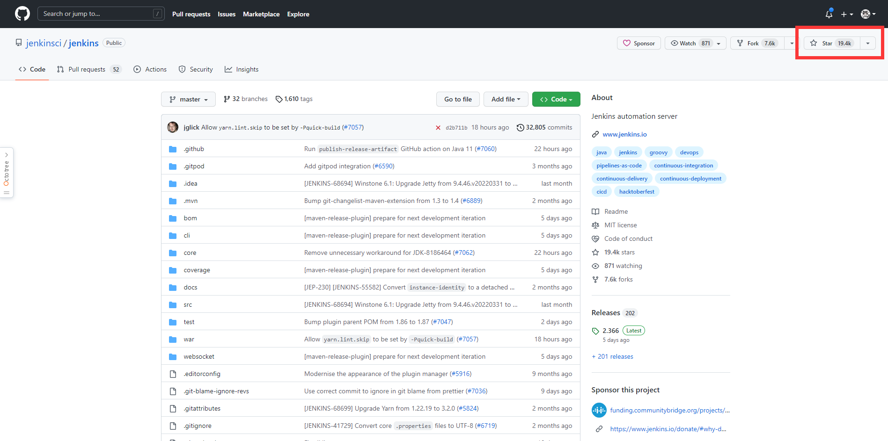

相比 **Gitlab + Jenkins** 实现自动化部署，大概需要 **4G** 以上的内存才能够运行起来。而 **Drone** + **Gitee** 使用内存不到 **1G** ~

以下是两者的对比图，小伙伴也可以了解一下~

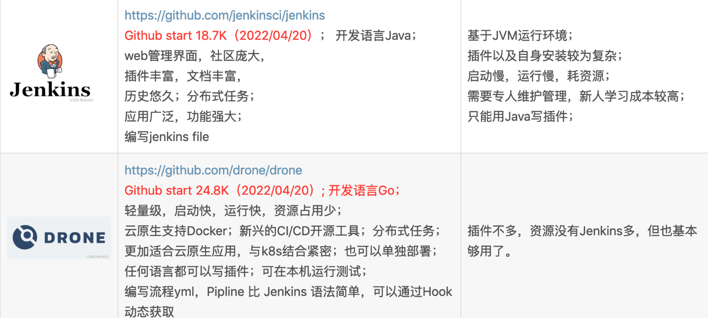

## 什么是 Drone？

**Drone **是一个面向忙碌的开发团队的自助持续集成和持续交付平台。

> 官网：https://www.drone.io/

同时，**Drone** 是使用 **Golang** 语言进行编写。所有的编译、测试的流程都在 Docker 容器中执行。**Drone** 通过使用简单的 **YAML** 配置文件，就可以轻松的定义出一条流水线，并且每一个构建操作都是在一个临时的 **Docker** 容器中执行，能够完全控制其构建环境并保证隔离。最后，开发人员只需要在项目中引入 **.drone.yml** 文件，将代码推送到 Git 仓库中，即可自动化的完成**编译**、**测试** 和 **发布**。

简单来说，**Drone** 其实就是一款轻量级的 **Jenkins** ，可以占用更少的资源，实现软件的流水线操作，并且可以轻松的和 **Gitlab**、**Gitee**、**Github** 相结合。


## 创建 OAuth2应用

由于**蘑菇博客**是部署在 **Gitee** 中的，因此本文将介绍 **Drone** 如何实现：代码提交到 **Gitee** 上，自动触发 **Drone** 流水线，完成项目的打包和部署

首先，打开 **Gitee** 上的设置页面，找到 **第三方应用**，然后选择创建应用

> 地址：https://gitee.com/oauth/applications

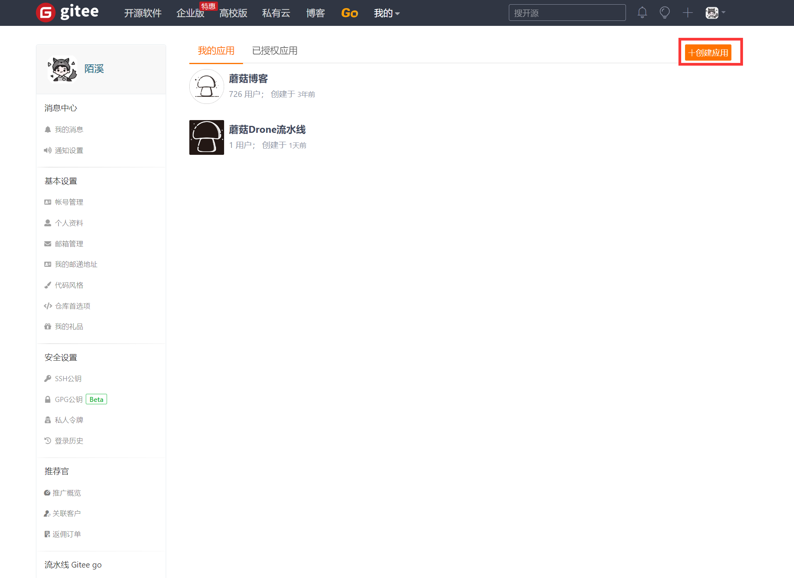

然后填写相关的信息，需要注意的是，这里的 **ip** 地址，需要换成自己服务器的

- **应用主页**：服务器地址+端口号

- **应用回调地址**：服务器地址+端口号/login 
- **权限**：把这四个都勾选上，否则后面登录可能会报错

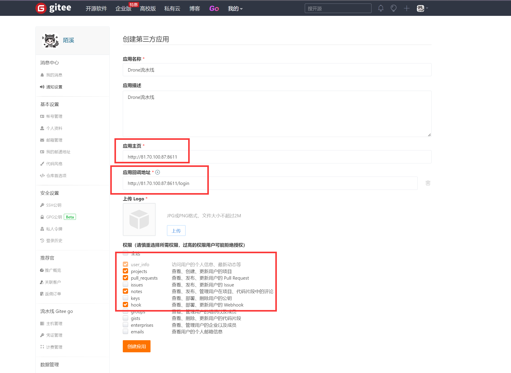

点击创建应用，就会得到 **ClientKey** 和 **ClientSecret** ，需要保存好，后续在编写 **docker-compose.yml** 文件的时候会用到

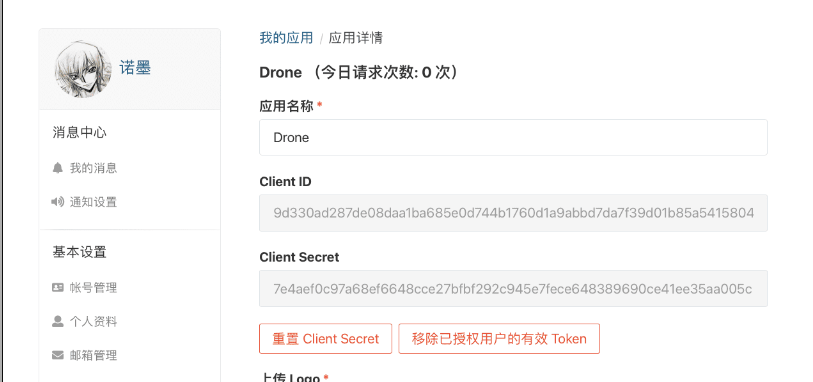

## 生成RPC秘钥

由于 **drone server** 和 **drone runner** 通信需要使用秘钥，因此可以使用 openssl 命令生成

```bash
$ openssl rand -hex 16
bea26a2221fd8090ea38720fc445eca6
```

可以也需要保存改秘钥，在下面需要使用

## 编写 drone.yml 文件

首先，需要编写 **drone** 的 **docker-compose** 文件，用来创建 **drone** 容器 

创建 **drone.yml** 文件，并修改以下的内容

- **DRONE_GITEE_CLIENT_ID**：上面的 **Gtiee** 的 **Client ID** 值
- **DRONE_GITEE_CLIENT_SECRET**：**Gitee OAuth2** 客户端密钥（上面的 **Client Secret** 值）
- **DRONE_RPC_SECRET**：**Drone** 的共享密钥（生成 **RPC** 密钥）
- **DRONE_SERVER_HOST**：**Drone** 的主机名(改成自己的域名获得 ip+端口(注意是drome的))
- **DRONE_USER_CREATE**：创建管理员账户，这里对应为 **Gitee** 的用户名(也就是登录的账号,不是昵称)(填错了回导致自动化部署失败)

```yml
version: '3'
networks:
  mogu:
    external: false
services:
  # 容器名称
  drone-server:
    container_name: drone
    # 构建所使用的镜像
    image: drone/drone
    # 映射容器内80端口到宿主机的8611端口8611端口,若修改的话，那么上面Gitee上也需要进行修改
    ports:
      - 8611:80
    # 映射容器内/data目录到宿主机的目录
    volumes:
      - /usr/local/bin/drone:/data
    # 容器随docker自动启动
    restart: always
    privileged: true
    networks:
      - mogu
    environment:
      # Gitee 服务器地址如果github就把GITEE改成GITHUB和https://gitee.com改成https://github.com
      - DRONE_GITEE_SERVER=https://gitee.com
      # Gitee OAuth2客户端ID
      # - DRONE_GITEA_CLI（上面的Client ID值）
      - DRONE_GITEE_CLIENT_ID=0a334xxxxxxxxc711e40af
      # Gitee OAuth2客户端密钥（上面的Client Secret值）
      - DRONE_GITEE_CLIENT_SECRET=79173f5367xxxxx000899
      # drone的共享密钥（生成rpc密钥）
      - DRONE_RPC_SECRET=bea26a2221fd8090ea38720fc445eca6
      # drone的主机名(改成自己的域名获得ip+端口(注意是drome的))
      - DRONE_SERVER_HOST=192.168.11.1:8611
      # 外部协议方案根据你的域名判断是http还是https(ip加端口是http)
      - DRONE_SERVER_PROTO=http
      - DRONE_GIT_ALWAYS_AUTH=false
     # 创建管理员账户，这里对应为gitee的用户名(也就是登录的账号,不是昵称)(填错了回导致自动化部署失败)
      - DRONE_USER_CREATE=username:xxx@qq.com,admin:true
      
  docker-runner:
    container_name: drone-runner
    image: drone/drone-runner-docker
    restart: always
    privileged: true
    networks:
      - mogu
    depends_on:
      - drone-server
    volumes:
      - /var/run/docker.sock:/var/run/docker.sock
      - /sync/drone/agent/drone.key:/root/drone.key
    environment:
      # 用于连接到Drone服务器的协议。该值必须是http或https。(同上)
      - DRONE_RPC_PROTO=http
      # 用于连接到Drone服务器的主机名(同上)
      - DRONE_RPC_HOST=81.70.100.87:8611
      # Drone服务器进行身份验证的共享密钥，和上面设置一样（生成rpc密钥）
      - DRONE_RPC_SECRET=bea26a2221fd8090ea38720fc445eca6
      # 限制运行程序可以执行的并发管道数
      - DRONE_RUNNER_CAPACITY=2
        # docker runner 名称
      - DRONE_RUNNER_NAME=docker-runner
      - DRONE_DEBUG=true                      # 调试相关，部署的时候建议先打开
      - DRONE_LOGS_DEBUG=true                 # 调试相关，部署的时候建议先打开
      - DRONE_LOGS_TRACE=true                 # 调试相关，部署的时候建议先打开
      - TZ=Asia/Shanghai

```

填写完毕后，我们将 **drone.yml** 文件拷贝到服务器上，使用下面的命令运行

```bash
docker-compose -f drone.yml up -d
```

这里需要小伙伴们提前下载好 **docker-compose**，如果不清楚什么是 **docker-compose** 的小伙伴，下面有一个简单的介绍

> Docker Compose 是用来定义和运行多个Docker应用程序的工具。通过Compose，可以使用YAML文件来配置应用程序需要的所有服务，然后使用一个命令即可从YML文件配置中创建并启动所有服务

首先到 **Github release**中下载我们的 **docker-compose**

```bash
https://github.com/docker/compose/releases
```

然后选择 **Linux** 版本下载

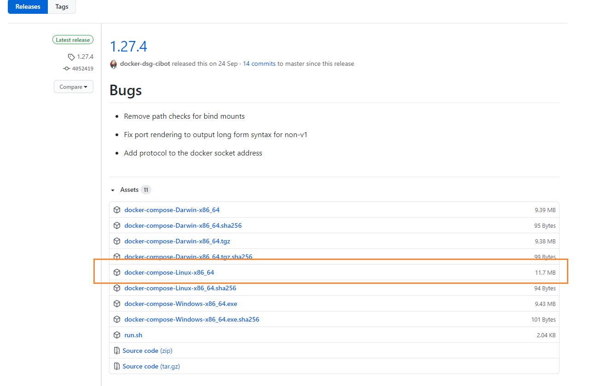

把下载到的文件使用 **Xftp** 工具，拷贝到 `/usr/local/bin/` 目录下

```bash
# 重命名
mv docker-compose-Linux-x86_64  docker-compose
# 加入执行权限
sudo chmod +x /usr/local/bin/docker-compose
# 查看docker-compose版本
docker-compose -v
```

安装完成后，再次使用上面的命令，安装 **drone**，安装完成后，使用 **docker ps  -a** 即可查看到安装的 **drone** 了

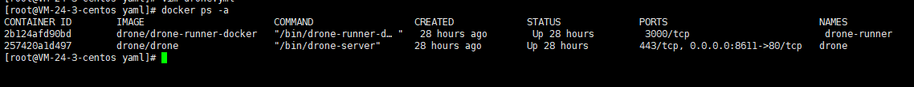

下面两个运行的容器的作用分别如下：

- **drone**：为 **Drone** 的管理提供了 **Web** 页面，用于管理从 **Git** 上获取的仓库中的流水线任务

- **drone-runner**：一个单独的守护进程，会轮询 **Server**，获取需要执行的流水线任务，之后执行

如果你正确的启动了上述的两个容器，那么你打开浏览器，输入**IP:8611** 可以进入到 **Drone** 主服务的 **Web** 管理界面的登录界面，


点击 **Continue** 后，即可跳转到 **Gitee** 的 **OAuth** 授权页面，这里直接点击 **同意授权**

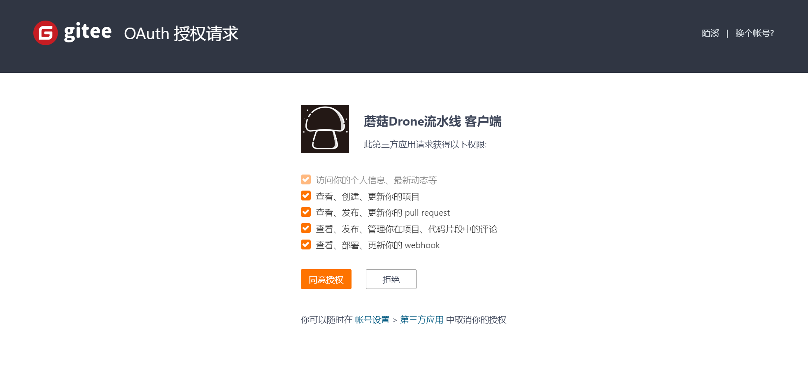

授权通过后，在我们仓库的管理页面，即可看到新增了一条 **WebHook** 记录，当 **Gitee** 有新的代码提交请求后，就会通过调用下面的地址，从而让 **Drone** 能够启动流水线操作。 

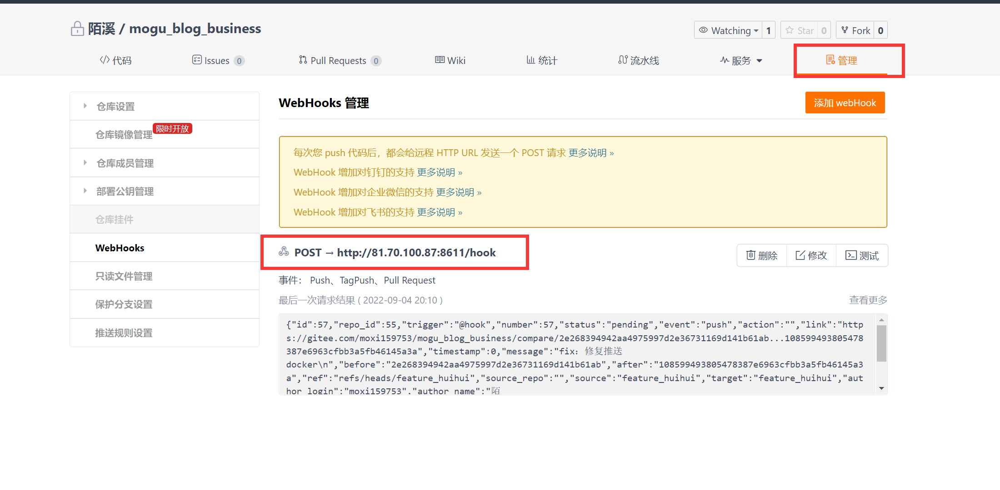

登录成功后，即可跳转到 **Drone** 的主页，在这里是能够看到 **Gitee** 上全部的项目的

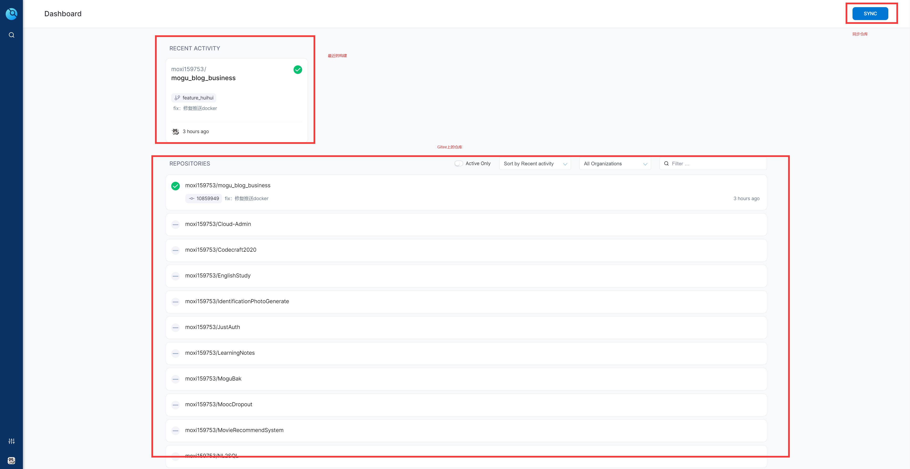

我们找到需要构建流水线的项目，然后进入后点击 **激活仓库**

> 这里是有BUG的，如果你的项目是中文名称的话，进去是会 404 

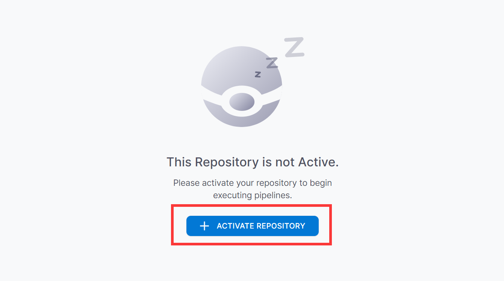

然后把下面几个开关进行打开，主要是开启容器特权，以及自动取消构建

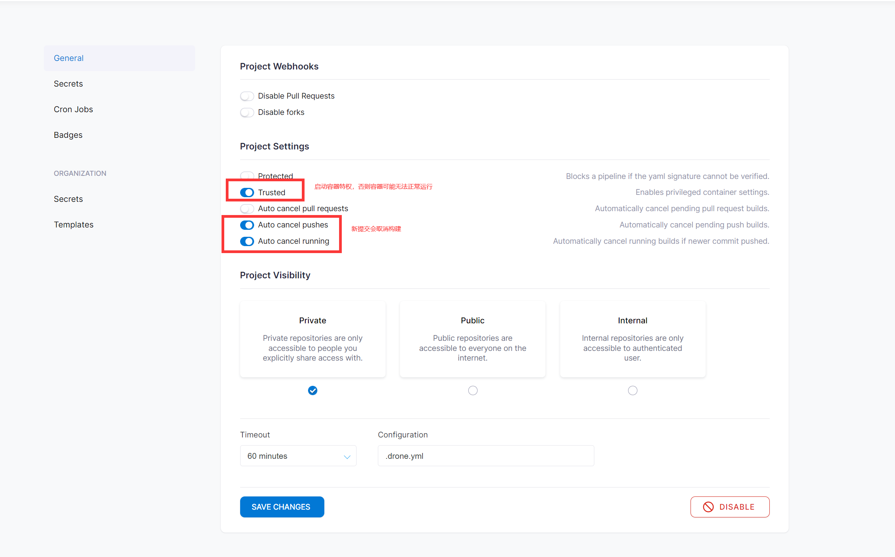

## 创建一个 **SpringBoot** 项目

首先，我们在 Gitee 上创建一个私有的仓库 **hello-mogu**

> https://gitee.com/projects/new

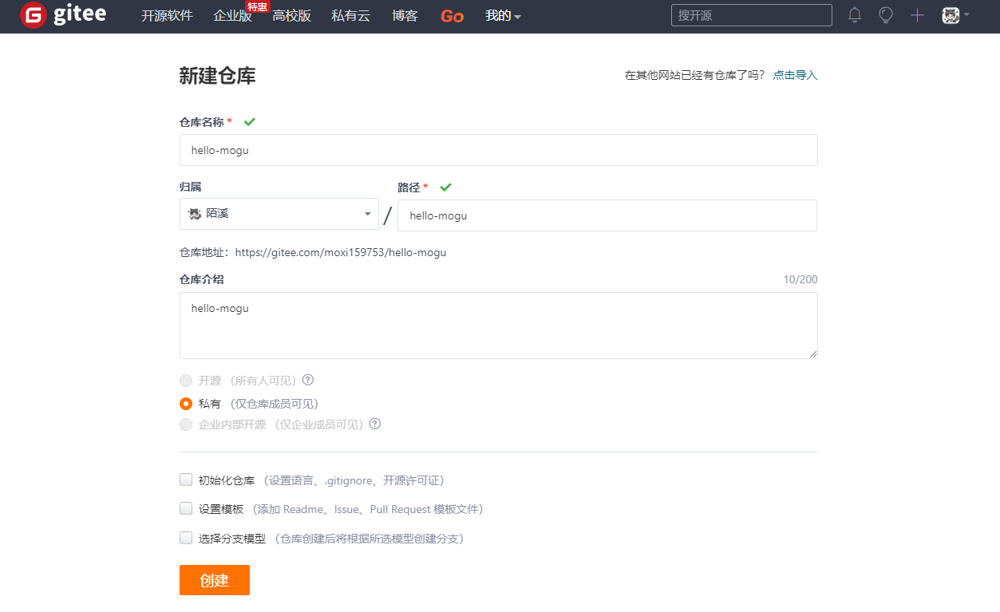

然后打开网站 **start.spring.io** 初始化一个最简单的 **SpringBoot** 项目

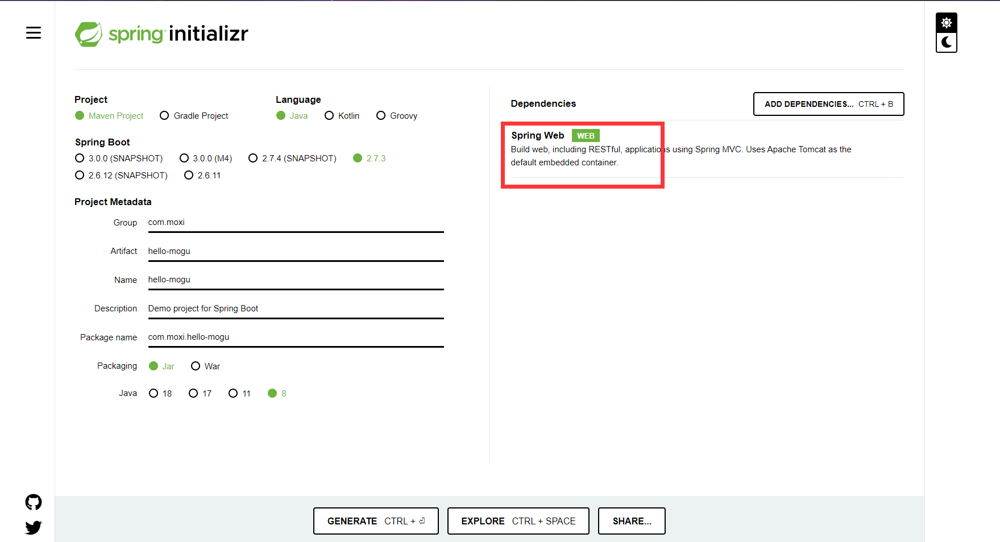

然后下载后解压，即可看到以下的目录

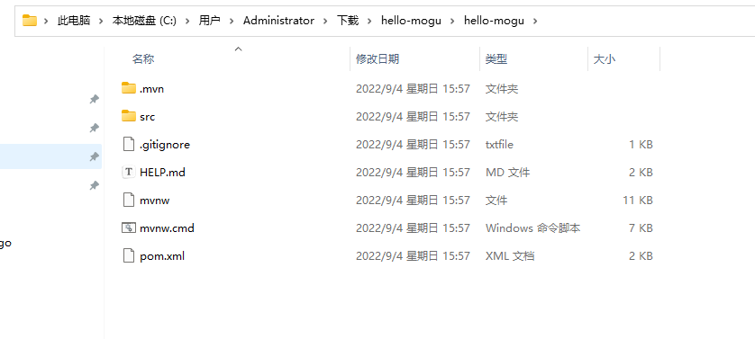

然后使用以下命令，将该项目和刚刚创建的Gitee仓库关联上

```bash
git init
git commit -m "first commit"
git remote add origin https://gitee.com/moxi159753/hello-mogu.git
git push -u origin "master"
```

下面即可看到代码成功推送到 **Gitee** 上了

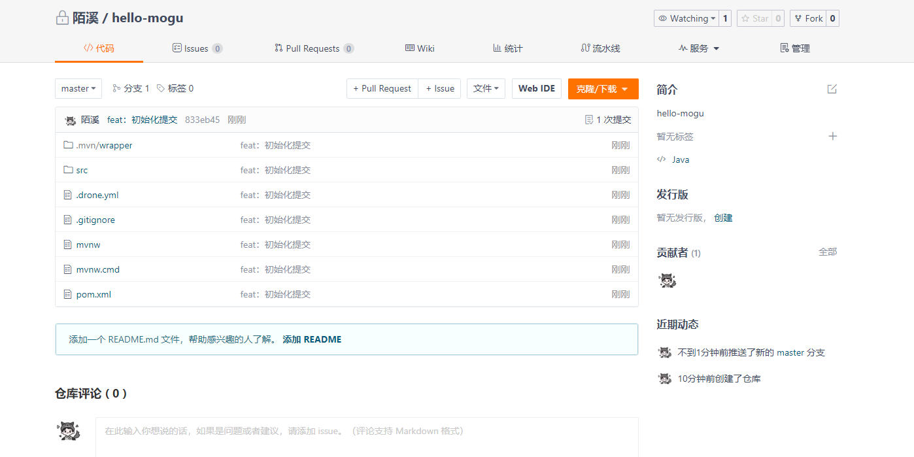


## Drone 流水线命令

接下来，需要通过将 **.drone.yml** 文件创建到 **Git** 存储库的根目录来配置管道。在这个文件中，定义了每次收到 **Webhook** 时执行的一系列步骤。

下面这个是最简单的一个 **drone** 流水线，我们创建  **.drone.yml** 文件，写上下面的内容

```YML
kind: pipeline  # kind 属性定义了对象的种类。此示例定义了一个管道对象。
type: docker	# type 属性定义管道的类型。此示例定义了一个 Docker 管道，其中每个管道步骤都在 Docker 容器内执行。
name: default   # name 属性定义了管道的名称。您可以为您的项目定义一个或多个管道

steps: # 步骤部分定义了一系列串行执行的管道步骤。如果管道中的任何步骤失败，管道将立即退出
- name: greeting # name 属性定义管道步骤的名称
  image: alpine # image 属性定义了一个执行 shell 命令的 Docker 镜像。您可以使用来自任何 DockerHub 中的任何 Docker镜像。
  commands: # commands 属性将在 Docker 容器内执行的 shell 命令列表定义为容器入口点。如果任何命令返回非零退出代码，则管道步骤将失败。
  - echo hello
  - echo world
```

写完后，再次将该提交提交到远程仓库，然后找到刚刚创建的仓库（如果没有，先执行 **SYNC** 操作）

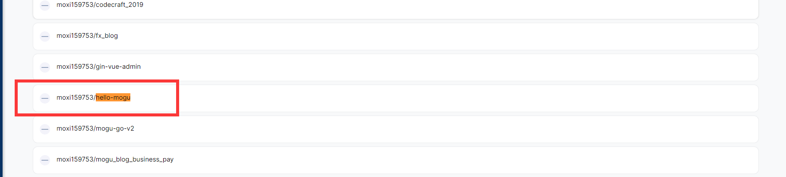

点击仓库内，设置好配置，点击保存

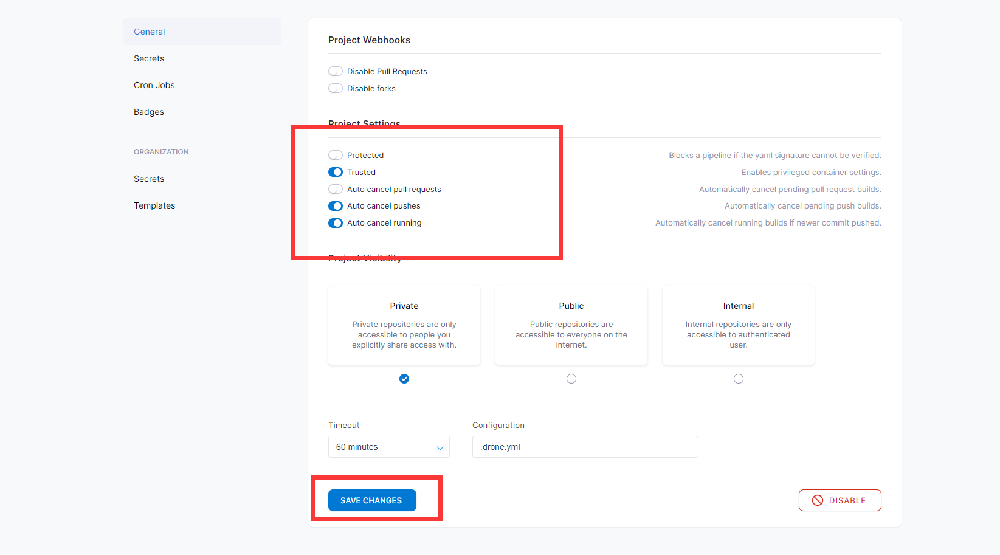

然后切换到构建页面，点击创建

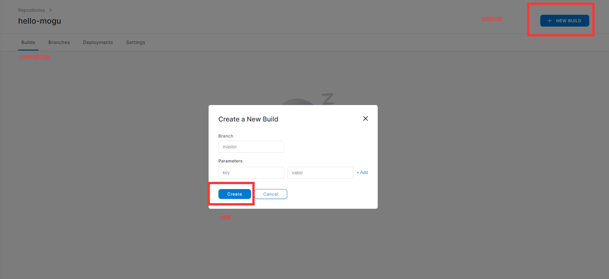

创建完成后，项目就会进行流水线构建【以后可以设置代码提交，主动触发】

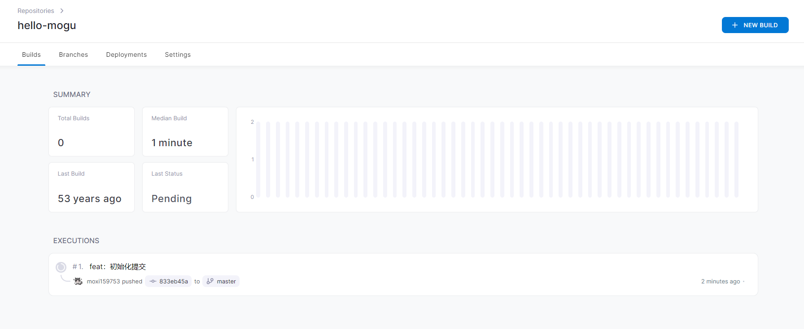

点击记录详情页，可以看到打印出来的 **hello world**

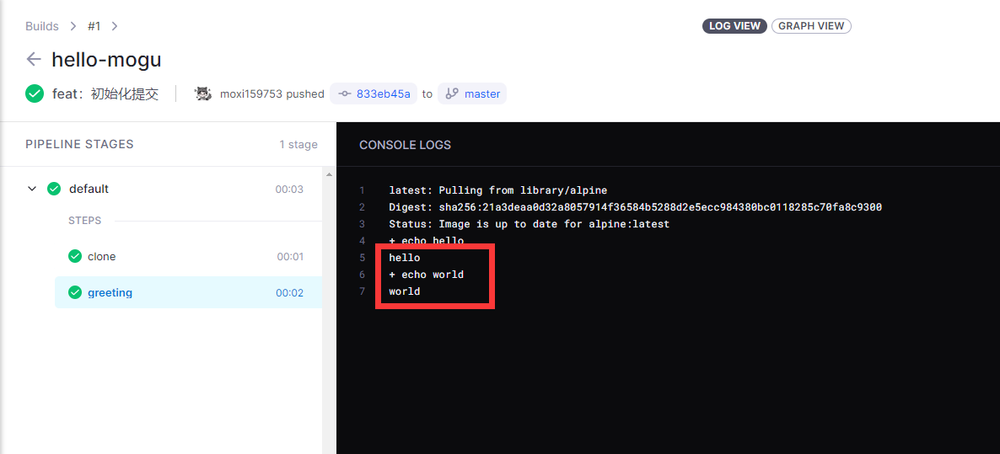


## 更多流水线操作

例如，我们可以将两个步骤串连起来，第一个步骤输出 **hello world**、第一个输出  **bonjour monde**

```yml
kind: pipeline
type: docker
name: greeting

steps:
- name: en
  image: alpine
  commands:
  - echo hello world

- name: fr
  image: alpine
  commands:
  - echo bonjour monde
```

在我们推送代码后，就可以看到流水线已经正常输出内容了

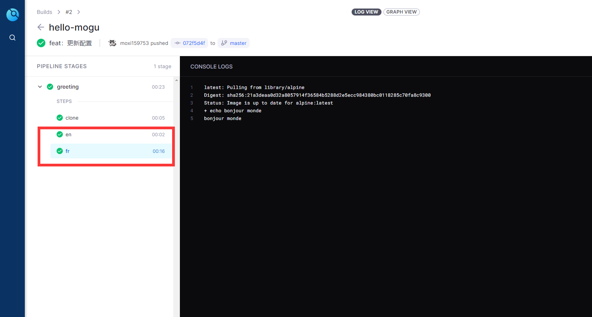

同时，我们也可以定义多个管道，串联的去执行

```yml
kind: pipeline
type: docker
name: en

steps:
- name: greeting
  image: alpine
  commands:
  - echo hello world

---
kind: pipeline
type: docker
name: fr

steps:
- name: greeting
  image: alpine
  commands:
  - echo bonjour monde
```

同时，通过增加 **trigger** 可以设置管道触发的方式，例如，push：代码提交后触发，pull_request：代码PR后触发

```yml
kind: pipeline
type: docker
name: en

steps:
- name: greeting
  image: alpine
  commands:
  - echo hello world

trigger:
  event:
  - push
  - pull_request
  - tag
  - promote
  - rollback
```

下面我们来完整的测试一下 **hello-mogu**

首先，我们在刚刚的 **SpringBoot** 项目中，创建一个 **Controller** 文件，写上一个 hello 蘑菇的方法

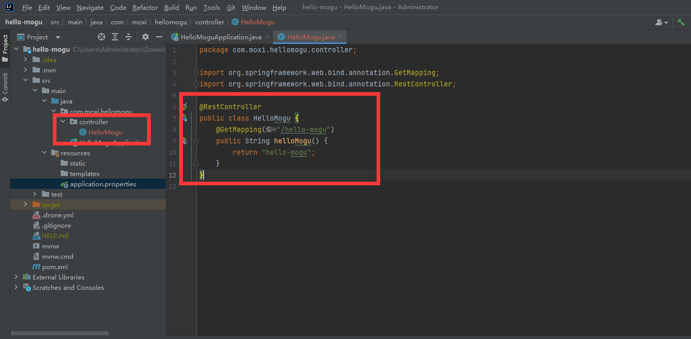

```java
import org.springframework.web.bind.annotation.GetMapping;
import org.springframework.web.bind.annotation.RestController;

@RestController
public class HelloMogu {
    @GetMapping("/hello-mogu")
    public String helloMogu() {
        return "hello-mogu";
    }
}

```

然后编辑 .drone.yml 文件，编写流水线代码

```yml
kind: pipeline # 定义对象类型，还有secret和signature两种类型
type: docker # 定义流水线类型，还有kubernetes、exec、ssh等类型
name: hello-mogu # 定义流水线名称

steps: # 定义流水线执行步骤，这些步骤将顺序执行
  - name: build-package # 流水线名称
    image: maven:3.8.5-openjdk-8 # 定义创建容器的Docker镜像
    volumes: # 将容器内目录挂载到宿主机，仓库需要开启Trusted设置
      - name: maven-build
        path: /root/hello-mogu # 将应用打包好的Jar和执行脚本挂载出来
    commands:
      - mvn clean package -DskipTests=true
      # 将打包后的jar包，拷贝到 /root/hello-mogu 目录
      - cp /drone/src/target/hello-mogu-0.0.1-SNAPSHOT.jar  /root/hello-mogu

volumes: # 定义流水线挂载目录，用于共享数据
  - name: maven-build
    host:
      path: /root/hello-mogu   #jar包目录可以修改从宿主机中挂载的目录

```

这里使用了  **build-package** 的镜像进行构建，里面包含了 **Java** 和 **Mavne** 环境。

同时，为了方便将构建好的 **Jar** 包挂载出来，我们使用了 **volumes** ，需要指定容器内的地址 以及 挂载到宿主机的位置

将修改后的代码推送到 Gitee 中，可以看到流水线正常运行，并且在开始下载依赖进行构建 **jar** 包

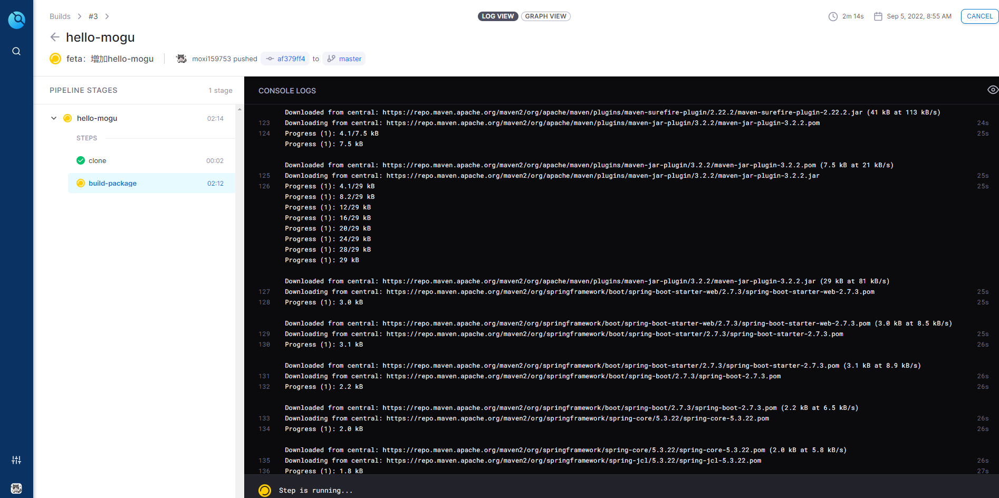

执行成功后，我们打开自己的服务器，在 /root/hello-mogu 目录，就可以看到刚刚打包后的 **jar** 包了

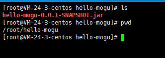

如果你服务器有 java 环境，可以直接用下面的命令启动

```bash
java -jar hello-mogu-0.0.1-SNAPSHOT.jar 
```

下面，我们可以继续编写流水线，创建项目的 **Dockerfile** 文件，

> Dockerfile的主要作用是用来构建镜像的

```bash
FROM registry.cn-shenzhen.aliyuncs.com/mogu-zh/jdk:8-mogu-alpine
ENV LANG C.UTF-8
ENV TZ Asia/Shanghai
VOLUME /tmp
ADD hello-mogu-0.0.1-SNAPSHOT.jar hello-mogu-0.0.1-SNAPSHOT.jar
ENTRYPOINT ["java","-Xms256m","-Xmx256m","-jar","/hello-mogu-0.0.1-SNAPSHOT.jar"]

```

存放位置如下所示，主要拉取了带着 jdk8 环境的镜像，然后设置启动参数

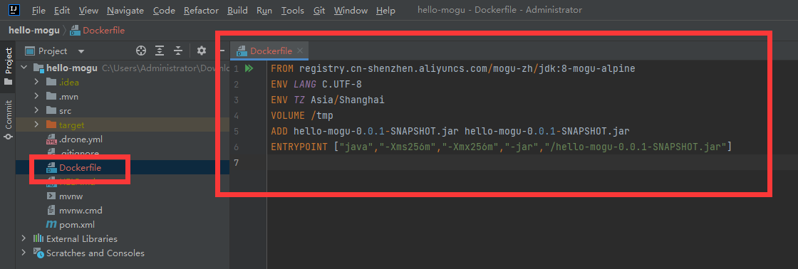

继续编写 .drone.yml 文件，这里除了需要拷贝  **jar** 文件外，还需要把刚刚写的 **Dockerfile** 文件也拷贝到宿主机上

同时，引入 **appleboy/drone-ssh** 镜像，听名字就可以知道，这个命令是用来远程 **SSH** 连接服务器的

这里有两个变量：**TEST_SERVER_IP** 和 **TEST_SERVER_PASSWORD**，分别是服务器的 **ip** 和 **密码**。为了防止信息泄露，我们需要配置到 **secret**

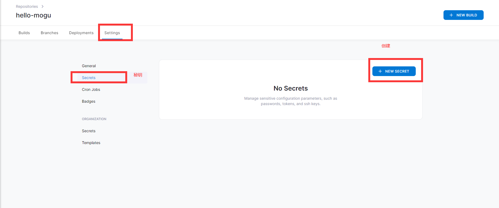

然后填写秘钥的名称和值，保存即可

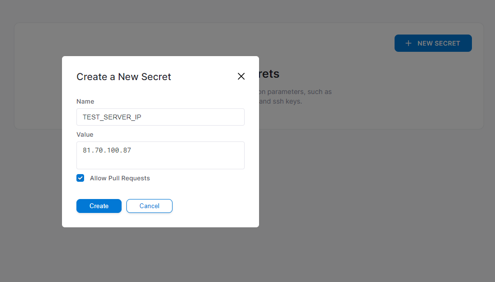

配置完成后，一共包含以下两个值

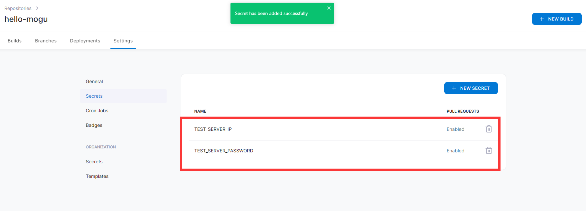

完整的流水线代码如下：

```yml
kind: pipeline # 定义对象类型，还有secret和signature两种类型
type: docker # 定义流水线类型，还有kubernetes、exec、ssh等类型
name: hello-mogu # 定义流水线名称

steps: # 定义流水线执行步骤，这些步骤将顺序执行

  - name: build-package # 流水线名称
    image: maven:3.8.5-openjdk-8 # 定义创建容器的Docker镜像
    volumes: # 将容器内目录挂载到宿主机，仓库需要开启Trusted设置
      - name: maven-build
        path: /root/hello-mogu # 将应用打包好的Jar和执行脚本挂载出来
    commands:
      - mvn clean package -DskipTests=true
      # 将打包后的jar包，拷贝到挂载目录
      - cp /drone/src/target/hello-mogu-0.0.1-SNAPSHOT.jar  /root/hello-mogu
      # 将Dockerfile拷贝到挂载目录
      - cp /drone/src/target/classes/Dockerfile /root/hello-mogu

  - name: ssh
    image: appleboy/drone-ssh
    settings:
      # 你服务器ip地址
      host:
        from_secret: TEST_SERVER_IP
      # 服务器账号
      username: root
      # 密码登入写法
      password:
        from_secret: TEST_SERVER_PASSWORD
      port: 22
      script:
        - cd /root/hello-mogu
        - ls
        - docker build  -t hello-mogu:latest .
        - docker run -p 8080:8080 -d hello-mogu:latest


volumes: # 定义流水线挂载目录，用于共享数据
  - name: maven-build
    host:
      path: /root/hello-mogu   #jar包目录可以修改从宿主机中挂载的目录

```

核心操作就是：在 jar 打包完成后，会通过 ssh 进入到我们服务器中，通过 Dockerfile 构建我们的 **hello-mogu** 镜像，同时使用 **docker run** 启动镜像，完成最简单的一个流水线工作，以下是流水线运行成功的截图：

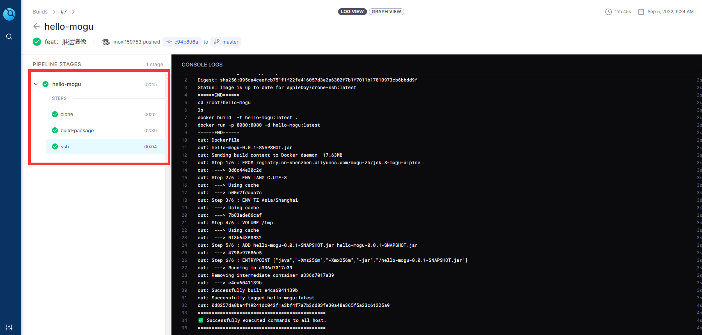

下面，我们去我们的服务器中，使用 docker images 命令，即可查看到制作完成的镜像了


通过使用  docker ps -a ，可以看到目前 hello-mogu 容器正在运行

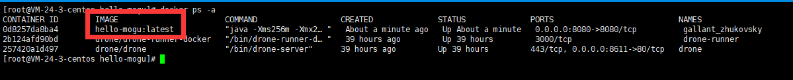

最后，我们访问服务器：http://81.70.100.87:8080/hello-mogu，久违的 **hello-mogu** 终于出现了

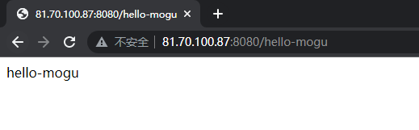

同时，**Drone** 还提供了很多插件，可以打开 https://plugins.drone.io/  进行查看

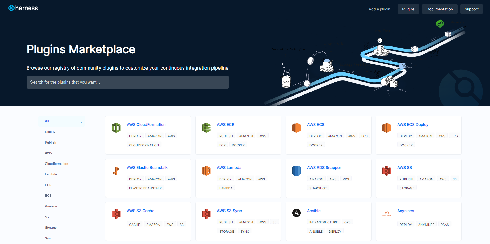

在这里，可以下载别人做好的插件，例如在构建成功后，发送邮件通知，这里用到了  **Email** 插件

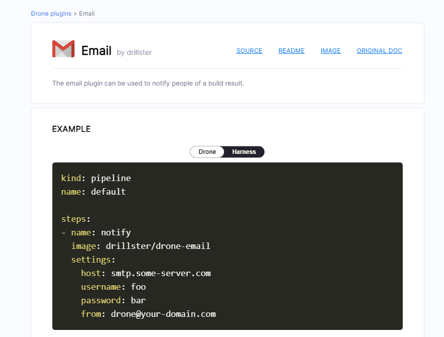

或者使用 Drone Cache 插件，将中间结果缓存到**云存储**中

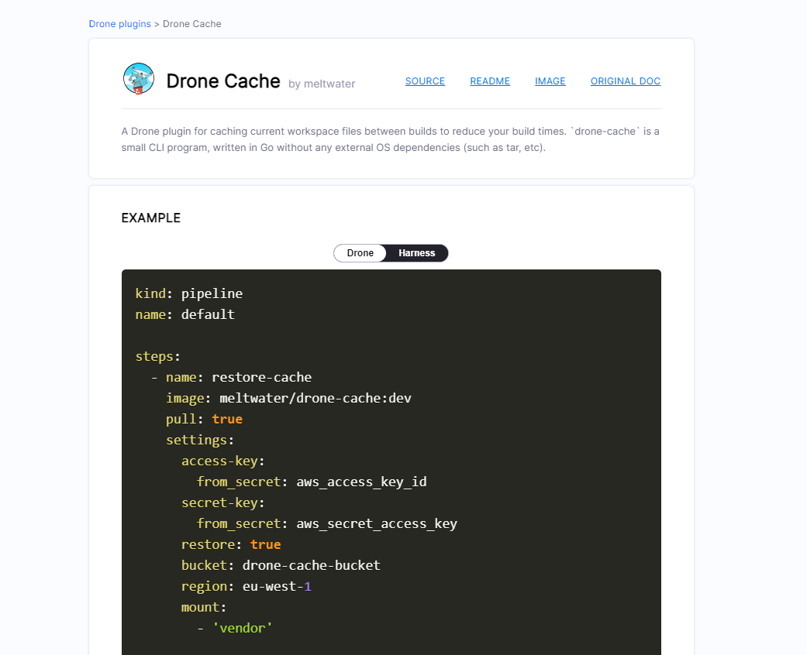

好了，本期 **Drone** 学习之旅就到这里了，本文简单的介绍了一下 **Drone** 的接入流程，更多使用技巧欢迎到 Drone 官网学习~

最后，本次学习中所有的源码，陌溪也整理到了一个压缩包中，有需要的小伙伴可以在公众号回复【**drone**】获取

我是 **陌溪**，我们下期再见~

