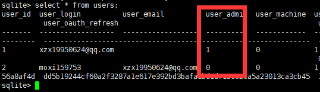
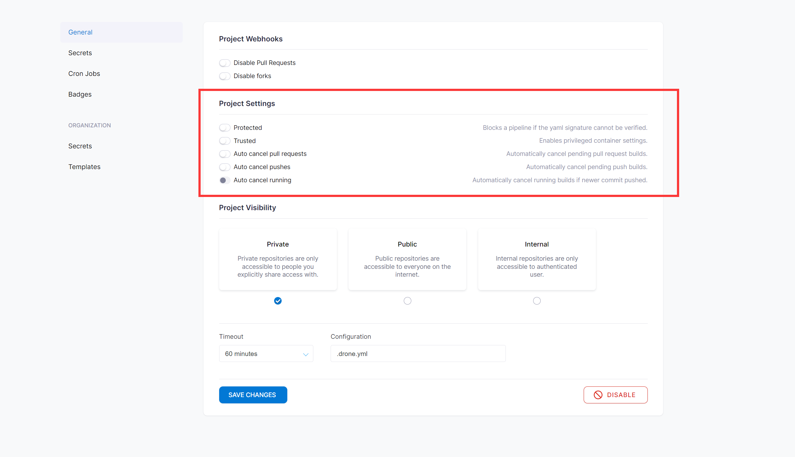

今天，重新搭建了一套 **drone** 流水线，但是在配置的时候，发现找不到 **Project Setting** 配置

重试尝试了几次后，无果，从网上看到是因为登录的账号不是管理员账号导致的

> Drone Server启动时要指定DRONE_USER_CREATE参数，用来设置管理员帐号，只有用管理员帐号打开drone web界面才可以看到和设置Trusted

因为 drone 的数据是挂载出来的，同时内置的 **sqlite** 数据库，因此可以直接数据库去修改自己登录账号为管理员

首先，需要在服务器中安装 **SQLite**，因为使用yum 安装的 sqlite 版本太低，因此需要进行手动安装

```bash
#安装gcc与wget
yum install gcc
 
yum Install wget
 
#安装最新版（截至2021-1-13）sqlite并解压、安装
 
wget http://www.sqlite.org/2020/sqlite-autoconf-3340000.tar.gz
 
tar zxf sqlite-autoconf-3340000.tar.gz
 
cd sqlite-autoconf-3340000
 
./configure --prefix=/usr/bin/sqlite
 
make && make install
 
#检查安装的sqlite3版本
/usr/bin/sqlite/bin/sqlite3 --version
```

安装完成后，找到 database 文件，然后进行操作

```bash
/usr/bin/sqlite/bin/sqlite3 database.sqlite
.header on #开启头部显示。
.mode column # 列输出
.tables
select * from users;
update users set user_admin = 1;
```





操作完成后，刷新页面，即可看到当前账号的 Project Setting 配置出现了



同时，可以看到在 drone 里是注册了两个账号！因此我们可以修改 **drone.yml** 配置，把 **moxi159753** 这个账号也设置管理员

```bash
# 创建管理员账户，这里对应为gitee的用户名(必填主义是用户名,不是昵称)(填错了回导致自动化部署失败)
- DRONE_USER_CREATE=username:moxi159753,admin:true
```

