大家好，我是 **陌溪**

有不少小伙伴想让我讲讲蘑菇中的图片上传功能，今天就让我们一起来学习一下如何将图片上传到 **七牛云** 吧~

在讲如何上传七牛云之前，我们先来看看主流的对象存储方式有哪些

**第一种**：直接将图片保存到服务器的磁盘（使用 **IO** 流）

- 优点：开发便捷、成本低
- 缺点：扩容困难，数据容易丢失

**第二种**：使用分布式文件系统进行存储（如 **MiniIO**）

- 优点：容易实现扩容
- 缺点：开发复杂度稍大，尤其是需要开发复杂的功能时。

**第三种**：使用第三方的存储服务（**七牛云**）

- 优点：开发简单，数据不易丢失，并且图片加载速度快。
- 缺点：超过免费限额，可能需要付费

如果有体验蘑菇博客的小伙伴，其实可以在后台系统看到，蘑菇其实已经集成了上面的三种对象存储方式的，默认开启的是：本地文件存储

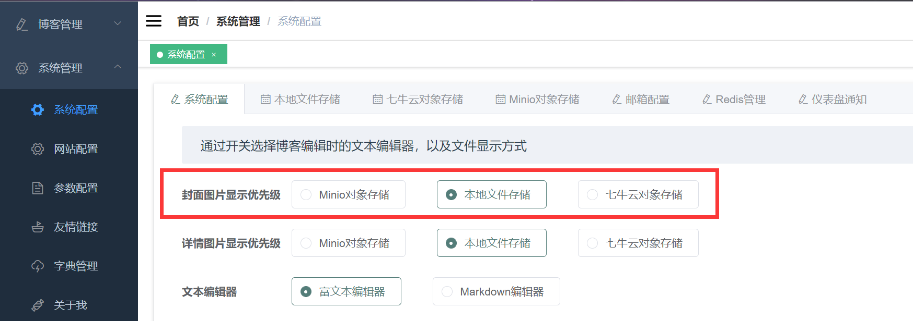

本期，我们讲重点讲解七牛云存储在蘑菇中如何使用的，对于其它存储方式，如果小伙伴感兴趣的话，后面可以在写一篇文章来讲解~

## 什么是对象存储

对象存储是面向文件的，海量的互联网存储，它也可以直接被称为：**云存储**。在对象存储中，你不能直接打开或修改文件，但可以像 **FTP** 一样上传文件，下载文件等。

同时，对象存储没有像文件系统那样有一个很多层级的文件结构，而是只有一个 **桶（bucket）** 的概念，也就是 **存储空间**。桶里全部都是对象，是一种非常扁平化的存储方式。其最大的特点就是它的对象名称就是一个域名地址，一旦对象被设置为 **公开**。互联网所有地方都可以访问到它，它的拥有者还可以通过 **REST API** 的方式访问其中的对象。因此，对象存储最主流的使用场景，就是存储网站中的静态内容，如：**图片**、**文件**、**视频** 等。

对象存储结构主要由：**对象**、**对象存储设备**、**元数据服务器**、**对象存储客户端** 四部分组成

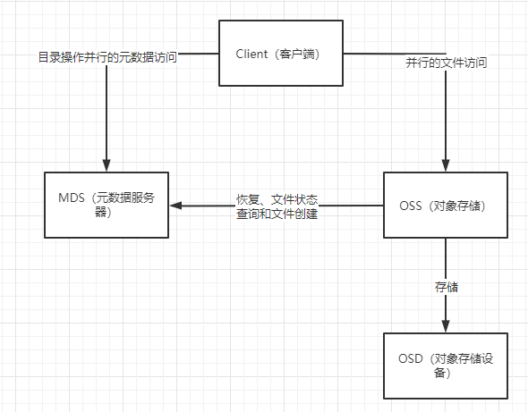

**对象** 是系统中数据存储的基本单位，一个对象实际上就是文件的数据和一组属性信息（**Meta Data**）的组合。每个对象是数据和数据属性集的综合体，数据属性可以根据应用的需求进行设置，包括数据分布、服务质量等。
**对象存储设备** 是一个智能设备，具有自己的存储介质、处理器、内存以及网络系统等，负责管理本地的 **Object**，是对象存储系统的核心。

**元数据服务器** 控制 客户端 与 对象存储的交互，为客户端提供元数据，主要是文件的逻辑视图，包括文件与目录的组织关系、每个文件所对应的 **OSD** 等。主要提供以下几个功能：对象存储访问、文件和目录访问、**Client Cache** 一致性。

**客户端** 主要是为了支持访问 **OSD** 上的对象而设计的，现有的应用对数据的访问大部分都是通过 **POSIX** 文件访问进行的，对象存储系统提供给用户的也是标准的 **POSIX** 文件访问接口。

## 第三方存储服务

说完了对象存储的基本原理，下面我们来聊聊第三方的存储服务，其实也就是在对象存储的基础上各家产生做了一些工作，比如在云厂商的机房搭建了对象存储服务，并做了相关容灾处理。目前市面上常见的第三方存储服务有：

阿里云对象存储 **OSS**：

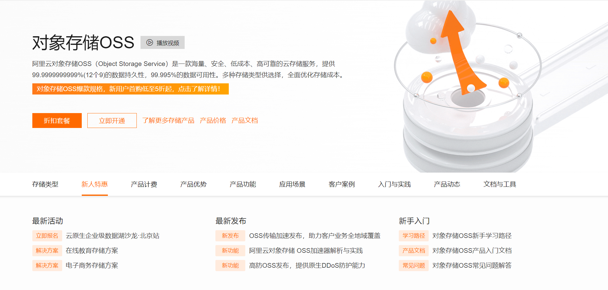

腾讯云对象存储 **COS**：

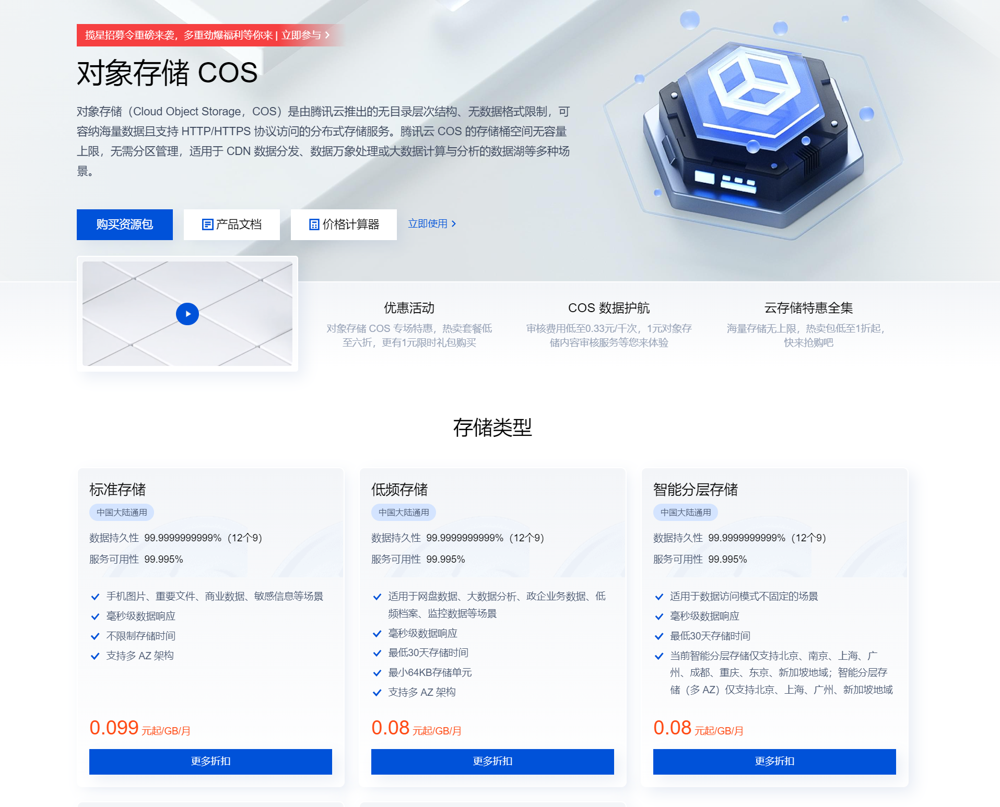

七牛云对象存储 **Kodo**：

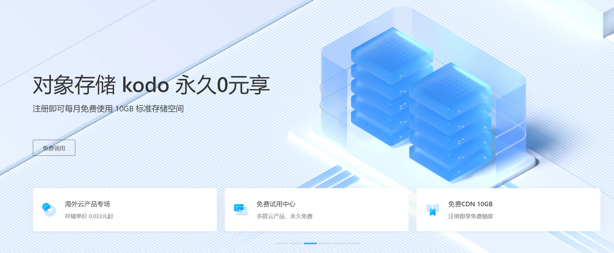

至于蘑菇为啥使用的是七牛云呢？当然是因为想要给大家节省成本了

首先，七牛云对象存储每个月是会提供 **10G** 的标准存储空间和 **10G** 免费的 **HTTP**  **CDN** 流量，一般作为个人的博客网站来说，**10G** 的存储已经完全够用了

以蘑菇博客为例，现在一共有 **1000** 多篇文章，一共存储了  **14414** 个图片，也才花费了 **2.21GB** 的存储空间（这当然还得靠蘑菇集成的图片压缩算法，把大图都压缩成马赛克了。。）


除了存储外，如果我们的图片还要放在公网上，被大家访问的话，那么就还需要用到 **CDN** 流量了

以蘑菇为例，一个月的 **CDN** 流量大概需要 **9G**，如果大家使用的是 **HTTP** 流量的话，那么是有 **10G** 免费的额度，也相当于白嫖，而且还可以享受非常大的图片 **CDN** 带宽，比起存储在自己的服务器的 **1M** 小水管来说，体验感简直拉满了！

## 如何接入七牛云存储

下面我们来讲讲，如何接入七牛云存储，实现对图片资源的高速访问

按照管理，先初始化一个 **SpringBoot** 项目，引入 **SpringWeb** 依赖后，下载即可

> https://start.spring.io/

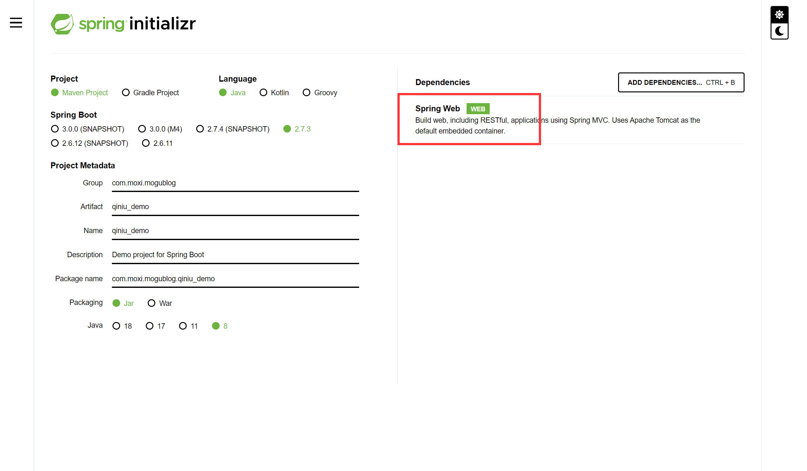


然后，将项目导入到 **IDEA** 中，引入七牛云 **SDK** 依赖

```pom
<dependency>
    <groupId>com.qiniu</groupId>
    <artifactId>qiniu-java-sdk</artifactId>
    <version>[7.7.0, 7.7.99]</version>
</dependency>
```

然后编写配置文件 **application.yml**，这里需要配置七牛云的公钥、私钥、桶名称以及访问的 **URL**，下面会将如何获取这几个参数

```yml
server:
  port: 8080

qiniu:
  accessKey: xxxxxxxxxxxxxxxxxxxxxxxxxxxxx # 公钥
  secretKey: xxxxxxxxxxxxxxxxxxxxxxxxxxxxxx # 私钥
  bucketName: mogu-test  # 桶名称
  area: z2  # z2表示华南
  path: http://riew531sd.hn-bkt.clouddn.com/  # 访问url

# 最大文件上传，单次最大上传
spring:
  servlet:
    multipart:
      max-request-size: 10MB
      max-file-size: 10MB

```

首先，打开七牛云官网【点击查看原文直达】

> 官网：https://s.qiniu.com/zuuEJz

然后，注册账号，完成个人认证后，即可每月获取免费的 **10G** 存储空间~

选择对象存储，选择空间管理，新建空间

> 对象存储：https://portal.qiniu.com/kodo/bucket

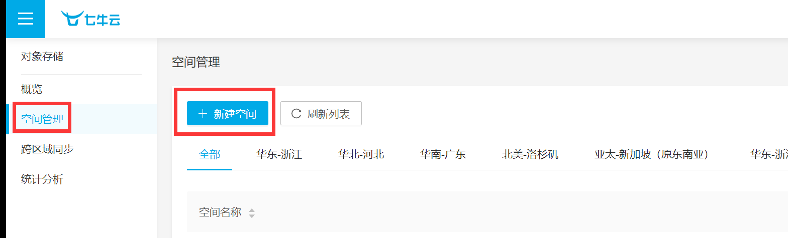

在右侧填写好存储空间信息，这里需要配置：存储空间名称（**bucketName**）、存储区域（area），这两个信息在上方配置中需要使用

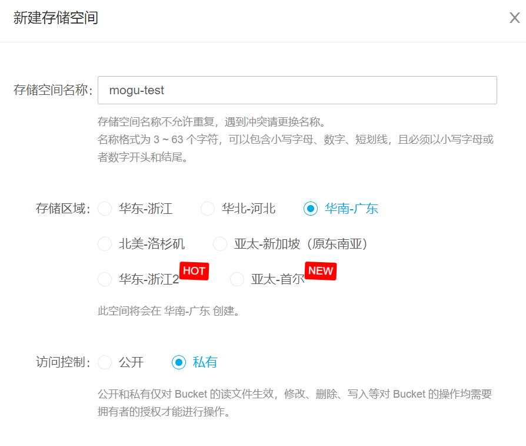

空间创建完成后，会提示绑定图片域名，如果小伙伴没有域名的话，可以直接使用七牛云提供的测试域名

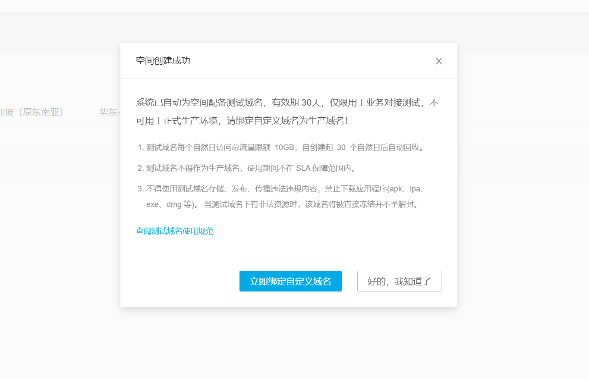

这里可以稍后来绑定，然后进入到对象存储的首页，在这里可以看到刚刚的测试域名

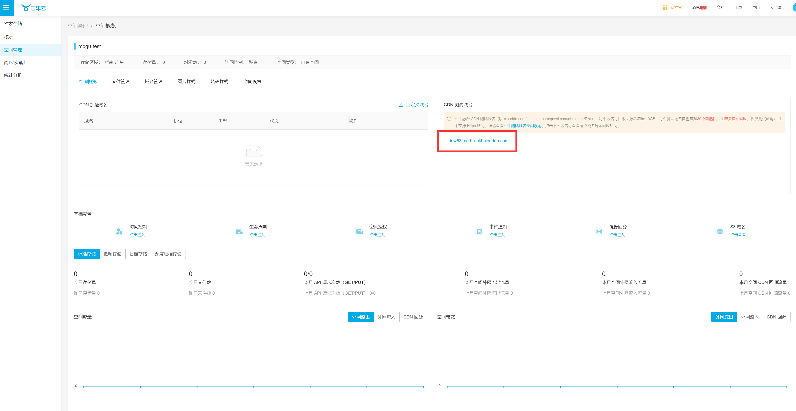

然后右上方的头像，可以看到密钥管理

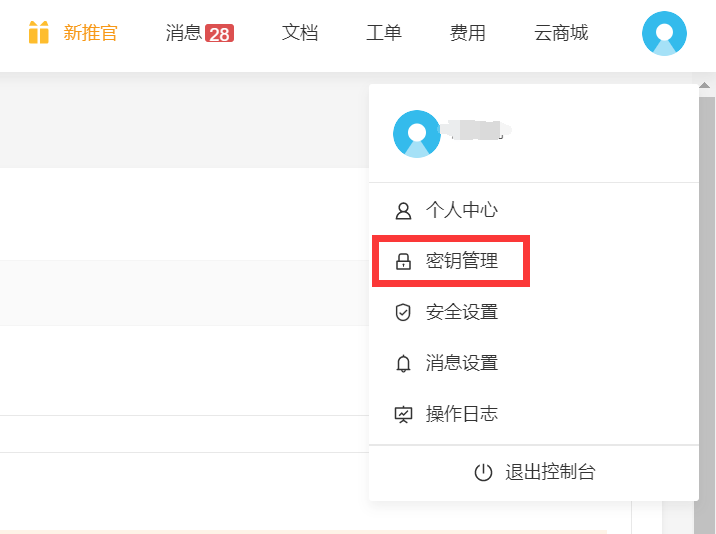

点击后，是可以看到正在生效 **accessKey** 和 **secretKey** 了，这个需要保管好，最好能定期做一下切换，防止秘钥泄露

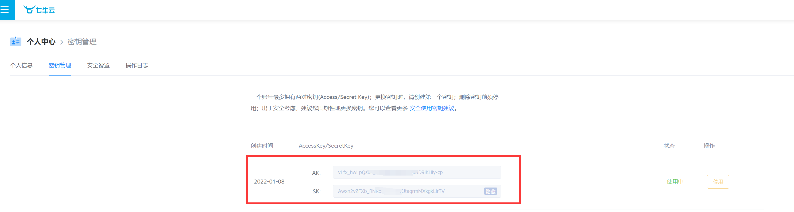


下面，来看看七牛云上传图片方法的流程图


上传图片到七牛云的代码如下所示：

```java
/**
     * @param file 前端传来的图片
     * @return 图片的访问路径
     */
public String upload(MultipartFile file){
    // 生成文件名
    String fileName = getRandomImgName(file.getOriginalFilename());
    //构造一个带指定 Region 对象的配置类
    Configuration cfg = setQiNiuArea(area);
    //...其他参数参考类注释
    UploadManager uploadManager = new UploadManager(cfg);
    //默认不指定key的情况下，以文件内容的hash值作为文件名
    try {
        byte[] uploadBytes = file.getBytes();
        Auth auth = Auth.create(accessKey, accessSecretKey);
        String upToken = auth.uploadToken(bucketName);
        Response response = uploadManager.put(uploadBytes, fileName , upToken);
        //解析上传成功的结果
        DefaultPutRet putRet = new Gson().fromJson(response.bodyString(), DefaultPutRet.class);
        return path + fileName;
    } catch (Exception ex) {
        ex.printStackTrace();
    }
    return null;
}
```

删除文件代码如下所示：

```bash
/**
 * 删除七牛云文件
 *
 * @return
 */
public String deleteFile(String fileName) {
    //构造一个带指定Zone对象的配置类
    Configuration cfg = setQiNiuArea(area);
    //获取上传凭证
    Auth auth = Auth.create(accessKey, accessSecretKey);
    BucketManager bucketManager = new BucketManager(auth, cfg);
    try {
        bucketManager.delete(bucketName, fileName);
        return "删除成功";
    } catch (QiniuException ex) {
        //如果遇到异常，说明删除失败
        ex.printStackTrace();
        return "删除失败";
    }
}
```

完整的 **QiNiuUtil.java** 如下：

```java
@Component
public class QiNiuUtil {
    @Value("${qiniu.accessKey}")
    private  String accessKey;      //公钥
    @Value("${qiniu.secretKey}")
    private  String accessSecretKey;   //私钥
    @Value("${qiniu.bucketName}")
    private  String bucketName;   // 存储空间
    @Value("${qiniu.path}")
    private  String path;       // 域名
    @Value("${qiniu.area}")
    private  String area;       // 区域


    /**
     * @param file 前端传来的图片
     * @return 图片的访问路径
     */
    public String upload(MultipartFile file){
        // 生成文件名
        String fileName = getRandomImgName(file.getOriginalFilename());
        //构造一个带指定 Region 对象的配置类
        Configuration cfg = setQiNiuArea(area);
        //...其他参数参考类注释
        UploadManager uploadManager = new UploadManager(cfg);
        //默认不指定key的情况下，以文件内容的hash值作为文件名
        try {
            byte[] uploadBytes = file.getBytes();
            Auth auth = Auth.create(accessKey, accessSecretKey);
            String upToken = auth.uploadToken(bucketName);
            Response response = uploadManager.put(uploadBytes, fileName , upToken);
            //解析上传成功的结果
            DefaultPutRet putRet = new Gson().fromJson(response.bodyString(), DefaultPutRet.class);
            return path + fileName;
        } catch (Exception ex) {
            ex.printStackTrace();
        }
        return null;
    }

    /**
     * 删除七牛云文件
     *
     * @return
     */
    public String deleteFile(String fileName) {
        //构造一个带指定Zone对象的配置类
        Configuration cfg = setQiNiuArea(area);
        //获取上传凭证
        Auth auth = Auth.create(accessKey, accessSecretKey);
        BucketManager bucketManager = new BucketManager(auth, cfg);
        try {
            bucketManager.delete(bucketName, fileName);
            return "删除成功";
        } catch (QiniuException ex) {
            //如果遇到异常，说明删除失败
            ex.printStackTrace();
            return "删除失败";
        }
    }

    /**
     * @Description: 生成唯一图片名称
     * @Param: fileName
     * @return: 云服务器fileName
     */
    public static String getRandomImgName(String fileName) {
        int index = fileName.lastIndexOf(".");

        if (fileName.isEmpty() || index == -1){
            throw new IllegalArgumentException();
        }
        // 获取文件后缀
        String suffix = fileName.substring(index).toLowerCase();
        // 生成UUID
        String uuid = UUID.randomUUID().toString().replaceAll("-", "");
        // 拼接新的名称
        return uuid + suffix;
    }

    /**
     * 设置七牛云上传区域（内部方法）
     *
     * @param area
     * @return
     */
    private Configuration setQiNiuArea(String area) {
        //构造一个带指定Zone对象的配置类
        Configuration cfg = null;

        //zong2() 代表华南地区
        switch (area) {
            case "z0": {
                cfg = new Configuration(Zone.zone0());
            }
            break;
            case "z1": {
                cfg = new Configuration(Zone.zone1());
            }
            break;
            case "z2": {
                cfg = new Configuration(Zone.zone2());
            }
            break;
            case "na0": {
                cfg = new Configuration(Zone.zoneNa0());
            }
            break;
            case "as0": {
                cfg = new Configuration(Zone.zoneAs0());
            }
            break;
            default: {
                return null;
            }
        }
        return cfg;
    }
}
```

最后，在编写 **Controller** ，提供 **http** 接口供外界调用

```java
@RestController
public class UploadController {

    @Autowired
    private QiNiuUtil qiNiuUtil;

    @PostMapping("/upload")
    public String upload(@RequestBody MultipartFile file) {
        return qiNiuUtil.upload(file);
    }

    @PostMapping("/delete")
    public String upload(@RequestParam String fileName) {
        return qiNiuUtil.deleteFile(fileName);
    }
}
```

完整的代码压缩包，陌溪也已经上传到网盘，在公众号回复【**qiniu**】即可下载


## 测试七牛云

完成代表编写后，启动项目开始进行图片上传测试

首先，测试一下上传功能，选择对应的文件点击上传，上传成功后即可返回图片url地址

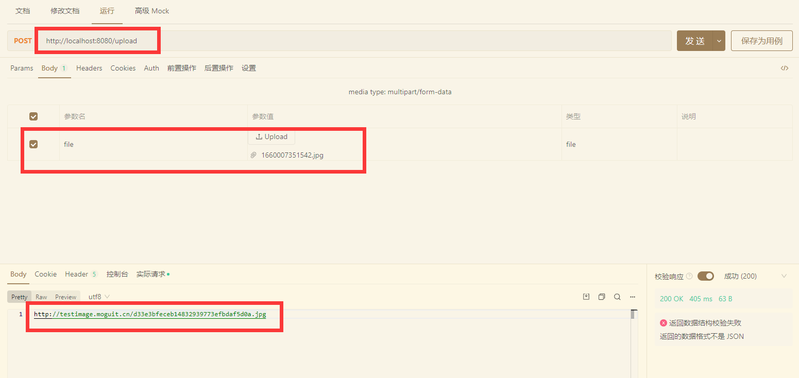

打开七牛云的文件管理目录，即可查看到刚刚上传的文件：

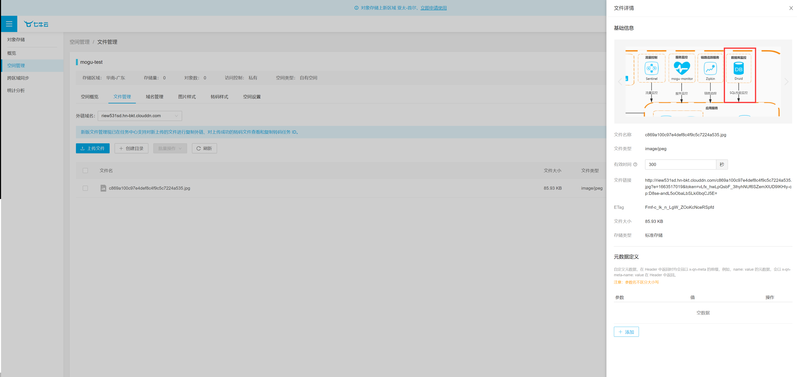

调用 **delete** 方法，输入刚刚的文件名，即可删除刚刚上传的文件

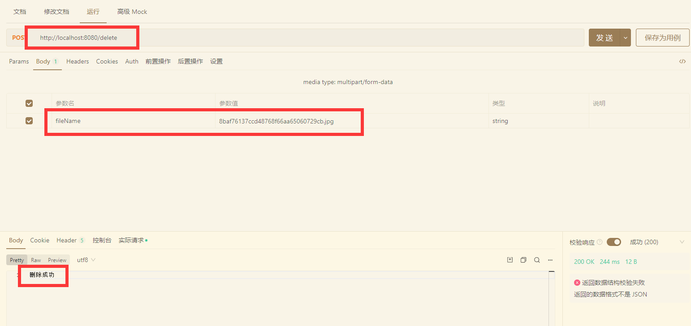

再次到七牛云后台管理中，可以看到刚刚删除的配置

最后，陌溪也把完整的代码操作，上传到网盘了，


## 蘑菇集成七牛云配置

在蘑菇社区中，集成了 七牛云、阿里云、Minio、本地存储四种方式，通过配置表保存各个云存储的配置信息

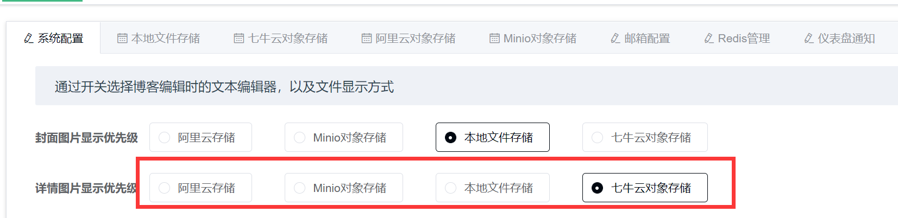

可以通过切换 **TAB** ，来配置不同的存储模式，来满足大家对于不同存储方式的需求。

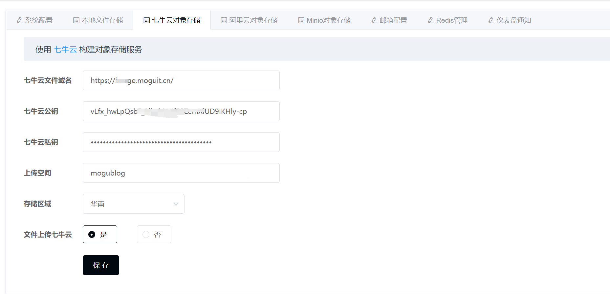

下面，是蘑菇图片服务的完整流程图

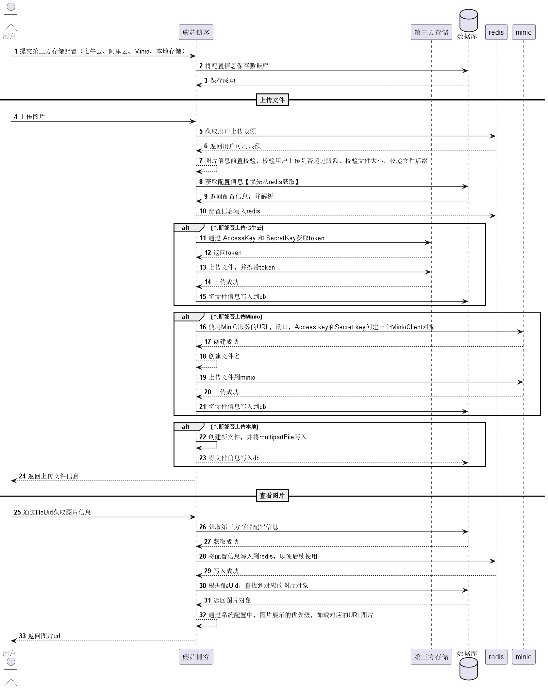

如果想了解关于蘑菇图片存储的更多细节，可以下载蘑菇源码体验吧~

```bash
Gitee： https://gitee.com/moxi159753/mogu_blog_v2
```

好了，本期的蘑菇第三方存储学习就到这里了

我是陌溪，我们下期再见。