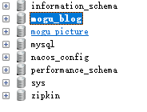
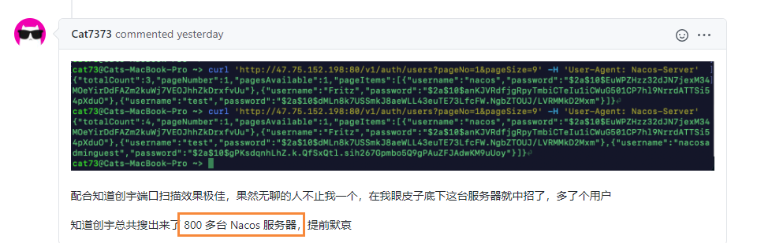
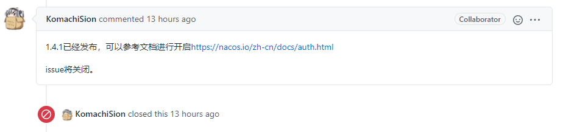
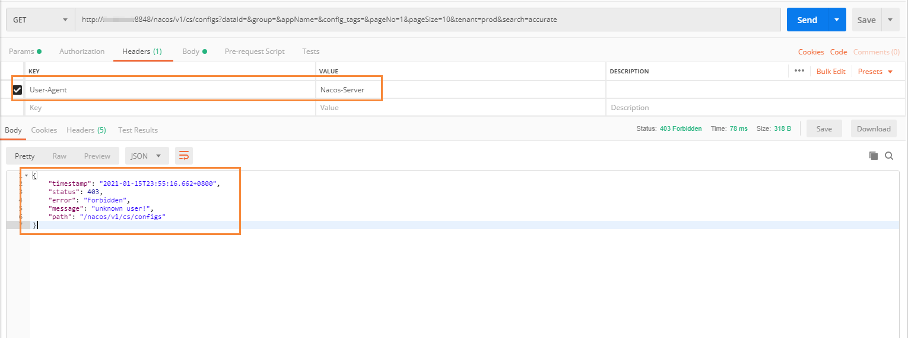
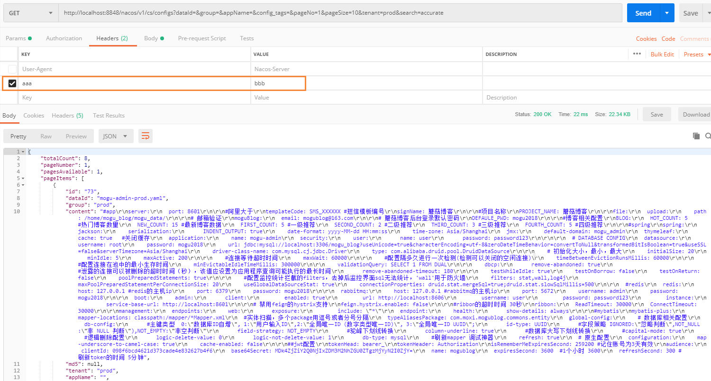

# Nacos出现重大安全漏洞,开源项目险遭脱库

## 前言

大家好，我是**陌溪**

昨天陌溪在**蘑菇博客交流群**和群里的小伙伴进行了一场**比较激烈的讨论**，主要是关于 **Nacos** 中一个**绕过安全认证**直接获取**微服务**项目的配置文件的 **安全漏洞**。


截止到昨天为止，该 **issue** 已经有 **50** 条评论。下面是该 **issue** 的地址，感兴趣的小伙伴可以跳转进行查看。

```bash
https://github.com/alibaba/nacos/issues/4593
```

## 漏洞起源

可能有些小伙伴还不太清楚 **Nacos** 是啥，它是 **SpringCloud** **Alibaba** 微服务架构中的一个组件，主要作用是**服务注册和发现**以及**分布式配置管理**。  也就是说我们的配置都可以在 **Nacos** 中存储，里面记录着 **MySQL**、**Redis** 等数据库的**账号**和**密码**，如果用户能够进入到 **Nacos** 中，也相当于我们的**数据**已经能够被脱库了。

因为 **Nacos** 官方仓库对该 **issue** 做了**脱敏**处理，**issue** 提主的描述也已经被删除了，但是从 **issue** 的回答中，陌溪能还原这个**安全漏洞**的一些描述。

> 用户发现通过设置请求头：User-Agent: Nacos-Server，就可以绕过Nacos的权限校验，而直接获取到项目的所有配置文件信息，然后题主建议Nacos官方立即对这个问题进行修复。

然后 **Nacos** 项目的开发者认为，这不是一个 **安全漏洞**，并且认为通过设置 **User-Agent** 就相当于开启了白名单，那么就可以忽略鉴权。


开发人员的答复马上就获得了 **300** 多人的反对意见。认为开发者将 **Nacos** 默认密码和本次**安全漏洞**说成是一个问题。


我觉得上面这个回复非常中肯，就拿**陌溪**来说，当我部署完 **Nacos** 后，我首先第一件事就是修改 **Nacos** 默认的账号和密码，然后换成一个更加安全的。但是对于**忽略鉴权**这个机制，我并不知情的，所以其它用户也可以通过非法的**后门**来获取到我的配置。

## 漏洞复现

在我看完这个 **issue** 的时候，**陌溪**和**群里小伙伴**想着就拿线上部署的**蘑菇博客**来进行测试。首先我先介绍一下，**蘑菇博客**使用的 **Nacos** 版本是 **1.4.0**，也是前段时间，刚刚发布的最新的一个版本。

首先通过 **Chrome** 浏览器的**F12** 观察 **nacos** 请求的 **Network**，找到了下面这条**Nacos配置文件**请求接口

```bashh
http://your_ip:8848/nacos/v1/cs/configs?dataId=&group=&appName=&config_tags=&pageNo=1&pageSize=10&tenant=dev&search=accurate
```

然后打开 **Postman**，填写这个 **URL**，并设置 **GET** 请求，同时设置 **Headers** 请求头，加入 **User-Agent:Nacos-Server**，如下图所示


从上面的请求 **URL** 中可以看出，陌溪没有设置任何 **Token** 相关的操作，只填写了一个固定的请求头，然后发送请求一个 **HTTP** 请求。

嗯...  果然不出我所料，我的 **Nacos** 配置**直接就获取到**了！！！


其中里面包含了 **MySQL** 的账号密码，**Redis** 的账号密码。而且因为之前**陌溪**为了方便，并没有对配置文件的用户和密码进行**加密处理**，所以直接显示的就是**明文**。同时因为经常为了远程调试方便，所以顺便开放了 **MySQL** 的 **3306** 端口，下面我通过找到的 **IP地址** 和 **MySQL** 的账号密码，使用 **SQLyog** 工具，直接入侵了我的后台数据库



陌溪只需要执行 **SQL** 导出，就可以轻松将**蘑菇博客数据**进行**脱库**，同时我在 **issue** 中，也看到有小伙伴通过**端口扫描工具**，一共搜出来 **800** 多台暴露了公网的 **Nacos** 服务器，所以这些服务器无一例外，都有可能被**脱库**！！



上次蘑菇博客删库事件：[大型生产事故,开源项目蘑菇博客差点被删库](https://mp.weixin.qq.com/s/UprMwItKjJ-Bcj1Z5ija1g) 还历历在目，因为陌溪设置 **MySQL** 的密码而引起的，而这次很显然是 **Nacos** 出现的安全漏洞而造成的。

最后**陌溪**提醒一下，想**利用该漏洞搞事情**的小伙伴，我**劝你善良**。


## 解决方法

后面社区小伙伴们，踊跃的提出了自己的修改意见，最后决定通过增加自定义 **Key Value** 键值对对来解决，只有通过设置**正确的键值**对才能**获取配置**。


在今天 **Nacos** 开发人员已经重视了这个高危安全漏洞，并且紧急的发布了最新的 **1.4.1** 版本。



我们只需要下载最新版本的 **Nacos 1.4.1** ，然后修改对应的 **application.properties** 文件，修改如下内容

```bash
# 开启鉴权
nacos.core.auth.enabled=true
# 关闭白名单功能
nacos.core.auth.enable.userAgentAuthWhite=false.
# 配置键值对 [键值对可以自定义]
nacos.core.auth.server.identity.key=aaa
nacos.core.auth.server.identity.value=bbb
```

最后我们再次使用刚刚的请求进行测试，发现已经无法获取到配置了



那么我们需要怎么才能获取到配置呢？只需要在 **headers** 里面，填写刚刚配置文件中的**键值对**即可



因为**键值对**是我们自定义的，因此每个人的都是不相同的。到这里 **Nacos** 的**安全漏洞**已经算是解决了，最后**陌溪**希望看到本篇文章的小伙伴，如果公司还没有升级最新版的 **Nacos**，那么强烈建议进行升级！

## 往期推荐

- [从三本院校到斩获字节跳动后端研发Offer-讲述我的故事](https://mp.weixin.qq.com/s?__biz=MzkyMzE5NTYzMA==&mid=2247485023&idx=1&sn=429fd2090f081e7cd09bec7786b2f30a&chksm=c1e987def69e0ec8da0ec74fae9b62055406fd199270a6b132687d943a1295659d939b2236b7&token=642644308&lang=zh_CN&scene=21#wechat_redirect)
- [蘑菇博客从0到2000Star，分享我的Java自学路线图](https://mp.weixin.qq.com/s?__biz=MzkyMzE5NTYzMA==&mid=2247484691&idx=1&sn=f01431e0b7c38f72282fdae96eca126b&chksm=c1e98492f69e0d848cba8052b814750027b4c1f0bd813e64afbb7ea79a1d78c39cbc97941e4f&token=642644308&lang=zh_CN&scene=21#wechat_redirect)
- [陌溪在公众号摸滚翻爬半个月，整理的入门指南](https://mp.weixin.qq.com/s/Jj1i-mD9Tw0vUEFX/VXH19dQRkNtPbzDMVXwsPQ)
- [陌溪在开源社区逛了几个月, 终于写下了蘑菇博客的开源文档](https://mp.weixin.qq.com/s/VXH19dQRkNtPbzDMVXwsPQ)

结语
--

**陌溪**是一个从三本院校一路摸滚翻爬上来的互联网大厂程序员。独立做过几个开源项目，其中**蘑菇博客**在码云上有 **2K Star** 。目前就职于**字节跳动的Data广告部门**，是字节跳动全线产品的商业变现研发团队。本公众号将会持续性的输出很多原创小知识以及学习资源。如果你觉得本文对你有所帮助，麻烦给文章点个「赞」和「在看」。同时欢迎各位小伙伴关注陌溪，让我们一起成长~

