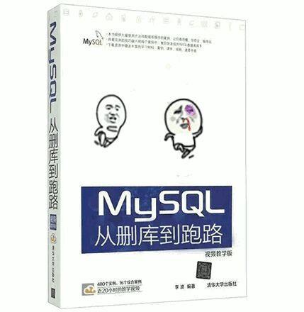
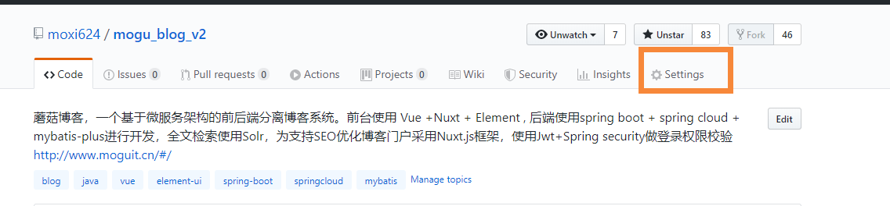

## 前言

> 大家好，我是陌溪

陌溪这阵子一直在研究**自动化部署**。因为之前人肉运维的方式，虽说能够完成项目部署的要求，但是每次**蘑菇博客**发布都需要经历以下几个过程：**编译**、**打包**、**上传到服务器**，**启动项目**。这些步骤做多了就感觉非常的**花费时间**，每次进行这一系列的操作，可能就需要大概 **20** 分钟左右，长年累月，造成大量的时间花费在这低效率的工作上，所以现在迫切的需要一个能够**持续集成**和**持续部署**的功能。

经过陌溪摸滚翻爬，目前主要的**持续集成方案**有以下两种：

- **Jenkins** + **Gitlab** + **Docker**
- **Gitee Go**
- **Github Actions**

因为考虑到 **Jenkins** + **Gitlab** 需要我们在自己的服务器安装 **Jenkins** 和 **Gitlab** 私有库，这样就会比较消耗**我们服务器的资源**，因为陌溪用的都是学生机，对，没错，就是 **1** 核 **2G** 的那种。


**Github** 提供的 **Actions** 服务，慷慨的给 **Actions** 提供了计算资源，也就是说我们可以在 **Github** 提供的一个独立容器中，给我们的项目进行构建，最后在通过 **Scp** 和 **SSH** 等 **Linux** 命令，分发到我们的服务器上，最后启动项目。

最近 **Gitee** 也推出了 **Gitee Go**，在功能和使用上和 **Github Actions** 类似，但是因为只有 **500** 分钟的试用时间，超过了就需要付费的，因此这里就暂时不考虑了。

综上，陌溪最终选定**Github Actions** 作为**蘑菇博客**持续集成方案，下面我就开门见山，展示一下最终结果。


当我们提交代码时，会自动执行对应的 **actions**，开始运行脚本，自动完成项目的编译、打包、部署。

## 什么是Github Actions？

我们都知道**持续集成**是有很多步骤组成：

- 抓取代码
- 编译，运行测试，打包
- 登录远程服务器
- 发布到第三方服务
- .....

**Github** 统一将上述操作称为 **Actions**，其中里面的**很多操作**在项目中是相同的，完全可以共享，因此 **Github** 就想到了把每个操作写成一个**独立的脚本文件**，存放到代码仓库中，让其它用户可以直接引入某个 **action**，从而不必自己写复杂的脚本。

我们通过一系列的 **Action** 组合，在加上自己部分业务逻辑的脚本，就组合成了一个 **Actions** ，我们称这个**Actions** 为持续集成，这就是 **Github Actions** 的特别之处，同时 **Github** 有专门一个 **Action** 仓库，我们通过在里面**挑选合适的脚本**进行组合，即可完成自己的持**续集成方案**了。


> Github Actions传送门：
>
> https://github.com/marketplace?type=actions

## Github Actions介绍

> Github Actions 官方文档：
>
> https://help.github.com/en/actions/automating-your-workflow-with-github-actions

**Github Actions** 优势：

- 通过 **Docker** 隔离，每个Actions的运行都在独立的Docker容器
- GitHub 提供慷慨的计算资源（每个 workflow 会独享 **1** 核虚拟 CPU, **3.75GB** 内存, 网络权限和 **100GB** 的磁盘空间, 感觉比我的 **VPS** 性能还好）
- 代码上下文（可以获取触发 **Actions** 的代码上下文环境, 比如当前分支）
- 提供一种新的配置语言和一个体验非常现代化的 **workflow** 编辑器

**Github** **Actions** 限制：

- 支持在代码仓库的 **Settings** 中增加不超过 **100** 个密钥(比如 **Slack**, **S3** 等), 供 workflow 使用; 也可以直接使用可视化编辑器增加
- **Workflow** 的 **Action** 支持设置 **Icon** 和背景色
- **workflow** 有一定限制

**GitHub Actions** 拥有非常大的灵活度和足够的计算资源, 足够做很多很多以前需要靠 **CI** 或者通过配置 **jenkins** 来实现的功能. **GitHub Actions** 会不会抢占一些第三方类似服务的市场不好说, 但是对这份充足而且目前免费的计算资源, 会让很多开源项目和小公司技术团队的开发流程**更灵活和自动化**。

**GitHub** 在发布 **Actions** 的时候, 也明确说过会防止被**滥用当成服务器计算机资源**. 目前 **GitHub workflow** 本身有一些限制, 比如每个 **workflow**, 包括排队和执行时间, 最多 **58** 分钟; 每个 **workflow** 最多可以包含 **100** 个 Action; 每个仓库同一时刻只能运行两个 **workflow** (足够慷慨了, 这相当于你同时占据了 GitHub 近 8G 的内存资源)。

**GitHub** 在每个 **workflow** 触发的时候, 给 **workflow** 创建一台虚拟机, 作为 **workflow** 的执行环境(**Runtime**), 然后之后一系列的 **Actions** 是在这个 **Runtime** 环境里面执行 **docker** 命令, **pull** 对应的 **docker** 镜像, 执行脚本. 而这一切都需要在 **58** 分钟之内完成。

## 基本概念

**Github Actions** 有自己的专业名词

- **workflow（工作流程）**：我们的一个持续集成运行过程，就是一个 **workflow**
- **job（任务）**：一个 **workflow** 由一个或多个 **jobs** 构成，也就是说我们一个工作流程可以完成多个任务
- **step（步骤）**：每个 **job** 又是由多个 **step** 组成，我们通过不同的步骤进行叠加，最终完成一个 **job**
- **action（动作）**：每个 **step** 相当于一系列的动作组成

## Workflow文件

**GitHub Actions** 的配置文件叫做 **workflow** 文件，存放在代码仓库的`.github/workflows`目录

**workflow** 文件采用的是 **YAML** 格式，文件名可以任意取，但是后缀统一为 **yml**，例如我创建了两个

```
actions_dev.yml
actions_master.yml
```

这里两个配置文件分别是对应着博客的 **dev** 分支发布 和 **master** 分支发布

一个库可以有多个 **workflow** 文件。**GitHub** 只要发现`.github/workflows`目录里面有`.yml`文件，就会自动运行该文件，关于 **workflow** 的配置有很多，更多详情可以参考文档。

> 文档地址：
>
> https://help.github.com/en/actions/automating-your-workflow-with-github-actions/workflow-syntax-for-github-actions

下面主要是列举一下常用的配置：

### name

用于定义一个 **workflow** 的名词，如果省略该字段，默认为 **workflow** 的文件名

```
name: mogu CI/CD
```

### on

指的是触发 **workflow** 的条件，通常是指某些事件，比如 **pull**，**push**，**pull request**，**start**，**fork** 等，都可以触发我们的 **workflow**，例如下面代码是项目 **master** 分支有 **push** 提交时触发

```
on: 
  push:
    branches: 
      - master
```

`on` 字段也可以是事件的数组

```
on: [push, pull_request]
```

### jobs.name

**workflow** 文件的主体是由一个个 **job** 构成，表示要执行的一个或多个任务

**jobs** 字段中，需要写出每一项任务的 **job_id**

```
jobs:
  my_first_job:
    name: My first job
  my_second_job:
    name: My second job
```

### jobs.runs-on

runs-on字段表示运行所需的虚拟机环境，它是一个必填字段，目前有如下可以提供

- ubuntu-latest，ubuntu-18.04 或 ubuntu-16.04
- windows-latest，windows-2019 或 windows-2016
- macOS-latest 或 macOS-10.14

```
jobs:
  build:
    runs-on: ubuntu-latest
```

蘑菇博客的 **job** 指定的是 **ubuntu** 环境

### jobs.steps

steps字段指定了每个 **job** 的运行步骤，可以包含多个步骤，并且每个步骤都可以指定以下字段

- **steps.name**：步骤名称
- **steps.run**：步骤运行的命令或者action
- **steps.env**：步骤所需的环境变量

## 开始一个Actioins

关于**Github Actions** 前置知识我们已经有了初步的学习和了解，下面就可以开始编写自己的 **Actions** 了。


我们进入我们的 **Github** 项目，然后点击 **Actions**，然后选择 **Maven** 项目


这时候会自动创建一个 **maven.yml**

```yml
name: Java CI     #Actions名称

on: [push]        # Action触发条件，当有push提交的时候，触发

jobs:
  build:
	runs-on: ubuntu-latest    #运行环境

steps:
- uses: actions/checkout@v1    # 使用别人的action，checkout指的是拉取本仓库代码
- name: Set up JDK 1.8
  uses: actions/setup-java@v1  #使用官方脚本创建java环境
  with:
    java-version: 1.8
- name: Build with Maven
  run: mvn -B package --file pom.xml
```

下面我们需要根据自己的业务修改，例如**蘑菇的脚本触发条件**是：蘑菇博客的 **master** 分支有提交时触发

```bash
name: Java CI     #Actions名称

on: 
  push:
    branches: 
      - master       #在提交master时触发
jobs:
  build:
	runs-on: ubuntu-latest    #运行环境
steps:

- uses: actions/checkout@master    #获取master分支
  with:
    ref: master  # 切换到master分支
- name: Set up JDK 1.8
  uses: actions/setup-java@v1  #使用官方脚本创建java环境
  with:
    java-version: 1.8
```

## 配置私有的配置文件仓库

因为**蘑菇博客**需要在编译的时候**获取线上环境**的配置环境，而线上环境的配置环境有很多**服务器密码**等信息，不利于**开源公开**，不然可能就被人发现后**删库跑路**了，因此需要创建一个**私有仓库**来存放这些信息。



下面我创建了一个私有仓库：**mogu_prod_configuration**，里面主要存放**线上环境**，以及**测试环境**的配置文件


里面目录结构如下所示：


每个项目里面存放了对应的配置文件，如 **mogu_admin**、**mogu_eureka**、**mogu_picture**、**mogu_sms**、**mogu_web** ，存储的的是各自的 **application.yml** 文件

我们将对应的配置创建完成后，提交到自己的**私有仓库**即可。因为是私有仓库，在访问时需要配置 **SSH** 免密登录.

在任意一台服务器中，执行下列命令

```bash
ssh-keygen -t rsa
```

这时候会生成 **id_rsa id_rsa.pub** 两个文件，我们将 **id_rsa.pub** 文件中的内容放入该私有库

地址：**Settings** -> **Deploy keys**


将 **id_rsa** 中的内容写入蘑菇博客项目的 **Secrets** 中，这样我们就可以在 **Actions** 中引入该私钥而不会暴露出来。在 **Actions** 中写入该步骤，实现 **Actions** 提供的服务器可以访问私有库



然后进行密钥添加


注意每次添加完后，要是想修改的话，只能够重新删除后再添加。这里主要添加的几个 **Secrets** 有：

```bash
DOCKER_ID：云服务器登录名，如root等
DOCKER_IP：云服务器IP地址
DOCKER_PASSWORD：云服务器IP地址
DOCKER_PORT：云服务器ssh端口
ID_RSA：私钥
ID_RSA_PUB：公钥
```

在 **Actions** 脚本中通过 **${{ secrets.xxxxx }}** 引用，示例如下：

```yaml
  - name: Set SSH Environment
    run: |
      mkdir -p ~/.ssh/
      echo "${{ secrets.ID_RSA }}" > ~/.ssh/id_rsa
      echo "${{ secrets.ID_RSA_PUB }}" > ~/.ssh/id_rsa.pub
      cat ~/.ssh/id_rsa.pub >> ~/.ssh/authorized_keys
      chmod 600 ~/.ssh/id_rsa
      chmod 700 ~/.ssh && chmod 700 ~/.ssh/*
      ls -l ~/.ssh/
```

关于密钥验证过程如下：

- 机器1生成密钥对并将公钥发给机器2，机器2将公钥保存。
- 机器1要登录机器2时，机器2生成随机字符串并用机器1的公钥加密后，发给机器1。
- 机器1用私钥将其解密后发回给机器2，验证成功后登录

## 获取蘑菇博客配置文件

下面我们就需要使用 **git clone** 命令下载我们的配置文件了，在下载之前，我们首先需要配置好 **ssh** 免密登录


拉取脚本如下

```bash
git clone git@github.com:moxi624/mogu_prod_configuration.git
```

完整的 **action** 如下：其中 **run** 表示运行的是脚本文件，我们要做的是把刚刚下载的配置文件，使用 **mv** 命令，替换我们项目中的各个目录下的配置文件...

```yaml
 - name: Download config file and replace
      run: |
        git clone git@github.com:moxi624/mogu_prod_configuration.git
        mv -f ./mogu_prod_configuration/dev_config/mogu_admin/application.yml ./mogu_admin/src/main/resources/application.yml
        mv -f ./mogu_prod_configuration/dev_config/mogu_eureka/application.yml ./mogu_eureka/src/main/resources/application.yml
        mv -f ./mogu_prod_configuration/dev_config/mogu_picture/application.yml ./mogu_picture/src/main/resources/application.yml
        mv -f ./mogu_prod_configuration/dev_config/mogu_sms/application.yml ./mogu_sms/src/main/resources/application.yml
        mv -f ./mogu_prod_configuration/dev_config/mogu_web/application.yml ./mogu_web/src/main/resources/application.yml
        mv -f ./mogu_prod_configuration/dev_config/vue_mogu_admin/config.js ./vue_mogu_admin/static/ckeditor/config.js
        mv -f ./mogu_prod_configuration/dev_config/vue_mogu_admin/prod.env.js ./vue_mogu_admin/config/prod.env.js
        mv -f ./mogu_prod_configuration/dev_config/vue_mogu_web/prod.env.js ./vue_mogu_web/config/prod.env.js
```

然后执行 **mvn clean install** 进行打包

```yaml
- name: Build Java jar
      run: | 
        mvn clean install
```

下面的操作是对 **vue_mogu_admin** 和 **vue_mogu_web** 进行打包。因为是 **Vue** 项目，所需安装 **node** 环境，然后执行

```yaml
# 安装依赖
npm install
# 打包
npm run build
```

完整代码如下：

```
    - name: Use Node.js 12.x
      uses: actions/setup-node@v1
      with:
        node-version: 12.x    
    - name: Build vue_mogu_admin and vue_mogu_web
      run: |
        cd ./vue_mogu_admin
        npm install
        npm run build
        cd ..
        cd ./vue_mogu_web
        npm install
        npm run build
        cd ..
```

## 构建的文件打包

将 **maven** 项目和 **vue** 项目进行打包后，后续要做的是将其压缩，传递到我们的服务器

首先是创建一个文件夹，将刚刚生成的 **jar** 包和静态页面 **dist**，全部放到文件夹下，然后使用 **tar** 命令进行压缩

```yaml
 - name: Move files and compress
      run: |
        mkdir -p transfer_files
        mv ./mogu_admin/target/mogu_admin-0.0.1-SNAPSHOT.jar ./transfer_files/mogu_admin-0.0.1-SNAPSHOT.jar
        mv ./mogu_sms/target/mogu_sms-0.0.1-SNAPSHOT.jar ./transfer_files/mogu_sms-0.0.1-SNAPSHOT.jar
        mv ./mogu_eureka/target/mogu_eureka-0.0.1-SNAPSHOT.jar ./transfer_files/mogu_eureka-0.0.1-SNAPSHOT.jar
        mv ./mogu_picture/target/mogu_picture-0.0.1-SNAPSHOT.jar ./transfer_files/mogu_picture-0.0.1-SNAPSHOT.jar
        mv ./mogu_web/target/mogu_web-0.0.1-SNAPSHOT.jar ./transfer_files/mogu_web-0.0.1-SNAPSHOT.jar
        mv ./vue_mogu_web/dist ./transfer_files/web_dist
        mv ./vue_mogu_admin/dist ./transfer_files/admin_dist
        tar -zcvf  transfer_files.tar.gz transfer_files/
```

## Scp脚本拷贝到服务器

在这一步，我们就需要将我们刚刚压缩好的 **transfer_files.tar.gz** 使用**远程超拷贝**命令，复制到我们的阿里云服务器上，在这里我们无法直接使用 **scp** 命令，而需要借助别人写的的一个脚本：**appleboy/scp-action@master**

这里面需要用到刚刚我们定义的 **Secrets**，如果没有的话，是无法完成的，**source** 是我们需要拷贝的文件，**target** 是我们需要拷贝的目标服务器的地址，完整代码如下所示：

```bash
    - name: Scp file to aliyun
      uses: appleboy/scp-action@master
      with:
        host: ${{ secrets.DOCKER_IP_DEV }}
        username: ${{ secrets.DOCKER_ID }}
        password: ${{ secrets.DOCKER_PASSWORD }}
        port: ${{ secrets.DOCKER_PORT }}
        source: "transfer_files.tar.gz"
        target: "/home"
```

## 文件分发和备份

在这步的 **action** 中，我们要做的事情是，使用ssh远程登录我们的云服务器，然后将我们的刚刚拷贝过来的压缩包解压，然后分发到各自的目录下，同时还需要将原来的文件进行备份和删除

这里远程连接 **ssh**，也是引用的别人的 **action**：**appleboy/ssh-action@master**

```yaml
    - name: Distribution and backup
      uses: appleboy/ssh-action@master
      with:
        host: ${{ secrets.DOCKER_IP_DEV }}
        username: ${{ secrets.DOCKER_ID }}
        password: ${{ secrets.DOCKER_PASSWORD }}
        port: ${{ secrets.DOCKER_PORT }}
```

登录进去后，我们需要做的是，首先进入到home目录下，然后解压

```yaml
script: |
          cd /home
          tar -zxvf /home/transfer_files.tar.gz
```

然后判断原来的备份文件是否存在，如果存在那么需要删除

```yaml
if [ -f "/home/mogu_blog/mogu_admin/mogu_admin-0.0.1-SNAPSHOT.jar.bak" ];then
	echo "mogu_admin.jar.bak exists and is being deleted"
	rm -f /home/mogu_blog/mogu_admin/mogu_admin-0.0.1-SNAPSHOT.jar.bak
fi
```

然后把现在的jar文件进行备份

```yaml
if [ -f "/home/mogu_blog/mogu_admin/mogu_admin-0.0.1-SNAPSHOT.jar" ];then
	echo "mogu_admin.jar exists and is being backup"
	mv /home/mogu_blog/mogu_admin/mogu_admin-0.0.1-SNAPSHOT.jar 		/home/mogu_blog/mogu_admin/mogu_admin-0.0.1-SNAPSHOT.jar.bak
fi
```

然后在从解压的文件夹中把对应的jar移动过来

```yaml
mv /home/transfer_files/mogu_admin-0.0.1-SNAPSHOT.jar /home/mogu_blog/mogu_admin/mogu_admin-0.0.1-SNAPSHOT.jar
```

我们需要将 mogu_eureka、mogu_picture、mogu_sms、mogu_admin、mogu_web、以及vue_mogu_web 和 vue_mogu_admin 都替换一遍。

```yaml
  - name: Distribution and backup
      uses: appleboy/ssh-action@master
      with:
        host: ${{ secrets.DOCKER_IP_DEV }}
        username: ${{ secrets.DOCKER_ID }}
        password: ${{ secrets.DOCKER_PASSWORD }}
        port: ${{ secrets.DOCKER_PORT }}
        script: |
          cd /home
          tar -zxvf /home/transfer_files.tar.gz

          echo "################# mogu_admin moving #################"

          if [ -f "/home/mogu_blog/mogu_admin/mogu_admin-0.0.1-SNAPSHOT.jar.bak" ];then
            echo "mogu_admin.jar.bak exists and is being deleted"
            rm -f /home/mogu_blog/mogu_admin/mogu_admin-0.0.1-SNAPSHOT.jar.bak
          fi
          if [ -f "/home/mogu_blog/mogu_admin/mogu_admin-0.0.1-SNAPSHOT.jar" ];then
            echo "mogu_admin.jar exists and is being backup"
            mv /home/mogu_blog/mogu_admin/mogu_admin-0.0.1-SNAPSHOT.jar /home/mogu_blog/mogu_admin/mogu_admin-0.0.1-SNAPSHOT.jar.bak
          fi
          mv /home/transfer_files/mogu_admin-0.0.1-SNAPSHOT.jar /home/mogu_blog/mogu_admin/mogu_admin-0.0.1-SNAPSHOT.jar
```

## 启动项目

在我们替换完成后，我们要做的就是启动我们的项目了，同样也是使用 **ssh** 连接我们的云服务器，然后进入各自的目录下，执行启动脚本

```yaml
 - name: Start mogu_eureka
      uses: appleboy/ssh-action@master
      with:
        host: ${{ secrets.DOCKER_IP_DEV }}
        username: ${{ secrets.DOCKER_ID }}
        password: ${{ secrets.DOCKER_PASSWORD }}
        port: ${{ secrets.DOCKER_PORT }}
        script: |
          cd /home/mogu_blog/mogu_eureka/
          ./shutdown.sh
          ./startup.sh
```

到这里为止，自动化脚本已经构建完毕~。如果小伙伴有多台服务器的话，可以配置两个 **workflow** 文件，一个用来监听 **dev** 分支的改动，另一个用来监听 **master** 主分支的改动。这样将代码提交到测试服务器进行测试，测试通过后，在提交到正式服务器~。

陌溪已经将完整的 **workflow** 脚本文件打包好了，在公众号回复 **自动化部署脚本** ，即可获取。

## 结语

**陌溪**是一个从三本院校一路摸滚翻爬上来的互联网大厂程序员。独立做过几个开源项目，其中**蘑菇博客**在码云上有 **2K Star** 。目前就职于**字节跳动的Data广告部门**，是字节跳动全线产品的商业变现研发团队。本公众号将会持续性的输出很多原创小知识以及学习资源。如果你觉得本文对你有所帮助，麻烦给文章点个「赞」和「在看」。同时欢迎各位小伙伴关注陌溪，让我们一起成长~


## 参考

 阮一峰 GitHub Actions 入门教程：

http://www.ruanyifeng.com/blog/2019/09/getting-started-with-github-actions.html

GitHub Actions 初体验:

https://zhuanlan.zhihu.com/p/52750017