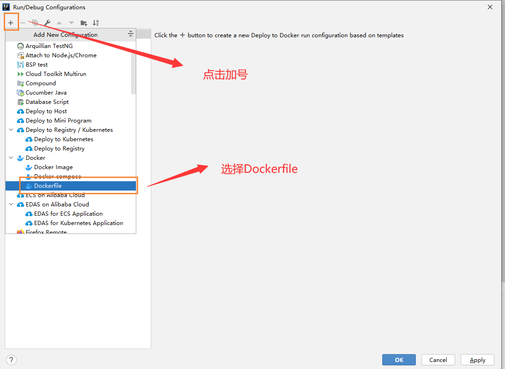
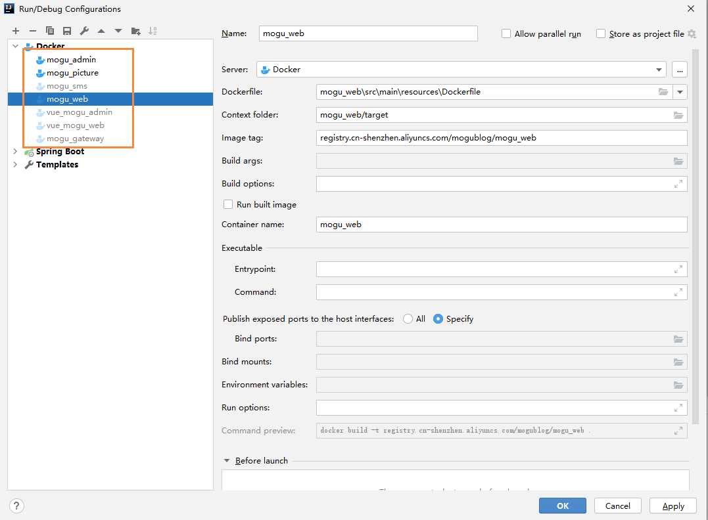
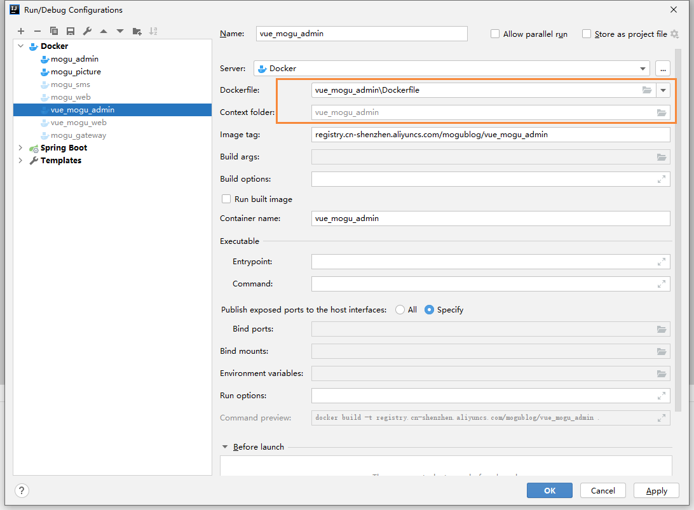
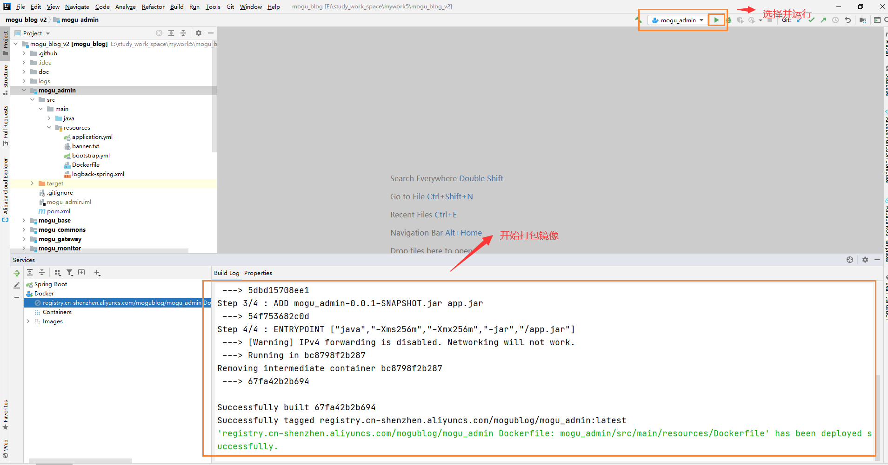
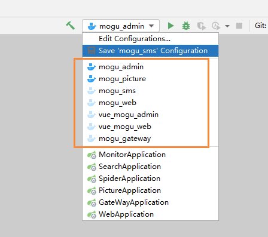
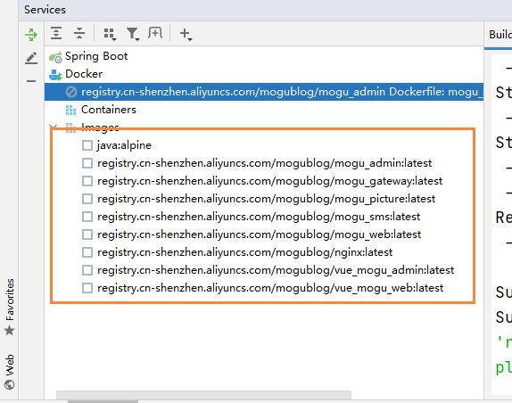
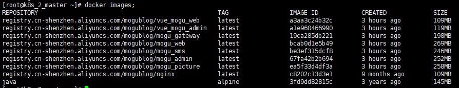

## 前言

> 大家好，我是陌溪

最近很长一段时间没有更新文章了，主要这阵子回家后一直在锻炼身体(打黑工)。

本文主要是为了解决蘑菇博客存在的一个问题，使用 **Github Actions** 在制作 **Docker** 镜像太慢的问题。在 [还在人肉运维？看看蘑菇博客是如何实现自动化部署](https://mp.weixin.qq.com/s/a6mFcvg_c1lgWzxt4ctsfQ) 这篇文章中，里面有关键的一个步骤就是将 **jar** 包从 **Github** 服务器提交到阿里云服务器，因为 **Github** 是托管在国外服务器上，而我的阿里云却在国内。所以因为网络问题，有时候完成一个  **Github Actions** 耗时长达 **3** 小时！


很显然，如果我们打算马上进行线上测试，并且立即看到效果的话，用 **Github Actions**  显然是不能达到要求。经过陌溪的一顿探索后，发现可以通过 **IDEA** 制作好 **Docker** 镜像，然后提交到服务器中。说干就干，下面开始对蘑菇博客进行改造。


## 云服务器安装Docker

因为需要将 **制作镜像**上传到云服务器中，所以需要提前在服务器上安装 **Docker** 环境

首先配置 **Docker** 的阿里 **yum** 源

```bash
cat >/etc/yum.repos.d/docker.repo<<EOF
[docker-ce-edge]
name=Docker CE Edge - \$basearch
baseurl=https://mirrors.aliyun.com/docker-ce/linux/centos/7/\$basearch/edge
enabled=1
gpgcheck=1
gpgkey=https://mirrors.aliyun.com/docker-ce/linux/centos/gpg
EOF
```

然后 **yum** 方式安装 **docker**

```bash
# yum安装
yum -y install docker-ce
# 查看docker版本
docker --version  
# 开机自启
systemctl enable docker
# 启动docker
systemctl start docker
```

配置 **docker** 的镜像源

```bash
cat >> /etc/docker/daemon.json << EOF
{
  "registry-mirrors": ["https://b9pmyelo.mirror.aliyuncs.com"]
}
EOF
```

然后修改 docker 的配置，开启 **2375** 端口

```bash
vi /usr/lib/systemd/system/docker.service
```

找到下面这条语句

```bash
ExecStart=/usr/bin/dockerd -H fd:// --containerd=/run/containerd/containerd.sock
```

将其替换成

```bash
ExecStart=/usr/bin/dockerd -H tcp://0.0.0.0:2375 -H unix://var/run/docker.sock
```

然后重新加载配置并重启 **Docker** 使其生效

```bash
# 重新加载配置
systemctl daemon-reload
# 重启 docker
systemctl restart docker
```

然后使用下面命令，查看端口号是否正常启动

```bash
netstat -tunlp
```

我们能看到 **2375** 端口，已经成功启动 。


注意，开放 **2375** 端口容易被端口扫描，当成肉鸡，因此还推荐配置**安全证书**来进行访问，参考博客

> https://blog.csdn.net/qq_40321119/article/details/107951712

## IDEA安装Docker插件

首先需要到 **IDEA** 插件市场，点击 **File** -> **Settings** -> **Plugins** 搜索 **Docker** 插件进行安装


然后找到刚刚安装好的 **Docker** 插件，输入 **Docker** 的 **API** 地址，如果出现 **Connection Successful** 则表示成功


## 创建DockerFile文件

下面我们需要在项目的 **resource** 目录，添加 **DockerFile** 文件，这里以 **mogu_admin** 为例


然后添加如下内容

```bash
FROM java:alpine
VOLUME /tmp
ADD mogu_admin-0.0.1-SNAPSHOT.jar app.jar
ENTRYPOINT ["java","-Xms256m","-Xmx256m","-jar","/app.jar"]
```

最后在修改 **pom.xml** 文件，加入 **maven** 的 **docker** 打包插件

```xml
<!--docker镜像build插件-->
<plugin>
    <groupId>com.spotify</groupId>
    <artifactId>docker-maven-plugin</artifactId>
    <version>1.2.0</version>
    <configuration>
        <!-- 注意imageName一定要是符合正则[a-z0-9-_.]的，否则构建不会成功 -->
        <imageName>registry.cn-shenzhen.aliyuncs.com/mogublog/${project.artifactId}</imageName>
        <!-- 指定DockerFile路径-->
        <dockerDirectory>${project.basedir}/src/main/resources</dockerDirectory>
        <rm>true</rm>
        <resources>
            <resource>
                <targetPath>/</targetPath>
                <directory>${project.build.directory}</directory>
                <include>${project.build.finalName}.jar</include>
            </resource>
        </resources>
    </configuration>
</plugin>
```

## 配置 Docker镜像信息

下面我们选择 **Run** -> **Editor Configurations**，进行 **Docker** 信息的配置


然后点击加号，选择 **DockerFile** 的方式构建



然后输入如下内容

```bash
DockerFile目录: mogu_admin\src\main\resources\Dockerfile
target目录: mogu_admin/target
镜像名及标签: registry.cn-shenzhen.aliyuncs.com/mogublog/mogu_admin
```

详情如下图所示，同时我们需要 不要勾选 **Run built image**，因为我们是用 **docker-compose** 进行管理。


按照同样的步骤，我们将 **5** 个核心服务进行配置



对于前端项目，**vue_mogu_admin**  和 **vue_mogu_web** 和后台项目有些许区别，主要在于 **Context folder** 文件夹直接选择对应的目录即可。



## 打包Docker镜像到服务器

在做成Docker镜像前，我们需要先对服务镜像打包

在项目根目录，使用 `mvn clean install` 进行打包，操作完成后，即可看到 **BUILD SUCCESS**


然后在到 **vue_mogu_admin** 和 **vue_mogu_web** 目录，使用 **npm run build** 命令进行打包，生成 **dist** 文件夹


在我们完成所有的步骤后，回到 **IDEA** 中， 就可以点击 **运行**，开始打包镜像



需要注意的是，我们需要将刚刚我们设置的 7 个配置都运行一次



在我们执行完七个后，将会生成多个镜像文件到服务器中，可以在 **Images** 中看到



也可以在服务器中，使用 **docker images** 命令镜像查看



到这里为止，蘑菇博客的镜像就已经打包完毕了，当小伙伴们修改完蘑菇博客源代码后，就可以使用这种方式完成镜像的替换。好了，那我们下期再见~

## 结语

**陌溪**是一个从三本院校一路摸滚翻爬上来的互联网大厂程序员。独立做过几个开源项目，其中**蘑菇博客**在码云上有 **2K Star** 。目前就职于**字节跳动的Data广告部门**，是字节跳动全线产品的商业变现研发团队。本公众号将会持续性的输出很多原创小知识以及学习资源。如果你觉得本文对你有所帮助，麻烦给文章点个「赞」和「在看」。同时欢迎各位小伙伴关注陌溪，让我们一起成长~

