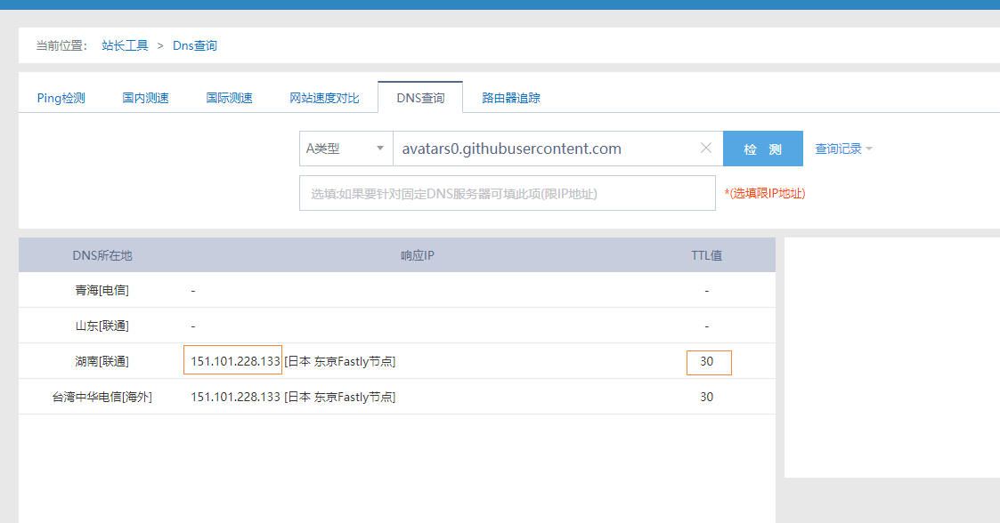
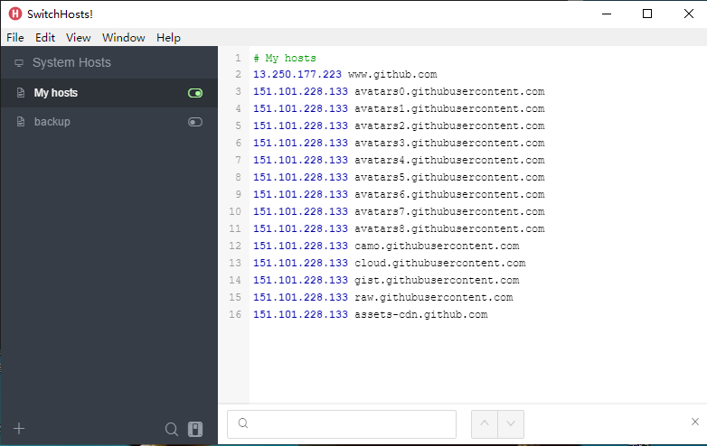

## 前言

> 大家好，我是陌溪

最近访问 **Github** 进行网上冲浪的时候，发现 **Github** 用户头像一直无法正常获取，出现**图裂**的情况


作为强迫症患者很显然这个不能忍，简直太影响冲浪体验了


## 问题排查

首先在 **Github** 页面按 **F12** 打开调试页面，然后我们可以看到 **Console** 区域有报错，是因为图片无法获取而产生


在错误区域的最右边位置 **鼠标右键** -> **copy link address** ， 获取到**链接地址**

```bash
https://avatars0.githubusercontent.com/u/18610136?s=40&v=4
```

然后保留地址的二级域名，即复制以下内容

```bash
https://avatars0.githubusercontent.com
```

## 解决方法

打开**站长之家**的 **DNS** 检测工具

> http://tool.chinaz.com/dns

然后在下面位置复制我们刚刚截取的 **二级域名**



选择一个 **TTL** 值小的域名进行复制，其中 **DNS TTL** 表示：域名解析信息在 **DNS** 中的存在时间

按下面给的 **hosts** 模板更换成该 **IP** 地址

```bash
# My hosts
151.101.108.133 avatars.githubusercontent.com
151.101.108.133 avatars0.githubusercontent.com
151.101.108.133 avatars1.githubusercontent.com
151.101.108.133 avatars2.githubusercontent.com
151.101.108.133 avatars3.githubusercontent.com
151.101.108.133 avatars4.githubusercontent.com
151.101.108.133 avatars5.githubusercontent.com
151.101.108.133 avatars6.githubusercontent.com
151.101.108.133 avatars7.githubusercontent.com
151.101.108.133 avatars8.githubusercontent.com
151.101.108.133 camo.githubusercontent.com
151.101.108.133 cloud.githubusercontent.com
151.101.108.133 gist.githubusercontent.com
151.101.108.133 raw.githubusercontent.com
151.101.108.133 assets-cdn.github.com
```

然后在修改 **host** 文件，路径在

```bash
C:\Windows\System32\drivers\etc\
```

下面我安利一个非常棒的修改 **Hosts** 的工具 ： **SwitchHosts**

```bash
https://oldj.github.io/SwitchHosts/
```

它可以设置多个 **hosts** 文件进行切换，修改起来非常方便



在保存后，打开 **cmd** 窗口，刷新 **DNS**

```bash
ipconfig /flushdns
```

在修改完成后，我们打开 **Github** 页面，然后刷新