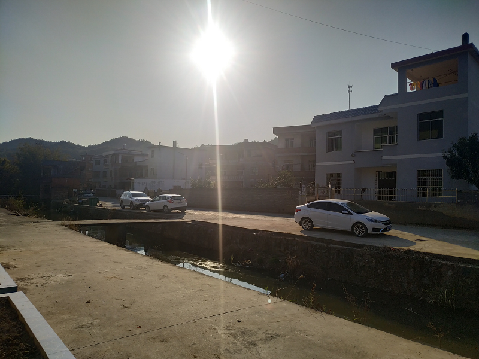
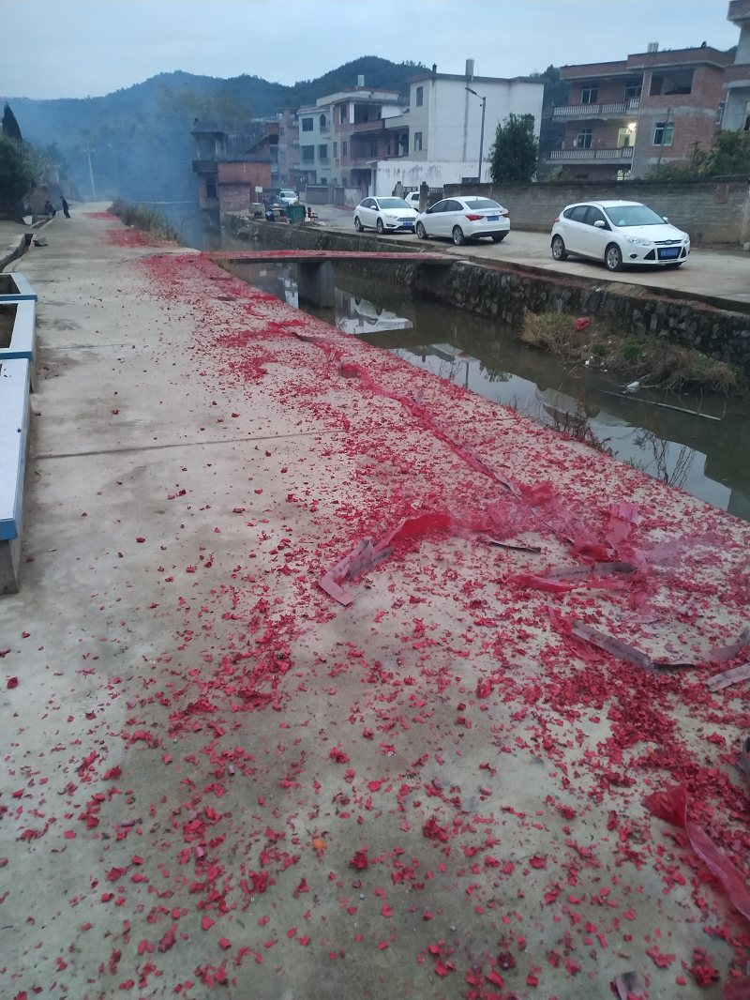
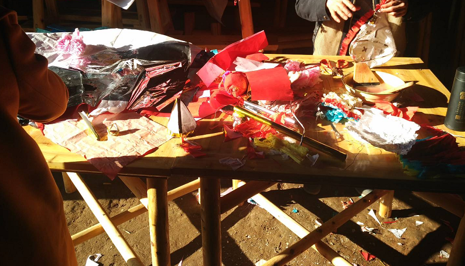
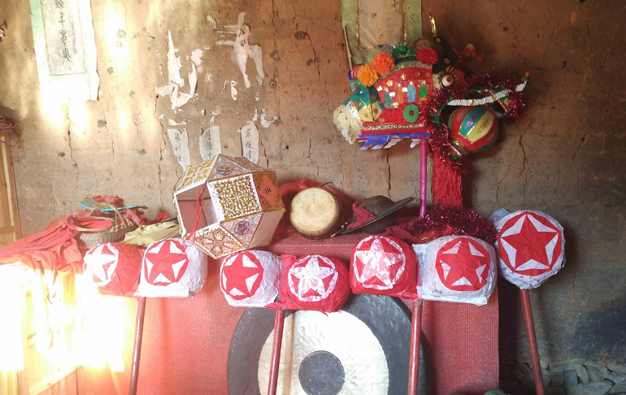
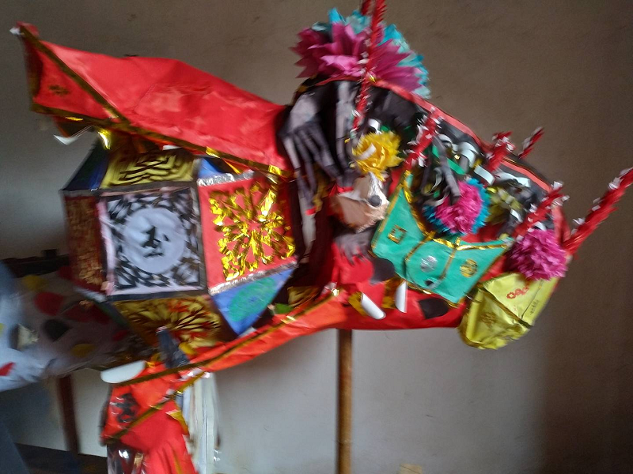
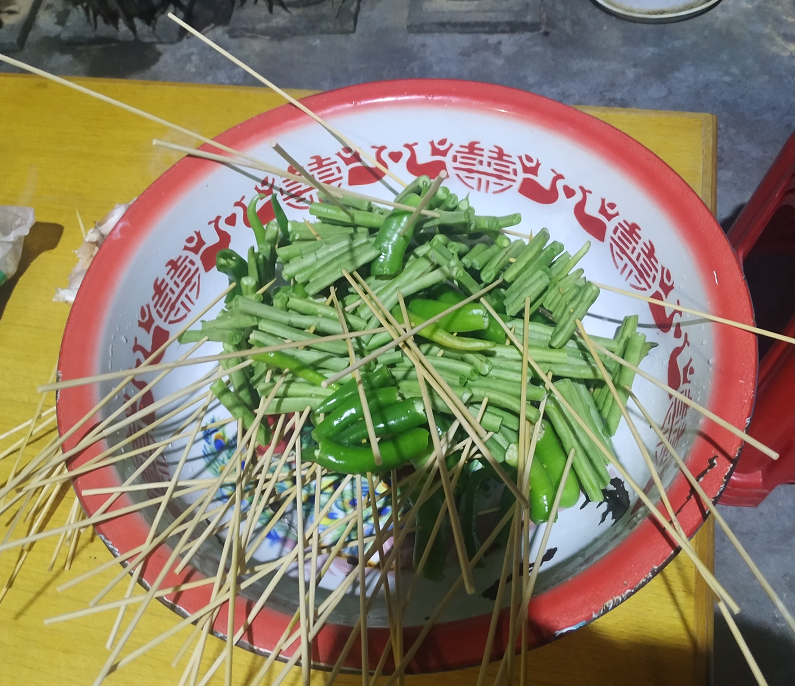
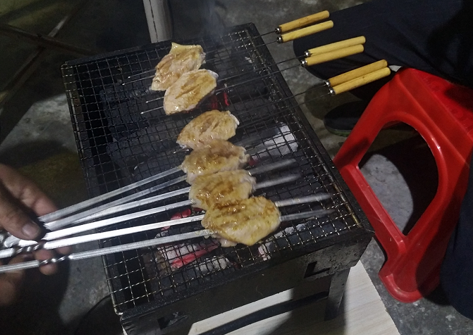

> 大家好，我是陌溪

最近**很长一段时间**没有更新公众号了，陌溪在此特别**冒个泡**证明我还在..，其实陌溪这阵子一直都在拜年，下面给大家伙看看我最近一阵子的拜年安排表，简直被安排的明明白白的..

- 初一：去家族起源地拜年
- 初二：去**外婆家**拜年
- 初三：在自己家里准备**烧烤**
- 初四：和小伙伴一块**聚餐**
- 初五：去**第一个姑奶奶**和**舅爷家**拜年
- 初六：大哥和三哥家孩子**满月酒**去帮忙
- 初七：去**第二个姑奶奶**家拜年
- 初八：去**第三个姑奶奶**家拜年
- 初九：去**第一个姑姑**家拜年
- 初十：去**第二个姑姑**家拜年

先说说我的老家吧，在江西赣州的一个**小村**里。小时候老爸和老妈还在广东打工，我就跟着奶奶在村子里长大。每到过年的时候，村里里是**最热闹**的时候了，在外务工的人员都会赶回家吃上一份**团圆饭**。

下面这个就是老家的房子，是老爸在**二零零几年**的时候就建好了。我一直很敬佩老爸，因为爷爷在我4岁的时候因病走了，那会老爸才27/8岁，然后老爸作为家里的老大，初中毕业就肩负起重任外出打工，然后担任起照看我叔叔和姑姑的重任。老爸在外拼搏的几年里，也吃了没有文化的苦，做了很多累活，虽然现在自己弄了个小本生意，但是每天也很辛苦。因此老爸对于**子女的教育**抓的非常紧，我也很庆幸能够出生在一个**注重教育的大家庭**里。

家门口这几年**政府**给铺好了路，交通也便捷了许多。原来我小时候那个桥还是个非常窄的小桥，记得小时候我去上小学的时候，小桥一下没站稳，把我摔下了桥底，那会哭的老惨了。

吃年夜饭之前，按照惯例先打爆竹，**爆竹声中一岁除**，然后准备**干饭**咯~

老妈下厨制作的**年夜饭**，吃了这么多地方的饭菜，还是家里的饭菜香。

我们这里比较注重**传统文化传承**-**舞龙灯**，大年初一的时候，我们都会组队去家族发源地，一起利用**彩纸**制作一个个的“**龙灯**”，都是使用彩纸和浆糊，将剪好的纸给糊住（ps: 今年因为疫情原因，活动取消了，所以都是用的是去年的照片....）。

哈哈哈，下面几个**五角星**就是我剪的...

在这里最难的就是这个大龙头了，每次我们需要花费很长的时间去制作

下面就是我们兄弟四个制作好的大龙了~，可以拿出去舞龙了。每年舞龙的时候是最热闹的时候了，整个村的人都会聚集在一起，这两年**响应国家号召**，所以聚会也**取消了**。

这阵子老爸把他车子丢给我开，正好趁着过年的一阵时间，练习了一下**开车技巧**，先给车洗干净，然后准备拜年。

一上路，就在路上遭遇了**大堵车**，因为这里都是**乡间小路**，只是单行道，如果遇到对面过来了车辆就需要避让，但是可能有些地方不是很好的避开，在加上像我一样的新手司机太多，因此就造成了大堵车~，陌溪在这里堵了快半个多小时了...

然后就在家里开始了**烧烤生活**，首先准备食材

然后开始准备木炭，用的都是一个不太大的烧烤炉，小朋友在边上都快馋哭了。

我的春节生活就介绍到这里了，明天又要去姑姑家拜年了，这也是今年的**最后一家**了，后面就可以开始进入正常的搬砖生活了。

我是**陌溪**，我们下期再见~

## 往期推荐

- [蘑菇博客从0到2000Star，分享我的Java自学路线图](https://mp.weixin.qq.com/s/3u6OOYkpj4_ecMzfMqKJRw)

- [从三本院校到斩获字节跳动后端研发Offer-讲述我的故事](https://mp.weixin.qq.com/s/c4rR_aWpmNNFGn-mZBLWYg)

- [陌溪在公众号摸滚翻爬半个月，整理的入门指南](https://mp.weixin.qq.com/s/Jj1i-mD9Tw0vUEFXi5y54g)

## 结语

**陌溪**是一个从三本院校一路摸滚翻爬上来的互联网大厂程序员。独立做过几个开源项目，其中**蘑菇博客**在码云上有 **2K Star** 。目前就职于**字节跳动的Data广告部门**，是字节跳动全线产品的商业变现研发团队。本公众号将会持续性的输出很多原创小知识以及学习资源。如果你觉得本文对你有所帮助，麻烦给文章点个「赞」和「在看」。同时欢迎各位小伙伴关注陌溪，让我们一起成长~

