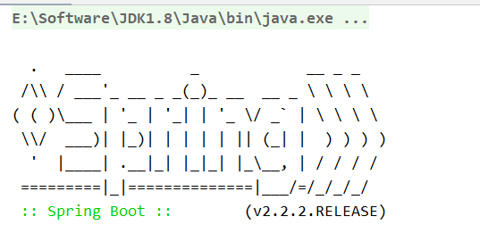
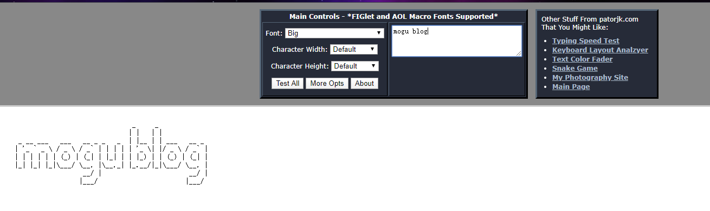

# SpringBoot项目增加自定义Banner

> 欢迎点击下方的公众号名片，关注陌溪，让我们一起成长~

最近有小伙伴推荐给博客启动的时候加上自定义Banner，开始我还不太明白他说的是那部分，后面给我发了这样一个文件，陌溪瞬间就懂了

```bash
////////////////////////////////////////////////////////////////////  
//                          _ooOoo_                               //  
//                         o8888888o                              //  
//                         88" . "88                              //  
//                         (| ^_^ |)                              //  
//                         O\  =  /O                              //  
//                      ____/`---'\____                           //  
//                    .'  \\|     |//  `.                         //  
//                   /  \\|||  :  |||//  \                        //  
//                  /  _||||| -:- |||||-  \                       //  
//                  |   | \\\  -  /// |   |                       //  
//                  | \_|  ''\---/''  |   |                       //  
//                  \  .-\__  `-`  ___/-. /                       //  
//                ___`. .'  /--.--\  `. . ___                     //  
//              ."" '<  `.___\_<|>_/___.'  >'"".                  //  
//            | | :  `- \`.;`\ _ /`;.`/ - ` : | |                 //  
//            \  \ `-.   \_ __\ /__ _/   .-` /  /                 //  
//      ========`-.____`-.___\_____/___.-`____.-'========         //  
//                           `=---='                              //  
//      ^^^^^^^^^^^^^^^^^^^^^^^^^^^^^^^^^^^^^^^^^^^^^^^^^^        //  
//            佛祖保佑       永不宕机      永无BUG                    //
//////////////////////////////////////////////////////////////////// 
```

我们经常看到的 **SpringBoot** 项目启动时候会出现这样的界面，其实就是设置了自定义 **Banner**。



其实修改的方法也比较简单，只需要在 **resource** 目录下，放一个 **banner.txt** 文件即可，文件下面就存放我们需要显示的 **banner** ，那么在启动的时候，就会加载出对应的图像出来


## 制作Banner

当然上面的 banner 图像肯定不是陌溪一个个手敲的，而是通过下面的网站制作的：

> http://patorjk.com/software/taag

以蘑菇博客为例，我们输入 **mogublog** ，就可以生成对应的图案了



同时里面也是也可以设置字符颜色和 Spring 版本号等信息

```bash
# 设置字体颜色为绿色
${AnsiColor.GREEN}
# 设置背景颜色为绿色
AnsiBackground.GREEN
# 显示SpringBoot版本
${spring-boot.version}
```

然后复制里面的文本到 banner.txt 即可，下面是我的完整Banner.txt文件，如下所示

```bash
${AnsiColor.GREEN}
                                _     _
                               | |   | |            
  _ __ ___   ___   __ _ _   _  | |__ | | ___   __ _ 
 | '_ ` _ \ / _ \ / _` | | | | | '_ \| |/ _ \ / _` |
 | | | | | | (_) | (_| | |_| | | |_) | | (_) | (_| |
 |_| |_| |_|\___/ \__, |\__,_| |_.__/|_|\___/ \__, |
                   __/ |                       __/ |
                  |___/                       |___/
${AnsiColor.BRIGHT_BLACK}
Spring Boot Version: ${spring-boot.version}${spring-boot.formatted-version}
```

这里因为设置字体颜色会让后面的颜色都会变成对应的颜色，所以我们需要在之前在设置成 **黑色**，这样才不会出现满屏的绿色了，下面是我的启动页面，如下所示：


ps：最近陌溪一直忙着**肝论文**.. 毕业要紧，所以最近蘑菇博客的更新频率也降低了

- ## 往期推荐

  - [蘑菇博客从0到2000Star，分享我的Java自学路线图](https://mp.weixin.qq.com/s/3u6OOYkpj4_ecMzfMqKJRw)

  - [从三本院校到斩获字节跳动后端研发Offer-讲述我的故事](https://mp.weixin.qq.com/s/c4rR_aWpmNNFGn-mZBLWYg)

  - [陌溪在公众号摸滚翻爬半个月，整理的入门指南](https://mp.weixin.qq.com/s/Jj1i-mD9Tw0vUEFXi5y54g)

  ## 结语

  **陌溪**是一个从三本院校一路摸滚翻爬上来的互联网大厂程序员。独立做过几个开源项目，其中**蘑菇博客**在码云上有 **2K Star** 。目前就职于**字节跳动的Data广告部门**，是字节跳动全线产品的商业变现研发团队。本公众号将会持续性的输出很多原创小知识以及学习资源。如果你觉得本文对你有所帮助，麻烦给文章点个「赞」和「在看」。同时欢迎各位小伙伴关注陌溪，让我们一起成长~

