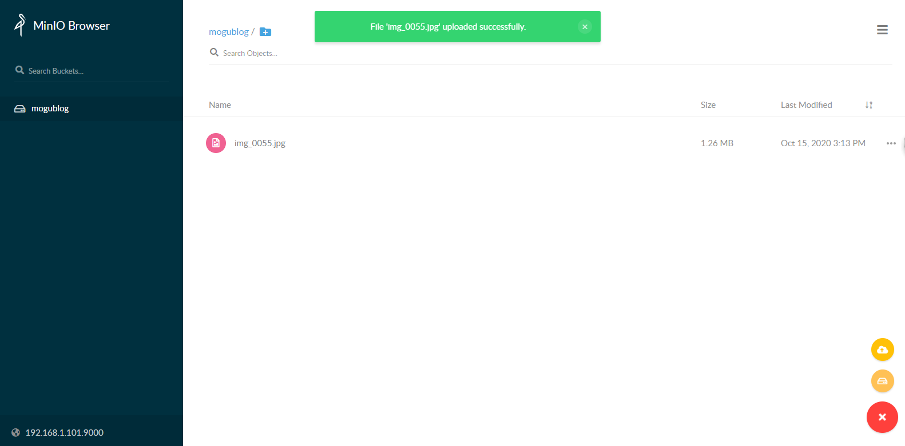
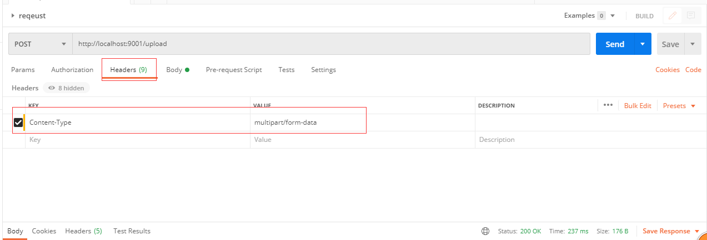
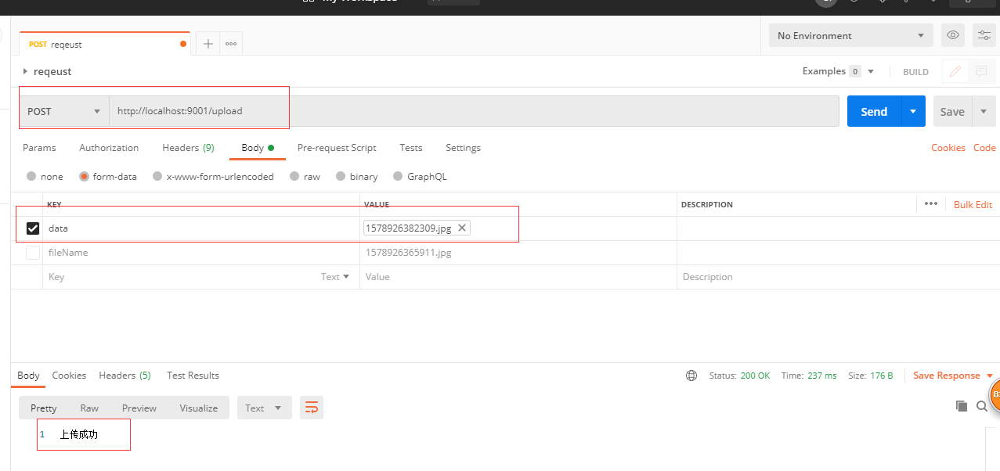
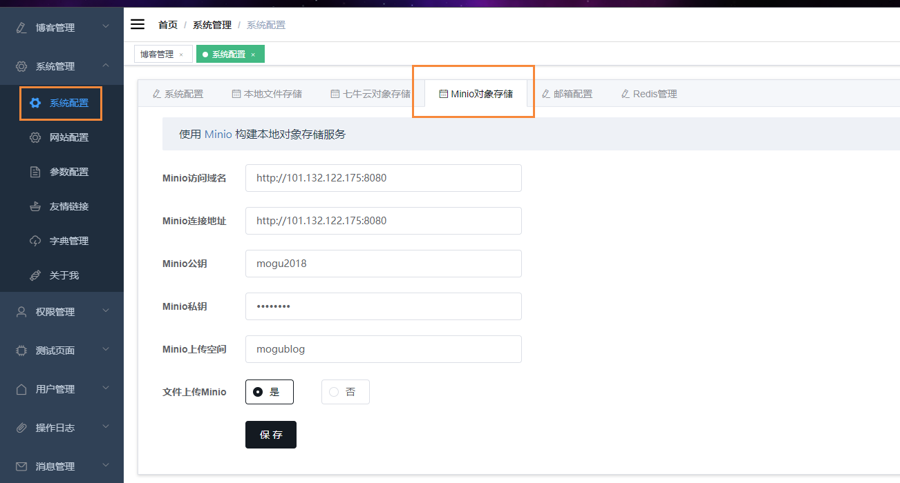
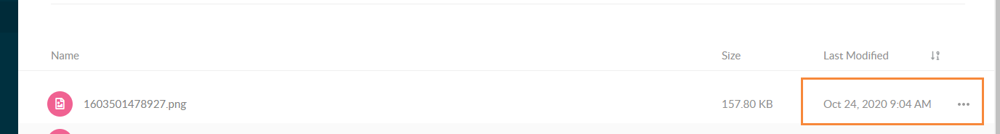

> 大家好，我是陌溪，欢迎点击下方的公众号名片，关注陌溪，让我们一起成长~

今天我们来讲讲蘑菇博客中的文件存储，蘑菇博客目前使用了：本地文件存储，七牛云存储和Minio存储，下面是每种存储服务之间的优缺点，让我们一起来康康吧


第一种方式：直接将图片保存到服务的硬盘（例如使用 **Nginx** 做静态资源映射）

- 优点：开发便捷，成本低
- 缺点：扩容困难

第二种方式：使用**分布式文件系统**进行存储（**FastDFS**）
- 优点：容易实现扩容
- 缺点：开发复杂度稍大（尤其是开发复杂的功能）

第三种方式：使用 **nfs** 做存储
- 优点：开发较为便捷
- 缺点：需要有一定的运维知识进行部署和维护

第四种方式：使用第三方的存储服务（例如**七牛云**）
- 优点：开发简单，拥有强大功能，免维护
- 缺点：付费

我们之前使用分布式文件系统 **FastDFS** 简直不要太爽，但是有几个问题不知道大家发现没有

- 第一个就是 **FastDFS** 没有一个完善的官方文档，各种第三方文档满天飞。
- 第二个就是创建容器比较麻烦，要创建存储服务与跟踪服务.
- 第三个就是安全性问题

通过上面的分析，我们发现每种方式都存在一定的优缺点，那么有没有一个 开发便捷，成本低，扩容简单的文件系统呢？


## 对象存储MinIO

**MinIO** 是世界上最快的对象存储服务器，在标准硬件上，读写速度分贝为 **183GB/s** 和 **171GB/s**，对象存储可以作为主要存储层，用于 **Spark**，**Presto**，**TensorFlow**，**H20.ai** 以及替代产品等各种工作负载用于 **Hadoop** **HDFS**

**MinIO** 是一种高性能的分布式对象存储系统，它是软件定义的，可在行业标准硬件上运行，并且在 **Apache 2.0** 许可下，百分百开放源代码。

>  文档地址：https://docs.min.io/cn/

### 下载

我们使用的是Docker的方式安装MinIO，首先拉取对应的镜像

```bash
docker pull minio/minio
```

然后我们需要创建两个目录，用于保存我们的文件和配置

```bash
mkdir -p /home/minio/data
mkdir -p /home/minio/config
```

### 启动容器

然后我们启动我们的容器，后面有个目录，就是我们需要挂载的硬盘目录

```bash
docker run -p 9000:9000 --name minio \
-e "MINIO_ACCESS_KEY=mogu2018" \
--privileged=true \
-e "MINIO_SECRET_KEY=mogu2018" \
-v /home/minio/data:/data \
-v /home/minio/config:/root/.minio \
minio/minio server /data
```

上面的配置中，包含两个重要的信息【以后登录时会用到，可以修改成自己的】

- **MINIO_ACCESS_KEY**：公钥
- **MINIO_SECRET_KEY**：密钥

运行成功后，我们就能看到我们下面的提示信息


如果需要后台运行，使用这条语句

```bash
docker run --privileged -d -it -p 9000:9000 --name minio \
-e "MINIO_ACCESS_KEY=mogu2018" \
--privileged=true \
-e "MINIO_SECRET_KEY=mogu2018" \
-v /home/minio/data:/data \
-v /home/minio/config:/root/.minio \
minio/minio server /data
```

### 访问

我们只需要访问上面提到的ip地址，就能够进入到我们的页面了【部署云服务器，需要自行开启安全组！】

```bash
http://192.168.1.101:9000
```


会有一个不错的登录页面，我们输入刚刚配置的账号和密码  mogu2018  mogu2018 即可进入


### 创建bucket

我们首先需要创建一个桶，可以当成是一个目录，点击我们的右下角 加号 按钮，选择 **create bucket** 进行创建

我们创建一个叫 **mogublog** 的桶，创建完成后，在侧边栏就能够看到我们刚刚创建的了


### 上传文件

然后我们选中我们的桶，在点击加号，选择 **upload file** 进行文件上传



上传成功后，即可看到我们刚刚上传的文件列表了~

## SpringBoot整合MinIO

### 修改权限

如果要使用 **SDK**，比如 **Java** 客户端来操作我们的minio的话，那么我们还需要修改一下我们的 **bucket** 权限


首先点击我们的 **mogublog** 的右边区域，点击 **Edit policy**，然后添加我们的权限为 可读可写，保存即可

### 添加依赖

```xml
<dependency>
    <groupId>io.minio</groupId>
    <artifactId>minio</artifactId>
    <version>7.0.2</version>
</dependency>
```

### 添加application.yml

```yml
server:
  port: 9001
spring:
  application:
    name: minio-application
  main:
    allow-bean-definition-overriding: true

minio:
  endpoint: http://192.168.1.101:9000
  accessKey: mogu2018
  secretKey: mogu2018
  bucketImageName: mogublog
```

### 添加配置文件

然后我们需要编写配置文件，用于初始化配置 MinioClient装载到spring容器中

```bash
@Configuration
public class MinIoConfig {
    @Value("${minio.endpoint}")
    private String endpoint;

    @Value("${minio.accessKey}")
    private String accessKey;

    @Value("${minio.secretKey}")
    private String secretKey;

    @Bean
    public MinioClient minioClient() throws Exception{
        // 使用MinIO服务的URL，端口，Access key和Secret key创建一个MinioClient对象
        MinioClient minioClient = new MinioClient(endpoint, accessKey, secretKey);
        return minioClient;
    }
}
```

### 编写Controller

编写前端控制器，用于接收前端的上传和下载请求

```java
@RestController
public class MinIoController {

    @Autowired
    MinioClient minioClient;
    
    @PostMapping("/upload")
    public String upload(@RequestParam("data") MultipartFile data) throws Exception{
        String fileName = data.getOriginalFilename();
        InputStream inputStram = data.getInputStream();
        minioClient.putObject(
                PutObjectArgs.builder().bucket("mogublog").object(fileName).stream(
                        inputStram, data.getSize(), -1)
                        .contentType(data.getContentType())
                        .build());
        return "上传成功";
    }

    @PostMapping("/download")
    public String download(@RequestParam("fileName")String fileName) throws Exception{
        String url = minioClient.presignedGetObject("mogublog", fileName, 60*60*24*7);
        return url;
    }
}
```

### 测试图片上传

下面我们就需要进行测试了，我们运行我们的项目，然后使用postman进行上传测试

首先我们在postman中添加我们的上传接口，然后在修改请求头中添加Content-Type

```bash
Content-Type  multipart/form-data
```

如下所示



然后在选择我们的图片上传



最后在刷新MinIO，就能够看到我们刚刚上传的文件了


我们可以通过下面的地址直接访问我们的图片

```bash
http://192.168.1.101:9000/mogublog/1578926382309.jpg
```

## 蘑菇博客配置Minio

蘑菇博客已经集成了Minio对象存储服务，我们只需要在系统配置，找到我们的 **Minio** 对象存储

例如：我在上面已经部署了  http://101.132.122.175:8080 的 **Minio** 服务【按照你部署的 **ip** 和端口填写】



这里有5个内容需要我们填写的

- Minio访问域名：文件上传到Minio对象存储服务器后，通过哪个域名或者ip进行访问
- Minio连接地址：Minio的访问地址，也就是上面提到的EndPoint
- Minio公钥：创建Minio容器时的公钥
- Minio私钥：创建Minio容器时的私钥
- Minio上传空间：创建Minio时的bucket

配置完成后，我们就需要访问我们的 **Minio** 服务，然后创建对应的 **Minio**上传空间【**Bucket**】，访问**Minio**地址

```bash
http://101.132.122.175:8080
```

输入账号和密码，然后选择 **Create Bucket**


还需要修改一下我们的 **bucket** 权限，允许读写权限


最后在回到我们的系统配置，开启 **Minio** 上传功能，同时在开启 **Minio** 的图片显示


我们可以上传图片进行测试，打开博客管理，添加博客后进行图片上传测试


通过上图发现，能够成功的访问到我们的图片了~，我们再到 **minio** 后台管理查看



也能够看到我们刚刚上传的文件了~


## 往期推荐

- [蘑菇博客从0到2000Star，分享我的Java自学路线图](https://mp.weixin.qq.com/s/3u6OOYkpj4_ecMzfMqKJRw)
- [从三本院校到斩获字节跳动后端研发Offer-讲述我的故事](https://mp.weixin.qq.com/s/c4rR_aWpmNNFGn-mZBLWYg)
- [陌溪在公众号摸滚翻爬半个月，整理的入门指南](https://mp.weixin.qq.com/s/Jj1i-mD9Tw0vUEFXi5y54g)
- [Windows+VMware快速搭建蘑菇博客本地开发环境](http://mp.weixin.qq.com/s?__biz=MzkyMzE5NTYzMA==&mid=100001477&idx=1&sn=a8d8e1dd302ad9e434c3151996a39559&chksm=41e98744769e0e5281d064e6eb4863719b7917fa2f0ebf4b5a049eab2bd5498598023347651c#rd)

## 结语

**陌溪**是一个从三本院校一路摸滚翻爬上来的互联网大厂程序员。独立做过几个开源项目，其中**蘑菇博客**在码云上有 **2K Star** 。目前就职于**字节跳动的Data广告部门**，是字节跳动全线产品的商业变现研发团队。本公众号将会持续性的输出很多原创小知识以及学习资源。如果你觉得本文对你有所帮助，麻烦给文章点个「赞」和「在看」。同时欢迎各位小伙伴关注陌溪，让我们一起成长~

