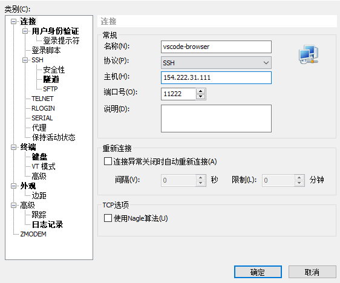
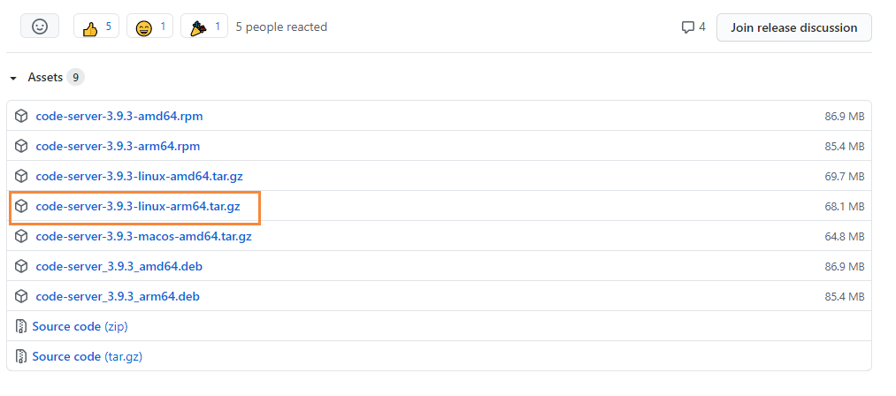
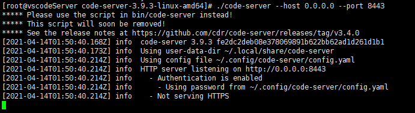
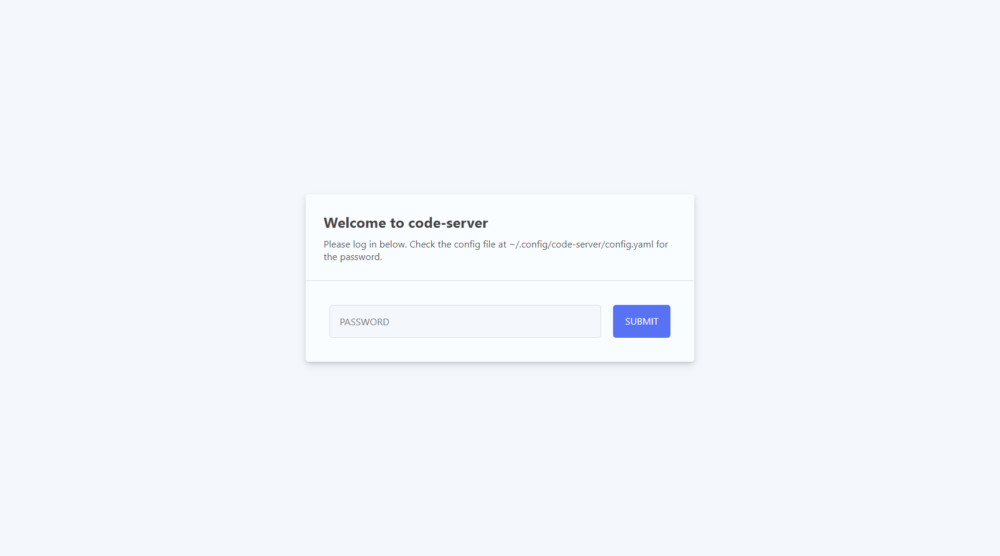
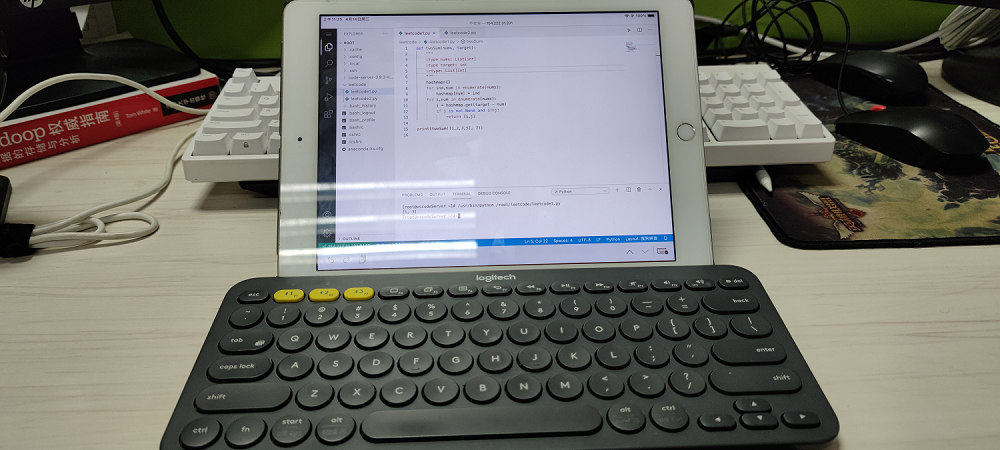
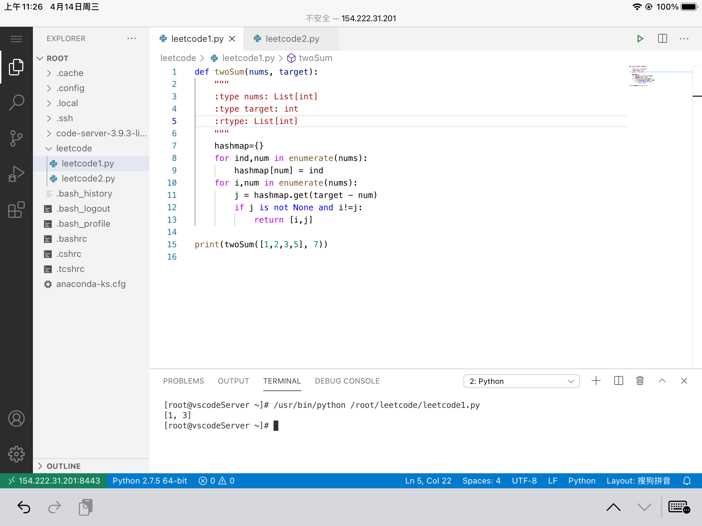

> 大家好，我是陌溪，欢迎点击下方的公众号名片，关注陌溪，让我们一起成长~

最近群里的小伙伴在买完 **ipad** 后，没玩多久就放在边上吃灰了，在群里咨询有没有办法提高 **ipad** 生产力。


其实陌溪之前购买了一台 **ipad**，同时配了一款蓝牙键盘-**罗技K380**，但是受限于没有**合适的编辑器**，因此想把 **ipad** 作为 **生产工具** 并做不到，只是用来看 **爱奇艺** 和 **Bilibili** 还挺香的，真是 **买前生产力，买后爱奇艺**。

但是，最近陌溪在 **Github** 网上冲浪的时候，发现 **vscode** 有 **browser** 版本，也就是浏览器版本，通过在自己服务器上进行配置，然后通过浏览器来来进行访问，突然发现打开新世界的大门。


## 安装

为了考虑到以后部署环境需要做到移植性比较强，能一次部署到处运行，因此这里使用 **Docker** 来进行安装。

首先需要在一台 **Linux** 服务器上安装 **Docker**，第一步，配置 Docker 的阿里云 yum 源

```bash
cat >>/etc/yum.repos.d/docker.repo<<EOF
[docker-ce-edge]
name=Docker CE Edge - \$basearch
baseurl=https://mirrors.aliyun.com/docker-ce/linux/centos/7/\$basearch/edge
enabled=1
gpgcheck=1
gpgkey=https://mirrors.aliyun.com/docker-ce/linux/centos/gpg
EOF
```

然后开始安装和启动 **Dokcer**

```bash
# yum安装
yum -y install docker-ce

#查看docker版本
docker --version  

# 设置开机自启
systemctl enable docker

# 启动docker
systemctl start docker
```

因为我已经对官方 **Centos** 的镜像配置了 **SSH** 远程无密登录，只需要拉取一个我预先制作的**Docker镜像**即可。

```shell
docker pull moxi/centos_ssh
```

下载完上面的镜像后，使用 **docker** 命令启动该容器，同时开放两个端口号，分别是 **11222** 和 **8443** 端口号。

其中 **11122** 端口用于远程 **xftp** 连接，传输文件。8443端口则为 **vscode** 浏览器访问的链接。

```
docker run --privileged -d -it -h vscodeServer --name vscodeServer -v /etc/localtime:/etc/localtime:ro -p 11222:22  -p 8443:8080  moxi/centos_ssh /usr/sbin/init
```

启动容器后，使用 **xshell** 工具进行连接，输入服务器的 **ip** 和连接端口 **11222** ，点击确定后，在输入账号和密码 **root**  **mogu2018**。



## 下载 vscode server

进入**docker** 容器内部后，去 **Github** 上下载好 **vscode server**

> 下载地址：https://github.com/cdr/code-server/releases

然后挑选合适的 **vscode server** 版本进行安装



然后再到我们的服务器中解压，使用下列命令

```
tar -zxvf code-server-3.9.3-linux-amd64.tar.gz
```

解压完成后，进入下面目录

```
cd code-server-3.9.3-linux-amd64
```

使用命令启动，这个命令需要独占一个窗口

```
./code-server --host 0.0.0.0 --port 8443
```

下面是启动成功的截图



启动成功后，输入 **ip** + **8443** 端口号，即可访问到 **vscode** 的浏览器版本了



打开登录页面后，需要编辑下面文件进行密码的修改

```
vi ~/.config/code-server/config.yaml
```

如下所示，修改默认的端口号和密码，保存即可，然后重启 **vscode** 服务

```bash
bind-addr: 127.0.0.1:8443
auth: password
password: mogu2018
cert: false
```

再次输入密码，即可进入到 **vscode** 浏览器版本


不过上面的启动方式存在一个问题，就是需要**独占**一个窗口，如果终端关闭的话，将不能继续运行。因此我们需要开启一个守护进程 **nohup**，执行如下脚本进行后台运行

```
nohup ./code-server --port 8443  --host 0.0.0.0  > catalina.out  2>&1 &
```

## ipad打开

把上述操作都完成后，在 **ipad** 上的 **Safari** 浏览器打开，输入对应的账号和密码，即可开启愉快的搬砖之旅~



安装 **python** 扩展插件后，来个 **leetcode** 经典题目 **两数之和** 来练练手~。



如果小伙伴想要扩展更多的功能的话（运行Java或者C语言），需要去安装更多的插件进行支持就行了。好了，本期的分享就介绍到这里了，我们下期再见~

## 往期推荐

- [蘑菇博客从0到2000Star，分享我的Java自学路线图](https://mp.weixin.qq.com/s/3u6OOYkpj4_ecMzfMqKJRw)
- [从三本院校到斩获字节跳动后端研发Offer-讲述我的故事](https://mp.weixin.qq.com/s/c4rR_aWpmNNFGn-mZBLWYg)
- [陌溪在公众号摸滚翻爬半个月，整理的入门指南](https://mp.weixin.qq.com/s/Jj1i-mD9Tw0vUEFXi5y54g)
- [读者问:有没有高效的记视频笔记方法？](https://mp.weixin.qq.com/s/QcQnV1yretxmDQr4ELW7_g)

## 结语

**陌溪**是一个从三本院校一路摸滚翻爬上来的互联网大厂程序员。独立做过几个开源项目，其中**蘑菇博客**在码云上有 **2K Star** 。目前就职于**字节跳动的Data广告部门**，是字节跳动全线产品的商业变现研发团队。本公众号将会持续性的输出很多原创小知识以及学习资源。如果你觉得本文对你有所帮助，麻烦给文章点个「赞」和「在看」。同时欢迎各位小伙伴关注陌溪，让我们一起成长~

