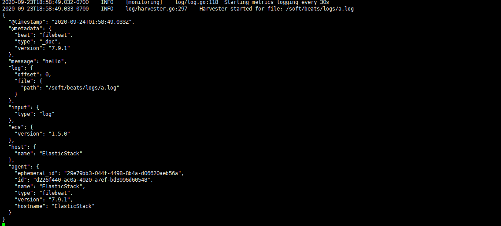
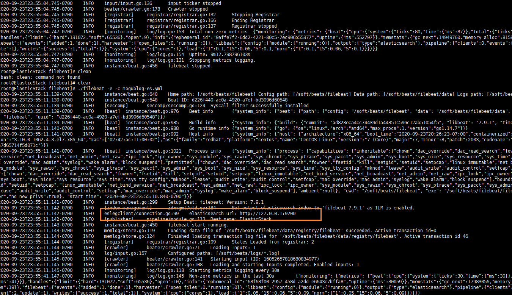

> 大家好，我是陌溪，欢迎点击下方的公众号名片，关注陌溪，让我们一起成长~

上篇我们讲解了 **ElasticStack** 技术栈中 [ElasticSearch的使用](https://mp.weixin.qq.com/s/9eh6rK2aZHRiBpf5bRae9g)，这次给大家带来的是 **ElasticStack** 技术栈中日志采集器 **Beats** 的使用。

## Beats简介

通过查看 **ElasticStack** 可以发现，**Beats** 主要用于采集数据

> 官网地址：https://www.elastic.co/cn/beats/


**Beats** 平台其实是一个轻量性数据采集器，通过集合多种单一用途的采集器，从成百上千台机器中向 **Logstash** 或 **ElasticSearch** 中发送数据。


通过 **Beats** 包含以下的数据采集功能

- **Filebeat**：采集日志文件
- **Metricbeat**：采集指标
- **Packetbeat**：采集网络数据


如果使用 **Beats** 收集的数据不需要任何处理，那么就可以直接发送到 **ElasticSearch** 中。但是，如果们的数据需要经过一些处理的话，那么就可以发送到 **Logstash** 中，然后处理完成后，在发送到 **ElasticSearch**，最后在通过 **Kibana** 对我们的数据进行一系列的可视化展示。


## Filebeat使用

### 介绍

**Filebeat** 是一个轻量级的日志采集器


### 为什么要用Filebeat？

当你面对成百上千、甚至成千上万的服务器、虚拟机和容器生成的日志时，请告别SSH吧！**Filebeat** 将为你提供一种轻量型方法，用于转发和汇总日志与文件，让简单的事情不再繁华，关于 **Filebeat** 的记住以下两点：

- 轻量级日志采集器
- 输送至 **ElasticSearch** 或者 **Logstash**，在 **Kibana** 中实现可视化

### 架构

用于监控、收集服务器日志文件


流程如下：

- 首先是 **input** 输入，我们可以指定多个数据输入源，然后通过通配符进行日志文件的匹配
- 匹配到日志后，就会使用 **Harvester**（收割机），将日志源源不断的读取到来
- 然后收割机收割到的日志，就传递到 **Spooler**（卷轴），然后卷轴就在将他们传到对应的地方

### 下载

> 官网下载地址：
>
> https://www.elastic.co/cn/downloads/beats/filebeat

选中对应版本的 **Filebeat**，我这里是 **Centos** 部署的，所以下载 **Linux** 版本


下载后，上传到 **CentOS** 服务器上，然后创建一个文件夹

```bash
# 创建文件夹
mkdir -p /soft/beats
# 解压文件
tar -zxvf filebeat-7.9.1-linux-x86_64.tar.gz 
# 重命名
mv filebeat-7.9.1-linux-x86_64/ filebeat
```

然后我们进入到 **filebeat** 目录下，创建对应的配置文件

```bash
# 进入文件夹
cd filebeats
# 创建配置文件
vim mogublog.yml
```

添加如下内容

```yml
filebeat.inputs: # filebeat input输入
- type: stdin    # 标准输入
  enabled: true  # 启用标准输入
setup.template.settings: 
  index.number_of_shards: 3 # 指定下载数
output.console:  # 控制台输出
  pretty: true   # 启用美化功能
  enable: true
```

### 启动

在我们添加完配置文件后，我们就可以对 **filebeat** 进行启动了

```bash
./filebeat -e -c mogublog.yml
```


然后我们在控制台输入 **hello**，就能看到我们会有一个 **json** 的输出，是通过读取到我们控制台的内容后输出的


内容如下

```json
{
    "@timestamp":"2019-01-12T12:50:03.585Z",
    "@metadata":{ #元数据信息
        "beat":"filebeat",
        "type":"doc",
        "version":"6.5.4"
    },
    "source":"",
    "offset":0,
    "message":"hello", #元数据信息
    "prospector":{
        "type":"stdin" #元数据信息
    },
    "input":{ #控制台标准输入
        "type":"stdin"
    },
    "beat":{  #beat版本以及主机信息
        "name":"itcast01",
        "hostname":"ElasticStack",
        "version":"6.5.4"
    },
    "host":{
        "name":"ElasticStack"
    }
}
```

### 读取文件

我们需要再次创建一个文件，叫 **mogublog-log.yml**，然后在文件里添加如下内容

```yml
filebeat.inputs:
- type: log
  enabled: true
  paths:
    - /soft/beats/logs/*.log
setup.template.settings:
  index.number_of_shards: 3
output.console:
  pretty: true
  enable: true
```

添加完成后，我们在到下面目录创建一个日志文件

```bash
# 创建文件夹
mkdir -p /soft/beats/logs

# 进入文件夹
cd /soft/beats/logs

# 追加内容
echo "hello" >> a.log
```

然后我们再次启动 **filebeat**

```bash
 ./filebeat -e -c mogublog-log.yml
```

能够发现，它已经成功加载到了我们的日志文件 **a.log**



同时我们还可以继续往文件中追加内容

```bash
echo "are you ok ?" >> a.log
```

追加后，我们再次查看filebeat，也能看到刚刚我们追加的内容


可以看出，已经检测到日志文件有更新，立刻就会读取到更新的内容，并且输出到控制台。

### 自定义字段

但我们的元数据没办法支撑我们的业务时，我们还可以自定义添加一些字段

```bash
filebeat.inputs:
- type: log
  enabled: true
  paths:
    - /soft/beats/logs/*.log
  tags: ["web", "test"]  #添加自定义tag，便于后续的处理
  fields:  #添加自定义字段
    from: test-web
  fields_under_root: true #true为添加到根节点，false为添加到子节点中
setup.template.settings:
  index.number_of_shards: 3
output.console:
  pretty: true
  enable: true
```

添加完成后，我们重启 **filebeat**

```bash
./filebeat -e -c mogublog-log.yml
```

然后添加新的数据到 **a.log** 中

```bash
echo "test-web" >> a.log
```

我们就可以看到字段在原来的基础上，增加了两个


### 输出到ElasticSearch

我们可以通过配置，将修改成如下所示

```yml
filebeat.inputs:
- type: log
  enabled: true
  paths:
    - /soft/beats/logs/*.log
  tags: ["web", "test"]
  fields:
    from: test-web
  fields_under_root: false 
setup.template.settings:
  index.number_of_shards: 1
output.elasticsearch:
  hosts: ["127.0.0.1:9200"]
```

启动成功后，我们就能看到它已经成功连接到了 **ElasticSearch** 了



然后我们到刚刚的 **logs** 文件夹向 **a.log** 文件中添加内容

```bash
echo "hello mogublog" >> a.log
```

在 **ElasticSearch** 中，我们可以看到，多出了一个 **filebeat** 的索引库


然后我们浏览对应的数据，看看是否有插入的数据内容


### Filebeat工作原理

Filebeat主要由下面几个组件组成： **harvester**、**prospector** 、**input**

#### harvester

- 负责读取单个文件的内容
- **harvester** 逐行读取每个文件（一行一行读取），并把这些内容发送到输出
- 每个文件启动一个 **harvester**，并且 **harvester** 负责打开和关闭这些文件，这就意味着 **harvester** 运行时文件描述符保持着打开的状态。
- 在 **harvester** 正在读取文件内容的时候，文件被删除或者重命名了，那么 **Filebeat** 就会续读这个文件，这就会造成一个问题，就是只要负责这个文件的 **harvester** 没用关闭，那么磁盘空间就不会被释放。

#### prospector

- **prospector** 负责管理 **harvester** 并找到所有要读取的文件来源
- 如果输入类型为日志，则查找器将查找路径匹配的所有文件，并为每个文件启动一个 **harvester**
- **Filebeat** 目前支持两种 **prospector** 类型：**log** 和 **stdin**

- **Filebeat** 如何保持文件的状态
  - **Filebeat** 保存每个文件的状态并经常将状态刷新到磁盘上的注册文件中
  - 该状态用于记住 **harvester** 正在读取的最后偏移量，并确保发送所有日志行。
  - 如果输出（例如 **ElasticSearch** 或 **Logstash** ）无法访问，**Filebeat** 会跟踪最后发送的行，并在输出再次可以用时继续读取文件。
  - 在 **Filebeat** 运行时，每个 **prospector** 内存中也会保存的文件状态信息，当重新启动 **Filebat** 时，将使用注册文件的数量来重建文件状态，Filebeat将每个harvester在从保存的最后偏移量继续读取
  - 文件状态记录在data/registry文件中

### input

- 一个 **input** 负责管理 **harvester**，并找到所有要读取的源
- 如果 **input** 类型是 **log**，则 **input** 查找驱动器上与已定义的 **glob** 路径匹配的所有文件，并为每个文件启动一个 **harvester**

- 每个 **input** 都在自己的 **Go** 例程中运行
- 下面的例子配置Filebeat从所有匹配指定的glob模式的文件中读取行

```yml
filebeat.inputs:
- type: log
  paths:
    - /var/log/*.log
    - /var/path2/*.log
```

### 启动命令

```bash
./filebeat -e -c mogublog-es.yml
./filebeat -e -c mogublog-es.yml -d "publish"
```

### 参数说明

- **-e：**输出到标准输出，默认输出到syslog和logs下
- **-c：**指定配置文件
- **-d：**输出debug信息

### 读取Nginx中的配置文件

我们需要创建一个 **mogublog-nginx.yml** 配置文件

```yml
filebeat.inputs:
- type: log
  enabled: true
  paths:
    - /soft/nginx/*.log
  tags: ["nginx"]
  fields_under_root: false 
setup.template.settings:
  index.number_of_shards: 1
output.elasticsearch:
  hosts: ["127.0.0.1:9200"]
```

启动后，可以在 **Elasticsearch** 中看到索引以及查看数据


可以看到，在 **message** 中已经获取到了 **nginx** 的日志，但是，内容并没有经过处理，只是读取到原数据，那么对于我们后期的操作是不利的，有办法解决吗？


### Module

前面要想实现日志数据的读取以及处理都是自己手动配置的，其实，在 **Filebeat** 中，有大量的 **Module**，可以简化我们的配置，直接就可以使用，如下：

```bash
./filebeat modules list
```

可以看到，内置了很多的 module，但是都没有启用，如果需要启用需要进行 **enable** 操作：

```bash
#启动
./filebeat modules enable nginx 
#禁用
./filebeat modules disable nginx 
```

可以发现，nginx的module已经被启用。

#### nginx module 配置

我们到下面的目录，就能看到module的配置了

```bash
# 进入到module目录
cd modules.d/
#查看文件
vim nginx.yml.disabled
```

得到的文件内容如下所示

```bash
# Module: nginx
# Docs: https://www.elastic.co/guide/en/beats/filebeat/7.9/filebeat-module-nginx.html

- module: nginx
  # Access logs
  access:
    enabled: true
    # 添加日志文件
    var.paths: ["/var/log/nginx/access.log*"]

    # Set custom paths for the log files. If left empty,
    # Filebeat will choose the paths depending on your OS.
    #var.paths:

  # Error logs
  error:
    enabled: true
    var.paths: ["/var/log/nginx/error.log*"]
```

#### 配置filebeat

我们需要修改刚刚的 **mogublog-nginx.yml** 文件，然后添加到我们的 **module**

```yml
filebeat.inputs:
setup.template.settings:
  index.number_of_shards: 1
output.elasticsearch:
  hosts: ["127.0.0.1:9200"]
filebeat.config.modules:
  path: ${path.config}/modules.d/*.yml
  reload.enabled: false
```

#### 测试

我们启动我们的 **filebeat**

```bash
./filebeat -e -c itcast-nginx.yml
```

如果启动的时候发现出错了，错误如下所示，执行如图所示的脚本即可 【新版本的ES好像不会出现这个错误】

```bash
#启动会出错，如下
ERROR fileset/factory.go:142 Error loading pipeline: Error loading pipeline for
fileset nginx/access: This module requires the following Elasticsearch plugins:
ingest-user-agent, ingest-geoip. You can install them by running the following
commands on all the Elasticsearch nodes:
  sudo bin/elasticsearch-plugin install ingest-user-agent
  sudo bin/elasticsearch-plugin install ingest-geoip

```

启动成功后，能看到日志记录已经成功刷新进去了


我们可以测试一下，刷新 **nginx** 页面，或者向错误日志中，插入数据

```bash
echo "err" >> error.log
```

能够看到，刚刚的记录已经成功插入了


关于module的其它使用，可以参考文档：

> 文档地址：
>
> https://www.elastic.co/guide/en/beats/filebeat/current/filebeat-modules.html

## Metricbeat

**Metricbeat** 是一个轻量性指标采集器，用于从系统和服务收集指标。**Metricbeat** 能够以一种轻量型的方式，输送各种系统和服务统计数据，从 **CPU** 到内存，从 **Redis** 到 **Nginx**，不一而足。


- 定期收集操作系统或应用服务的指标数据
- 存储到 **Elasticsearch** 中，进行实时分析

### Metricbeat组成

**Metricbeat** 有2部分组成，一部分是 **Module**，另一个部分为 **Metricset**

- **Module**：收集的对象：如 **MySQL**、**Redis**、**Nginx**、操作系统等
- **Metricset**：收集指标的集合：如 **cpu**、**memory**，**network**等

以 **Redis Module**为例，我们查看一下它的组成结构如下所示：


### 下载

首先我们到官网，找到 **Metricbeat** 进行下载

> 下载地址：
>
> https://www.elastic.co/cn/downloads/beats/metricbeat


下载完成后，我们通过xftp工具，移动到指定的目录下

```bash
# 移动到该目录下
cd /soft/beats
# 解压文件
tar -zxvf 
# 修改文件名
mv  metricbeat
```

然后修改配置文件

```bash
vim metricbeat.yml
```

添加如下内容

```yml
metricbeat.config.modules:
  path: ${path.config}/modules.d/*.yml
  reload.enabled: false
setup.template.settings:
  index.number_of_shards: 1
  index.codec: best_compression
setup.kibana:
output.elasticsearch:
  hosts: [""127.0.0.1:9200"]
processors:
  - add_host_metadata: ~
  - add_cloud_metadata: ~
```

默认会指定的配置文件，就是在

```bash
${path.config}/modules.d/*.yml
```

也就是 **system.yml** 文件，我们也可以自行开启其它的收集

### 启动

在配置完成后，我们通过如下命令启动即可

```bash
./metricbeat -e
```

在 **ELasticsearch** 中可以看到，系统的一些指标数据已经写入进去了：


### system module配置

```yml
- module: system
  period: 10s  # 采集的频率，每10秒采集一次
  metricsets:  # 采集的内容
    - cpu
    - load
    - memory
    - network
    - process
    - process_summary
```

### Metricbeat Module

Metricbeat Module的用法和我们之前学的filebeat的用法差不多

```bash
#查看列表
./metricbeat modules list 
```

### Nginx Module

#### 开启Nginx Module

在 **nginx** 中，需要开启状态查询，才能查询到指标数据。

```bash
#重新编译nginx
./configure --prefix=/usr/local/nginx --with-http_stub_status_module
make
make install

./nginx -V #查询版本信息
nginx version: nginx/1.11.6
built by gcc 4.4.7 20120313 (Red Hat 4.4.7-23) (GCC)
configure arguments: --prefix=/usr/local/nginx --with-http_stub_status_module

#配置nginx
vim nginx.conf
location /nginx-status {
    stub_status on;
    access_log off;
}

# 重启nginx
./nginx -s reload
```

重启完成后，进行测试


结果说明：

- **Active connections**：正在处理的活动连接数
- server accepts handled requests
  - 第一个 server 表示Nginx启动到现在共处理了9个连接
  - 第二个 accepts 表示Nginx启动到现在共成功创建 9 次握手
  - 第三个 handled requests 表示总共处理了 21 次请求
  - 请求丢失数 = 握手数 - 连接数 ，可以看出目前为止没有丢失请求
- Reading: 0 Writing: 1 Waiting: 1
  - Reading：Nginx 读取到客户端的 Header 信息数
  - Writing：Nginx 返回给客户端 Header 信息数
  - Waiting：Nginx 已经处理完正在等候下一次请求指令的驻留链接（开启keep-alive的情况下，这个值等于
    Active - (Reading+Writing)）

### 配置nginx module

```bash
#启用redis module
./metricbeat modules enable nginx

#修改redis module配置
vim modules.d/nginx.yml
```

然后修改下面的信息

```bash
# Module: nginx
# Docs: https://www.elastic.co/guide/en/beats/metricbeat/6.5/metricbeat-modulenginx.
html
  - module: nginx
#metricsets:
# - stubstatus
  period: 10s
# Nginx hosts
  hosts: ["http://127.0.0.1"]
# Path to server status. Default server-status
  server_status_path: "nginx-status"
#username: "user"
#password: "secret"
```

修改完成后，启动 **nginx**

```bash
#启动
./metricbeat -e
```

### 测试

我们能看到，我们的 **nginx** 数据已经成功的采集到我们的系统中了


## 参考

-  [Filebeat 模块与配置](https://www.cnblogs.com/cjsblog/p/9495024.html)

- [Elastic Stack（ELK）从入门到实践](https://www.bilibili.com/video/BV1iJ411c7Az)

## 结语

**陌溪**是一个从三本院校一路摸滚翻爬上来的互联网大厂程序员。独立做过几个开源项目，其中**蘑菇博客**在码云上有 **2K Star** 。目前就职于**字节跳动的Data广告部门**，是字节跳动全线产品的商业变现研发团队。本公众号将会持续性的输出很多原创小知识以及学习资源。如果你觉得本文对你有所帮助，麻烦给文章点个「赞」和「在看」。

同时，因为本公众号**申请较晚**，暂时没有开通**留言**功能，欢迎小伙伴们添加我的私人微信【备注：**加群**】，我将邀请你加入到**蘑菇博客交流群**中，欢迎小伙伴们找陌溪一块聊天唠嗑，共同学习进步。


