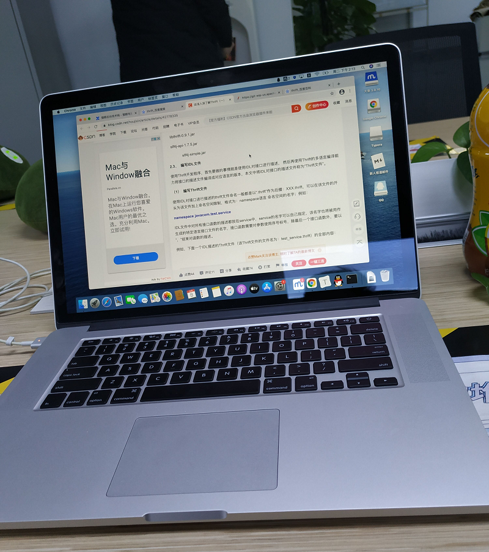

> 大家好，我是陌溪，欢迎点击下方的公众号名片，关注陌溪，让我们一起成长~

今天陌溪给大家带来的是学弟的一份校招求职经历。在 **2020** 年 **10** 月，和学弟在聊的时候，那会他只拿到了几个小厂的 **Offer**，在经过半年的提升，最终抓住春招的尾巴，最终成功上岸，收获了 **滴滴出行** 和 **字节跳动** 的 **Offer**。

同时学弟也最早提到蘑菇博客部署方式存在的不足。在上一篇文章中：[如何使用一条命令完成蘑菇博客的部署？](https://mp.weixin.qq.com/s/LgRIqdPAGzN1tCPMi0Y8RQ) ，介绍了蘑菇博客部署的 **四** 种方式。提问的时候，那会在 **2020** 年 **10** 月，还是采用的是第二种 **Docker** 方式部署，在后面就修改成 **Docker-Compose** 方式了，也就是学弟所说的一个服务做成一个镜像的方式，在这里也感谢学弟的宝贵意见。


学弟经过半年时间的努力，最终收获让自己满意的 **Offer**，前阵子特意来向我报喜了。在这里陌溪只想说一句，学弟你太牛逼了！本科收获大厂 **Offer** 实属羡慕，让陌溪有一种**白读三年**的感觉。


这位学弟和陌溪一样，本科是一个普通的院校。但是学弟在经历过大学一年多的迷茫生活后，能够及时醒悟，同时制定了明确的目标，抓住每一次能够提升自己的机会，完成两段实习经历，最终成功上岸大厂！

下面让我们来看看这位学弟的个人经历吧，希望对同处于迷途中的小伙伴有所帮助~

## 关于我

我就读于福建省内的一个**双非二本**，计算机专业，**21** 届的本科生，也算运气比较好，抓住了春招的尾巴，在今年 **4月** 和 **5月份** 相继拿到了 **滴滴** 和 **字节跳动** 的 **Offer** ，最后是选择了**字节跳动**。因为我从去年 **8** 月份接触到了陌溪学长的 **蘑菇博客** ，在学习项目的时候也加了学长的 **QQ群** 和个人 **QQ**，在学习过程中有一些问题的时候也会和学长一起讨论，直到前几天收到 **字节Offer** 的时候很高兴的和学长一起分享了一下。因为我们的本科学校都是**双非本**，因此学长也建议我写一下我自己的学习和面试过程，也能够对一些同样的双非本科的同学，在求职和学习方面有一些参考和帮助~

## 大学生活

我本身是特别喜欢打篮球和打游戏的，但是高三需要准备高考，这两样东西基本跟我无缘了。所以在大一的时候，基本上就是白天有课就上课，没课的话就是和同学去打球了，晚上要么打球，要么开黑 **LOL**，在学习上，也只是保证了平常课堂上的内容听懂，完成了作业，不挂科而已，这样的生活一直到了大二下学期吧。那个时候自己的技能水平基本就是什么都不会，只是知道课堂上老师讲的东西，所以到大二下学期，我掌握的技能也就是简单的**C++**，**Java** 语法，除了平常能写一点课本上简单的 **Demo** 之外，就没有别的了。

在一次和舍友的聊天中，得知了自己学校招聘的情况。因为舍友是打 **ACM** 的，那个时候他也刚拿了 **ACM** 亚洲区域赛的银奖。在我们这样的双非学校，没有相关领域的奖项，或者没有项目经验，实习经验，有的公司你连简历筛选都过不去。

聊完也想了挺多的，因为我本身家庭条件就不太好，所以也没有考研的想法，就想着毕业直接参加工作了，所以从那个时候开始，我就开始为后续的招聘开始准备了

竞赛方面的话，主要还是和另外两个舍友一起参加了全国数学建模大赛，最后在机房熬夜爆肝了**三天**，也算是把参赛论文做出来了，最后在暑假的时候，也收到了指导老师的消息，说我们获得了**全国三等奖**，那个时候还是很高兴的，毕竟这也算是个数理竞赛的国奖，也会让自己的简历丰富一些~

记得是第二天早上 **9** 点就要提交了，那个时候很晚了，机房就剩下我们三个苦逼的在改论文


项目方面的话，我们学校对学生有个文明分机制的，每学期统计一次，高低都有对应的奖励或者一些惩罚吧，是一个比较简单的 **WEB** 管理系统，这个系统是由几个 **16** 届的学长做的，因为那个时候负责后端的学长马上要去实习了，所以就需要找人对这个项目进行后续的维护和开发，最早是从辅导员那里听到这个消息的，然后我就直接报名了，在和后端的学长进行了交流之后，也是在大二下学期的暑假就留在学校看项目代码了，在那个暑假根据这个项目也是学到了 **Spring**，**SSM** ，**Redis**，**Git** 相关的使用，但是也只是懂得基本的使用，其中的源码和各种原理都不懂，但是这个项目也是我最早开始找实习的时候的简历上的第一个项目。

大三上课程很紧，一周被排的满满的，所以也没怎么深究这些知识。

大三的寒假过完，也就是 **2020** 年 **3** 月的时候，因为需要找大三暑期的实习了，所以也开始准备一些面试的东西，那个时候也很迷茫，根本不知道需要什么样的水平，掌握什么样的知识，才能通过面试拿到实习 **Offer**，反正就是很迷茫。。。

后面也是知道了牛客网这个网站，上面有很多很多同学分享的面经，因为我做的项目和学的知识也主要是Java方向的，所以就主要是找 **Java** 方面的面经来看，也是通过这种方式，大概能知道面试官在进行Java面试的时候会问哪些问题。

我会把我不懂的问题都记录下来，在逐个问题通过百度或者翻书去找答案，在学习初期，对于一些知识点，我不是就简单的把一些问题的答案记住，而是会去不断深挖，了解它的底层原理或者与其相关的扩展知识，并且去形成自己的笔记。这一段时间也是比较难熬的，但你也能很清楚的感觉到自己所掌握的知识在不断积累。

同学们要形成体系的话，最好不要只看面经，比如 **Java** 的话，相关知识可以去 **Github** 上的 **JavaGuide** 或者陌溪学长在 **Gitee** 上的笔记都挺不错的，上面的知识点总结的都会比较全。

> JavaGuide：https://github.com/Snailclimb/JavaGuide
>
> 陌溪学习笔记：https://gitee.com/moxi159753/LearningNotes

## 校招投递

### 大三春招

在一边学习的过程中，我也一边开始了春招投简历的流程，那个时候知名的大厂我是根本不敢投递的，觉得自己肯定过不了 TAT。。，可能因为没有过硬的奖项，比如 **ACM**，并且也没有实习，再加上学校是**双非本科**，所以挺多公司的简历是直接挂了的，**虽然说挺沮丧的，但是也没放弃**，周围也有两个同学一起在准备春招，在春招过程中一起交流打气，所以也是坚持了下来。

大三的春招做了笔试的中小公司是蛮多的，最后也就只面试了两家公司，一个是 **好未来**，一个是 **tap4fun**。最后也是拿到了 **tap4fun** 的暑期实习 **Offer**，和两个同学一起去成都实习去了

### 暑期实习以及提前批

因为我和一个同班同学还有另一个软工的同学都拿到了 **tap4fun** 的实习 **Offer**，所以我们也是一起坐飞机去了成都，人生第一次做飞机还是挺激动的 ^^


在实习期间的主要工作也是和同组的策划，客户端同学进行合作，用 **Golang** 开发了一款 **RTS** 手游，最后也是成功的通过答辩，提前拿到了这家公司的秋招 **Offer**。

在公司实习期间也是一些公司，比如 **字节跳动** 的秋招提前批的时间，所以也是有投递一些提前批的公司，在提前批期间也是参加了**网易**，**科大讯飞**，**贝壳找房**的笔试，只有贝壳找房通过了笔试，但是二面挂了TAT。

### 正式秋招

因为手上已经拿到了 **tap** 的正式 **Offer**，并且薪资对于在成都来说，也算是挺不错的，所以整个秋招来讲，我的心态是比较好的，所以是真的很建议同学们一定要在秋招之前找个实习，因为不仅能有机会直接转正，还能丰富你的简历，也能学到挺多知识的。

大概在8月15号从成都回到家里，休息了几天，在实习期间因为挺多公司也还是简历挂，就觉得**自己的项目技术点**有少也有点老，而且那个时候也刚好看到了陌溪学长在**牛客上的面经**，也看到了 **蘑菇博客**，所以那个时候就打算学习一下蘑菇博客，搭建起来，作为自己的另一个项目。

因为蘑菇博客的各项文档都很全，并且加了学长的 **QQ** 后，一些问题也可以直接问学长，所以我大概在 **10** 天的时间内，把蘑菇博客搭建在了我的服务器上，并且将项目的代码都看懂，做了自己的总结笔记。因为蘑菇博客涉及到了 **SpirngCloud**，**ElasticSearch**，**Zipkin** 等一些我之前没接触到的技术，所以也是再花了一周的时间，将相关的知识进行了总结梳理。最后再将蘑菇博客作为自己的项目**写在了简历上**。

在8月底9月初的几天，我就集中的投了很多公司，基本上有秋招的公司，还能投的，我都投了，大概投了有 **80** 多家公司吧，9月到10月的过程中就是集中的笔试面试的时间，最后在国庆之后，基本所有流程都结束了，拿到了 **微盟** 和 **猫眼** 的秋招 **Offer** ，最后综合考虑了一下，选择了猫眼。

### 决定再次春招

其实周围挺多同学秋招拿到相对不错的 **Offer** 之后就基本躺平了，但是我个人还是想尝试冲击一些更高的薪资和更大的平台，所以考虑了之后，也是决定提前去猫眼实习，再次丰富一下自己的简历，也能提前熟悉一下公司的业务。

因此在 **12** 月初，我就一个人来了北京，开始了我的第二段实习，因为公司配的电脑是 **MAC** ，我之前都没接触过苹果的操作系统，还是熟悉了几天。



因为猫眼的技术栈是和美团的相通的，所以一些基础设施和基础平台是很完善的，在猫眼内部的 **wiki** 和美团的学城上，关于一些平台或者中间件的设计文档都比较详细，想要查一些问题或者学习一些平台中间件的设计原理是比较方便的。

因为我的组的猫眼电商中台的交易组，所以这段实习的时间，让我对目前企业级别的，相对成熟的电商中台体系有了一定的了解，然后也学了一些内部平台和中间件的设计原理，在熟悉完负责的相应模块的业务代码后，也是接了了两个相对简单的需求，在经过联调，测试后也是顺利上线了。

因为已经准备好了要春招，所以在实习周末的时候，都会花上一个下午的时间进行刷题，然后巩固一下基础知识。

因为 **2021**年初北京疫情的关系，我怕回不了老家，所有在过年前的 **10** 天左右，在需求完成后的情况下，和**leader** 说明了情况，也是先回去了。

### 大四春招

过完年后，就开始了准备春招了，期间也是将 **两段实习经历** 和 **项目** 进行了总结梳理，将之前秋招总结的基础知识笔记进行复习（做自己笔记的重要性），同时也会去搜**特定公司的面经**进行查缺补漏，比如你准备要投字节，那几天字节的面经可以多看一看。

在面经中我发现很多面试都会涉及操作系统的问题，有的还会挖的很深，而我自己在操作系统方面的知识是比较零散和混乱的，所以也是集中了 **2** 天时间去百度上搜索相关的问题，比如一个进程到底包含了哪些东西，**进程内核态和用户态切换的详细过程**，**inode** 是什么，**CPU** 那些寄存器存的是什么。。。等等一些问题，在网上搜到有歧义或者搜不到的知识，可以去翻一下相对权威的书，在操作系统这边我主要翻的是《**现代操作系统**》第几版我忘记了，反正是个黑皮。

在准备的差不多了以后，就开始投简历了，因为秋招已经拿了猫眼的 **Offer**，所以一些中厂我是没投了，主要就投了大厂，比如 **字节**，**腾讯**，**滴滴**，**美团**等，得到笔试面试机会的有 **腾讯**，**滴滴**，**字节**。

在 **4** 月初也是成功拿到了滴滴的 **Offer**。

字节过程很坎坷，一共经历了 **9** 个技术面，在五一节之后也是成功收到了 **Offer**。

## 一点小建议

小伙伴们如果是校招要准备面试的话，主要可以分为三块来准备

### 算法题

这个是挺重要的一块，因为有的面试官很看重你的代码能力，如果你面试的时候写不出来，可能就直接因为这个挂掉了，所以大家可以多刷刷 **leetcode** 和 **剑指Offer**。**leetcode** 的题不用全刷，刷 **200+** 的高频题就可以了，**剑指offer** 建议全刷。

刷题不要只刷一遍，尽量做到你看到一道题，你脑子里就能马上反应出这道题的思路，刷题的话，目前可以参考 **codetop** 。这个网站上对各个公司各个部门，在面经上出现的算法题都有总结，总结的很不错，还有出现频率和日期等。

> codetop地址： https://codetop.cc

### 基础知识

这一块算是最大的一块了，通常一面的话，都会看你基础知识的深度和广度，所以基础知识一定要打牢。

以 **Java** 来说，基础知识包括：**JVM**，**JUC**，**Java集合**，包括其源码深究，语言特性。**Spirng** 家族的框架的八股文。**中间件**：比如 **Redis**，**MQ**，**ElasticSearch** 相关的原理知识，应用场景，这个通常会在问你项目的时候引申出来问。

**操作系统**，**计算机网络**，这个也算是八股文了，但是一定要弄清楚，别只是简单背个答案，别人换一种方式问你就不懂了。

基本的数据结构和算法， 简单的栈，队列，堆，数组，树等结构和原理都要具备，算法的话，如果你简历上没写有竞赛相关的经历，知道一些基础的，比如几大排序算法，字符串匹配的算法应该问题就不大了。

### 项目

小伙伴们的项目最好是要涉及目前主流的技术框架和中间件了，比如目前比较火热的是**微服务**，那你的项目最好也要和这个相关，当然，如果有一些轮子的项目，比如手写一个 **RPC**，这样是更好的。因为如果面试官对你的项目比较感兴趣，在面试当中就会花比较长的时间来问你，面试的时间通常就一个小时左右，如果项目问的多，其他的八股文知识自然会问的少一些，回答不出来的概率肯定也就低一些啦~

当然，你写在简历上的项目，自己一定要摸清，摸透，一些地方为什么要那么做，这么做有什么好处，对你的系统有什么提升，这些都是面试官最喜欢问的，最好面试前都要想清楚，还有你的项目如果涉及到了一些中间件比如**Redis**，**MQ**，他在问项目的时候也会简单的扩展一下相关的知识。

上面只是写了一些个人准备面试时候的一些方向吧，具体的一些学习资料，学习网站什么的，在陌溪学长的博客上也有推荐，这边我就不详细的说了~

下面是我在面试 **猫眼**、**滴滴** 和 **字节跳动** 的面经，欢迎大家查阅~

## 秋招猫眼面经

### 一面 1h 20min

- 介绍一下你的项目
- **MQ** 除了解耦，还知道其他用途吗？ 
- **MQ** 如果消息消费失败，你怎么处理？ 
- 你的项目中 **MQ** 如何选型?有了解过 **RocketMQ** 和 **Kafka** 吗？ 
- **Redis** 五大基本类型？它们实现的底层原理说一下 
- **Redis** 持久化，**RDB** 和 **AOF** 的区别？ 
- **Redis** 除了缓存还知道其他应用场景吗？ 
- 缓存穿透，击穿，雪崩是怎么样的？对应都有什么解决方法？ 
- **Spring IOC AOP**？ 
- **IOC** 的启动流程？ 
- **Java** 的反射了解吗？ 
- 你项目中的事务是怎么做的？ 
- **Spring** 中 **@transcational** 是怎么完成事务的呢？ 
- **final** **finally** **finalize** 区别？ 
- 面试官在文档里写了段 **try catch finally** 的代码，问最后返回什么，**finally** 里有 **return** 
- **HashMap**，**ConcurrentHashMap**，原理，区别？**JDK1.7和1.8** 有什么变化？ 
- **Valetile** 关键字的特点？原理，单例双重锁中不用它的话，会有什么问题？ 
- **CAS** 说一下 
-  **JVM** 内存模型 
- 双亲委派模型?为什么要用它？ 
- **GC** 算法？新生代老年代的 **GC** 的过程？ 
- 项目中有对 **JVM** 的参数调优过吗？具体怎么做的？ 
- **Linux** 怎么查看 **JVM** 的堆栈信息？ 
- **InnoDB** 建表可以不要主键吗？ 
- 索引的数据结构？为啥要用 **B+** 树，**B树** 不行吗？ 
- **Hash** 索引会存在什么问题？ 
- 写了几个 **SQL** 语句，判断能否走索引 
- 给个[二叉树]()，三种遍历结果？ 
- 简单[算法题]() 

```bash
给个数组 比如【1，5，2，4，6】 问 是否存在一个下标，下标两边的和相同，如果有，返回下标，如果没有，返回 -1, 
```

**18** 号一面，当天晚上约的二面时间 

###  二面（1h左右）

- **项目相关**：对项目一些地方的合理性进行提问，并且问你有什么解决方法或者想法，说了自己的想法之后面试官会跟你说他的一些想法（面试官太赞了），里面会包含一些对 **Redis**，**MQ** 的问题 
- **实习相关**，因为我的实习不是 **Java** 岗，就没深问 (到这就 **20** 多分钟了) 
- **Synchronized** 和 **lock** 的区别，越详细越好 
- **JVM** 内存空间说一下 
- 谈一谈 **Volatile**关键字
- **Mysql** 四大隔离级别，分别会出现什么问题说一下?
- **Mysql** 默认的隔离级别是什么 ?
- 可重复读可以解决哪些问题？怎么解决的？ 
- 最左匹配原则？我举了联合索引的例子，然后他就写了三道简单sql问我是否能走到索引 
- **算法题**：输入一个 **float** 类型的数据 **a** ，求更号 **a**  

> 说了思路（二分）然后面试官说OK，开始写，最后写完他提了一点，如果 **a < 1** 呢 ？ 裂开，虽然他后面说没关系，但是还是感觉到一丝凉意~

- 手上哪些offer？ 

- 能接受实习吗？ 

- 反问环节

  - 问了评价和技术栈以及反馈时间（5个工作日） 
  - 许愿HR面

  

**2020.10.12** 更新

收到书面意向书

还愿啦！！！！！！！刚刚6点 **HR** 沟通意向了，聊了一些基本问题，**10** 月中旬沟通薪资发正式 **Offer**

## 春招滴滴面经

### 一面 30+min

-  自我介绍 

-  介绍一下实习，做了什么 

-  mysql为什么最好别对长字符串的这种字段建索引？ 

-  四次挥手time-wait相关 

-  **Redis** 主从同步怎么做的？ 

-  **Reids** 的 **hash** 的底层结构 

-  跟他说了字典和 **Java** 的 **HashMap** 的一些区别，比如扩容的时候是渐进式扩容，然后还聊了为什么 **Redis** 采用渐进式 

-  让你设计一个类似 **Git** 的可供多个用户同时操作的文档，你怎么设计 

-  还有一些基础问题忘记了。。 

- 算法题  

  ```bash
  先给了一道二叉树的，题目比较长，读完了之后大概就是leetcode的原题二叉树给两个节点，找他们的最近公共祖先 
  ```

   这道题把主要的逻辑写出来了，但是面试官说跑case比较难，换一道简单的吧，我：？？？ 

   又写了个快排，跑了个 **case** 过了 

###  二面 40+min

-  自我介绍 
-  挑一个自己熟悉的项目说一说，遇到什么困难 
-  说了项目里 **ElasticSearch** 的相关的一些问题，然后聊了怎么解决 
-  他说对我的 **Golang** 游戏实习比较感兴趣，问了 **Golang** 和 **Java** 的区别，以及游戏开发和后端开发的区别 
-  扯到实习项目的 **Redis** 分布式锁，写了一下简单的伪代码 
- 项目里锁的过期时间怎么设置呢，太长太短会出现什么问题，怎么解决?
-  **Java**的锁？ **Synchronized 和 **Lock** 区别，以及原理 
-  二叉平衡树分析一下 
- 算法题：剑指 **Offer** 原题：删除单链表中的重复节点，空间O(1) 

###  三面 40+min

- 问了项目相关问题，然后引申出：你如果要设计一个稳定的项目，应该怎么设计 ？
- **TCP**，**HTTP**，**HTTPS** 相关 
- **MySQL** 主从怎么做的，**binlog** 为什么要分两种格式 
- **MySQL** 索引问题，索引越多越好吗，为什么 ?
- **MySQL** 回表问题 
-  线程进程区别，父进程开一个 **socket**，子进程把他关了，那么父进程的那个 **socket** 关了吗（答错了，这边应该是没关，那个 **socket** 上会有引用计数） 
- 几种 **IO** 模型，**BIO**，**NIO** 和**多路复用**等 。

- ```BASH
  大数据题：一个很大的文件，里面放的ipv4的地址，怎么存和怎么使得我查询一个ip是否存在里面效率最高？ 
  ```

  - 答：**ipv4 32**位，跟 **int** 一样，用 **bitmap** 存，大概 **500M** 空间，查询效率 **O(1)** 
  - 面试官：**OK**，思路很对，那你写一下吧 
  - 我：**WTF** ？？？？？？ 
  - 直接第一步就卡在ipv4怎么转成int了，然后跟他说能不能输入的就是ipv4的二进制然后再转，后续就是对这个代码的实际实现进行讨论 
  - 反正我最后也没写出来TAT 
  - 评价一下自己，优点缺点 

- 有什么想问我的吗？

## 字节跳动面经

其实从春招投字节开始已经面过 **9** 个技术面了。。 朝夕光年 **4** 面技术 + **HR**，然后 **HR** 面挂了，我人都裂开了，然后转投电商后端，**2** 面挂，被教育捞起来，目前已经通知**3**面过后，最终上岸收获 **Offer**。

###  字节电商一面 55min

- 自我介绍 
- 进程之间通信 
- 操作系统锁如何解决和预防 
- 堆排序，建堆时间复杂度，整体时间复杂度
- redis分布式锁如何锁续期
- 项目中 MQ 如何保证消费不丢失，如何做幂等，用db做有什么弊端，如何改进？
- 操作系统中断发生了什么 
- **算法题1**：概率题 抛硬币，先抛到正面的赢，第一个抛的人赢的概率？ 
- **算法题2**：比一个数小的最大数（元素不能变）
- **算法题3**：环形的打家劫舍

###  字节电商二面 1h 

- 自我介绍
- 项目相关
- **Redis** 怎么用，为什么用 **Token**，**Session** 和 **Cookie** 的区别，**MQ** 怎么用的
- **Redis** 数据结构，持久化
- 进程线程相关
- **hashmap**相关
- **算法题**：无序数组，找出两个元素相乘为 **target** 的下标（注意int类型的向下取整，需要特判） 
- 延续上面的问题，**500G** 的文件，怎么找（在提示以后，说了布隆过滤器，预处理等） 
- 继续延申，如何设计可以删除元素的布隆过滤器？ 需要考虑到高可用和高准确性，增删的元素量很大**500G** ~ **1T** 

###  字节教育一面 25min 

- **算法题1**：**36** 进制加法 
- **TCP** 三次握手，为什么不能两次 
- 四次挥手，过程，报文，以及状态 
- 如何解决 **TCP** 粘包问题 
- 知道哪些 **http** 状态码 
- **逻辑题**：两个人数数字，**1~30**，最少说一个，最多说三个，怎么保证第一个人一定输或者一定赢 
- 反问了一下业务 

### **字节教育二面 48min** 

- 介绍实习项目
- 介绍内部限流平台 
- **Java** 多态 
- **算法题1**：**Java** 集合，手写一个 **ArrayQueue** 
- 如何把这个队列升级成可应对并发的生产者消费者队列，手写 
- 写两个 **SQL**，问了两个 **SQL** 的执行顺序 ?
- 给两个 **SQL**，问如何执行 ?
- **Innodb** 的隔离级别，知道线上为什么要用这种吗 
- **HashMap put** 和 **resize** 
- **算法题2**：无序数组第 **k** 大，分析时间复杂度

###  字节教育三面 50min 

- **算法题**：螺旋打印矩阵变形题，第一圈顺时针，第二圈逆时针，第三圈顺时针。。。 
- 键盘敲一个字符，显示到word里，操作系统完成了什么工作？ 
- 什么函数使得用户进程将内核缓冲区当中的数据拷贝到进程中？ 
- 硬中断和软中断的区别？ 
- 进程线程的区别？ 
- **CPU** 的核心是和线程还是进程对应？ 
- 能把某个用户进程，线程锁定在某个 **CPU** 核心上执行吗？ 
- 显示器如何显示字符有了解过吗？ 
- 字符的类型，比如罗马题，宋体等，是怎么做的有了解过吗 
- 聊人生 

从这位学弟的面经中，我们就能感觉到他为面试所付出的努力，如人饮水冷暖自知，让我们恭喜这位学弟。

我是陌溪，我们下期再见~

## 往期推荐

- [蘑菇博客从0到2000Star，分享我的Java自学路线图](https://mp.weixin.qq.com/s/3u6OOYkpj4_ecMzfMqKJRw)
- [从三本院校到斩获字节跳动后端研发Offer-讲述我的故事](https://mp.weixin.qq.com/s/c4rR_aWpmNNFGn-mZBLWYg)
- [陌溪在公众号摸滚翻爬半个月，整理的入门指南](https://mp.weixin.qq.com/s/Jj1i-mD9Tw0vUEFXi5y54g)
- [读者问:有没有高效的记视频笔记方法？](https://mp.weixin.qq.com/s/QcQnV1yretxmDQr4ELW7_g)
- [万字长文带你学习ElasticSearch](https://mp.weixin.qq.com/s/9eh6rK2aZHRiBpf5bRae9g)
- [如何使用一条命令完成蘑菇博客的部署？](https://mp.weixin.qq.com/s/LgRIqdPAGzN1tCPMi0Y8RQ)

## 结语

应各位小伙伴们的需求，陌溪已经把 **学习笔记** 已经整理成 **PDF** 版本啦，方便大家在手机或者电脑上阅读。以下笔记仓库的部分 **PDF** 文件 ~


如果有需要离线阅读的小伙伴可以到公众号回复 **PDF** ，即可获取下载地址~


同时本公众号**申请较晚**，暂时没有开通**留言**功能，欢迎小伙伴们添加我的私人微信【备注：**加群**】，我将邀请你加入到**蘑菇博客交流群**中，欢迎小伙伴们找陌溪一块聊天唠嗑，共同学习进步，如果你觉得本文对你有所帮助，麻烦小伙伴们动动手指给文章点个「**赞**」和「**在看**」。

