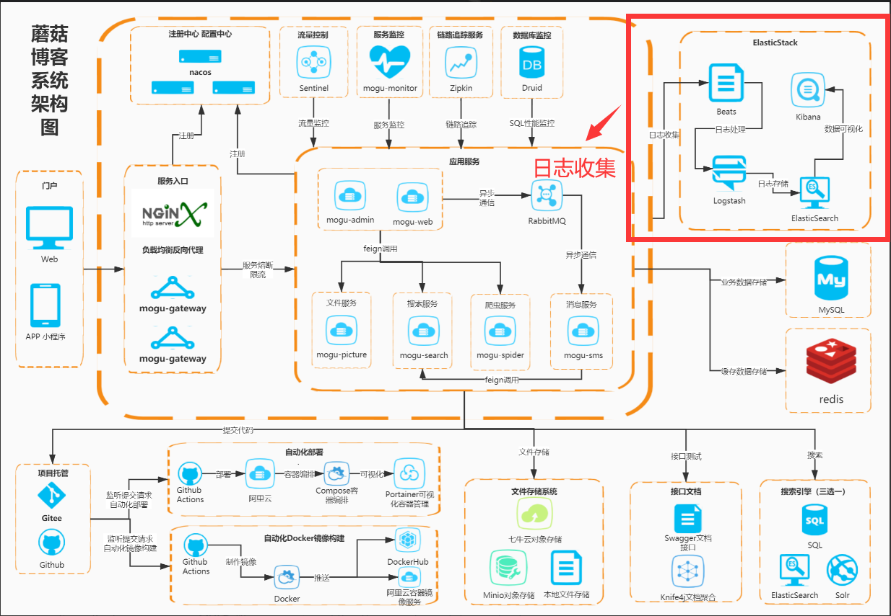
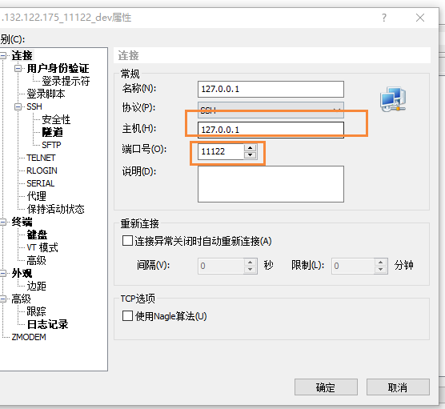
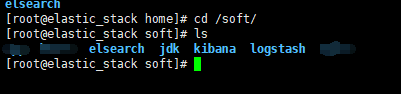
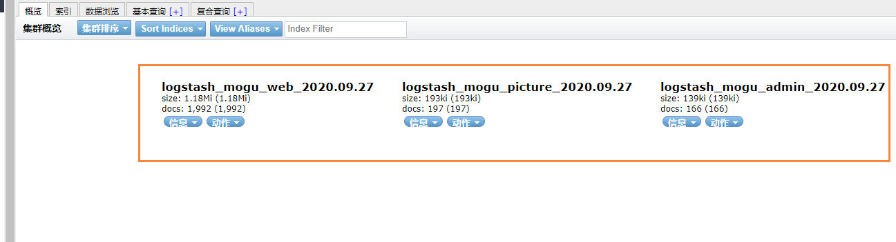
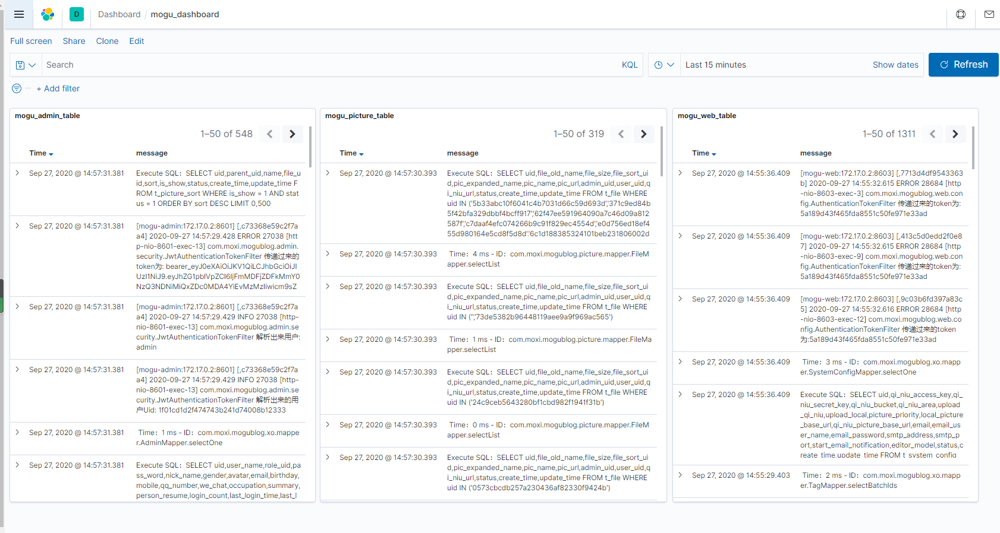

> 大家好，我是陌溪，欢迎点击下方的公众号名片，关注陌溪，让我们一起成长~

前阵子学习了 **ElasticStack** 的技术栈，其中包括 **ElasticSearch** 、**Beats**、**Kibana**、**Logstash**。陌溪打算将其用于蘑菇博客的项目中，搭建一套**分布式日志收集系统**。关于 **ElasticStack** 的技术栈学习，可以参考前面写的文章~

- [万字长文带你学习ElasticSearch](https://mp.weixin.qq.com/s/9eh6rK2aZHRiBpf5bRae9g)
- [一文带你了解轻量性日志采集器Beats的使用](https://mp.weixin.qq.com/s/GoNNoVJA4rOmVjHWc032sw)

下面陌溪开始手把手搭建蘑菇博客技术栈的**日志收集模块**，坐稳扶好，一起开车啦~



## 拉取ElasticStack镜像

通过本教程，可以非常方便的给**蘑菇博客**项目，集成 **ELK** 用于分布式日志收集

为了更加方便的部署 **ELK** 环境，陌溪已经提前将环境打包成了 **Docker** 镜像，发布到了 **DockerHub** 中，所以我们只需要拉取我提前制作的 **ElasticStack** 镜像即可

```bash
# 拉取镜像
docker pull moxi/elastic_stack

# 查看镜像
docker images;
```

拉取完成后，查看我们的镜像信息，容量大概在**4.16G** 左右


## 制作容器

在我们拉取完成后，就可以开始通过镜像制作我们的 **ElasticStack** 容器了

```bash
docker run --privileged -d -it -h elastic_stack --name elastic_stack -v /etc/localtime:/etc/localtime:ro -p 11122:22 -p 9200:9200 -p 5601:5601  -p 5044:5044 -p 9600:9600 moxi/elastic_stack /usr/sbin/init
```

其中这里主要使用的端口号有

- **11122**：用于建立 **ssh** 连接内部容器
- **9200**：**ElasticSearch** 默认端口号
- **5601**：**Kibana** 默认端口号
- **5044**：**Logstash** 默认端口号

执行完上面的命令后，如果没有错误，那么就代表执行成功


然后我们就可以通过在启动一个 **xshell** 窗口，连接我们的容器了



输入你服务器的ip地址，以及端口号为 **11122**，然后点击确定，然后在输入服务器的账号和密码

- 账号：**root**
- 密码：**mogu2018**

即可进入到我们的容器内部，我们到 **/soft** 目录下，能看到里面安装的软件




- **ElasticSearch**：分布式搜索引擎
- **jdk**：java1.8
- **kibana**：图形化工具
- **logstash**：用于数据的过滤和处理

## 启动ElasticSearch

因为 **ElasticSearch** 的启动配置要求比较高，所以我们需要修改一些配置，首先我们到宿主机【是刚刚安装**Docker** 的机器，不是现在容器里面！！】

```bash
# 到宿主机上打开文件
vim /etc/sysctl.conf

# 增加这样一条配置，一个进程在VMAs(虚拟内存区域)创建内存映射最大数量
vm.max_map_count=655360

# 让配置生效
sysctl -p
```

然后再去启动 **ElasticSearch**，因为 **ElasticSearch** 不能使用 **root** 用户直接启动，所以我们需要切换到 **elsearch** 用户

```bash
# 切换用户
su elsearch

# 进入到ElasticSearch目录
cd elsearch

# 启动
./bin/elasticsearch

# 后台启动
./bin/elasticsearch -d
```

启动完成后，我们就可以看到 **ElasticSearch** 运行在9200端口上


我们输入下面的地址到浏览器中访问

```bash
http://your_ip:9200/
```

如果出现下面的内容，表示 **ElasticSearch** 服务已经正常启动~


## 启动Logstash

**Logstash** 的作用就是收集 **Beats** 发送过来的数据，然后进行处理，处理完成后，在将其推送到 **ElasticSearch** 中，如果需要查看更多的关于 **Logstash**，可以查看这篇博客

> Logstash入门简介：
>
> http://www.moguit.cn/#/info?blogOid=156

我们首先到 **logstash** 目录

```bash
cd /soft/logstash
```

然后我们可以查看配置文件

```bash
vim mogu-dashboard.conf
```

可以看到我之前配置的信息

```bash
input {
        beats {
                port => "5044"
        }
}
filter {
        mutate {
                split => {"message"=>"|"}
        }
        mutate {
                add_field => {
                "userId" => "%{[message][1]}"
                "visit" => "%{[message][2]}"
                "date" => "%{[message][3]}"
                }
        }
        mutate {
                convert => {
                "userId" => "integer"
                "visit" => "string"
                "date" => "string"
                }
        }
        mutate {
           remove_field => [ "host" ]
        }
}
#output {
# stdout { codec => rubydebug }
#}

output {
    if [from] == 'mogu_web' {
        elasticsearch {
          hosts => ["127.0.0.1:9200"]
          index => "logstash_mogu_web_%{+YYYY.MM.dd}"
        }
    }

    if [from] == "mogu_admin" {
        elasticsearch {
          hosts => ["127.0.0.1:9200"]
          index => "logstash_mogu_admin_%{+YYYY.MM.dd}"
        }
    }

    if [from] == "mogu_sms" {
        elasticsearch {
          hosts => ["127.0.0.1:9200"]
          index => "logstash_mogu_sms_%{+YYYY.MM.dd}"
        }
    }

    if [from] == "mogu_picture" {
        elasticsearch {
          hosts => ["127.0.0.1:9200"]
          index => "logstash_mogu_picture_%{+YYYY.MM.dd}"
        }
    }
    
    if [from] == "mogu_nginx" {
        elasticsearch {
          hosts => ["127.0.0.1:9200"]
          index => "logstash_mogu_nginx_%{+YYYY.MM.dd}"
        }
    }
}

```

> 我们可以通过获取到传递过来的 **from** 字段，就是在 **filebeat** 时候指定的 一个字段，代表是这条日志属于哪个模块的，然后在根据 **logstash** 的 **if** 判断，然后生成不同的 **ElasticSearch** 索引



下面，我们指定该配置文件后，然后启动项目

```bash
# 前台启动
./bin/logstash -f ./mogu-dashboard.conf

# 后台启动
nohup ./bin/logstash -f ./mogu-dashboard.conf  > catalina.out  2>&1 &
```

注意：**logstash** 的启动可能会比较慢，需要耐心的等待一会~


启动完成后，会占用 **9600** 端口~，同时经过 **logstash** 的数据都会发送到 **ElasticSearch** 中

## 启动Beats

### 启动filebeat

**filebeat** 是一个轻量级的日志文件收集器，主要用于收集我们的一些日志文件【它和应用服务器存放在一起】

需要注意，**Beats** 不在我们ELK服务器上进行启动了，我们需要到部署蘑菇博客的服务器上，然后找到 **Beats** 目录


我们首先需要到我们应用服务器中，然后启动filebeats ，如果你的目录下没有，可以参考下面这篇文章：[一文带你了解轻量性日志采集器Beats的使用](https://mp.weixin.qq.com/s/GoNNoVJA4rOmVjHWc032sw)

安装好后，首先进入到filebeat目录

```bash
cd /soft/beats/filebeat
```

然后查看我们的配置文件

```bash
vim mogu-dashboard.yml
```

然后修改我们配置文件中 **logstash** 的地址，我们要把它改成刚刚部署的 **logstash** 服务器的 **ip** 即可

```bash
filebeat.inputs:
- type: log
  enabled: true
  paths:
    - /home/mogu_blog/mogu_web/catalina.out
  fields:
    from: mogu_web
  fields_under_root: true

- type: log
  enabled: true
  paths:
    - /home/mogu_blog/mogu_admin/catalina.out
  fields:
    from: mogu_admin
  fields_under_root: true

- type: log
  enabled: true
  paths:
    - /home/mogu_blog/mogu_sms/catalina.out
  fields:
    from: mogu_sms
  fields_under_root: true

- type: log
  enabled: true
  paths:
    - /home/mogu_blog/mogu_picture/catalina.out
  fields:
    from: mogu_picture
  fields_under_root: true

setup.template.settings:
  index.number_of_shards: 1
output.logstash:
  hosts: ["101.132.122.175:5044"]
```

然后启动我们的 **filebeat**

```bash
# 前台启动
./filebeat -e -c mogu-dashboard.yml

# 后台启动
#!/bin/bash 
nohup ./filebeat -e -c mogu-dashboard.yml > catalina.out  2>&1 &
```

启动完成后，我们能够看到日志文件已经被加载


## 启动Kibana

**Kibana** 的作用就是对我们的数据进行图形化的显示，首先我们到 **Kibana** 目录 【回到 **ELK** 目录下】

```bash
# 到kibana安装目录
cd /soft/kibana
```

因为 **Kibana** 和 **ElasticSearch** 一样，不支持 **root** 用户启动，所以我们继续切换成 **elsearch** 用户

```bash
su elsearch
```

然后启动

```bash
./bin/kibana
```

查看启动信息，我们发现 **Kibana** 启动在 **5601** 端口号


启动后，我们在浏览器中访问我们的地址

```bash
http://your_ip:5601
```


我们找到 **dashboard** 就可以看到蘑菇博客的日志记录了



这里就只介绍了ElasticStack的日志收集，关于更多的Kibana图形化页面，小伙伴可以参考其它文件进行配置，这里就不列举出来啦~

我是陌溪，我们下期再见~

## 往期推荐

- [蘑菇博客从0到2000Star，分享我的Java自学路线图](https://mp.weixin.qq.com/s/3u6OOYkpj4_ecMzfMqKJRw)
- [从三本院校到斩获字节跳动后端研发Offer-讲述我的故事](https://mp.weixin.qq.com/s/c4rR_aWpmNNFGn-mZBLWYg)
- [陌溪在公众号摸滚翻爬半个月，整理的入门指南](https://mp.weixin.qq.com/s/Jj1i-mD9Tw0vUEFXi5y54g)
- [读者问:有没有高效的记视频笔记方法？](https://mp.weixin.qq.com/s/QcQnV1yretxmDQr4ELW7_g)
- [万字长文带你学习ElasticSearch](https://mp.weixin.qq.com/s/9eh6rK2aZHRiBpf5bRae9g)
- [如何使用一条命令完成蘑菇博客的部署？](https://mp.weixin.qq.com/s/LgRIqdPAGzN1tCPMi0Y8RQ)

## 结语

最近，应各位小伙伴们的需求，陌溪已经把 **开源学习笔记仓库** 整理成 **PDF** 版本啦，方便大家在手机或者电脑上阅读。

> 开源笔记地址：https://gitee.com/moxi159753/LearningNotes

以下笔记仓库的部分 **PDF** 文件 ~


如果有需要离线阅读的小伙伴可以到公众号回复 **PDF** ，即可获取下载地址~


同时本公众号**申请较晚**，暂时没有开通**留言**功能，欢迎小伙伴们添加我的私人微信【备注：**加群**】，我将邀请你加入到**蘑菇博客交流群**中，欢迎小伙伴们找陌溪一块聊天唠嗑，共同学习进步，如果你觉得本文对你有所帮助，麻烦小伙伴们动动手指给文章点个「**赞**」和「**在看**」。

