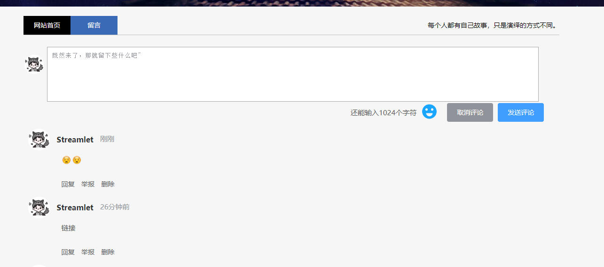

> 大家好，我是陌溪，欢迎点击下方的公众号名片，关注陌溪，让我们一起成长~

陌溪最近写了一个博客的评论模块，因为需要引入了**表情包**，所以就将 **Vue** 的文本渲染方式，从原来的 **v-text** 的形式，改成了 **v-html**，也就是可以渲染 **html** 标签，但是这样不可不免的会带来问题，也就是 **XSS** 跨站脚本攻击。

## XSS跨站脚本攻击

跨站脚本攻击缩写为 **XSS** ，恶意攻击者往 **Web** 页面里插入恶意 **Script** 代码，当用户浏览该页面时，嵌入 **Web** 里面的 **Script** 代码会被执行，从而达到恶意攻击用户的目的，**XSS** 攻击针对的是用户层面的攻击！

例如：陌溪在评论框输入以下内容

```
<a onclick='let count=10;while(count>0){alert("xss攻击");count=count-1;}'>链接</a>
```

如果懂 **html** 和 **js** 的小伙伴，应该能看到这其实是一个带有点击事件的 **a** 标签。输入完毕后，这个时候评论就会出现一个超链接。


只要我们点击这个链接后，就会出现一个**alert** 弹框


上面代码因为写的的是循环 **10** 次后，alert 弹框就消失，但是如果是 **while(true)**，那么后果不堪设想，会进入无止无休的弹框。

## 解决XSS脚本攻击

陌溪通过网上冲浪，发现一款能够根据白名单过滤 **HTML** ，防止 **XSS** 攻击的插件。主要特性包括：

- 白名单控制允许的HTML标签及各标签的属性
- 通过自定义处理函数，可对任意标签及其属性进行处理

> XSS解决方案：https://jsxss.com

首先需要安装 **xss** 模块

```
npm install xss --save
```

然后在 **main.js** 中引入

```
import xss from 'xss'
// 定义全局XSS解决方法
Object.defineProperty(Vue.prototype, '$xss', {
  value: xss
})
```

然后针对需要渲染的页面，调用 **$xss()** 方法

```
<div class="rightCenter" v-html="$xss(item.content)"></div>
```

我们在点击刚刚的页面，发现已经不会有弹框了，但是有出来了新的问题，就是我引入的标签也被过滤了。

如下图所示，这是没有使用 **XSS** 解决方案



引入**xss** 解决方案后，我们的表情包也被转换成了字符串了！


这个时候，我们就需要自定义拦截规则了，我们在 **data** 中添加如下配置，下面是自定义白名单，也就是什么标签以及标签的属性能够正常使用，其它的都会被拦截，对于一些无害的标签和属性，我们可以放入到白名单中。

```
    data() {
      return {
        // xss白名单配置
        options : {
          whiteList: {
            a: ['href', 'title', 'target'],
            span: ['class']
          }
        }
      };
    },
```

然后在使用的时候，增加 **option** 配置

```
<div class="rightCenter" v-html="$xss(item.content, options)"></div>
```

这个时候，表情已经成功显示了，并且原来的脚本攻击也不生效，达到了我们的目的~


我是陌溪，我们下期再见~