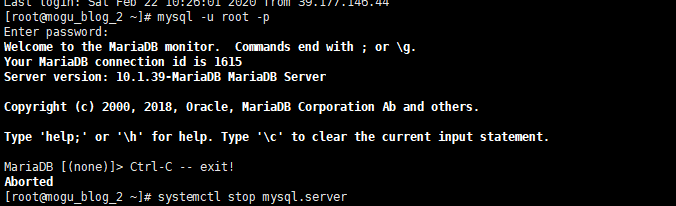
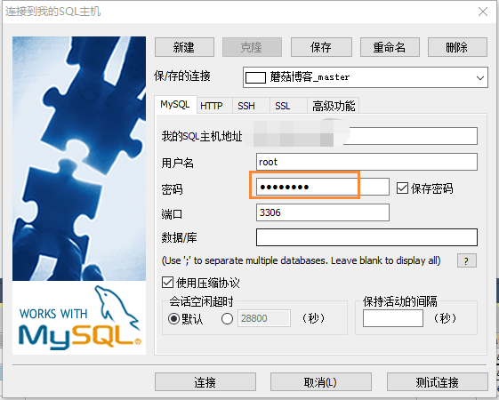

## 前言

今天有个热心的小伙伴，通过 **MySQL** 图形化管理工具 **SQLyog** 进行远程数据库连接，成功进入了 **蘑菇博客** 的生产环境数据库。然后在博客数据表中增加一个**超级管理员**账号，最后通过新创建的超级管理员，在蘑菇博客后台转悠了一圈，然后进入蘑菇博客交流群和我反馈了这个 **BUG** ，在这里首先感谢这位小伙伴的**不删库之恩** .... 

## 问题缘由

问题出现的原因，是因为蘑菇博客生产环境的数据库使用的远程登录密码为 **默认密码(mogu2018)** 。也就是说，当我们在 **Linux** 服务器中，使用下面的命令进行数据库连接

```bash
# 连接mysql
mysql -u root -p
# 输入密码
mogu2020
```

发现使用密码： **mogu2020** ，能够成功在服务器上登录MySQL



然后我们在通过 **SQLyog** 进行测试，我们输入密码  **mogu2018**



发现也能够成功登录系统！问题就出在这里呢，我以为我把密码改成了 **mogu2020**  ，但是其他小伙伴如果使用远程工具，还可以继续使用 **mogu2018** 进行登录

## 解决方案

首先这个问题出现的原因，是因为**远程连接的密码**和**本地连接的密码**不一致引起的，也就是说我在部署完 **MySQL** 后，只修改了一个所引起的，首先我们查询 **mysql** 用户

```bash
# 登录mysql
mysql -u root -p

# 使用mysql数据库
use mysql

# 查询mysql用户
select user, host from mysql.user;
```

我们能够发现有4个用户


其中 **host** 为 **%** 的表示是远程连接用户，而 **localhost** 和 **127.0.0.1** 都是本地用户，下面的配置就是蘑菇博客在线上的配置

```yaml
  datasource:
    username: root
    password: mogu2020
    url: jdbc:mysql://localhost:3306/mogu_admin
```

因为 **MySQL** 和项目是在同一个云服务器中，所以直接通过 localhost，即可连接。

而我们在 **Windows** 上通过 **SQLyog** 远程连接我们的云服务器，就只能通过 **%** 用户进行连接了，现在我们要做的是修改 **%** 用户(也远程连接用户) 的 密码即可。 

```bash
# 修改密码，改成 mogu2020
GRANT ALL PRIVILEGES ON *.* TO 'root'@'%'IDENTIFIED BY 'mogu2020' WITH GRANT OPTION;

# 刷新
flush privileges;
```

修改完密码后，**SQLyog** 远程连接通过 **mogu2018** 无法登录了，正所谓亡羊补牢，为时不晚。因为之前修改密码的时候，只修改了 **localhost** 的，而没有修改%的，而导致这个问题的出现，最后再次感谢热心的小伙伴发现这个问题，以及小伙伴的不删库之恩~

## 结语

**陌溪**是一个从三本院校一路摸滚翻爬上来的互联网大厂程序员。独立做过几个开源项目，其中**蘑菇博客**在码云上有 **2K Star** 了。目前就职于**字节跳动的Data广告部门**，是字节跳动全线产品的商业变现研发团队。同时本公众号将会持续性的输出很多原创小知识以及学习资源。欢迎各位小伙伴关注陌溪，让我们一起成长~

