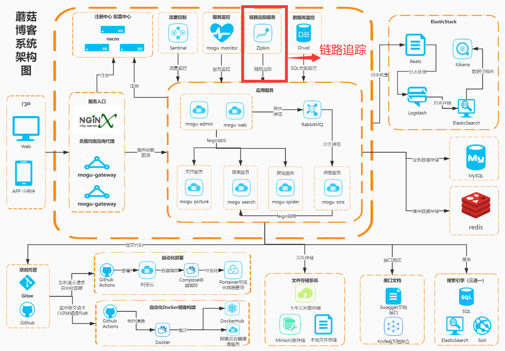

> 大家好，我是陌溪，欢迎点击下方的公众号名片，关注陌溪，让我们一起成长~

在前面的章节中，我们了解了蘑菇博客的日志收集模块，下面我们一起来学习蘑菇博客中的链路追踪模块~



随着微服务架构的流行，服务按照不同的维度进行拆分。一个由客户端发起的请求在后端系统中会经过多个不同的服务节点调用来协同产生最后的请求结果，每一个前端请求都会形成一条复杂的分布式服务调用链路，链路中的任何一环出现高延时或错误都会引起整个请求最后的失败。


并且，伴随着微服务数量的增加，对调用链路的分析将会越来越复杂，它们之间的关系可能如下所示。（密集恐惧症慎入~）


在复杂的调用链路中假设存在一条调用链路响应缓慢，如何定位其中延迟高的服务呢？这个时候就需要有一个用于调用链路的监控和服务跟踪的解决方案。

## 什么是Zipkin?

### 定义

**Zipkin** 是 **Twitter** 的一个开源项目，它基于 **Google Dapper** 实现，它致力于收集服务的定时数据，以解决微服务架构中的延迟问题，包括数据的收集、存储、查找和展现。 我们可以使用它来收集各个服务器上请求链路的跟踪数据，并通过它提供的 **REST API** 接口来辅助我们查询跟踪数据以实现对分布式系统的监控程序，从而及时地发现系统中出现的延迟升高问题并找出系统性能瓶颈的根源。除了面向开发的 **API** 接口之外，它也提供了方便的 **UI** 组件来帮助我们直观的搜索跟踪信息和分析请求链路明细，比如：可以查询某段时间内各用户请求的处理时间等。


如上图所示，各业务系统在彼此调用时，将特定的跟踪消息传递至 **zipkin** , 同时 **zipkin**在收集到跟踪信息后将其聚合处理、存储、展示等，用户可通过 **web UI** 方便获得网络延迟、调用链路、系统依赖等等。

并且 **zipkin** 会根据调用关系通过 **zipkin ui** 生成依赖关系图，下面是我搭建成功后，蘑菇博客链路追踪的依赖图。


注意: **Zipkin** 仅对 **RPC** 通信过程进行记录，注意它与业务代码日志是无关的，如果你希望找到一款 **LogAppender** 来分析所有 **Log4j** 留下的日志，那么建议还是使用 **Kakfa+ELK** 这种传统的方法来实现。

> 源码：https://github.com/apache/incubator-zipkin

### 概念

使用 **zipkin** 涉及到以下几个概念

- **Span**：基本工作单元，一次链路调用(可以是 **RPC**，**DB** 等没有特定的限制)创建一个 **span**，通过一个 **64** 位 **ID** 标识它，**span** 通过还有其他的数据，例如描述信息，时间戳，**key-value** 对的 ( **Annotation** ) **tag** 信息，**parent-id** 等,其中 **parent-id** 可以表示 **span** 调用链路来源，通俗的理解 **span** 就是一次请求信息
- **Trace**：类似于树结构的 **Span** 集合，表示一条调用链路，存在唯一标识
- **Annotation**：注解，用来记录请求特定事件相关信息（例如时间），通常包含四个注解信息
  - **CS**： Client Start，表示客户端发起请求
  - **SR**：Server Receive，表示服务端收到请求
  - **SS**：Server Send，表示服务端完成处理，并将结果发送给客户端
  - **CR**：Client Received，表示客户端获取到服务端返回信息
- **BinaryAnnotation**：提供一些额外信息，一般已 **key-value** 对出现

### 完整的调用链路图


上图表示一请求链路，一条链路通过 **Trace Id** 唯一标识，**Span** 标识发起的请求信息，各 **span** 通过 **parent id** 关联起来，如图


整个链路的依赖关系如下:


完成链路调用的记录后，如何来计算调用的延迟呢，这就需要利用 **Annotation** 信息


**SR-CS**：得到请求发出延迟

**SS-SR**：得到服务端处理延迟

**CR-CS**：得到整个链路完成延迟

### Zipkin Server

**Zipkin Server** 主要包括四个模块：

- **Collector**：接收或收集各应用传输的数据
- **Storage**：存储接受或收集过来的数据，当前支持 **Memory**，**MySQL**，**Cassandra**，**ElasticSearch** 等，默认存储在内存中
- **API**（Query）：负责查询Storage中存储的数据，提供简单的 **JSON API** 获取数据，主要提供给 **Web UI** 使用
- **Web**：提供简单的 **Web** 界面

### 缺点

- 在 **SpringCloud** 中强依赖与 **Spring-cloud-starter-zipkin**
- **Zipkin** 只能统计接口级别的信息

## 什么是Sleuth？

### 定义

**spring-cloud-starter-sleuth**: 英文名是侦探，它的功能是在项目中自动为日志加入 **Tag** 与序列号。

> 源码：https://github.com/spring-cloud/spring-cloud-sleuth

### 原理

调用侧请求中加入额外的 **Span** 序列号等上下文信息放入 **Header** 中(通过注入Feign定制Client实现)，被调用侧通过全局 **Filter** 模拟 **AOP** 记录执行情况，计算执行情况与耗时，并存入定制的 **ByteBoundedQueue** 队列中，然后通过 **HTTP** 等将信息异步发送到 **Zipkin** 收集器中，**Zipkin** 收集器通过UI显示调用详情

其中添加了如下组件

- **TraceFeignClient**： 请求端注入的 **FeignClient**，为 **Request** 的 **Header** 添加 **SpanID**, **TraceID**等信息

- **TraceFilter**： 接收端注入的定制 **Filter**，它将解析 **Request** 中的 **Header**，执行业务，计算耗时，最终算出一个完整的 **JSON** 格式的 **Span**，通过队列异步发送到收集器ZipKin中
- **ZipKin**：日志收集器，读取 **JSON** 格式的 **SPAN** 信息，并存储与展示

### 采样率

如果使用 **spring-cloud-sleuth-zipkin** 或 **spring-cloud-sleuth-stream**，**PercentageBasedSampler** 是默认的（默认值是0.1），你可以使用 **spring.sleuth.sampler.percentage** 配置输出。

### 附加信息

用户可以使用 **span tags** 定制关键字，为了限制 **span** 数据量，一般一个 **HTTP** 请求只会被少数元数据标记，例如 **status** **code**、**host** 以及 **URL**，用户可以通过配置 **spring.sleuth.keys.http.headers** (一系列头名称)添加 **request headers**

## 安装Zipkin

### 安装须知

在 **SpringBoot 2.x** 版本后就不推荐自定义 **zipkin server** 了，推荐使用官网下载的 **jar** 包方式

也就是说我们不需要编写一个 **mogu-zipkin** 服务了，而改成直接启动 **jar** 包即可

### 下载地址

```
https://search.maven.org/remote_content?g=io.zipkin.java&a=zipkin-server&v=LATEST&c=exec
```

### 运行

```shell
java -jar zipkin-server-2.12.5-exec.jar

# 或集成RabbitMQ

java -jar zipkin-server-2.12.5-exec.jar --zipkin.collector.rabbitmq.addresses=127.0.0.1
```

如果出现下图，表示 **zipkin**以内存存储的方式进行启动了。


### 日志存储方式

目前 **zipkin** 收集的信息能够以三种方式进行存储

- 内存（默认）
- **Mysql**
- **ElasticSearch**

这里我们尝试的是以 **mysql** 的方式进行存储，如果不想以 **mysql** 进行存储的话，可以忽略这一步

首先，初始化 **mysql** 数据库，请执行下面的 **SQL** 脚本，在之前，需要创建一个数据库，叫 **zipkin**

```
--
-- Copyright 2015-2019 The OpenZipkin Authors
--
-- Licensed under the Apache License, Version 2.0 (the "License"); you may not use this file except
-- in compliance with the License. You may obtain a copy of the License at
--
-- http://www.apache.org/licenses/LICENSE-2.0
--
-- Unless required by applicable law or agreed to in writing, software distributed under the License
-- is distributed on an "AS IS" BASIS, WITHOUT WARRANTIES OR CONDITIONS OF ANY KIND, either express
-- or implied. See the License for the specific language governing permissions and limitations under
-- the License.
--

CREATE TABLE IF NOT EXISTS zipkin_spans (
  `trace_id_high` BIGINT NOT NULL DEFAULT 0 COMMENT 'If non zero, this means the trace uses 128 bit traceIds instead of 64 bit',
  `trace_id` BIGINT NOT NULL,
  `id` BIGINT NOT NULL,
  `name` VARCHAR(255) NOT NULL,
  `remote_service_name` VARCHAR(255),
  `parent_id` BIGINT,
  `debug` BIT(1),
  `start_ts` BIGINT COMMENT 'Span.timestamp(): epoch micros used for endTs query and to implement TTL',
  `duration` BIGINT COMMENT 'Span.duration(): micros used for minDuration and maxDuration query',
  PRIMARY KEY (`trace_id_high`, `trace_id`, `id`)
) ENGINE=InnoDB ROW_FORMAT=COMPRESSED CHARACTER SET=utf8 COLLATE utf8_general_ci;

ALTER TABLE zipkin_spans ADD INDEX(`trace_id_high`, `trace_id`) COMMENT 'for getTracesByIds';
ALTER TABLE zipkin_spans ADD INDEX(`name`) COMMENT 'for getTraces and getSpanNames';
ALTER TABLE zipkin_spans ADD INDEX(`remote_service_name`) COMMENT 'for getTraces and getRemoteServiceNames';
ALTER TABLE zipkin_spans ADD INDEX(`start_ts`) COMMENT 'for getTraces ordering and range';

CREATE TABLE IF NOT EXISTS zipkin_annotations (
  `trace_id_high` BIGINT NOT NULL DEFAULT 0 COMMENT 'If non zero, this means the trace uses 128 bit traceIds instead of 64 bit',
  `trace_id` BIGINT NOT NULL COMMENT 'coincides with zipkin_spans.trace_id',
  `span_id` BIGINT NOT NULL COMMENT 'coincides with zipkin_spans.id',
  `a_key` VARCHAR(255) NOT NULL COMMENT 'BinaryAnnotation.key or Annotation.value if type == -1',
  `a_value` BLOB COMMENT 'BinaryAnnotation.value(), which must be smaller than 64KB',
  `a_type` INT NOT NULL COMMENT 'BinaryAnnotation.type() or -1 if Annotation',
  `a_timestamp` BIGINT COMMENT 'Used to implement TTL; Annotation.timestamp or zipkin_spans.timestamp',
  `endpoint_ipv4` INT COMMENT 'Null when Binary/Annotation.endpoint is null',
  `endpoint_ipv6` BINARY(16) COMMENT 'Null when Binary/Annotation.endpoint is null, or no IPv6 address',
  `endpoint_port` SMALLINT COMMENT 'Null when Binary/Annotation.endpoint is null',
  `endpoint_service_name` VARCHAR(255) COMMENT 'Null when Binary/Annotation.endpoint is null'
) ENGINE=InnoDB ROW_FORMAT=COMPRESSED CHARACTER SET=utf8 COLLATE utf8_general_ci;

ALTER TABLE zipkin_annotations ADD UNIQUE KEY(`trace_id_high`, `trace_id`, `span_id`, `a_key`, `a_timestamp`) COMMENT 'Ignore insert on duplicate';
ALTER TABLE zipkin_annotations ADD INDEX(`trace_id_high`, `trace_id`, `span_id`) COMMENT 'for joining with zipkin_spans';
ALTER TABLE zipkin_annotations ADD INDEX(`trace_id_high`, `trace_id`) COMMENT 'for getTraces/ByIds';
ALTER TABLE zipkin_annotations ADD INDEX(`endpoint_service_name`) COMMENT 'for getTraces and getServiceNames';
ALTER TABLE zipkin_annotations ADD INDEX(`a_type`) COMMENT 'for getTraces and autocomplete values';
ALTER TABLE zipkin_annotations ADD INDEX(`a_key`) COMMENT 'for getTraces and autocomplete values';
ALTER TABLE zipkin_annotations ADD INDEX(`trace_id`, `span_id`, `a_key`) COMMENT 'for dependencies job';

CREATE TABLE IF NOT EXISTS zipkin_dependencies (
  `day` DATE NOT NULL,
  `parent` VARCHAR(255) NOT NULL,
  `child` VARCHAR(255) NOT NULL,
  `call_count` BIGINT,
  `error_count` BIGINT,
  PRIMARY KEY (`day`, `parent`, `child`)
) ENGINE=InnoDB ROW_FORMAT=COMPRESSED CHARACTER SET=utf8 COLLATE utf8_general_ci;
```

执行完成后，我们将会得到下面的三个表


其中

- **zipkin_spans**：存放基本工作单元，也就是一次链路调用的信息
- **zipkin_dependencies**：存放的依赖信息
- **zipkin_annotations**：用来记录请求特定事件相关信息（例如时间）

然后在安装下面的方式进行启动

```
java -jar zipkin.jar --STORAGE_TYPE=mysql --MYSQL_DB=zipkin --MYSQL_USER=root --MYSQL_PASS=root --MYSQL_HOST=localhost --MYSQL_TCP_PORT=3306
```

启动完成后，我们在运行我们的服务，在打开数据库就能看到信息存储在 **mysql** 中了


## 蘑菇博客集成zipkin

安装完成后，我们需要引入 **sleuth**  和 **zipkin** 的依赖

```xml
<!-- sleuth -->
<dependency>
    <groupId>org.springframework.cloud</groupId>
    <artifactId>spring-cloud-starter-sleuth</artifactId>
</dependency>

<!-- zipkin链路追踪 -->
<dependency>
    <groupId>org.springframework.cloud</groupId>
    <artifactId>spring-cloud-starter-zipkin</artifactId>
</dependency>
```

然后在业务服务的application.yml增加下面的配置，其中蘑菇博客的业务服务主要是：mogu-web，mogu-admin，mogu-sms，mogu-picture，mogu-search

```yml
#spring
spring:
  # sleuth 配置
  sleuth:
    web:
      client:
        enabled: true
    sampler:
      probability: 1.0 # 采样比例为: 0.1(即10%),设置的值介于0.0到1.0之间，1.0则表示全部采集。
  # zipkin 配置
  zipkin:
    base-url: http://localhost:9411  # 指定了Zipkin服务器的地址
```

然后浏览器输入下面的地址：http://localhost:9411 ，如果出现下面的画面，那么代表我们 **zipkin** 服务配置成功了


## Zipkin ui界面介绍

### 首页

首页里面主要承载了trace的查询功能，根据不同的条件，搜索数据


### trace详情


### span详情


这个图中，需要注意的是相对时间和调用行为，调用行为分如下四种：

**CS - Client Send** ：客户端已经提出了请求。这就设置了跨度的开始。

**SR - Server Receive**：服务器已收到请求并将开始处理它。这与CS之间的差异将是网络延迟和时钟抖动的组合。

**SS - Server Send**：服务器已完成处理，并将请求发送回客户端。这与SR之间的差异将是服务器处理请求所花费的时间

**CR - Client Receive**： 客户端已经收到来自服务器的响应。这就设置了跨度的终点。当记录注释时，RPC被认为是完整的。

**相对时间**：表示在调用链开始到现在的时间，如下所示

**17ms** 的时候，**Client Send bas-ms** 这个应用发出了调用

**19ms** 的时候，**Server Receive ems-ms** 收到了 **bas-ms** 的调用。 这个说明，从 **bas-ms** 到 **ems-ms** 中间的网络耗时花费了2ms.

**34ms** 的时候，**Server Send ems-ms** 的方法执行完毕，准备返回响应结果给 **bas-ms** , 这说明 **ems-ms** 处理请求花费了 **34-19 = 15ms**

**34ms** 的时候，**Client Receive bas-ms** 收到了返回结果

界面显示的时候，是根据相对时间来排序的，所以 **Client Receive** 排在了第三位，因为他和 **Server Send** 的时间是一样的。

### 全局依赖


点击服务名，弹出如下框，显示出了调用关系


点击具体的服务名，出现如下界面


- **Number of calls** ： 总的调用数（除去异常的）
- **Number of errors**：调用异常的次数

## 参考资料

- <font size=2>https://blog.csdn.net/singgel/article/details/89853346</font>
- <font size=2>https://blog.csdn.net/u012394095/article/details/82585863</font>

## 往期推荐

- <font size=2>[蘑菇博客从0到2000Star，分享我的Java自学路线图](https://mp.weixin.qq.com/s/3u6OOYkpj4_ecMzfMqKJRw)</font>
- <font size=2>[从三本院校到斩获字节跳动后端研发Offer-讲述我的故事](https://mp.weixin.qq.com/s/c4rR_aWpmNNFGn-mZBLWYg)</font>
- <font size=2>[陌溪在公众号摸滚翻爬半个月，整理的入门指南](https://mp.weixin.qq.com/s/Jj1i-mD9Tw0vUEFXi5y54g)</font>
- <font size=2>[读者问:有没有高效的记视频笔记方法？](https://mp.weixin.qq.com/s/QcQnV1yretxmDQr4ELW7_g)</font>
- <font size=2>[万字长文带你学习ElasticSearch](https://mp.weixin.qq.com/s/9eh6rK2aZHRiBpf5bRae9g)</font>
- <font size=2>[如何使用一条命令完成蘑菇博客的部署？](https://mp.weixin.qq.com/s/LgRIqdPAGzN1tCPMi0Y8RQ)</font>

## 结语

最近，应各位小伙伴们的需求，陌溪已经把 **开源学习笔记仓库** 整理成 **PDF** 版本啦，方便大家在手机或者电脑上阅读。

> 开源笔记地址：https://gitee.com/moxi159753/LearningNotes

以下笔记仓库的部分 **PDF** 文件 ~


如果有需要离线阅读的小伙伴可以到公众号回复 **PDF** ，即可获取下载地址~


同时本公众号**申请较晚**，暂时没有开通**留言**功能，欢迎小伙伴们添加我的私人微信【备注：**加群**】，我将邀请你加入到**蘑菇博客交流群**中，欢迎小伙伴们找陌溪一块聊天唠嗑，共同学习进步，如果你觉得本文对你有所帮助，麻烦小伙伴们动动手指给文章点个「**赞**」和「**在看**」。

