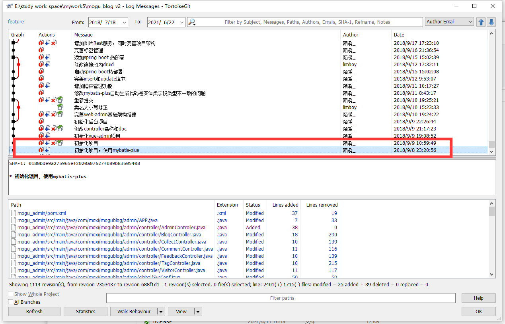
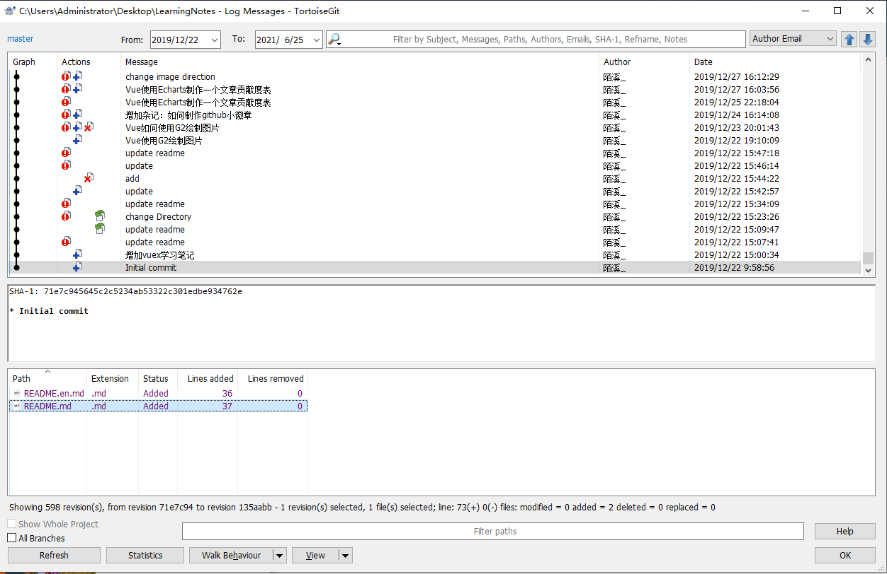
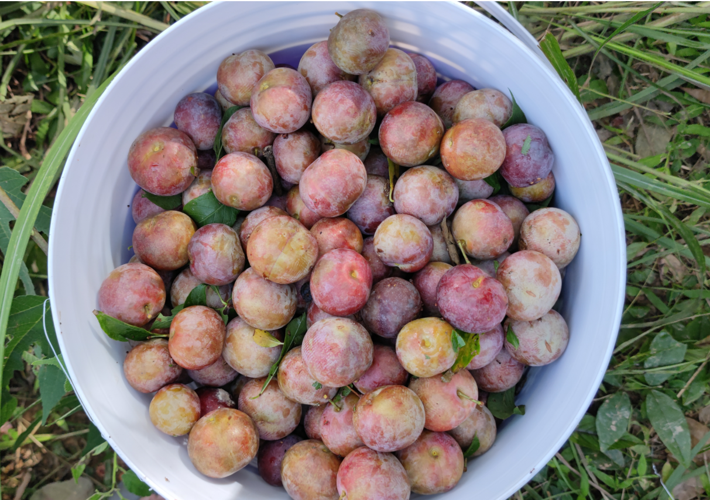
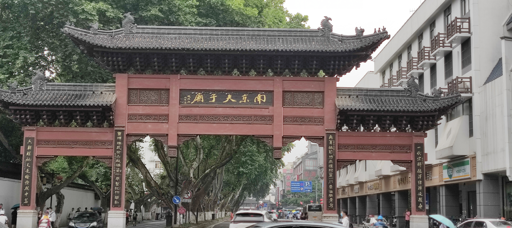
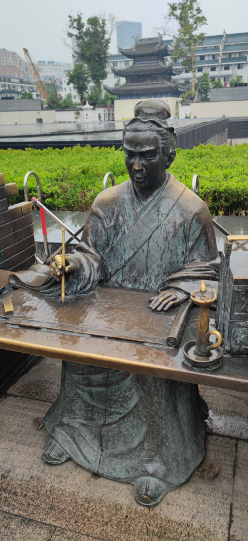
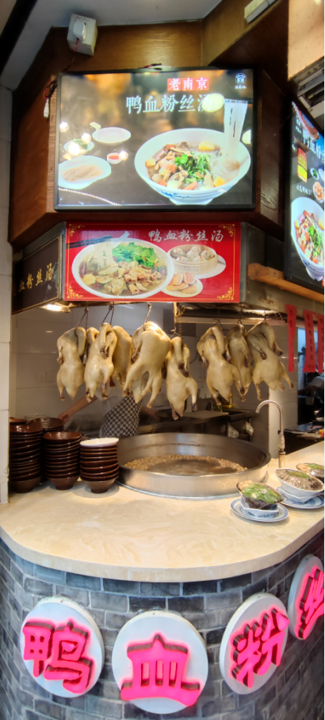
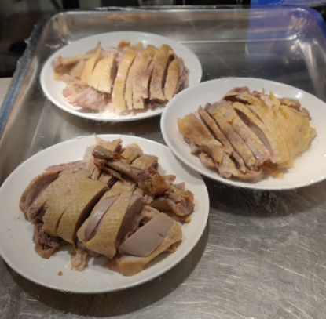
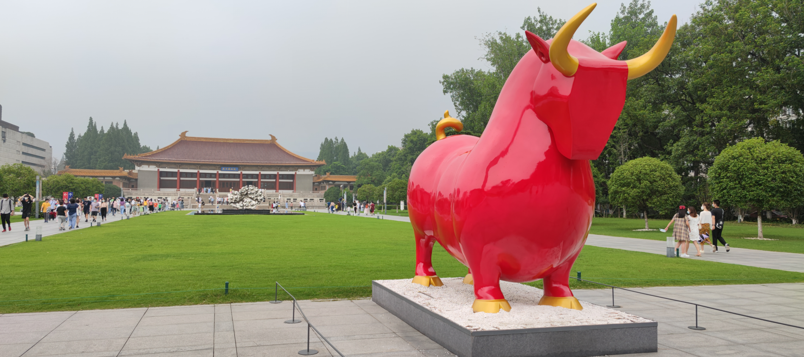

> 大家好，我是陌溪，欢迎点击下方的公众号名片，关注陌溪，让我们一起成长~

陌溪三年的研究生校园时光一眨眼就过去了，在与实验室小伙伴的欢声笑语中，我们毕业了！

三年前我抱着提升自己的编程能力，能够在毕业后找到一份好工作的想法，重新踏进了校园。而毕业后，我也很庆幸自己能够坚持下来，最近我在码云主页翻开了一下我的代码提交记录，记录的起点是 **2018** 年 **9** 月 **8** 号。突然怀念起了，研一时候的一下课就来写蘑菇博客的场景了~

那天，是我研究生入学的第一天，陌溪定下了一个想法，就是能够自己独立做一个开源项目，并且以此来锻炼自己的编程能力，同时也希望后期能够不断完成文档，对后面的小伙伴有所帮助，蘑菇博客也由此诞生了。

在蘑菇博客不断更新迭代的过程中，我也认识了很多志同道合的小伙伴，同时也感谢那些踊跃为蘑菇博客提交 **issue** 以及 **Pull Request** 的小伙伴。

**2019** 年 **12** 月 **22** 日，我创建了另外一个开源笔记项目：**LearningNote**，笔记来源于B站上视频的学习，同时会记录平时一些学习和项目中遇到的问题。

那会创建笔记仓库的目的很简单，就是打算将自己所学的技术栈构成体系。方便自己以后能够快速进行回顾。

记得在知乎有一个特别火的话题是：**你的编程能力是什么时候突飞猛进**？

在这里引用我的小伙伴阿秀的一条回复：**每个人的编程能力应该都是在不知不觉间慢慢提升的，仿佛“随风潜入夜，润物细无声”一般.**

我也很喜欢这句话：**种一棵树最好的时间是十年前，其次是现在**。我很庆幸，我在三年前把这棵小树苗种下了，三年后我也因此取得了我的一个阶段性的目标。

现在陌溪已经挤进打工人的队伍了~

如果有小伙伴看过我之前写的文章的话（[从三本院校到斩获字节跳动后端研发Offer-讲述我的故事](https://mp.weixin.qq.com/s/c4rR_aWpmNNFGn-mZBLWYg)），是知道其实之前是实习过的。那会陌溪在北京实习的时候为了节省日常开销，住在比较远的地方，通勤时间需要一个半小时。

所以陌溪后面在选择工作地点的时候，就选择了杭州，可能就是之前北漂留下的阴影...

趁着毕业后的这些天，也忙着先把 **租房问题** 给落实下来，现在陌溪是和学校的小伙伴一起整租了一套三室一厅，最最最重要的是，房间就在公司隔一条街，离公司仅需要步行4分钟，对比之前，感觉真舒服...  希望以后搬砖时候，领导不要因为我近，让我多加会班 ..

嗯...，好了，言归正传，先说说我最近都做啥去了

## 回家乡

陌溪在参加完谢师宴后，就踏上了回家的路途，想着以后回家的时间变少了，所以要常回家看看。吃完晚饭，在江边散步吹吹风，也是很惬意的~

然后陌溪又回了一趟老家，发现自己的山上的李子也已经成熟了。我是从小就在大山里长大的孩子，记得小时候，只要李子一成熟，马上就会被大家采摘。而现在往山里走的时候，发现很多一棵棵的熟透李子无人采摘了。这其实也是目前农村现象的缩影，随着城市化进程的推进，农村的青壮年劳动力致力于投身城市化建设中，而留在农村的大多数是老人。

陌溪是拎着一个桶进山，不一会儿就摘满了，洗一洗够吃很久了~

## 毕业旅行

在马上要成为打工人的前，我和女朋友打算进行毕业旅行。比起朋友圈的其它小伙伴去西藏，去大西北旅游，我只能好深羡慕。最终和女朋友敲定，选择一个互相比较近的城市：**南京**

首先，到南京的第一站来到了 **科举圣地 南京夫子庙**。夫子庙为供奉祭祀孔子之地，是中国第一所国家最高学府。

遥想当年，无数的文人墨客在此处停留，通过鲤鱼跳龙门实现从民到官的突破。

鸭血粉丝汤是南京的一道传统名菜，主要是由鸭血，鸭肠，鸭肝、鸭谈和粉丝组成，在南京的大街小巷中都能看到它们的身影。

可能有小伙伴就要问了，鸭血粉丝汤里的都是鸭杂，而鸭肉就制作成了另外一道名菜：南京盐水鸭，也被称为 **桂花鸭** 或者 **金陵盐水鸭**。

吃饱喝足，开始了夜游秦淮河沿岸~

第二天去了中山陵，中山陵是孙中山的陵寝，来的这天刚好周末，参观的人群也很多。

听导游说，中山陵共有392级台阶，象征着当时全中国的3亿9千200万人民。

从中山陵下来后，我们又去了南京博物院，南京博物院是中国三大博物馆之一。进门看到的就是一个勇敢牛牛，不怕困难的雕像。

进入博物馆，首先映入眼帘的是猛犸象的化石

