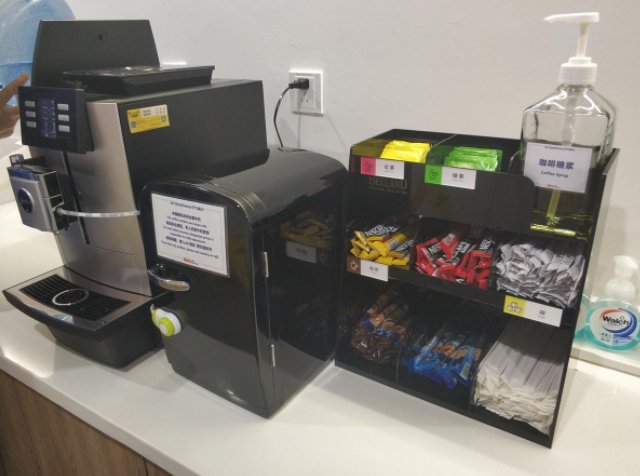
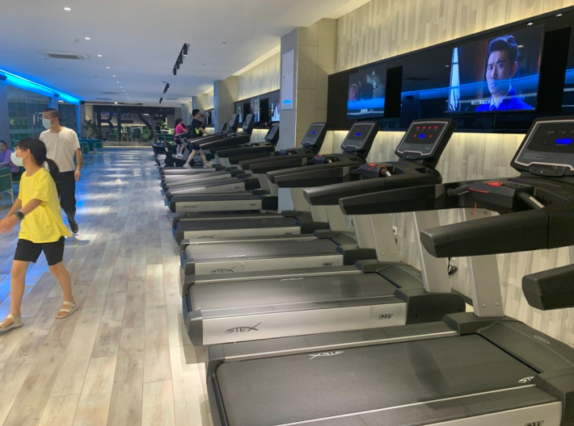
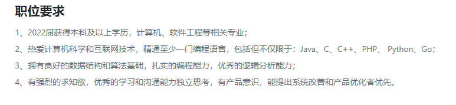

> 大家好，我是陌溪，欢迎点击下方的公众号名片，关注陌溪，让我们一起成长~

准确的来说，陌溪应该是在字节工作了**10** 多天了，只是刚入职恰逢字节的单休，然后也和小伙伴出去玩了，所以就拖到这周双休才写完这篇入职体验。

这两天朋友圈都被字节取消大小周的消息刷屏，小伙伴纷纷来问陌溪，是不是取消大小周了。没错呢，网上的新闻已经已公布了呢~

记得早上在上班的时候还在和小伙伴聊着，刚经历过小周马上就要上六天班好累呀。没想到下午的时候就梦想成真，成功取消了~

不过真的取消大小周后，突然发现自己的 **package** 也少了一波，让本不富裕的家庭雪上加霜了。

但是，从另外一个方面想，周末就可以有时间去做自己的事情了，比如出去玩一天回来后，还能接着在家里躺一天恢复状态~，想想也还是不错的。

好了，下面开始回归正传，谈谈我在字节工作一周的体验呢

## 起床上班

关于住房问题，陌溪是和小伙伴一起整租了一套三室一厅的双层 **loft**，价格的话是 **5500** 一个月，然后均摊下来人均 **1800** 左右，加上 **公司的租房补贴** 和**杭州市政府的租房补贴**，四舍五入约等于每月租房不用花啥钱。关于路程的话，平时去上班大概花费 **5** 分钟，和之前北京的一个半小时通勤比起来，简直不要太爽。

上次和北京的小伙伴聊起来，听说他在公司附近租的一套两室一厅的房子花了 **9000** 多，着实把我吓着了，这每个月辛苦搬砖的钱都被黑心房东赚走了。

不过有一点还是需要吐槽的，下班回家的路程才 **5** 分钟，但是我平时下楼就要花 **10** 分钟才能坐上电梯下来。因为上班在比较高的楼层，电梯在每一层都要停一下，陌溪在 **15** 楼搬砖，最坏的情况可能就要停个 **14** 次才能下来，真是太痛苦了。。加上等电梯的时间，我觉得爬楼都比电梯要快了

## 我的团队

陌溪所在的是字节跳动的 **Data**-**商业化技术团队**，支持字节跳动包括抖音/今日头条/西瓜视频以及海外全系产品的**广告变现技术**。我们团队负责大型广告系统建设，为全球客户提供商业推广方式与方案，亿级流量持续升级，亿级收入持续增长。同时团队遍布北京、上海、杭州等地区。

说了这么多关于陌溪的团队介绍，用一句话概括就是：

现在字节跳动的提前批已经开始了，有 **4000+** 的研发岗位已经上线，越早投递机会越多。同时多一次投递机会，提前批不会影响秋招。最后一个非常重要的点就是：**提前批没有笔试**！**提前批没有笔试**！**提前批没有笔试**！

陌溪其实就是去年提前批成功上岸**字节跳动**的，在去年的 **7** 月 **7** 号的时候，陌溪已经拿了字节提前批的意向书开始躺平了... 

记得那个时候，实验室的小伙伴都还没开始找工作，大家都开始陆陆续续的开始等着 **8** 月份和 **9** 月份的秋招。陌溪在这里想说的是，如果你之前都已经准备的差不多了，那么完全可以抢先一步投递试试呢，越早投递的话，岗位**HC** 就越多，也越容易拿到满意的 **Offer**。当初在投递字节跳动的时候，是陌溪参加的第一次面试，也是抱着试一试的态度投递的，没想到整套流程下来，**2** 天就完成了全部面试流程，**10** 天就拿了意向书。这里不得不夸奖一下字节的招聘效率。

 

同时，陌溪也给自己所在团队打一波广告，欢迎小伙伴来陌溪所在的 **杭州商业化团队**。同时也欢迎小伙伴使用陌溪的内推码进行简历投递，这样陌溪就可以查看到各位的面试进度，并且和各位小伙伴们及时反馈了~

> 字节跳动校招内推码: WYU3X8M 
> 投递链接: https://jobs.toutiao.com/s/epB91a7

或者通**过微信扫码**进行投递也可，扫码投递后，陌溪即可看到小伙伴们的**简历状态**了，如果有最新的动态也能够帮忙跟进~

最后，陌溪也多说两句，目前根据网上公开的内推数据来看，目前 **后端开发** 和 **算法开发** 投递的人数最多，大概占据 **62%** 左右，而剩下的 **前端** 、**客户端** 以及 **测开** 这三个岗位，仅仅占了 **38%** 。因此，如果想圆梦大厂，投递 **前端**、**客户端** 以及 **测开** 也是一个性价比非常不错的岗位，就拿客户端来说，很多都写着不需要客户端基础，来了后会有专门的成长培训，并且听说很多客户端岗位都会有签字费（也就是签了 **Offer**，就让你多拿几个月的工资~）

## 公司福利

一年 **2** 次调薪机会，免费三餐、休闲下午茶、夜宵，无限量零食，每月的租房补贴，打车补贴，免费健身房，体检福利，医疗福利，六险一金，生育礼品，个人综合消费贷款，5折享受英语在线课程。

上面提到陌溪在比较高的楼层，因此我平时懒得下走去食堂吃饭，所以都在楼层上拿的盒饭吃。陌溪在入职直接一周后发现，在字节长胖真的很容易...

同时如果在公司想喝茶什么的，在边上都有红茶、绿茶，奶茶和牛奶，同时还提供现磨的咖啡~ 

至于下午茶的话，公司一般会用小推车直接送到每个人的工位上。一般是时令水果双拼，比如葡萄，哈密瓜，西瓜，火龙果。同时还有甜点，KFC的鸡腿和鸡翅等等~

在公司的附近也有健身房，健身房里有沙包，跑步机，台球，游泳馆等场所，平时周末有时间的话，可以过去锻炼身体也是不错的。陌溪这阵子刚在网上下单买了一套**游泳的装备**，准备下次去健身房的时候就可以戴上**戏水**了~

## 陌溪第一周在做啥？

陌溪之前其实一直都是用的 **Java** 进行开发的，包括面试字节的时候，也只问了 **Java** 相关的技术栈。大家如果观看了对应的招聘要求的话，其实也可以看出字节其实对于语言这块没有特别的要求，掌握 **Java**、**C++**、**PHP**、**Python** 或者是 **Golang** 里面至少一门语言即可。

所以小伙伴们下次投递简历的时候，也不用担心说自己只会 **Java** 能不能投递字节？毕竟目前学生在学校学习 **Golang** 的机会还是很少的，大部分都以 **Java** 和 **C++** 为主，同时再加上字节内部包含了大量的自研框架，基本上都是来了后现学现用的，所以小伙伴们冲就对了！

陌溪来的第一天，公司也给培训了一下公司的企业文化，以及各个部门的职责，同时就是公司的一些行为规章制度以及公司的红线。。所以，以后各位小伙伴们也不要**侧敲旁击**的问陌溪一些**红线问题**，比如说：

- 陌溪你一个月工资多少呀？

- 字节取消大小周啦，陌溪一个月少了多少钱呀？

- 陌溪你公司用的啥技术栈呀，能不能和我们分享分享？

- 陌溪你们公司的办公环境怎么样呀，能不能给我们拍几张工位照看看呢？

当然，如果小伙伴们真的非常想要了解内部情况，欢迎各位小伙们把简历砸过来，等到时候入职后自然就清楚了~

字节在**新人培养**上给每个新个刚入职的新同学都配备了一枚经验丰富的 **Mentor（导师）**。哦，不对，是每个拿了 **Offer** 的同学，也就是说去年 **10** 月份的时候，**Mentor** 就已经联系上我了，并且还给我讲了很多公司部门情况以及用到的技术栈，这样充分让我能够有足够的心里准备，去面对以后的打工人生活。

同时，在刚参加完公司的新人入职培训后，**Mentor** 就把我带到工位上，同时把部门上的其它同学都给我介绍了一遍。小伙伴们在遇到问题的时候，都可以向自己的 **Mentor** 求助，通过导师的帮忙，助我们顺利的度过新手村，让我们最后能够独挡一面，成为项目中的中流砥柱。

陌溪在第一天的生活中，也多亏了 **Mentor** 的帮助，才顺利搭建起了项目的开发环境。同时除了 **Mentor** 外，对于新人培养还有内部 **课程学习平台** 以及强大的飞书**知识库**，里面也会沉淀项目开发的完整文档流程，所以陌溪的前几天就在愉快的观看**视频教程**、阅读**知识库**。

同时为了能够快速上手开发，陌溪也学了公司内部的很多自研框架，真是零基础入门，写 **Go** 的时候还是挺别扭的，怀念 **Java** 的第一周。尤其是刚换上 **Mac** 电脑的时候，陌溪差点连自己的拿手绝活 - **CV大法** 都忘记了，所以闲暇之余也赶快补了补 **Mac电脑** 的生存手册。

比起之前在学校一直调侃的 **8117**（ **8** 点搬砖，晚上 **11** 点回寝室，工作 **7** 天），当然也还是工作时候的大小周感觉到更累一下，就我们组而言，一般是早上 **10** 点上班，到晚上 **9** 点下班，当然字节上班也是不打卡的，只要你觉得自己今天的任务已经完成，那么就可以提前回去，也没有人说你啥的。当然陌溪刚刚入职没多久，一般都是严格按照上下班时间执行的，一般就 **9:40** 到公司吃早餐，中午从 **12** 点到 **2** 点是午饭和休息时间，下午茶时间是 **3** 点半左右，晚饭时间是 **7** 点，所以陌溪一般晚上一般 **9** 点回去了。

毕竟上班后就会有业务上的压力，同时也会有产品的同学会不断的问你开发进展，陌溪在入职的第四天后，就要上手开始写一个简单的需求了，对我来说还是有一些挑战的，不过也让我明白了即使是一个非常简单的接口，也需要经历好几个阶段，例如 需求制定，技术方案、技术评审、技术开发、技术提测、**QA** 测试和上线等等一系列的流程，同时也会有多个同学和你进行配合，直到整个业务流程走完。

最近有小伙伴说博客存在的一些 **BUG** 也还没去解决，其实主要是因为陌溪刚入职不久，也还是努力的了解项目的**业务代码**，不过后面取消大小周了，估计平时周末就有时间做自己的事情了~

好了，我是陌溪，我们下期再见~

## 往期推荐

- [蘑菇博客从0到2000Star，分享我的Java自学路线图](https://mp.weixin.qq.com/s/3u6OOYkpj4_ecMzfMqKJRw)
- [从三本院校到斩获字节跳动后端研发Offer-讲述我的故事](https://mp.weixin.qq.com/s/c4rR_aWpmNNFGn-mZBLWYg)
- [陌溪毕业了](https://mp.weixin.qq.com/s/q8yusdIfxM2OVEyoxwpwwA)

## 结语

最后，陌溪也把之前为了准备校招面试时候，写的笔记都已经整理成了 **PDF** 版本，方便大家在手机或者电脑上阅读。以下笔记仓库的部分 **PDF** 文件 ，如果有需要离线阅读的小伙伴可以到公众号回复 **PDF** ，即可获取下载地址~

同时本公众号**申请较晚**，暂时没有开通**留言**功能，欢迎小伙伴们添加我的私人微信 **coder_moxi**【备注：**加群**】，我将邀请你加入到**蘑菇博客交流群**中，欢迎小伙伴们找陌溪一块聊天唠嗑，共同学习进步，如果你觉得本文对你有所帮助，麻烦小伙伴们动动手指给文章点个「**赞**」和「**在看**」。

