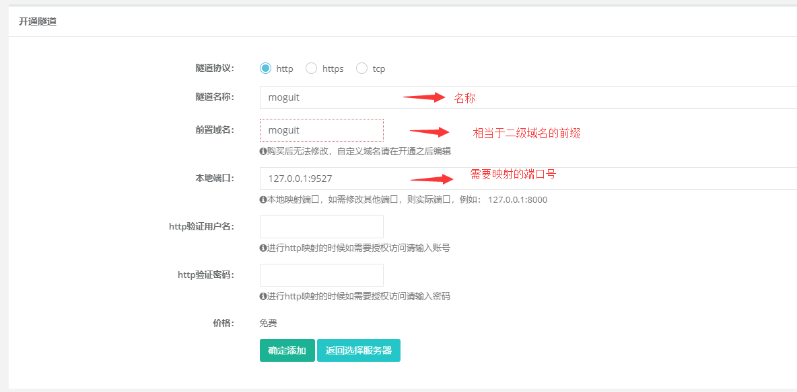
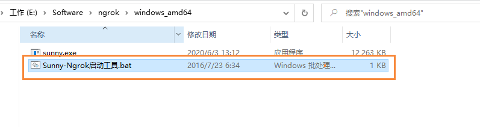
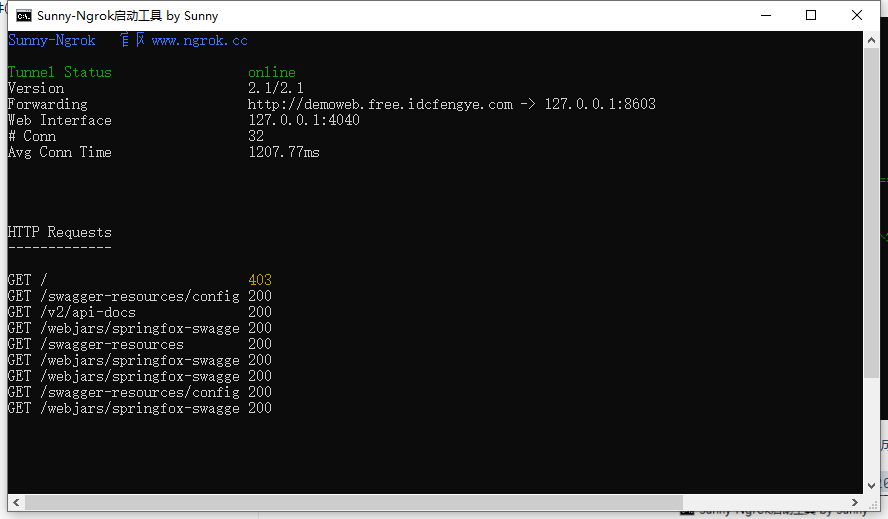
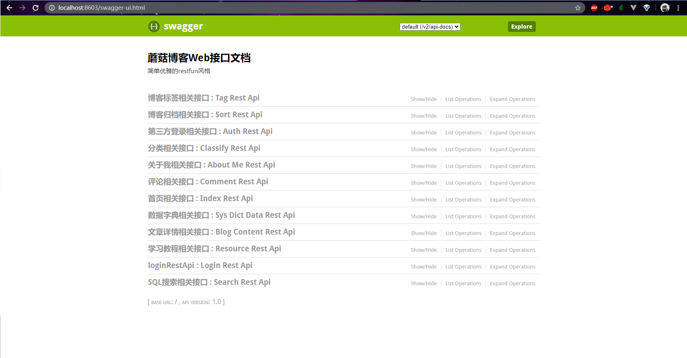

​                                                                                                                                                                           作者：陌溪

​                                                                                                                         陌溪的学习笔记：http://note.moguit.cn大家好，我是 **陌溪** 

最近有学妹咨询我，想用蘑菇博客作为毕业设计，有没有什么方法能够让远程可以访问本地运行的博客项目呢？

首先陌溪觉得，如果可以的话最好可以购买一台云服务器，毕竟如果在部署过程中，有任何问题都可以重置环境，然后重新部署。

但是，如果只想在最后毕业答辩或者项目验收的时候，把自己开发的功能展示给答辩老师看的话。或者是对 **Linux** 的命令不那么熟悉，那么就需要使用到内网穿透了，将公网的 **ip** 映射到我们的本机端口号中，实现本地项目的访问。

关于内网穿透工具有很多，有**付费版本**，也有**免费版**的，陌溪在这里推荐的一款免费的内网穿透工具： **ngrok**。

下面是关于 **ngrok** 的相关介绍

- 提供免费内网穿透服务，免费服务器支持绑定自定义域名
- 管理内网服务器，内网web进行演示
- 快速开发微信程序和第三方支付平台调试
- 本地WEB外网访问、本地开发微信、TCP端口转发
- 本站新增FRP服务器，基于 [FRP](http://github.com/fatedier/frp) 实现https、udp转发
- 无需任何配置，下载客户端之后直接一条命令让外网访问您的内网不再是距离

并且提供了免费的穿透服务

下面我们进入到ngrok的官网，然后注册账号后登陆，选择 左侧开通隧道，然后移动到下方，选择免费的服务器。

> 官网：http://www.ngrok.cc/

然后就进入 **创建隧道** 的页面，在这里输入一些信息

- 访问的协议
- 域名的前缀
- 需要映射的端口号

然后点击添加即可，在添加成功的页面，能够看到隧道 **id** 和 赠送域名，然后复制 **隧道id** 到后面使用。

然后下载 **ngrok** 软件，选中 **Window64Bit** 版本下载

> 下载：http://www.ngrok.cc/download.html

下载解压后，点击 **bat** 文件运行软件

这个时候，就需要在输入刚刚我们复制的 **隧道号** ，然后回车

输入完成后，我们就看到已经成功映射到了我们的 **8603** 端口上了。

首先先本地对 **8603** 端口号进行测试，输入下面的地址，打开 **Swagger** 页面。

> http://localhost:8603/swagger-ui.html

然后在打开 **ngrok** 进行测试，在浏览器输入下方地址，发现也可以成功的访问，这个时候我们就可以实现内网穿透啦

>  http://demoweb.free.idcfengye.com/swagger-ui.html

下面只需要把其它端口，也分别按照上述方法暴露出来，就可以实现远程访问了。

好啦，本次 **内网穿透** 部署之旅就到这里啦。我是陌溪，我们下次再见~

往期推荐
----

*   [蘑菇博客从0到2000Star，分享我的Java自学路线图](https://mp.weixin.qq.com/s/3u6OOYkpj4_ecMzfMqKJRw)
*   [从三本院校到斩获字节跳动后端研发Offer-讲述我的故事](https://mp.weixin.qq.com/s/c4rR_aWpmNNFGn-mZBLWYg)
*   [万字长文带你学习ElasticSearch](https://mp.weixin.qq.com/s/9eh6rK2aZHRiBpf5bRae9g)
*   [双非本科，折戟成沙铁未销，九面字节终上岸！](https://mp.weixin.qq.com/s/SRf2f8wFFyjz2BUUXD_pmg)
*   [如何使用一条命令完成蘑菇博客的部署？](https://mp.weixin.qq.com/s/LgRIqdPAGzN1tCPMi0Y8RQ)
*   [为什么你们制作镜像只有5MB，而我却200MB？](https://mp.weixin.qq.com/s/iWpivtTAKMPKT6gq_3nwaA)
*   [字节二面：蘑菇博客是怎么解决缓存穿透的?](https://mp.weixin.qq.com/s/JNnL6sTySXL9ta5p0rjjXg)
*   [还在用破解IDEA？陌溪手把手教如何申请正版](https://mp.weixin.qq.com/s/mZjoSjk0QqeKFxPbFySomg)

结语
--

应各位小伙伴们的需求，陌溪已经把 **大厂校招笔记** 已经整理成 **PDF** 版本啦，方便大家在手机或者电脑上阅读。以下笔记仓库的部分 **PDF** 文件 。如果有需要离线阅读的小伙伴可以到公众号回复 **PDF** ，即可获取下载地址~

同时本公众号**申请较晚**，暂时没有开通**留言**功能，欢迎小伙伴们添加我的私人微信【备注：**加群**】，我将邀请你加入到**蘑菇博客交流群**中，欢迎小伙伴们找陌溪一块聊天唠嗑，共同学习进步。最后，如果你觉得本文对你有所帮助，麻烦小伙伴们动动手指给文章点个「**赞**」和「**在看**」，非常感谢大家的支持。

