​                                                                                                                                                                           作者：陌溪

​                                                                                                                         陌溪的学习笔记：http://note.moguit.cn大家好，我是 **陌溪**。

我们都知道在一个团队中是由很多角色组成的，例如：业务、产品、设计、前端、后端、测试。每个角色各司其职，一起合作完成项目的交付。

而前端与后端的沟通则是需要通过一个统一的文件进行沟通交流，即通过接口文档事先约定好后端的接口返回内容，然后大家就按照这个文档约定完成前后端的开发。并且一般接口文档都是通过后端人员编写的，维护流程也比较繁琐。

最近被群里小伙伴安利了一款接口管理工具 **ApiPost**，陌溪在使用后觉的非常不错，在这里我也分享给大家。

ApiPost 包含了以下四种功能，同时具备接口调试，接口文档，以及 **Mock** 工具，以及接口流程测试。

> ApiPost = API接口调试工具 + 接口文档快速生成 + Mock工具 + 接口流程测试

- API接口调试工具：常见的有 Postman、Postwoman 等等

- 接口文档快速生成：常见的接口文档工具有 **Swagger** 和 **smart-doc**，但是对代码侵入性比较强。
- Mock工具：主要用于前端根据接口生成对应的数据，如 **RAP** 等工具。
- 接口测试：常见的接口测试工具有 **JMeter**

同时 **ApiPost** 也是国人开发的一款接口管理工具，致力于打造更好用的、中文的、接口调试与文档管理工具（简直是对于陌溪这种英语渣渣的福音~）

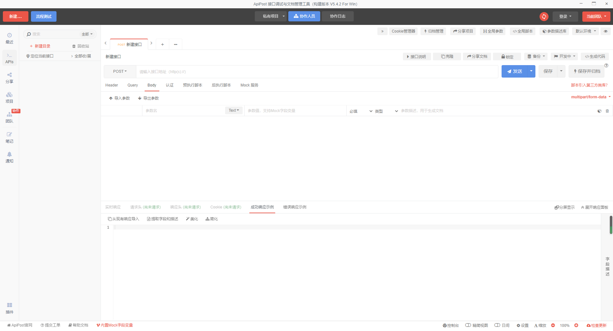

## Api接口调试

### 代码格式化

接口调试是在开发阶段中使用最多的一个功能，利用ApiPost进行常规的接口调试功能

让我感觉最舒服的是，对于返回的参数是可以进行 Json 格式化的，下面是 **Postman** 自带的 **Pretty** 功能 。

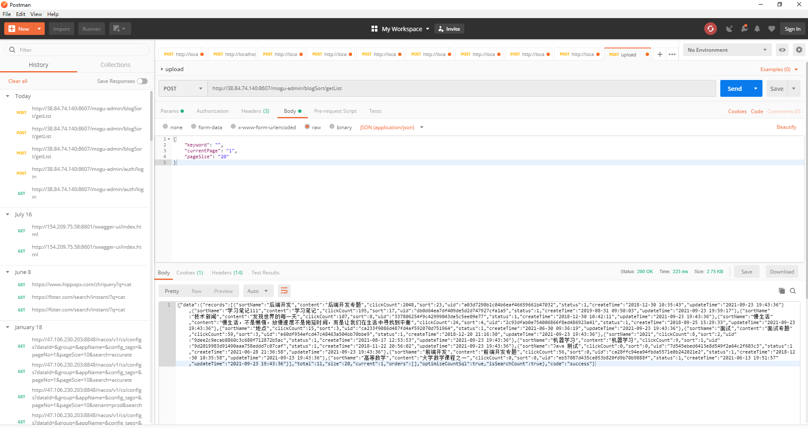

下面是 **ApiPost** 的 **Json** 格式化功能，并且通过右侧的三角形，可以对数组元素进行展开或者合拢。在面对返回结果是一个数组，并且每个对象中字段很多的时候，这个功能就非常棒了。

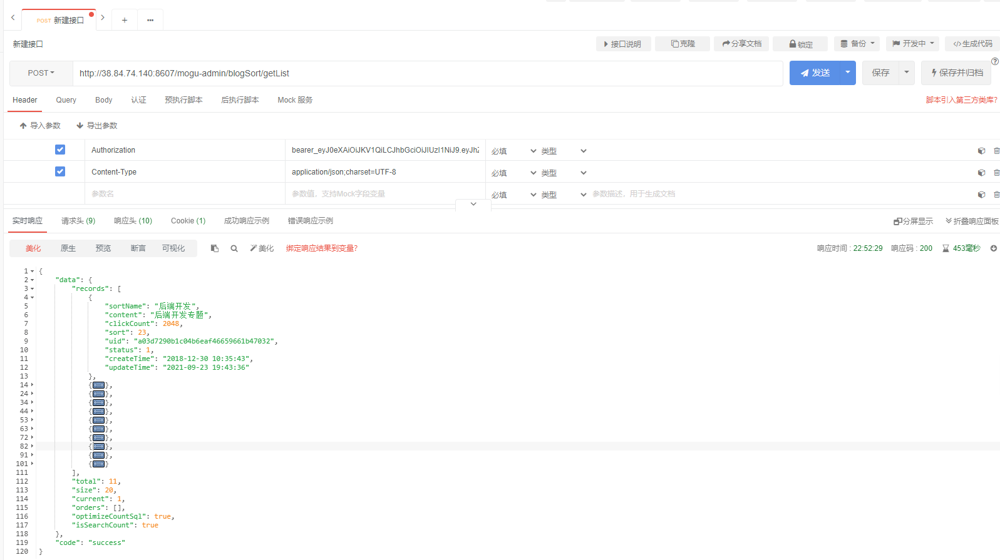

没有对比就没有伤害，在看看 **Postman** 的输出，陌溪每次只能把结果复制出来，然后打开 **Json** 在线格式化，才能够看到返回的结果，简直增加了额外的负担。

> Json格式化：https://www.sojson.com/

### 全局参数

同时，还有一个让陌溪非常喜欢的点，就是 **全局参数**。

在上面的示例中，我们需要给接口填写对应的鉴权请求头，才能够请求后台获得数据。

但在实际项目中，对于一批接口需要测试的时候，往往每个接口都需要填写**相同的鉴权请求头**，这样过程会非常繁琐。如果使用 ApiPost的话，我们可以利用全局参数或者目录参数实现。

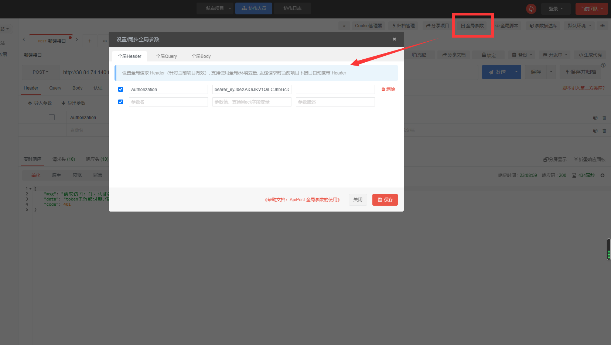

配置完成后，以后添加的接口，再次请求后台时，就会携带全局定义的请求头过去。同理，还支持全局的 **Query** 以及 **Body**，可以把一些不变的请求参数都配置好全局参数，这样会让我们编写接口请求时，省下很多时间~

### 目录参数

同时，我们还可以创建不同的目录，用来区分项目接口所处的不同模块。例如：以蘑菇博客为例，可以创建两个目录 **mogu-admin** 和 **mogu-web**，分别代表蘑菇博客的后端管理与门户项目。

因为，后台管理和门户是有两套鉴权逻辑的，即上面提到的全局配置token就不能针对两个场景生效了！

那如果我还想同时测试 门户类相关接口，或者是后台管理相关接口，那怎么办呢？

这个时候就需要用到目录参数了，它的作用和全局参数雷同，只是作用域不一样，**mogu-admin** 目录下的接口不会使用同级的 mogu-web 目录的目录参数作为发送参数。

通过对不同的目录，配置不同的全局参数，即可完美的解决刚刚的场景。

同时，当全局参数、目录参数、接口中都使用了同一个参数时，最终会按照以下优先级读取参数值：

> 单个接口 > 目录参数 > 全局参数

如上面的示例，如果全局参数、目录参数、接口中都定义了header参数token：

> 全局参数：token值为：698d51a19d8a121ce581499d7b701668 // 最低优先级
> 目录参数：token值为：b50e345cc9febd86dedecc551ebcc505 // 其次优先级
> 单接口参数：token值为：a1a9db893bb8a28ccb665d2af54d9417 // 最高优先级

那么最终发送的 **token** 值为：a1a9db893bb8a28ccb665d2af54d9417

## 接口文档快速生成

点击分享文档，即可获取对应的文档链接

复制并打开文档地址就可以看到了完整的接口文档。

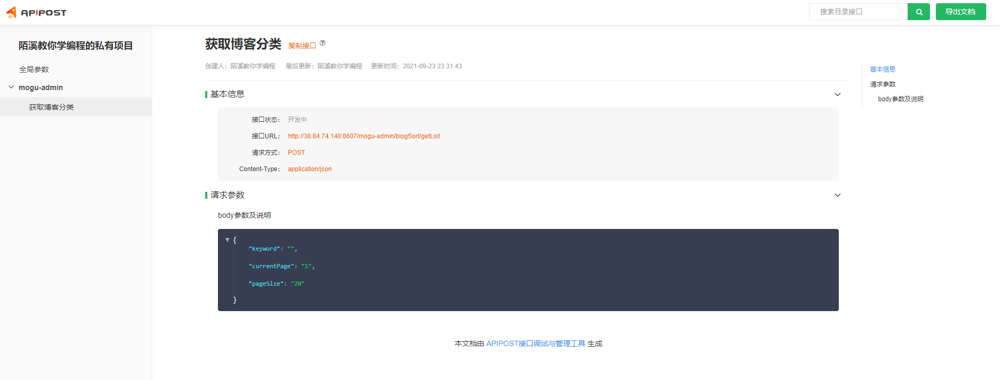

细心的小伙伴可能会发现，这个请求参数上没有相关字段的介绍，我们回到刚刚的 **ApiPost** 页面，点击 **提取字段和描述**，然后填入对应的字段名称。

然后重新发布，即可看到每个字段的含义了

有更细心的小伙伴，可能又会发现，这里为啥缺了点返回值呢？那是因为APIPOST不会把发送后的实时响应的数据作为响应示例。这个时候，需要手动的将实时响应结果导入或者复制到对应的成功响应示例和错误响应示例。

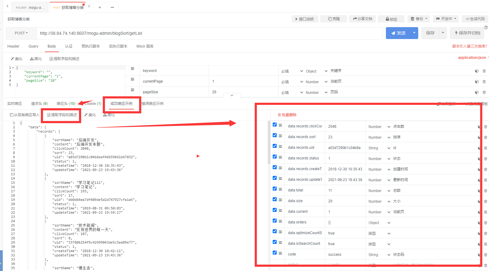

然后重新生成文档，这个时候，就会包含我们的成功示例啦。

同时还有对应的返回值字段描述

通过这个方法，可以随时随地的测试以及更新文档，简直是后端小伙伴的福音~

但是，不知道小伙伴们有没有发现一个问题，就是在生成接口文档的时候，还是需要自己填写参数描述。

填写参数描述是我们最烦恼的一件事情，尤其对于很多接口来说，往往具有大量相同名称、相同意义的参数，假如每次都需要手动录入，将会是一件非常耗时、低效的事情。

这个时候，我们可以通过 **ApiPost** 参数描述库解决这个问题，通过自定义参数描述库，我们可以将本项目用到的大量参数进行预注释。

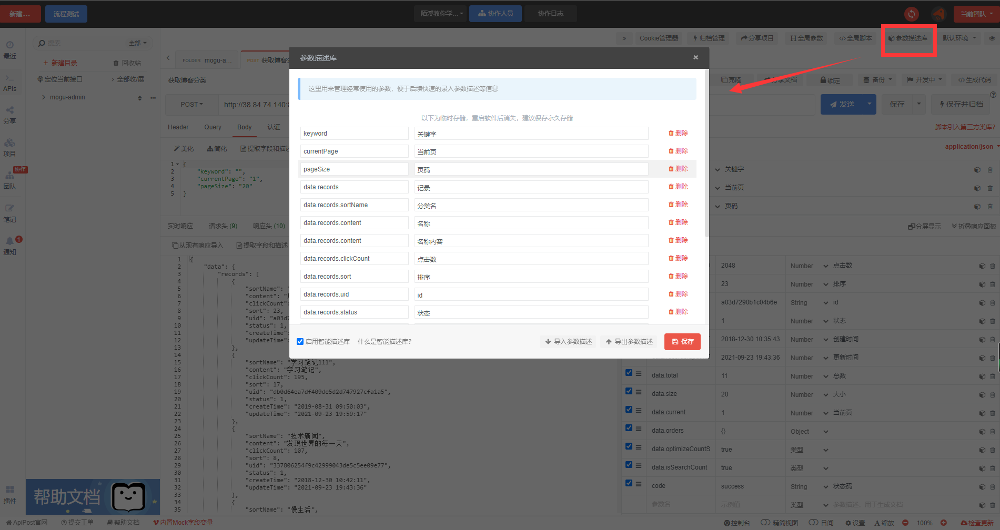

并且，我们在填写完某个描述后，会自动同步到 **参数描述库**，以后如果匹配到了相同的名称，会自动生成对应的描述，简直是一劳永逸的方法。

## Mock工具

我们都知道，在后端接口还没有开发完成的时候，接口是无法获取数据的，那么前端小伙伴就需要通过 **Mock** 事先编写好 **API** 的数据生成规则，由工具动态生成 **API** 的返回数据。通过访问 Mock 来获得页面所需要的数据，就可以轻松地完成对接工作。前后端人员只需要定义好接口文档就可以开始并行工作，互不影响，只在最后的联调阶段往来密切。

**ApiPost** 可以让你在没有后端程序的情况下能真实地返回接口数据，我们可以用 ApiPost 实现项目初期纯前端的效果演示，也可以用 **ApiPost** 实现开发中的数据模拟从而实现前后端分离。

同时，**ApiPost** 支持参数直接引用 **mock.js** 变量，点击下方可以查看 **内置Mock字段变量** 有哪些

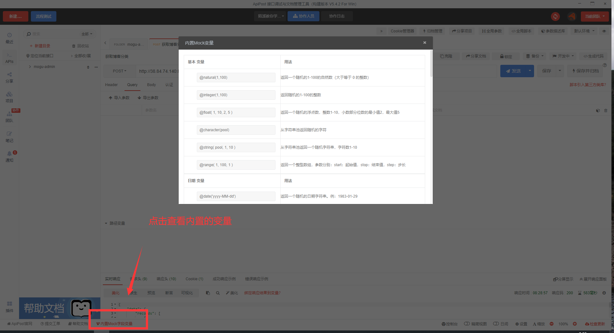

目前常用的内置变量有以下几种：

- **@guid()**：随机生成一个GUID，例：DEfbBBBf-7A23-a4DB-9BB1-57BCFf5FB5fc
- **@integer(1,100)**：随机生成一个 **1 ~100** 的整数

- **@datetime('yyyy-MM-dd HH:mm:ss')**：返回一个随机的日期和时间字符串。例：**1977-11-17 03:50:15**
- **@url('http')**：生成随机一个 **http URL**
- **@email()**：生成一个随机 **email** 邮箱
- **@province()**：随机生成一个中国省份（或直辖市、自治区、特别行政区）
- **@city()**：随机生成一个中国城市
- **@title()**：随机生成一个标题
- **@cname()**：随机生成一个中文名称
- **@cparagraph(**)：随机生成一段中文文本

下面我们利用这些常见的 **Mock** 变量，来生成一个 **Mock** 服务吧。

首先点击 **Mock服务**，然后编辑 **Mock模板**，右侧即可看到我们实时生成的 **Mock数据** 了

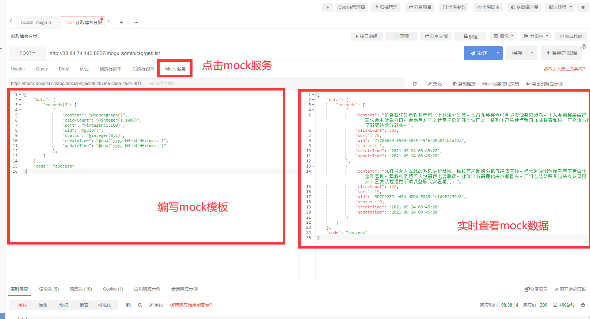

在点击上方的 **复制链接** ，即可把这个接口的 **mock** 请求交给前端小伙伴了，然后各种进行合作开发。

## 测试流程

流程测试是针对一个接口集合的测试，选择相应的环境，可以作为一系列请求一起运行。当您想要自动化API测试时，流程测试非常有用。点击开始，接口集合会并发的像服务器发出请求，最后会按照定义好的测试校验模块给出测试结果。对于**测试同学**来说，这是一个非常不错的功能。

在 ApiPost 中，创建一个流程测试需要如下步骤：

- 新建接口，并添加断言
- 打开流程测试，新建一个流程
- 向流程添加测试接口
- 选择环境，点击开始测试
- 查看返回的测试接口

流程测试界面如下图：

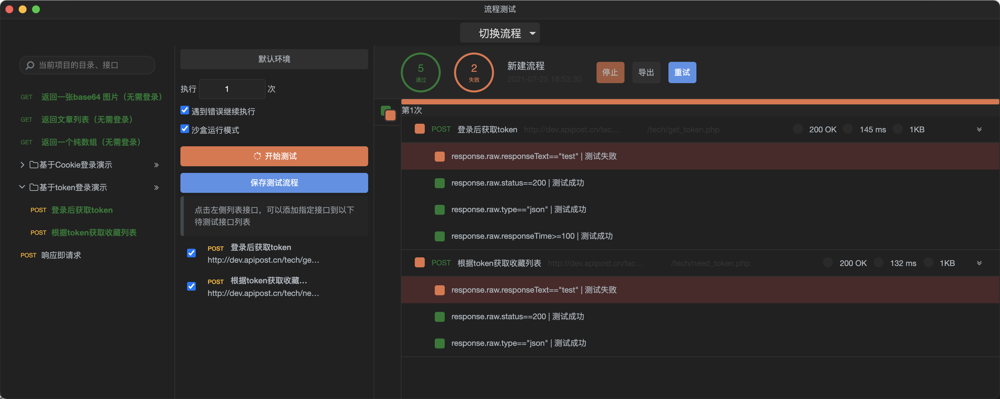

通过点击接口名称查看请求的请求和响应参数信息

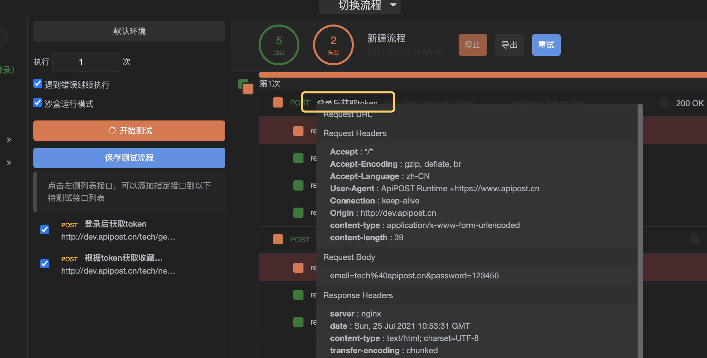

同时在 **ApiPost** 中，还提供了很多内置函数，例如我们很轻松的就可以对某个变量进行解密处理。

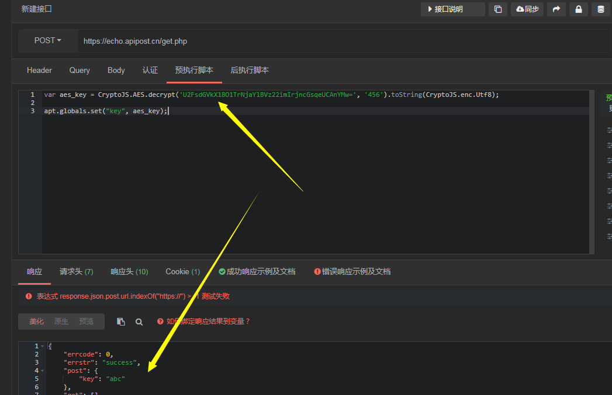

更多关于 **ApiPost** 的功能，还等待小伙伴去发现。好啦，本期就到这里啦。

我是陌溪，我们下次再见~

往期推荐
----

*   [蘑菇博客从0到2000Star，分享我的Java自学路线图](https://mp.weixin.qq.com/s/3u6OOYkpj4_ecMzfMqKJRw)
*   [从三本院校到斩获字节跳动后端研发Offer-讲述我的故事](https://mp.weixin.qq.com/s/c4rR_aWpmNNFGn-mZBLWYg)
*   [万字长文带你学习ElasticSearch](https://mp.weixin.qq.com/s/9eh6rK2aZHRiBpf5bRae9g)
*   [双非本科，折戟成沙铁未销，九面字节终上岸！](https://mp.weixin.qq.com/s/SRf2f8wFFyjz2BUUXD_pmg)
*   [如何使用一条命令完成蘑菇博客的部署？](https://mp.weixin.qq.com/s/LgRIqdPAGzN1tCPMi0Y8RQ)
*   [为什么你们制作镜像只有5MB，而我却200MB？](https://mp.weixin.qq.com/s/iWpivtTAKMPKT6gq_3nwaA)
*   [字节二面：蘑菇博客是怎么解决缓存穿透的?](https://mp.weixin.qq.com/s/JNnL6sTySXL9ta5p0rjjXg)
*   [还在用破解IDEA？陌溪手把手教如何申请正版](https://mp.weixin.qq.com/s/mZjoSjk0QqeKFxPbFySomg)
*   [32图，教你部署一个博客小程序](https://mp.weixin.qq.com/s/hFfsDPBdBpaLjXV8Bm5Ycg)

结语
--

博主就职于字节跳动商业化部门，一直在维护校招笔记仓库 **LearningNote**「在Gitee上已有 **3.9k+ star**，仓库地址：https://gitee.com/moxi159753/LearningNotes」，公众号上的文章也会在此同步更新，欢迎各位小伙伴一起交流学习，回复 「**PDF**」获取PDF笔记，点击查看原文可以**在线阅读**。

同时，想要丰富项目经验的小伙伴，可以参考我维护的开源微服务博客项目： **蘑菇博客**「 **Gitee** 官方推荐项目，博客类搜索排名**第一**，在 **Gitee** 已有 **3.6K** star，仓库地址：https://gitee.com/moxi159753/mogu_blog_v2 」。

本公众号**申请较晚**，暂时没有开通**留言**功能，欢迎小伙伴们添加我的私人微信 **coder_moxi**【备注：**加群**】，我将邀请你加入到**蘑菇博客交流群**中，欢迎小伙伴们找陌溪一块聊天唠嗑，共同学习进步。最后，如果你觉得本文对你有所帮助，麻烦小伙伴们动动手指给文章点个「**赞**」和「**在看**」，非常感谢大家的支持。

