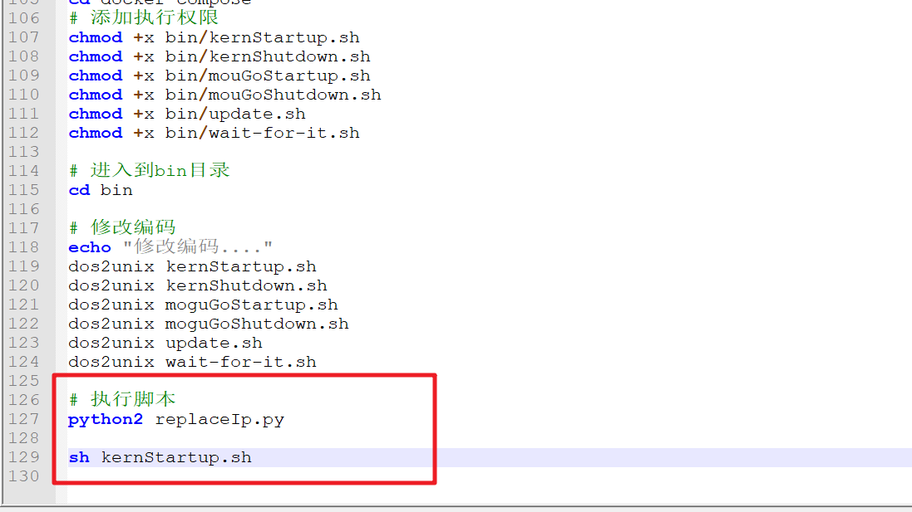
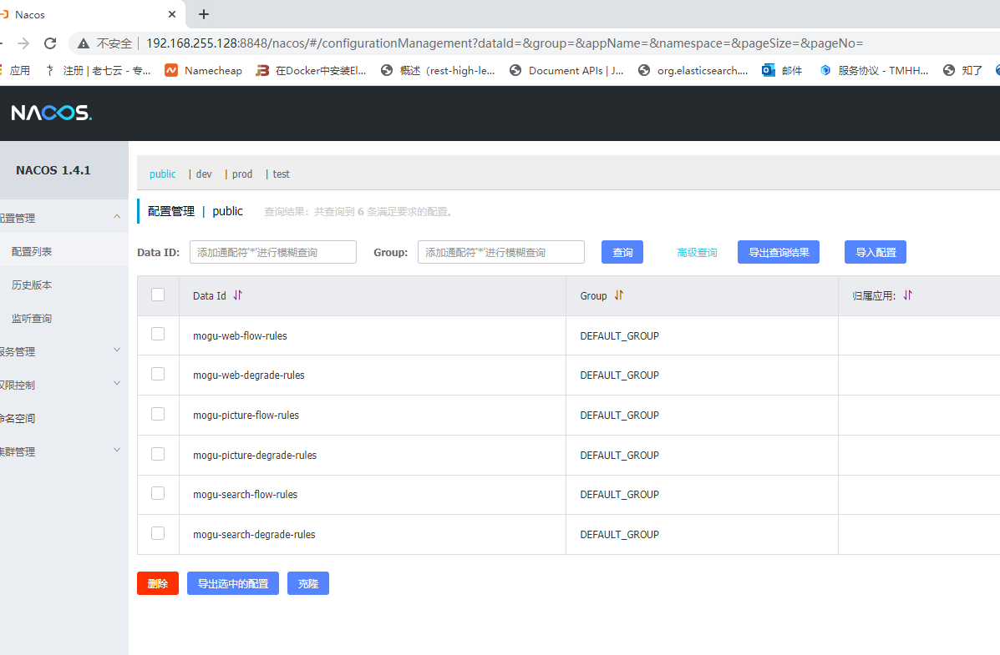
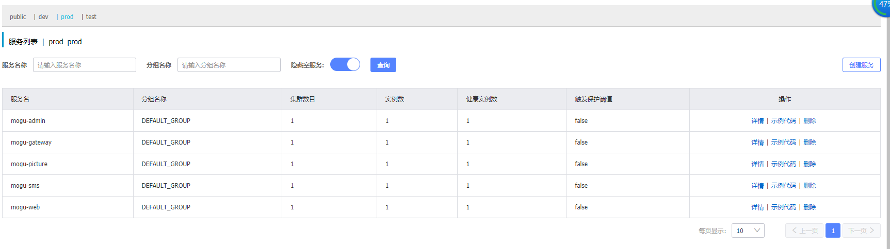
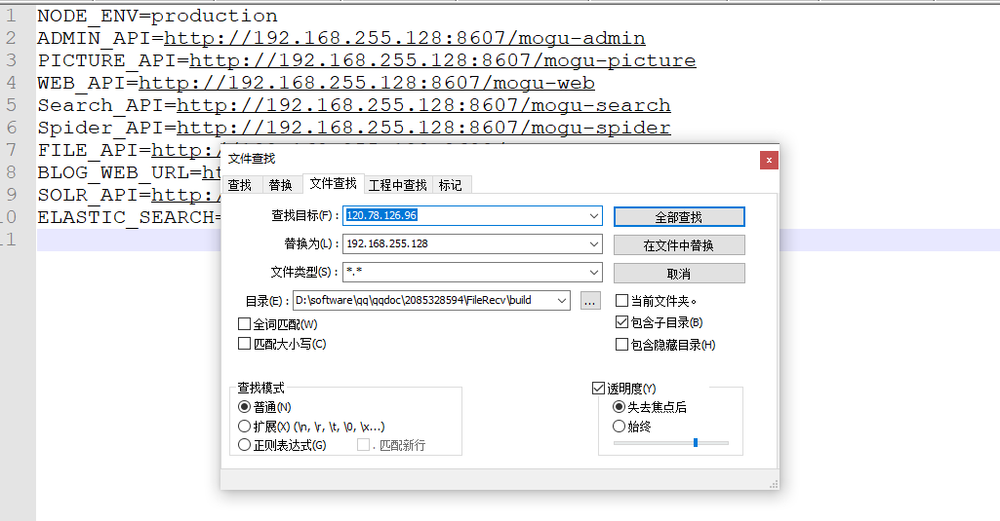

大家好，我是**陌溪**

宝塔是一个简单好用的服务器运维面板，最近在蘑菇博客的交流群里，见到很多小伙伴想让我出一份**宝塔**安装 **蘑菇博客** 的文档教程。说实话，陌溪是一直没有使用过 **宝塔面板** 的，一方面是觉得 **宝塔** 是 **PHP** 时代的产物，适合于之前的单机架构，同时宝塔本身在运行的时候也会耗费内存，容易让本不富裕的内存资源雪上加霜（最重要的是命令行这么香，为啥不用它）。 


不过其实也有很多小伙伴也玩过宝塔面板，并且在上面已经部署过其它的站点，然后又想要在上面部署 **蘑菇博客**。这个时候小伙伴跑来咨询陌溪，这样有问题么？

陌溪的回答，当然是，很有问题！


毕竟蘑菇博客需要安装 **MySQL**、**Redis**、**Nginx**，而这些新安装的软件和原来的都会有端口号冲突，如果要一起部署的话，就得做一些修改了。

下面我们一起来看看，如何在一台新机器上安装宝塔面板，然后部署蘑菇呢。

## 安装宝塔面板

宝塔的官网上 www.bt.cn 提供了一键部署脚本，只需要执行如下命令，即可在 **CentOS** 系统上进行安装。

```BASH
yum install -y wget && wget -O install.sh http://download.bt.cn/install/install_6.0.sh && sh install.sh
```

命令执行完成后，即会输出对应的面板地址，包括了账号和密码


访问后，即可打开宝塔的使用面板，同时还会提示你是否需要安装对应的软件。


如果是已经使用过宝塔搭建过站点的小伙伴，里面肯定已经包含了 **MySQL**、**Redis**、**Nginx**，这个时候如果在执行蘑菇博客**一键部署脚本**，就会有冲突了，下面让我们一起来看看蘑菇群里的大佬是怎么解决冲突的，以下是 **@泪梦红尘** 在改造宝塔部署蘑菇时的一些改动，让我们一起来康康吧。

## 感言

大家好，我是泪梦红尘，第一次看见蘑菇到现在一年有余，因为一些原因到现在我也没有一个基于蘑菇上线的网站，最近就想着直接抱 [蘑菇博客](http://www.moguit.cn/) 的大腿在上面发布文章（陌溪给了他一个蘑菇博客超管账号），于是就根据其他小伙伴的问题，将以前写的关于蘑菇的笔记整理了一下。

还记得，我第一次搭建蘑菇时只有一台 **2C4G** 的服务器，当时服务器上面用的是宝塔面板，跑着两个 **PHP** 的网站，为了让二者共存当时就修改了一下各自的端口，后来又发现其他小伙伴，遇到了相似的问题于是就将这篇文章整理了出来，帮助大家一起完成蘑菇博客的宝塔部署。

## 蘑菇博客与宝塔共存

关于蘑菇博客如何与宝塔面板共存，是有多种方案的，比较容易实现的有以下两种：

- 第一种：修改宝塔或者蘑菇博客两者冲突的端口，缺点就是无论你修改那个，都需要做相应的更改。
- 第二种：将两者冲突的合并起来，其实冲突的无非就是 **Nginx 80** 端口，**MySQL 3306** 端口，那蘑菇和宝塔这两个都用宝塔的不就好了。

## 将宝塔与蘑菇冲突部分进行合并

下面，先捋一下蘑菇与宝塔冲突的都有哪些服务

- 首先蘑菇 **vue\_mogu\_web** 的 **80** 端口

- 其次蘑菇 **vue\_mogu\_admin** 的 **80** 端口
- 然后蘑菇上传目录需要迁移到宝塔的 **nginx** 目录下
- 最后就是蘑菇的 **MySQL** 采用宝塔的 **MySQL** 服务

下面就是将以上服务由原来的 **Docker** 迁移到宝塔上面去，**192.168.255.128** 现在已经安装了宝塔


并且已经在这台服务器上，已经成功部署过一个 **WordPress** 站点（相信很多小伙伴装宝塔也是为了装这个~）


然后我们去找一下蘑菇一键部署的脚本，并将其做下修改

```bash
# 此命令是下载 moguInit.sh然后赋予其权限立即执行
# 我们只让他下载然后修改脚本后手动执行
wget http://oss.moguit.cn/script/moguInit.sh && chmod +x moguInit.sh && sh moguInit.sh
#修改后
wget http://oss.moguit.cn/script/moguInit.sh && chmod +x moguInit.sh 
```
这是下载 下来的 **moguInit.sh** 的部分脚本，我们将框起来的两行干掉，然后在执行一下脚本即可

- 其中 **python2 replaceIp.py** 是更换 **ip** 的脚本
- **sh kernStartup.sh** 是执行部署的脚本 此脚本后期需要做下更改



将红框的内容删除后，重新执行脚本，完成环境的搭建

```bash
sh moguInit.sh 
```

**moguInit.sh** 脚本执行之后，我们需要更改一下 **nacos** 配置，以及在宝塔中创建 **nacos\_config** 数据库

在码云上面拉下来蘑菇源码后，会有一个 **doc** 目录里面可以找到蘑菇博客数据库脚本，将如图三个脚本导入到宝塔的 MySQL 数据库中。


然后在修改 **nacos** 配置文件目录  **/root/docker-compose/yaml/nacos/nacos-config.env** ，修改对应的配置信息，主要修改的是数据库的 **ip** 地址，以及对应的账号和密码

```
# 修改后nacos-config.env配置
PREFER_HOST_MODE=hostname
MODE=standalone
SPRING_DATASOURCE_PLATFORM=mysql
## 对应数据库ip
MYSQL_SERVICE_HOST=192.168.255.128
## 对应数据库名字
MYSQL_SERVICE_DB_NAME=nacos_config
MYSQL_SERVICE_DB_PARAM="characterEncoding=utf8&connectTimeout=1000&socketTimeout=3000&autoReconnect=true&useSSL=false"
## 数据库端口
MYSQL_SERVICE_PORT=3306
## 数据库用户名
MYSQL_SERVICE_USER=nacos_config
## 数据库密码
MYSQL_SERVICE_PASSWORD=eRCTiazkWPyxd2Mx
JVM_XMS=256m
JVM_XMX=256m
JVM_XMN=256m
NACOS_AUTH_ENABLE=true
NACOS_AUTH_USER_AGENT_AUTH_WHITE_ENABLE=false
NACOS_AUTH_IDENTITY_KEY=mogu2018
NACOS_AUTH_IDENTITY_VALUE=mogu2018
```
注意做完这一步需要去宝塔防火墙开放 **3306** 端口和蘑菇所需要的端口，**nacos_config** 数据库访问权限也需要放行**docker** 容器 **ip** 或者 **直接开放所有端口**

最后，执行nacos 启动命令

```nacos
docker-compose -f ../yaml/nacos.yml up -d
```


  启动成功后，访问 nacos的图形化页面 http://ip:8848/nacos

接下来我们去宝塔导入蘑菇数据库脚本

- 分别创建 **mogu\_blog**  和 **mogu\_picture** 两个数据库，并将 **doc** 目录下脚本进行导入
- 需要注意下**访问权限** 改为**所有人**或者开放 **docker** 容器的 **IP** ，否则 **docker** 会访问不到数据库。


下一步，去 **nacos** 中修改配置将对应数据库密码修改下。


将所有服务配置进项检查修改，主要修改的是里面的 **mysql** 账号和密码

然后就是将 **mogu_picture** 上传图片的目录进行下修改


进入 **/root/docker-compose/yaml** ，修改 **mogu_picture.yml**

```
version: '3'
services:
  #授权服务
  mogu_picture:
    image: registry.cn-shenzhen.aliyuncs.com/mogublog/mogu_picture:latest
    container_name: mogu_picture
    restart: always
    ports:
      - 8602:8602
    networks:
      - mogu
    environment:
      - COMPOSE_PROJECT_NAME=mogu_picture
    volumes:
      - ../log/:/logs/
      - ../config/mogu_picture/:/config/    
      ## 映射目录修改为宝塔目录
      - /www/wwwroot/mogu_picture.cn/:/home/mogu_blog/mogu_data/
networks:
  mogu:
    external: true
```
然后我们进到 **/root/docker-compose/bin** 目录修改 **kernStartup.sh** 脚本，干掉 **MySQL** 及**vue_mogu_web**, **vue_mogu_admin** 和 **nacos** 

```
#!/usr/bin/env bash
echo '=====nacos正在进行初始化,请等待...====='
./wait-for-it.sh localhost:8848 --timeout=60  -- echo "=====nacos已经准备就绪====="
echo '=====开始运行rabbitmq====='
docker-compose -f ../yaml/rabbitmq.yml up -d
echo '=====开始运行redis====='
docker-compose -f ../yaml/redis.yml up -d
echo '=====开始部署mogu_data====='
docker-compose -f ../yaml/mogu_data.yml up -d
echo '======================'
echo '=====开始运行后台====='
echo '======================'

echo '=====开始运行mogu_gateway====='
docker-compose -f ../yaml/mogu_gateway.yml up -d

echo '=====开始运行mogu_admin====='
docker-compose -f ../yaml/mogu_admin.yml up -d

echo '=====开始运行mogu_picture====='
docker-compose -f ../yaml/mogu_picture.yml up -d

echo '=====开始运行mogu_sms====='
docker-compose -f ../yaml/mogu_sms.yml up -d

echo '=====开始运行mogu_web====='
docker-compose -f ../yaml/mogu_web.yml up -d

echo '执行完成 日志目录: ./log'

echo '================================================================='
echo '=====【微服务启动需要耗费一定时间，请到Nacos中查看启动情况】====='
echo '================================================================='
```


  ​    执行脚本后去 **nacos** 检查下服务是否都已经正常启动



当后台服务都已经正常启动后，需要去将前台页面进行打包了，打包后交给宝塔 **nginx** 管理就大功告成了

- 将蘑菇博客从码云上拉下来

- 分别在 **vue\_mogu\_admin** 和 **vue\_mogu\_web** 目录下执行 **npm install** （本机需要装 **nodejs** ）

- 分别替换 **vue\_mogu\_admin**  和  **vue\_mogu\_web **中的 **.env** 文件的 **ip** 地址



- 分别在 **vue\_mogu\_admin** 和 **vue\_mogu\_web** 目录下执行 **npm run build** 进行打包

- 最后将打包后 **dist** 目录上传到宝塔中


打开测试，能够正常访问，前端没有图片 去后台系统配置哪里，将图片改为 **picture** 绑定的域名即可


通过方式后端地址，也能够成功访问


到此 蘑菇博客就与宝塔共存，当然还有其他的方案，比如改下 **nginx** 端口 **MySQL** 端口，或者直接在宝塔中运行蘑菇，但是我感觉这种是比较容易维护且对其他项目侵入都比较小的。

最后，认识蘑菇博客也有一年多了，各种搭建方式也都有过尝试，自认坑都踩的差不多了，有其他小伙伴有蘑菇方面的问题，欢迎过来蘑菇交流群中，找我进行交流。