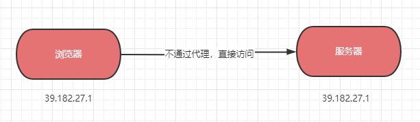
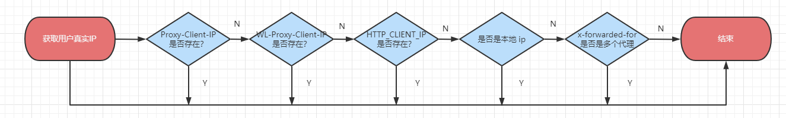

大家好，我是**陌溪**。

今天登录蘑菇博客后台，想查看一下国庆几天蘑菇博客的用户访问情况，然后一看，今日访问 **IP** 数 **1** 个！


不会吧，国庆竟然没有人访问蘑菇博客？说好的国庆一起在家卷，结果小伙伴们都出去玩了么？抱着对这个数据质疑的态度，陌溪找到了 **PV** 和 **UV** 的显示面板


结果发现，从 **9** 月 **28** 号以后的 **IP** 数就一直为 **1** 个，但是访问量却还是正常的，按道理这个访问量应该不可能都是**1** 个用户产生的。同时查看用户访问记录，发现该 **ip** 地址都是自己云服务器的地址。


抱着排查错误的想法，陌溪定位了以下几个可能出错的场景

- 获取 **IP** 的接口出错
- **Nginx** 出现问题
- 云服务器故障

## 故障排查

客户端的请求信息都包含在 **HttpServletRequest** 中，同时客户端访问服务器一般分为两种情况

- 客户端不经过代理，直接连接服务器
- 客户端经过多级代理，最终到达服务器

若客户端不经过代理，直接连接服务器，可以通过 **getRemoteAddr()** 方法获取该客户端的 **IP**。



若客户端经过多级代理（如 **nginx**），最终到达服务器，此时通过  **getRemoteAddr()** 方法是无法该客户端的 **IP**，只能获取到代理服务器的 IP 地址了。

此时，被 **nginx** 代理后，会通过 **x-forwarded-for** 把浏览器的真实 **ip** 地址以及代理服务器的 **ip** 地址记录下来。当客户端请求被转发的时候，IP将会被追加到 **x-forwarded-for** 字段的后面，并通过逗号进行隔开。


因此，当通过 **getRemoteAddr()** 获取到 **ip** 地址的时候，会获取到最近的一个 **nginx** 地址，即 **39.198.27.3**，而非用户的真实浏览器 **ip** 地址 **39.182.27.1**。

若想获取到用户的真实 ip 地址，这个时候就需要解析**HttpServletRequest** 中 **x-forwarded-for**  字段的内容了。上面提到了，客户端经过转发，IP 将追加到其后，以逗号进行隔开。因此只需要把第一个逗号之前的 **ip** 地址获取出来，即可找到用户的真实 ip 地址了。

```java
String ipAddress = request.getHeader("x-forwarded-for");
if (ipAddress != null && ipAddress.length() > 15) {
    if (ipAddress.indexOf(",") > 0) {
        ipAddress = ipAddress.substring(0, ipAddress.indexOf(","));
    }
}
```

完整的获取用户真实 **ip** 流程图如下所示



首先是判断 **Request** 的请求头 **Proxy-Client-IP** 、**WL-Proxy-Client-IP** 以及 **HTTP_CLIENT_IP** 字段是否携带了用户的真实 **ip** 地址，若没有的话，在判断请求地址是否来源于本地，最后在从  **x-forwarded-for** 中解析出正式的 **ip** 地址。获取用户真实 ip 的方法如下：

```java
    public static String getIpAddr(HttpServletRequest request) {
        String ipAddress = request.getHeader("x-forwarded-for");
        if (ipAddress == null || ipAddress.length() == 0 || "unknown".equalsIgnoreCase(ipAddress)) {
            ipAddress = request.getHeader("Proxy-Client-IP");
            return ipAddress;
        }
        if (ipAddress == null || ipAddress.length() == 0 || "unknown".equalsIgnoreCase(ipAddress)) {
            ipAddress = request.getHeader("WL-Proxy-Client-IP");
            return ipAddress;
        }
        if (ipAddress == null || ipAddress.length() == 0 || "unknown".equalsIgnoreCase(ipAddress)) {
            ipAddress = request.getHeader("HTTP_CLIENT_IP");
            return ipAddress;
        }
        if (ipAddress == null || ipAddress.length() == 0 || "unknown".equalsIgnoreCase(ipAddress)) {
            ipAddress = request.getRemoteAddr();
            if (ipAddress.equals("127.0.0.1") || ipAddress.equals("0:0:0:0:0:0:0:1")) {
                //根据网卡取本机配置的IP
                InetAddress inet = null;
                try {
                    inet = InetAddress.getLocalHost();
                } catch (UnknownHostException e) {
                    e.printStackTrace();
                }
                ipAddress = inet.getHostAddress();
                return ipAddress;
            }
        }
        //对于通过多个代理的情况，第一个IP为客户端真实IP,多个IP按照','分割
        if (ipAddress != null && ipAddress.length() > 15) {
            if (ipAddress.indexOf(",") > 0) {
                ipAddress = ipAddress.substring(0, ipAddress.indexOf(","));
                return ipAddress;
            }
        }
        return ipAddress;
    }
```

到这里，其实错误的问题就有些眉目了。首先获取 **ip** 的方法，是一直没有修改过的，因此不可能是代码问题，而造成 **ip** 获取异常的。陌溪回顾了一下 **9** 月 **28** 号左右发生的事情，发现我那会把蘑菇博客所有的页面都配置了域名的方式访问。


原来前端接口在请求后台的时候，是直接通过 ip 地址来访问的，修改后是通过域名访问。

```bash
# 修改前
http://39.182.27.4:8607/mogu-picture

# 修改后
http://gw.moguit.cn/mogu-picture
```

因为修改成了域名，就需要在 **nginx** 配置一下反向代理，请求到蘑菇博客的网关上。

```bash
server {
    listen       80;
    server_name  gw.moguit.cn;
    location / {
       proxy_pass   http://39.182.27.4:8607/;
    }
}
```

最开始，陌溪其实是没有发现有什么问题的，但是后面通过查阅资料发现 **nginx** 在配置反向代理的时候，若想获取用户真实 **ip**，需要设置请求头 **X-Real-IP** 和  **X-Forwarded-For**，修改后的配置如下所示：

```bash
server {
    listen       80;
    server_name  gw.moguit.cn;
    location / {
       proxy_pass   http://39.182.27.4:8607/;
       proxy_set_header Host $host;
       proxy_set_header X-Real-IP $remote_addr;
       proxy_set_header REMOTE-HOST $remote_addr;
       proxy_set_header X-Forwarded-For $proxy_add_x_forwarded_for;
    }
}
```

到这里其实就已经破案了，如果没有在 **nginx** 上配置对应的请求头的话，获取到的是最近的一个代理服务器 **nginx** 所在 **IP** 地址，也就是云服务器的地址。

修改配置后，等待一段时间再次查看，已经能够显示不同的 **ip** 地址了

好了，本期就到这里啦，我是陌溪，我们下期再见~


