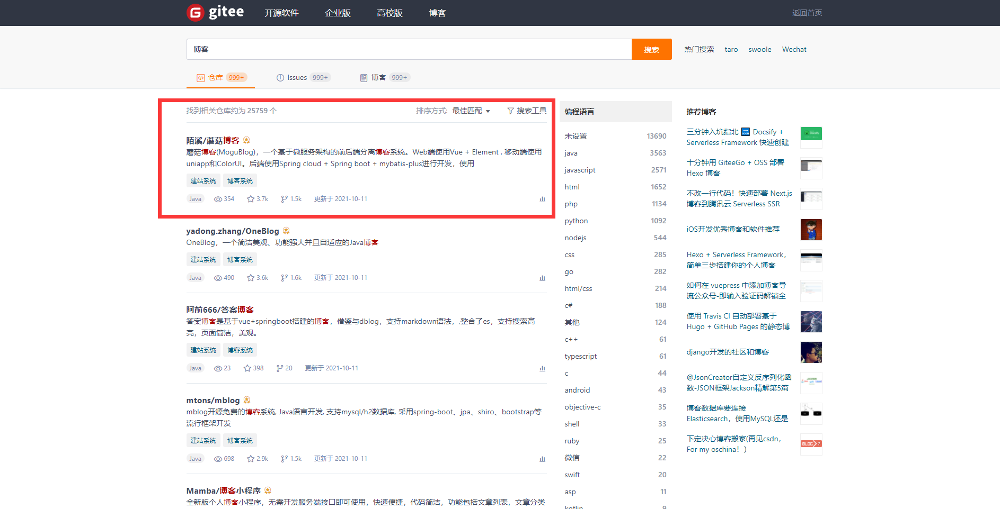
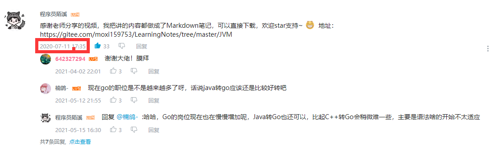

大家好，我是 **陌溪**。

今天给大家带来的是群里小伙伴的一份校招求职经历，我们都叫他 **小w**，也是最早进入蘑菇交流群到至今还在活跃的小伙伴之一。

在陌溪见过所有上岸大厂的小伙伴里面，**小w** 是比较特殊的一位。首先他没有光鲜亮丽的 **985** 和 **211** 的学校背景，仅有 **民办二本学历**，不难想象他想要在激烈的秋招中脱颖而出是多么困难的事情。

同时，**小w** 也是在我接触过的人里比较勤奋的一位，在最初的交谈中，陌溪得知他大三的时候， **Java** 就已经学完了**谷粒商城** 项目时候。在之前的文章里：[蘑菇博客从0到2000Star，分享我的Java自学路线图](https://mp.weixin.qq.com/s/3u6OOYkpj4_ecMzfMqKJRw) ，谷粒商城是 **Java** 学习路线图的最后一个项目，也是最难掌握的，需要学习很多前置的知识，在那之前陌溪还没有听到过有那个大三的小伙伴就已经学完了。

**小w**是我们在蘑菇群里一步步看着成长的，在**2021年7月9号** 秋招提前批才刚开始的时候。小w找到我，让我帮他看看简历，我第一眼看过去，内容特别的空洞，只罗列了大量的技术栈以及一个项目。


那会我就建议他多写几个项目经验上去，因为本身如何学校背景不好的话，简历上的项目又不丰富，那么很容易连简历关都过不去，更别说进入到面试环节大展身手了。


和 **小w** 的沟通中，其实也了解到他学过很多东西，例如 **谷粒商城**、康师傅的**JVM**、周阳的 **JUC** 等等。。，所以只需要把自己最真实的实力展示出来就 **OK** 了，所以陌溪就和 **小w** 一块从简历上的个人信息到专业技能，再到最后项目经历全部经过了修改，足足经过了五次的迭代。


下面一起来看看，在经过我们的多轮迭代后，**小w**的简历有哪些变化吧~

修改前，**小w** 简历上仅有一个项目，并且在陈述的时候也过于口语化，个人技能仅仅只是一些罗列，缺乏数据的支撑，最后简历页数也仅有简单简单的一页。陌溪刚接触到的时候，说实话感觉很可能企业的简历关都过不了。


在经过五次的迭代后，最终版的简历是下面这样的

首先是专业技能这块，不再是简简单单的对某个技能写了解或者熟悉，而是加入的很多支撑数据，这些数据随便每个展开都可以和面试官进行对线。

但是这也要求小伙伴们能够对简历上提到的内容了如指掌，而不是直接抄作业，因为面试官可能会对简历上提到的每个知识点进行提问，若简历上提到的某个数据没有掌握的话，会让面试官对你的简历产生质疑。


在项目经验这块，我让 **小w** 把自己熟悉和学过的项目都总结出来，同时完善了项目的介绍、技术栈和项目的内容，同时也给项目上加入了数据支撑，以及项目中的技术难点。


除了商城类项目外，另外两个项目分别是：短信平台和博客项目，也都按照上面的风格来写的

同时，这里我也鼓励小伙伴们，如果有搭建个人博客的话，最好能够购买云服务器然后上线，并且能够持续的在上面写一些文章，最后在把域名写到自己的简历上，这在简历上也是非常加分的，**小w** 在最开始是没有个人博客的，后面和我交流了一下后，用 **hexo** 搭建了一套个人博客系统，并在上面输出了 **30** 多篇的文章。


当然，博客类的项目除了 **hexo** 外，陌溪当然安利一下我开源的蘑菇博客

> 蘑菇博客：https://gitee.com/moxi159753/mogu_blog_v2

通过蘑菇博客快速搭建一套博客系统，并且除了能够写博客外，还能学习蘑菇博客的技术栈，为自己的简历加分，并且博客中提供了丰富的文档，帮助小伙伴们快速上手项目~


**小w** 和陌溪一样本科是一个普通的院校，但是 **小w** 的自学能力值得我们学习，通过制定明确的进大厂目标，并通过自己的努力一步步实现，最终成功上岸大厂！收获了让自己满意的 **Offer**。

下面让我们来看看 **小w** 的个人经历吧，希望对同处于迷途中的小伙伴有所帮助~

## 关于我

我就读于湖南省内的一个 **民办双非二本**，软件工程专业，**2022** 届的本科生，经过不断的努力下，最终还是抓住了秋招的尾巴，在**10月**的时候拿到了最想去的大厂 - **字节跳动** 的 **Offer**。

同时除了刚刚拿到的字节跳动 **Offer** 外，手上有的 **Offer** 有 **绿盟科技**、**去哪儿旅行**、**滴滴出行** 的 **Offer**。

我与陌溪结缘起始于 **Gitee** 上的一次寻找博客项目，那会通过 **Gitee** 的搜索功能，输入 **博客** 关键字，找到的第一个就是蘑菇博客，那会看到蘑菇博客的技术栈也是最新的，并且里面的技术大部分都学习过，可以说非常符合自己的口味。



也就通过 **README** 加入了 陌溪的**蘑菇交流群**，并且天天在群里水群和交流技术经验，直到收到 **字节Offer** 的时候很高兴的和群友一起分享了一下。最后，**陌溪学长** 也建议我写一篇关于我自己的学习和面试经历，也能够对一些同样的双非本科的同学，在求职和学习方面有一些参考和帮助，相信自己，有梦想终会成功！

## 大学生活

大学期间，因为我的自驱力可以，所以早早就有自学的想法。因为我高中就读的职业中专的计算机专业，因此接触计算机的时间比大家都早，原本就打算这么混下去的，高中毕业就出去找份小公司的编程工作，那时候从来没奢望过能进去**字节跳动**、**阿里巴巴**、**腾讯**这样的大厂工作。

中专的班主任人很好，时常说一些鼓励我们的话。因此读中专的 **三年** 我也没有虚度光阴，前两年认真的打好基础，在高三的时候也是奋发读书，并且通过对口升学考到了一个本科学校，虽然是一所 **民办的本科院校**，但是对我来说已经很不错了。

因为**民办院校**的学费都超贵，每年需要 **2~3** 万，并且我家里条件不是太好（我姐姐之前也是这样，选择了读**专科**，因为政策有补贴，所以学费更便宜）。

考虑到学费会增加家里的负担，于是就找爸妈商量，但是爸妈还是非常的鼓励我去这所学校读的。回过头了，我也非常庆幸父母的支持，因为如果没有这份 **本科学历** ，我可能连这些公司的门槛都达不到，更别说有面试机会了。

大学的时候也经常性的想努力学习，但是我只能说动力不大吧，总是断断续续的学，状态也不是非常好。直到疫情期间，一直在家无聊，就又对学习编程提起了兴趣，就从那开始持续性的进行学习的。

> 陌溪在疫情期间也是在持续充电中，如果小伙伴在刷B站学习的时候，看到陌溪的评论，记得点点赞哟
>
> 
>
> 
>
> 

在大学期间也参加过一些比赛，虽然能够在学校内获得一些奖项，但是让我去参加省内的比赛的时候我一般都拒绝了，我自己认为不想花费那么多时间在比赛上，我更愿意花时间学习自己想学的东西，但是经过秋招后，我发现比赛经历真的挺有用处的，尤其是像我这种双非本科的情况下，实习和比赛经历就是弥补学历不足的地方，所以能够去参加一些比较就一定要考虑去参加啊，尤其是算法类的比赛，在投递简历的情况下，首先都需要经过做笔试，是需要做算法题的，并且大部分的大厂在面试的时候也是会出算法题的。尤其是字节跳动更为看重算法。

> 在这里陌溪也建议大家在学校期间，多多参加一些必赛，这些必赛不仅能够帮助小伙伴拿到学校的教学金，同时也能够丰富大家的简历，为以后找工作做好铺垫，常见的一些必赛有：
>
> - ACM国际大学生程序设计竞赛
> - 华为软件精英挑战赛&华为杯
> - 百度之星程序设计大赛
> - “中国软件杯”大学生软件设计大赛
> - 蓝桥杯大赛
>
> 就拿华为软件精英挑战赛而言，陌溪的小伙伴之前就有人拿到了名次，直接获得华为的面试直通车，最终收获华为的Offer，年薪30W+。

## 校招投递

原本我的学习的话是按照培训机构的学习路线进行学习的，学习到了一定的程度就开始选择学习如何完整的做一个项目，然后选定 **个人博客系统**，所以在这时候了解到了 **陌溪** 的 **蘑菇博客**，并且通过在群里的一些了解，也知道了一些关于招聘的信息，并且也认识了挺多志同道合的小伙伴一起准备秋招。

因为我学校是**民办二本**，能去互联网公司工作的人不多，而且大家基本上没有秋招的这个概念，以为的秋招就是：公司来学校招聘的时候去应聘。所以我也很幸运，提前了解到了这方面的知识，打破了以往的认知偏差。同时，也通过更加进一步的了解找到了知乎和牛客网，并且从牛客网中得到了更多的关于秋招和面试的知识。

原本的 **秋招** 大家都说 **金九银十**，但是现在在我看来不是，早在 **7** 月份的时候就有部分大厂已经开启了提前批面试，比如字节跳动，我也去进行了尝试投递，但是其实我那时候准备的还不充分，并且之前简历写的一塌糊涂，所以直接简历就挂了。

在后续的 **8**、**9**月份，大部分的公司秋招正式批也都开启了，我也投了非常多的公司，我估计应该有 **80** 家公司吧，但是基本上都是投了之后就没有消息了，部分通知我笔试的，在我笔试后也是没有消息了，我自认为笔试做的都还不错，但是可能是因为 **简历** 的问题吧：没有**实习经历**，没有**比赛经历**，还是 **民办二本**，没有任何**竞争优势**。

在那个时候就在不断的寻找资料完善自己的简历，并且通过投递一些小公司，积累面试的经验，在最开始的时候愿意给我面试机会的大厂应该就是百度和腾讯了，百度的话进行了**两轮面试** 后挂掉了，因为算法题没有撕出来，后续又被捞起来继续面了两轮，又来第二轮的时候算法没有 **A** 出来挂掉了。

后续又是腾讯的面试，面试了 **20** 分钟不到就结束了，不知道是因为我太菜了问不下去了还是因为刷 **KPI**。那时候我还是挺沮丧的，因为一个 **Offer** 都没有，并且几个大厂都已经错过了，阿里的话我在笔试的时候 **2** 道算法题 **A** 了 **0** 个，那时候我都没怎么准备就直接去做了，所以做的很差，所以还是需要做到一定的准备的情况下在进行投递简历，但是我认为不一定要准备到 **100%**，因为我不认为有人能做到 **100%** 的准备，只要自己能够觉得自己准备到了 **80%** 左右就可以开始尝试进行投递简历，进行面试了。

> 这里陌溪也建议小伙伴们算法题能够提前准备，优化刷剑指Offer和LeetCode热题

我在面试的过程中也会记录下**面试的题目**进行复盘，这样能够对自己不足的地方做到很好的补充，同时可以考虑去**牛客网**中查看别人的面经，若看到不会的地方，可以再去加深印象。同时，在面试一家公司之前可以去牛客网中找一找**相关的面经**，能够让你更了解面试的内容，就比如字节跳动会有很多的 **算法题**、**智力题**、**系统设计题**等。

同时对于每场面试，我都会用一个表格记录下面


## 收获果实

在投递秋招的岗位上屡屡碰壁，后面我就退而求其次，打算面试实习岗，因为实习岗相对简单些，并且通过实习转正也有很大概率获取秋招的**Offer**。

在 **8** 月份的时候，面试了 **滴滴出行** 和 **字节跳动** 的实习岗位，并且成功拿到了 **实习Offer**，但是公司要求立即到岗实习，并且我们学校大四还需要返校上**两个月课**才可以出去实习，所以无缘去进行实习了。

在拿到字节跳动 **实习Offer** 的时候，是特别开心的。但是因为实习在北京，也没办法过去。通过拿到这两份大厂的实习Offer，也让我在秋招之路上坚定信心了。


在 **8** 月中旬的时候拿到了**绿盟科技**的提前批 **Offer**，当时还是挺开心的因为 **Base** 就在我家的城市，但那个时候，还是非常想去 **字节跳动**，**8** 月份的时候字节跳动的正式批应该是开了的，但是我投递的两个流程也因为简历不过关被挂掉了。


然后之前面试的去哪儿网也收到了 **Offer**，这个时候心里也变得更加从容淡定，没有像之前这么焦虑了，开始着手准备自己想去的大厂。


在某一天下午，我在学习的时候接到了一个北京的电话，说那边是字节跳动的hr邀请我进行面试，我那时候想了一下，好像最近投了字节跳动的实习，我就问了一下是实习吗，然后她告诉我是正式批，然后就约了个时间就准备进行面试了，那时候我非常的激动，因为我投的简历都挂了，我还以为我这次秋招已经和字节无缘了呢。当时面试的部门是 **Base** 深圳的抖音/抖音火山版/直播/影像部门。

随后就是几轮面试，在第二轮面试的时候算法题没有撕出来，我做过，但是小细节上好像出了点问题，最后也还是没有撕出来，但是面试官跟我说思路是对的，并且前面答的也不错，就给我过了。然后就是最后一轮，第三面了，第三面算法也没有撕出来，所以就直接挂了，详细面经的话后续会给出。所以这次字节的面试流程就告一段落了，我认为该部门的hr人超好，在我挂了之后有询问我考不考虑同部门的客户端，但是我考虑再三还是拒绝了，考虑后续能否有其他部门捞我，并且不是很想去做客户端。

然后在不久后，还是比较想去字节跳动，所以有考虑通过实习转正的方式去进入字节跳动，所以又去联系了 HR，并且还是在晚上 **10** 点的时候，还是感到挺不好意思的，**HR** 随后就跟我打电话沟通了，说是可以的，并且跟我说明了一下情况。虽然最后因为部门不招聘实习生了没有去成，但是我认为跟hr的沟通是让我很愉快的。

在那个时候就已经 **9** 月份开学了，在去学校的过程中接到了一个北京来的电话，随后告诉我说是字节跳动杭州**系统架构部**的 **HR**，通知我进行笔试，虽然我比较胆怯字节跳动的笔试，但是我还是非常欣喜的，因为还有机会进入到字节跳动，怎么说也是一次机会是吧，随后就答应了，但是在笔试的时候发挥不佳，**4** 道题 **A** 了 **1.3** 左右，我以为就此就凉了，但是在两周后我又接到了该 **HR** 的电话，通知我笔试过了，跟我确认面试的时间，我当时真是高兴的不得了，随后就预约了时间，在一面结束后，我也收到了一些不幸的消息，就当时直接和面试流程断开了一段时间，随后预约了国庆后的面试，在三面的时候我自我认为是答的比较差的，但是最后 **HR** 还是通知我过了，随后就给我发了**意向书**，效率真的特别快，**9.26** 一面、**10.8**二面、**10.9**三面、**HR**面。**10.11**就给我发意向书了，到此我的秋招就结束了。


## 秋招的一些小建议

首先，有机会去实习的话一定要去实习，通过**实习转正** 是一个比 **秋招** 更容易进入公司的方法，在每年的 **3** 月份左右，各公司应该就会开始招聘 **暑假实习生**，我愿称之为 **提前提前批**，因为**暑假实习生**的 **转正率** 听说是非常高的。其次，如果有机会的话多**参加比赛**是很有必要的，因为这也会是你的一个优势。

### 算法题

如果想要投递大厂的话，这方面是非常重要的，我主要挂掉的几次面试都是因为算法题没有写出来导致的，因为考核算法题的话不像八股文一样可以速成，算法题的话是需要积累的，我的话大概是刷了 **300+**，**高频题** 的话基本都刷了 **3** 遍以上，其中最主要刷的题是**剑指offer**和 **leetcode热题hot100**，最好的话是都能够掌握。

在你面试一个公司之前可以去**codetop**上去看看该公司喜欢出一些什么题目，该网站会记录一些大厂出的题的频度，我每次面试之前都会去上面做一做高频题。

**codetop**地址： https://codetop.cc

> 胖飞哥，快过来把广告费结一下

### 基础知识

基础知识是非常重要的，通常一面的话，都会看你**基础知识**的 **深度** 和 **广度**，所以基础知识一定要打牢，基础不牢，地动山摇。我在字节跳动的面试中感受到了 **字节跳动** 不在意你使用什么语言，主要考察的是你对基础的一些掌握，如**操作系统**、**计算机网络**、**数据库**的知识。

以 **Java** 来说，基础知识包括：**JVM**，**JUC**，**Java集合**，包括其源码深究，语言特性。**中间件**：比如 **Redis**，**MQ**相关的原理知识，应用场景，这个通常会在问你项目的时候引申出来问。

### 学习路线

学习路线图我主要也是根据尚硅谷的课程来的，首先是打好 **Java** 基础


> 尚硅谷Java零基础入门教程）
>
> https://www.bilibili.com/video/BV1Kb411W75N

在这里狂吹一波康师傅，康师傅真的是我见过讲东西讲的特别细致，并且能够让我记得住的老师了，**JVM**康师傅好像是参考的深入理解Java虚拟机：JVM高级特性与最佳实践（第3版） 周志明。


>尚硅谷宋红康JVM全套教程
>
>https://www.bilibili.com/video/BV1PJ411n7xZ

**JUC** 是跟着周阳老师进行学习的，里面讲到了很多大厂的面试题


>尚硅谷Java大厂面试题第2季，面试必刷，跳槽大厂神器
>
>https://www.bilibili.com/video/BV18b411M7xz

关于操作系统的学习，推荐王道考研的B站课程


>王道计算机考研 操作系统
>
>https://www.bilibili.com/video/BV1YE411D7nH

计算机网络的话，同样也是推荐王道考研


>王道考研 计算机网络
>
>https://www.bilibili.com/video/BV19E411D78Q

同时，关于计算机网络的话，公众号 **小林coding** 的 **图解计算机网络** 也给了我很大的帮助，我认为是一个很不错的资料。

同时，在面试过程中有提到我学习的 **Netty** 框架，我认为 **Netty** 真的是一个很不错的组件，非常的优秀并且值得学习，而且好像大部分面试官对Netty也挺感兴趣的，我认为值得去学习一下。

这里我是学习的黑马程序员 **Netty** 全套教程


> 黑马程序员Netty全套教程，全网最全Netty深入浅出教程
>
> https://www.bilibili.com/video/BV1py4y1E7oA

### 项目

项目的话我主要写了三个，一个是尚硅谷的 **谷粒商城**，一个是 **聚合短信平台**，一个是 **个人博客系统**，在三个项目中面试官一般问的都是 **商城项目**，但是其实我在面试大厂的时候基本都没有问项目，可能是不太感兴趣，因为是自己做的，没有落地，并且商城项目基本上已经人手一个了，可以的话我推荐学习 **Netty** 后手写一个 **RPC** 组件，能够加强自己对 **Netty** 的熟悉度，并且我认为造轮子的项目面试官应该是能够感兴趣的。

同时，在面试的实习岗位和正式批的岗位侧重点不同 ，实习岗的话就是侧重于一些中间件的问题，而正式批的话就主要是计算机基础的问题。

接下来是我在秋招过程中的一些面经

## 百度面经

### 一面  62min

- 自我介绍？

- 项目相关？

- Redis分布式锁的实现？

- Mysql的锁？

- b是二级索引 这时候执行 **select * from table where b = 4 for update** 哪些地方会加锁？

- 如果 **select * from table where b = 3 for update** 呢？

| a    | b    | c    |
| ---- | ---- | ---- |
| *    | 2    | *    |
| *    | 4    | *    |
| *    | 6    | *    |
| *    | 8    | *    |

- 事务的隔离级别？

- 可重复读是怎么实现的？

- mvcc的实现？

- 线程池有了解吗？线程池的拒绝策略？

- 线程池的执行流程？

- 手撕代码 [剑指 Offer 68 - I. 二叉搜索树的最近公共祖先](https://leetcode-cn.com/problems/er-cha-sou-suo-shu-de-zui-jin-gong-gong-zu-xian-lcof)

- 提供思路 [剑指 Offer 35. 复杂链表的复制](https://leetcode-cn.com/problems/fu-za-lian-biao-de-fu-zhi-lcof)

### 二面 48min

- 自我介绍？

- 操作系统中的任务调度算法？

- MySQL支持事务的执行引擎？

- 事务的隔离级别？

- 为什么需要多个事务隔离级别？就只有一个隔离级别不可以吗？

- 手写双向链表？（我心里慌了写了20分钟！！！！）

- 类的加载机制？

- web服务器的加载机制？（不会）

- 双亲委派机制？

- 破坏双亲委派机制？

- 自定义类加载器后加载自定义的java.lang.String类后与原本jdk的String相同吗？（不相同，但是没有考虑到说类加载器不同）

- Thread执行run方法和start方法有什么区别？

- 介绍一下B+树，它的查询复杂度是多少？（二分查找O(logN)）

- O(logN)的N是什么？（答：高度。。。 面试官：当前这层的节点个数）

- 设计模式的观察者模式介绍一下？（发布订阅模式 使用场景可以是消息队列）

- 观察者模式解决了什么问题？（解耦、异步、削峰 就是消息队列的特性）

- 操作系统中进程和线程的区别？

- 进程和线程哪个是直接和操作系统打交道的？（我答的线程。。。 实际是进程 因为进程需要申请内存等资源）

- 你还有哪部分掌握的较好？（mysql锁机制、redis、rabbitmq）

- mysql的死锁怎么解决？（答：mysql的死锁机制）

- 减少锁的粒度？（答：mysql的优化策略）

- 又是没有反问环节的一次面试。。。

## 字节跳动面经

### base深圳 抖音部门

#### 一面 42min

- 自我介绍？

- 项目相关问题？（15min）

- TCP三次连接？

- Java中静态代码块有什么作用？

- 使用静态代码块实现单例模式？

- MySQL的InnoDB使用的是什么数据结构？

- MySQL的数据在b+树中是怎么存储的？

- InnoDB可以使用非聚簇索引吗？

- InnoDB为什么不使用红黑树作为数据结构呢？

- 红黑树的查询复杂度是多少？

- 算法题：二叉树的层次遍历？

- 这个代码的时间复杂度？

- 反问环节？（面试的部门？抖音后端开发 开发语言？ Go base？深圳）


#### 二面 48min

- 自我介绍？

- 静态内部类和非静态内部类的区别？

- 接口和抽象类的区别？

- Java中==和equals的区别？

- String 的equals是怎么实现的？

- String的hashcode是怎么实现的？

- 讲一下ArrayList和LinkedList的？

- 介绍一些安全的容器类？（介绍了一下CopyOnWriteArrayList）

- 线程的几种状态以及是如何切换的？

- Java的可重入锁有了解吗？

- 公平锁更适用于什么场景？

- 介绍一下Java的线程池？

- TCP三次握手和四次挥手？

- 算法题：[全排列](https://leetcode-cn.com/problems/permutations/)（没写出来。。。无语 结束后再ide里一写就写出来了 发现是本来写递归的结束条件写错了）

- 反问环节 


#### 三面 42min

- 自我介绍？

- 项目的架构和技术难点？

- 项目相关？

- 进程和线程的区别？

- 进程通信的方式？

- 进程线程的场景题？

- 虚拟内存逻辑地址转物理地址？

- 谈一下GC?

- GC的选择和jvm优化？

- SQL题：

- 《学生姓名得分表》中有四列，ID（学号/唯一key），name（可能重名），course（选课名，不同同学可能选择一样或不一样），score（0-100分，<60分算不及格），每一行放置的是某一位同学某一门课程的得分

- 求平均分不及格的学生姓名


算法题：

```bash
假设给予一个数组，其size已知已知数组内放置的是排好序的自然数（从小到大）问数组内是否存在一个数，其重复的次数超过数组长度的一半期望时间复杂度O(logn)

（例如100个数的一个数组，假如里面有一个数重复了超过50次，比如51次、55次、80次，那么返回True，否则返回False）
```

凉凉 两个题目都没写出来 算法题结束后得到思路就写出来了，期间面试官有提示我怎么写，但是我太慌了没听进去。希望代码方面可以提高

### base杭州 系统架构部门

#### 一面 59min

- 自我介绍？

- netty是什么？

- netty为什么性能高？

- netty监听到事件之后怎么通知线程的呢？

-  假设现在有一个基于netty的rpc进行调用进行了哪些操作呢？

- 在浏览器中发起一个http请求的过程？

- TCP的连接为什么是可靠的？

- TCP怎么保证传输的顺序？

- 在发送数据的时候seq码是1、2、3但是因为网络原因接收到的是3、2、1请问这个问题怎么解决？

- TCP和UDP有什么区别？

- UDP适用于什么场景？

- HTTP的post请求有什么结构？

- cookie是什么？

- cookie是怎么被带过去的呢？

- http请求头中有些什么？

- keep-alive是怎么做到的？

- TCP为什么要四次挥手？

- 操作系统在执行一个进程的时候需要分配哪一些资源？

- 操作系统的内存是怎么管理的呢？

- 段页式的话访问需要访问几次内存？

- 为什么会有段页式这样的管理方式？

- 为什么要用虚拟内存来进行管理？

- 进程在内存中的模型是什么样的？（程序段 存储执行的文件 数据段 存储执行时的数据 PCB）

- 现在用一个递归没设置结束条件会发生什么？

- 栈是一个什么样的概念？

- 内存管理中的栈是用来干什么的？

- JVM的内存模型？

- 声明了一个静态变量会存储在哪里？

- GC主要是在哪里工作？

- GC怎么找到需要回收的内存呢？

- 进程中有多个线程，这多个线程要怎么进行通信？

- volatile做了什么？

- 不保证原子性会出现什么问题？

- 锁是做了什么事情？

- 是怎么做到的？（答了synchronized 和 lock接口）

- synchronized加的锁是一个什么样的锁？

- synchronized的锁升级？

- 死锁是一个什么样的东西？

- 手写一个死锁案例？怎么避免死锁？

- 手写一个SQL？

- MySQL中的索引是什么？

- 跳表有了解过吗？时间复杂度是多少？

- B+树适合用来维护zset吗？

- 算法题：[4. 寻找两个正序数组的中位数](https://leetcode-cn.com/problems/median-of-two-sorted-arrays/)


首先这个算法题第一思路就是说创建一个temp数组 将两个数组的值添加到temp数组中 然后进行中位数的查找。我还把这道题和数据流中的中位数弄混了。。尴尬。。说出了两个优先级队列的解法。

#### 二面 60min

- 闲聊？

- redis集群情况下put一个key value会存储在哪里？

- redis集群怎么保证写的数据比较均匀？

- redis在put的时候什么情况下算写入成功了？ 1.主机写入内存了返回成功 2.主从复制完了返回成功 3.主从复制完了还需要持久化到磁盘返回成功

- redis的put操作是线程安全的吗？

- redis为什么要设计成单线程而不设计成多线程？

- es的脑裂是什么？

- mysql事务的级别有几种？

- 怎么保证不会出现幻读？

- 幻读诗怎么引起的？

- 串行化怎么保证不出现幻读的？

- b+树的高度有多高？

- 为什么设计这么高？

- 剑指 Offer 50. 第一个只出现一次的字符

- [128. 最长连续序列](https://leetcode-cn.com/problems/longest-consecutive-sequence)

- [365. 水壶问题](https://leetcode-cn.com/problems/water-and-jug-problem)

- 反问环节？


#### 三面 55min

- 自我介绍？

- netty比nio高效的地方在哪里？

- select，epoll有了解吗？

- nio在linux下用的什么多路复用技术？

- 程序设计题 多个图书馆的书 a = {100,50,90,180,70} M = 400 需要把400本书放入a中，希望能够分配完之后a比较均匀。


```bash
数学题

(x, y)

1 1 1 1 1 1 1 1

1 1 1 1 1 1 1 1

1 1 1 1 1 1 1 1

1 1 1 1 1 1 1 1

M = 4 N = 8
```

- 顺时针旋转遍历 如(0, 0) (0, 7) (3, 7)  (3, 0) (1, 0) (1,6) (2,6) (2, 1)

- 求关于MN的最后一个节点的坐标?

- java中gc有哪些算法?

- gc的线程特别多会出现什么状况？

- 垃圾回收的时候会出现page fault吗？

- 操作系统中的页表是用来做什么的？

- 进程之间的页表可以共享吗？

- 线程之间的页表可以共享吗？

- 线程局部数据怎么实现的？每一个线程怎么找到自己私有的数据？

- 系统调用是一个什么概念？

- 获取系统时间需要使用到系统调用吗？

- 操作系统的fork是做什么的？

- java中的forkjoin是什么？

- java中的fork是做什么的？

- java中的join是做什么的？

- 操作系统中的进程调度算法？

- 系统提交一个任务系统怎么知道需要执行多久等待多久？

- 在TCP中有一个数据包叫rst数据包，一般以哦你感到哪几种场景？

- 软件层的防火墙的原理是什么？

- TCP的滑动窗口是什么？

- 一般滑动窗口有什么算法？

- 操作系统有什么参数可以调整滑动窗口的大小？

- 反问环节？