大家好，我是 **陌溪** 

之前的文章 [陌溪终于有时间写代码了](https://mp.weixin.qq.com/s/bcTY1b9CzY-TDnCDNf8PzA) 有提到，陌溪是一个来自大山里的孩子。


记得小时候还有农忙节，大家在哪个时候就不用上课了，一起去给家里干农活，比如拔花生生、割稻子、摘木梓。

木梓树可能很多小伙伴都没见过，就是长下面这样的，通过它可以用来榨油（木梓油），记得小时候上学，我们去报名的时候，还需要给学校携带10斤大米，2斤木梓油才可以报名成功。


提到江西，大家的第一感觉就是 **彩礼贵**！但是抛开这层，我们这里还有很多比较有名的特色美食：赣南脐橙、南康甜柚、花生巴、南酸枣糕、兴国米线等等。。

而这阵子，刚好亲戚家的脐橙果园也成熟了。赣南脐橙是我们市的标志性特产，年产量达百万吨，并且脐橙种植面积世界第一，是全国最大的脐橙主产区。陌溪每次回家都会吃上好几十斤。

因为亲戚知道陌溪是学计算机的，想让我帮忙看看能不能搭建一个小程序，用来给顾客展示和销售脐橙（他们原来主要是通过微信销售），并且给陌溪也发来了很多果园的图片。


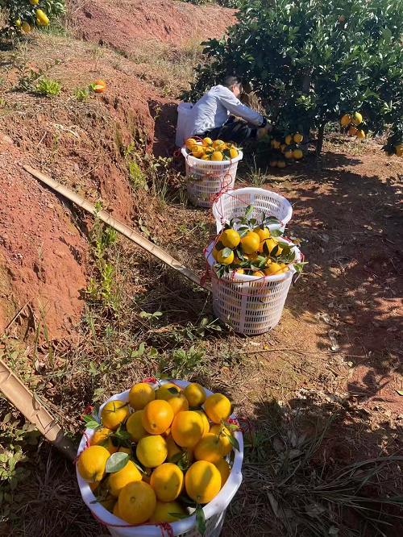


陌溪首先想到的就是 **Gitee** 上的一些比较热门的商城项目，比如   **yshop意象商城系统**

## 意象商城系统

**yshop**基于当前流行技术组合的前后端分离商城系统 **SpringBoot2**、**MybatisPlus**、**SpringSecurity**

**JWT**、**Redis**、**Vue** 的前后端分离的商城系统， 包含分类、sku、运费模板、素材库、小程序直播、拼团、砍价、商户管理、 秒杀、优惠券、积分、分销、会员、充值、多门店等功能，更适合企业或个人二次开发。

> 地址：https://gitee.com/guchengwuyue/yshopmall

主要包含以下功能

- 商品模块：商品添加、规格设置，商品上下架等
- 订单模块：下单、购物车、支付，发货、收货、评价、退款等
- 营销模块：积分、优惠券、分销、砍价、拼团、秒杀、多门店等
- 微信模块：自定义菜单、自动回复、微信授权、图文管理、模板消息推送
- 配置模块：各种配置
- 用户模块：登陆、注册、会员卡、充值等


小程序页面功能也很齐全


创建一个存储第三方软件服务Docker Compose文件目录：

```
mkdir -p /yshop/soft
```

然后在该目录下新建一个docker-compose.yml文件：

```
vim /yshop/soft/docker-compose.yml
```

接着创建上面docker-compose.yml里定义的挂载目录：

```
mkdir -p /yshop/mysql/data /yshop/redis/data /yshop/redis/conf
```

创建Redis配置文件redis.conf：

```
touch /yshop/redis/conf/redis.conf
```

docker 部署参考根目录docker文件夹

以上创建好之后参考docker下文件，先执行软件安装：

```
cd /yshop/soft
docker-compose up -d  启动
docker ps -a 查看镜像
```

运行docker/applicatiion目录下 docker-compose。当然之前一定要打包jar包，构建镜像 切换到Dockerfile 文件下：

```
docker build -t yshop-admin .  
```

虽然 **yshop** 搭建起来也不难，但是考虑到服务器成本，以及资金安全问题，以及还需要后续的维护，陌溪没有考虑使用这种方式。

首先是这个项目比较复杂，而如果只是单纯的想卖一些东西，也完全不需要使用这么多功能。同时，如果资金信息存储在自己服务器上，万一哪天服务器出现问题了，可是要找陌溪背锅的。

## 微信小商店

综合多方面因素考虑，陌溪发现了 **微信小商店** 就可以很好的满足亲戚的诉求。

> 微信小商店：https://shop.weixin.qq.com/

首先不需要开发成本，只需要简单的配置，就能拥有小商店的功能，特别适合没有开发能力的小商家使用。同时，自带了微信支付功能，并且数据信息都存储在微信服务器，从而无需担心资金和数据丢失问题。

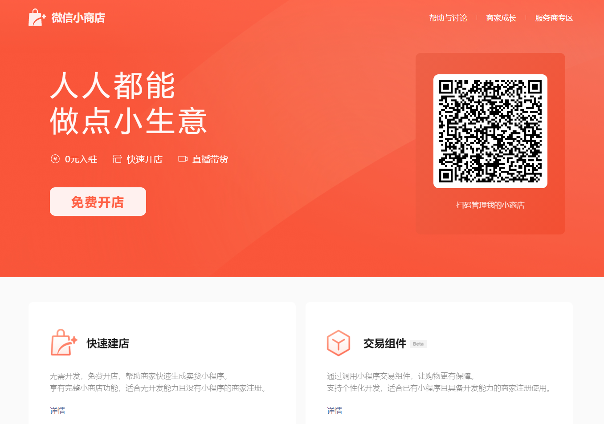

开始扫描网页上的二维码，会打开微信小商店的页面，然后创建类型选择 **个人**。

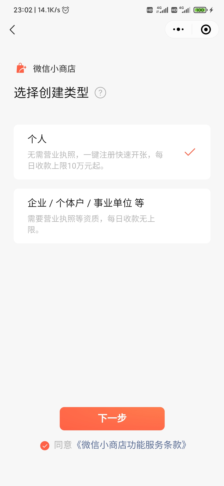

点击下一步，即可完成 **店铺** 的创建，不过如果想要上架商品，还需要上传身份证信息。


填写完信息后，点击提交即可进入到审核环节，过了一会时间都通过了审核，这里不得不给微信审核团队点赞

审核通过后，就可以进入到 微信小商店的功能界面了，在这里提供了非常多的功能，例如：商品列表、订单管理、配送管理、地址管理、以及店铺装修和轮播广告，简直就涵盖了小程序商店要用到的全部功能了。

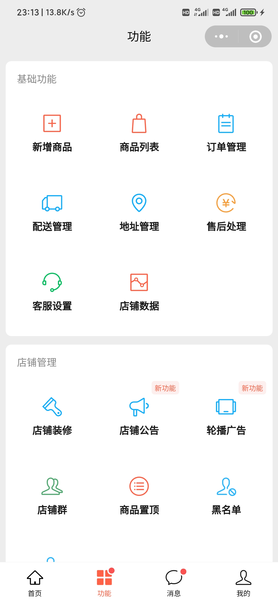

首先第一步，先上架商品，这里问亲戚要来了一些果园和脐橙的相关商品图片信息。

然后点击 **新增商品**，把图片信息进行上传，因为目前售卖的脐橙有 **10** 斤和 **20** 斤装，所以只需要创建两个规格即可，分别是 **10** 斤装 和 **20** 斤装的标准果。

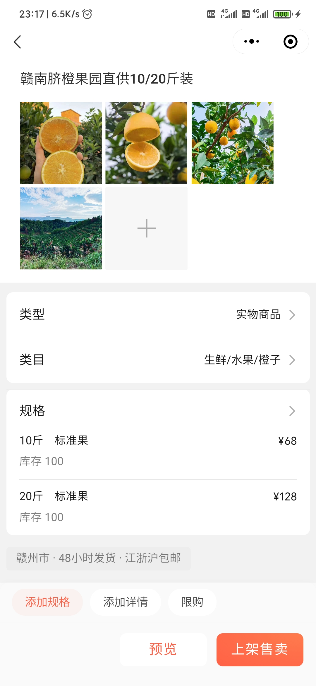

在配置好后，点击上架售卖即可。同时在提交上架的时候，也需要官方审核通过后才可以发布。

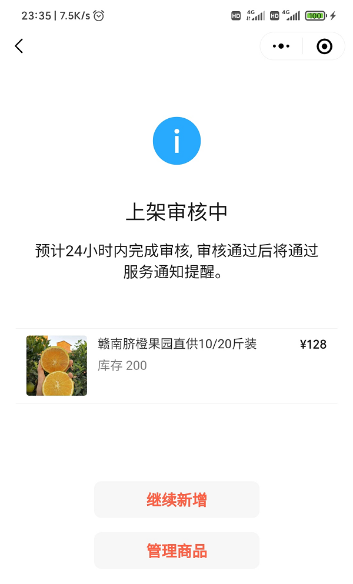

过了一会后，就通过了审核，然后点击商品信息，即可打开到商品详情页


点击 **买**，即可打开商品的规格信息进行选择，挑选好后，就可以开始编辑

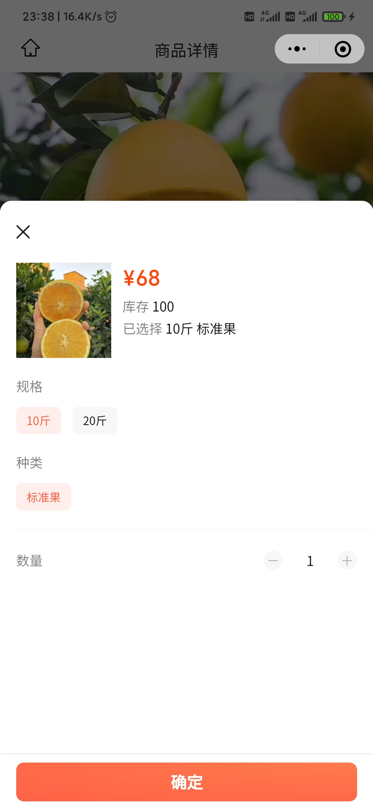

然后填写好收货信息，即可调用微信支付开始付款流程


付款完成后，点击 **我的** ，即可看到自己的下单信息了

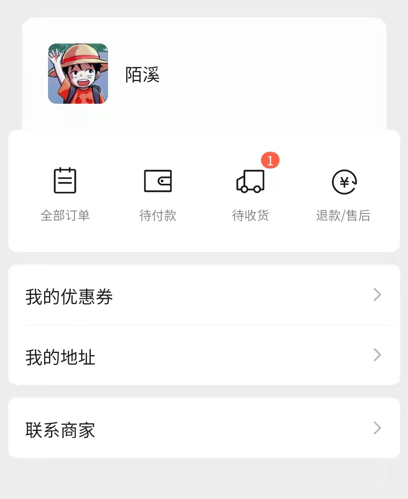

同时在微信小商品还提供了 **PC** 端页面，在这里可以编辑更多关于商店的信息

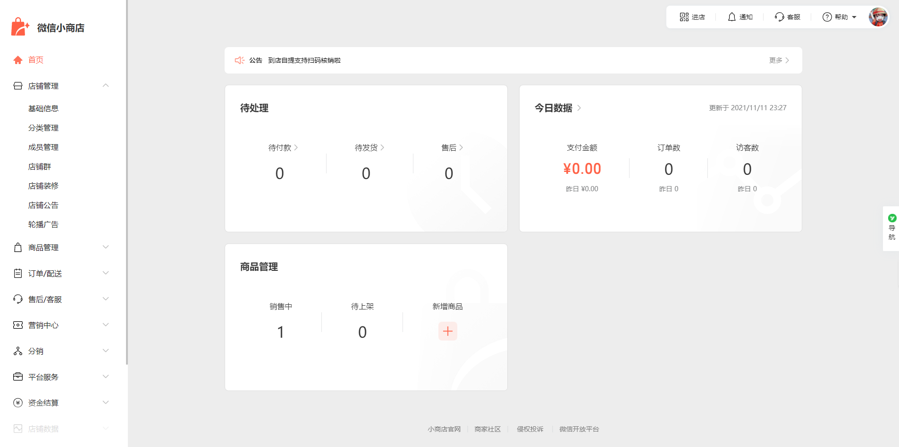

例如当有人购买商品后需要发货了，可以在生成订单信息和物流信息后，填写对应的物流模板，点击上传即可。

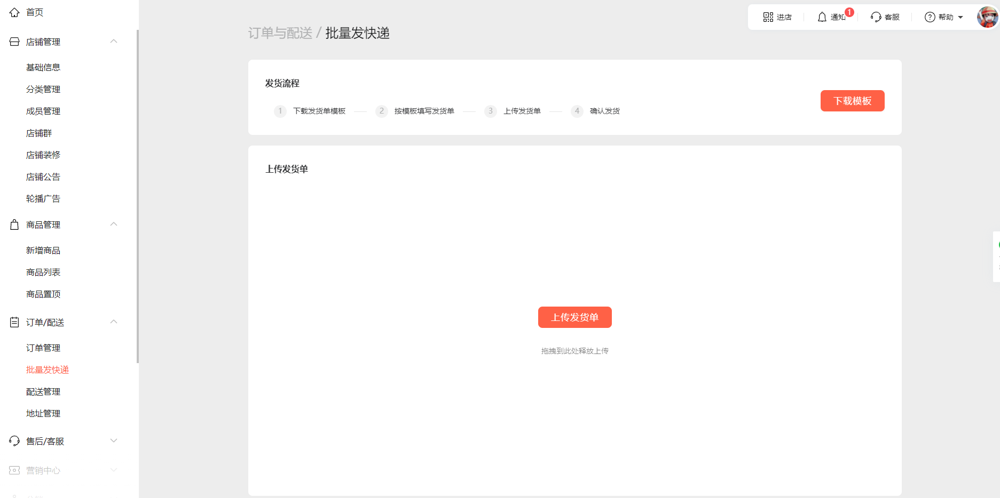

同时，亲戚还告诉我，他们家的脐橙都是发 **京东快递**，不同地区的快递费也不一样，并且相差还比较大，希望这个程序能够支持按不同地区来支持不同的快递费，并且一些偏远地区因为邮费太贵，所以不发货。

例如：针对 浙江省、江苏省、上海市、江西省、湖南省、湖北省、福建省、安徽省 和 广东省 这些比较近的省，可以免邮费，其它省份根据梯度来额外增加邮费。

通过微信小商店的后台，在 **配送管理**，可以选择不同的模板

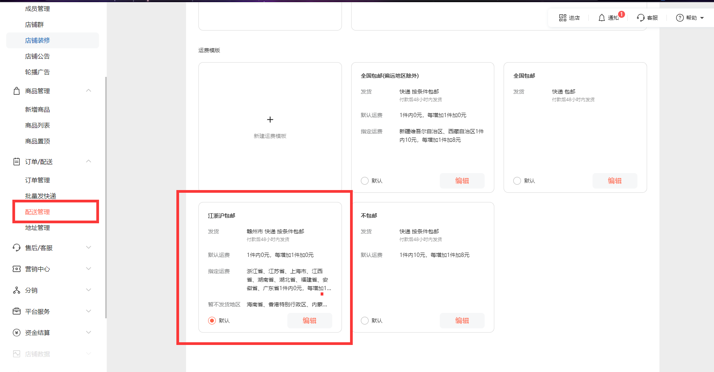

在配送模板中，可以根据不同的地区分别设置不同的邮费


最后，下面是最终小程序做成后的样子。

其实我们赣南的面积是比较大的，赣南下面还有18个县市，而赣南脐橙也有好多种类（虽然它们都叫赣南脐橙），比如 信丰脐橙；寻乌脐橙；安远脐橙。并且根据脐橙的大小，分为了精品果、标准果、小果等等，不同的规格会导致价格不同。

其中，信丰脐橙被称为 "橙中之王" ，果皮橙色、色泽鲜艳，是居家送礼必备~

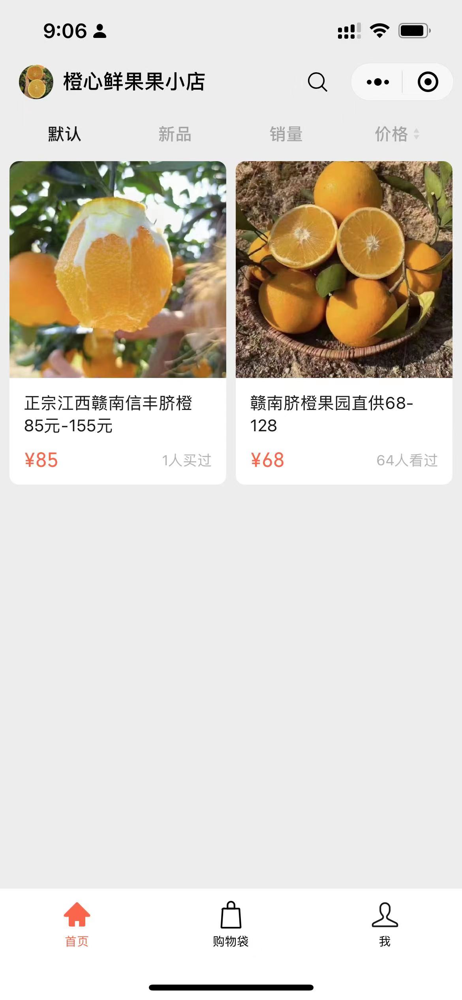

有想购买脐橙的小伙伴，也欢迎从陌溪亲戚的果园下单，配送是走京东快递，从果园采摘后直达手上


助力家乡农产品，从你我做起~

我是陌溪，我们下期再见~

