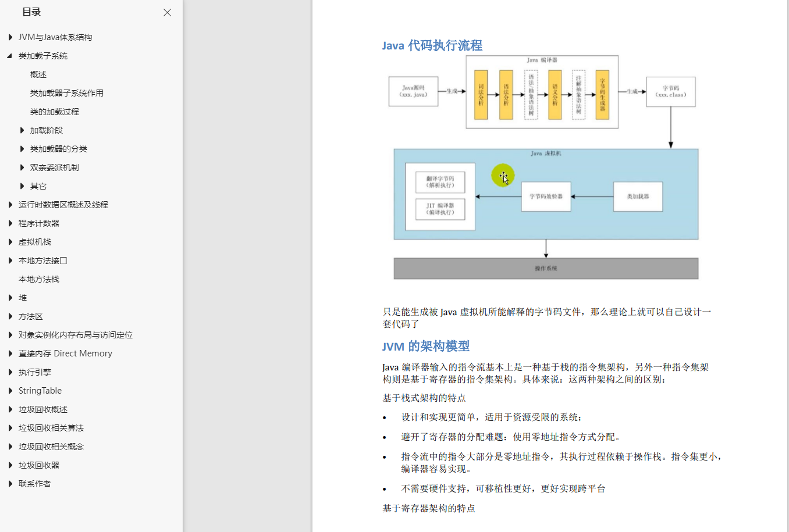
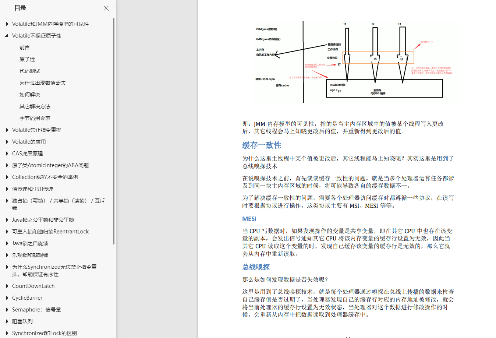
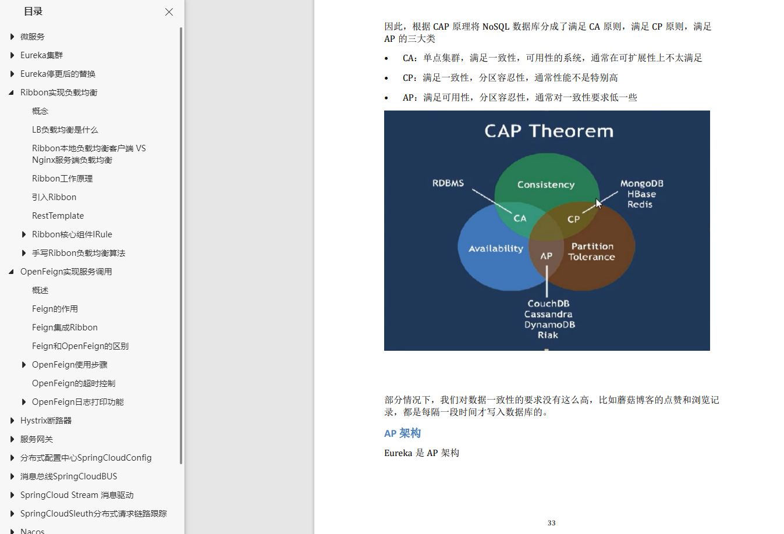

大家好，我是**陌溪**。

去年通过校招**提前批**成功上岸字节跳动，现在将我在准备面试的学习笔记都开源出来了，在 **Gitee** 上已经有 **4.3K** 的 **Star**。并且在未来也会不断的持续更新。

**Gitee** 开源地址：https://gitee.com/moxi159753/LearningNotes （建议 **Star** 收藏）

陌溪出身三本院校，也深知只有通过自己的不断努力才有机会上岸。在为了准备大厂校招面试，我准备了一年的时间，把学习的知识点都整理成了这份**学习笔记**，现在我把它制作成了 **PDF**，**免费分享给学弟和学妹们！**

有很多小伙伴顺利进入了 **BAT** 大厂，来找陌溪报喜。同时，在蘑菇群里还有**两位学弟**进入字节，一起做同事。

- [双非本科，折戟成沙铁未销，九面字节终上岸！](https://mp.weixin.qq.com/s/mE8AjQdQP8cgsWPVUbLBHA)
- [恭喜这位学弟！民办二本九面字节终上岸](https://mp.weixin.qq.com/s/mE8AjQdQP8cgsWPVUbLBHA)

笔记主要涵盖：**Java**，**MySQL**、**Redis**、**Spring**，**SpringCloud**，计算机网络，操作系统，数据结构，以及整理的**大厂面试题**。同时会记录平时一些学习和项目中遇到的问题。

**下载方式**：我把自己的原创笔记放在了自己的公众号上，大家可以扫码回复：**PDF** ，即可获得下载链接！

希望我的笔记能够帮助每一位想要进入大厂的小伙伴们，同时也希望各位学弟和学妹们，不要因为自己的出生不好就放弃了自己。

**愿一份付出都有收获，也希望每一个人的努力都能被看到！**

最后，在简单的展示一下，**PDF** 笔记里有哪些内容吧

**JVM学习**

**大厂面试突击**

**大厂面试宝典**

**微服务学习**

还有更多的笔记内容，就不列举出来了

**下载方式**：我把自己的原创笔记放在了自己的公众号上，大家可以扫码回复：**PDF** ，即可获得下载链接！

最后，希望在各位学弟学妹们，能够收获让自己满意的 **Offer**！