# 从三本院校到斩获字节跳动Offer-讲述我的故事

> 友情提示本文内容较长，都是干货，希望小伙伴能够耐心食用~文末有个人学习路线记录和笔记

## 前言

大家好，我是 **陌溪**。

我其实之前一直在写开源博客系统( **蘑菇博客** ) 和 开源学习笔记( **LearningNotes** )，内容大多数是学习或者做项目遇到的问题为主，这次打算写了一篇关于我的 **Java自学** 经历，希望对小伙伴有所收获。

因为我本科就读于北方某三本院校，和别人交谈的时候也不太愿意过多介绍关于自己本科的情况，想着英雄不问出处。不过后面想想，通过将自己的一些生活和学习经历分享出来，如果在某个阶段开始迷茫的小伙伴，也可以通过阅读我的经历，避免一些我走过的弯路，从而找到适合自己的路。

## 关于我

我本科就读于三本的独立学院，那会因为高考考得不好，说白了就是初中和高中阶段不爱学习导致的。

比如初中的时候，那会班级里流行用 **MP4**，我就用压岁钱给自己买了一个 **MP4** ，天天晚上蒙在被子里用它来看小说，有的时候看到小说高潮部分，基本上能看到凌晨四五点，掀开被子一看，都天亮了~。

在 **2013** 年 **7** 月的某一天，老爸打电话给我，他通过电话查询到了我的高考分数，其实和我当初高考估分的差不多，没有到二本线，还差 **10** 多分，所以如果想去读的话，只能选择一个三本院校了或者去再努力复读一年。

最后录取通知书出来了，我被挑选的一所三本院校录取了。不过专业都不是自己报考的**电气工程及自动化、工程造价、能源与动力**之类的，而是令我意想不到的**计算机科学与技术专业**。后面我也才了解到，我是被调剂到我们学院的计算机专业的，计算机专业在我们院属于比较垫底的专业，因为那会来计算机院的都是调剂生。

“选择拿着录取通知书去上学，还是再复读一年，你自己好好考虑一下”  这是老爸给我说的话，我琢磨了好久想想还是直接拿着通知书去了北方，那会可能想着去离家远的地方，越远越好。

## 初出茅庐

九月份，带着行李箱就开始了学校了，因为中途需要在北京转车，所以就在北京玩了两天。从北京西站下来后，我是第一次感受到了**大城市的繁华**，也默默想着**毕业后能够留在这里工作** 。

在北京，我和老爸去了北京天安门、故宫和长城，也第一次坐上了地铁。

最后辗转来到了我们的学校，老爸去参加学校组织的**家长见面会**后和我说：“我了解到你们学校可以转专业，你大一就好好学习，达到转专业要求后，申请转到电气专业”，我那会其实对所有专业是啥，没有太大的感觉，所以就答应了老爸。

后面就进入了大学生活了，大学的生活比高中生活更加轻松，不过我也没有放松自己。大一的时候还不能带电脑，所以老爸也没有给我配电脑，平时老师代码都是给我们在**PPT**上演示，那会也对编程产生了浓厚的兴趣，经常老师上课讲完的代码，会用小本子记录下来，然后跑去图书馆在一行一行的敲上去，那会乐此不疲。

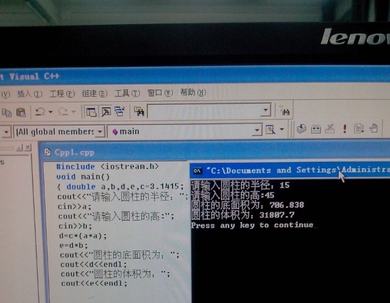

那会对于代码完全是不知所以然，不知道为什么要这么写，然后很多程序的**API** 和一些算法(冒泡排序，选择排序)基本上都是用小本本记起来，然后每天都看看。就这样的状态，很快大一的时间就过完了。

大二开始，我们开设了 **Java** 课程，通过学习 **Java**，我发现了原来编程不仅仅只是做出黑框框的，在命令行上运行的东西，它还能制作出 计算器，甚至是游戏(**JavaGui**)。

这里其实特别感谢**毕向东老师**讲解的 J**ava** 基础 ，那会视频资源特别匮乏，我有幸接触到了毕老师的视频教程，最后花费了大二一个学期才把 **Java** 基础视频学完(那会基本上一行一行的手敲)，后面又跟着传智播客的另外一门视频教程《 **Java** 贪吃蛇游戏》，我也是整整花费了 **1** 个月的时间，每一行代码都是跟着视频敲出来的。到最后游戏能运行的那一刻，我突然对编程有了更加浓厚的学习兴趣。

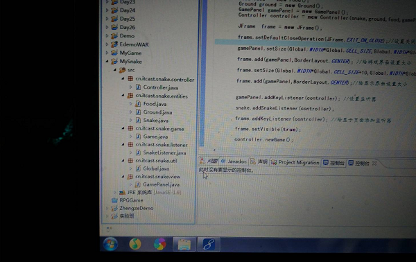

对了，为啥我没有去转专业去电气呢？因为大一的时候体测没有过，所以导致体育挂科了，最后无法满足学校转专业的要求，转专业要求必须满足成绩在前 **5** %，并且没有挂科。所以就被迫留在了计算机专业，然后就有了后面的故事，不然，陌溪可能毕业后就在**爬电线杆**了。

## 渐入佳境

大三的时候，我们开始了分班，就是选拔出一些人到卓越工程师班 ( **专注于编程实践** )，我和家里人商量了一下，说我准备去参加这个班级，因为我觉得在里面我能够学习到很多东西。。

当然去的条件也很苛刻，需要先通过编程考试，如果通过了初试，还需要进行复试，复试是自主选题，我做的就是跟着某马做的贪吃蛇小游戏。最后通过一系列的排名下来，我最终的成绩是**2/29**，组成了新的**29**人小班级。

在新的班级里，老师的要求比原来更严格了，在保证正常学习本科教学工作的基础上，同时增加了更多的实践性的课程，例如：**Java编程、HTML+CSS+JavaScript、C#编程、.NET编程、Android编程、嵌入式开发**

那会学习了很多不一样技术，我也很感谢老师那段时间的付出，因为每门课最后完成了，都需要制作一个案例，采取的是小组的形式，然后需要进行答辩讲解(从这个时候，我就明白了团队协作的重要性..)

- **Java** 课程：做的是一个超市采购系统( **Java GUI** 界面，整个国庆七天都在写它，没有出门)
- 前端课程：写的是一个播放器界面(那会跟着 **潭州学院** 的公开课做的)
- **C#** 课程：做的是一个高校报修管理系统，和两个小伙伴组队完成的(有现成的拖拽控件，那会发现新大陆.)
- **Linux** 课程：制作了一个基于 **QT** 的飞行棋游戏(需要定义通信协议啥的)
- **.NET** 课程：和三个小伙伴制作的蘑菇音乐(那会就是以蘑菇来命名的，我主要负责前端页面编写)
- **Android** 课程：做的是一个 蘑菇阅读APP(那会还拿去参加一个比赛，还获奖了)

当初做的蘑菇阅读 **APP**，那个时候加入了一些新的功能，比如听书功能(调用科大讯飞 **API** )还有 机器人聊天功能(调用图灵机器人 **API** )

在卓工班里，我们每个人虽然每天很辛苦，但是我觉得是过的最有意思的一段时光了，因为在这里我体验到了团队协作，每个人分工明确，大家都是奔着一个目标前进，就是让自己的作品能够更加出色。

经过了大三一年的学习，虽然现在感觉那个时候我们学的课程很多,就是什么都会学习，不像培训机构那样专注于某一门课程。现在想想也正是因为当初学的内容多，才让以后我们的就业不在局限于某一个方向，让对**前端**感兴趣的同学最后从事了前端相关的工作，对 **Java** 刚兴趣的同学从事了 **Java** 相关的工作，对 **C#** 和  **.NET** 感兴趣的也有自己的选择。

> 不过如果小伙伴一开始就有明确的目标的话，比如像从事Java，那么我推荐直接学习Java 相关的技能即可。
>
> 目前来说，比较认可的是 **X马** 和 XX谷 的课程，在bilibili他们都有公开了，尤其是 XX谷视频教程做的很良心，对我后面就业帮助很大。

## 波光粼粼

转眼就来到了大三的暑假了，那会我是觉得直接参加工作去赚钱也不错，不过家里人希望我能参加考研，等读完研之后再参加工作。

我最终还是被家里说服了，然后开始着手考研的复习，但是心里还想着工作的事情。也正因为这个导致我后面摔跟头了。希望小伙伴能**以此为戒**，在面对考研和工作的抉择时，需要了解到自己喜欢什么，并且能够坚定自己的目标，而不是随波逐流、人云亦云。

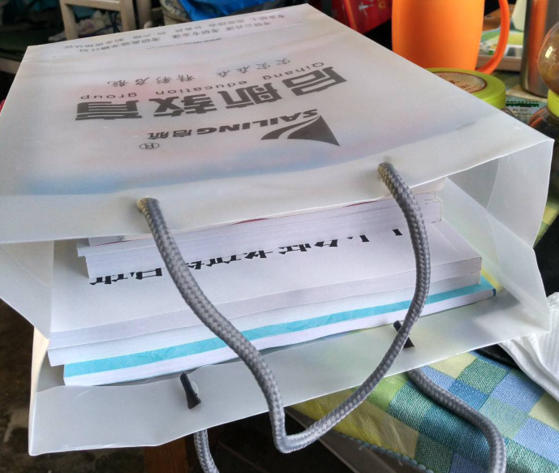

但是那会考研也没有很专注，当看到其它同学在找工作的时候，又跟着一起凑热闹，一块参加面试(当初面试实习岗位，面了两家还都被录取了)。那会对考研的事情又产生了动摇心理，最后在家里人的劝告下，我又继续回到了考研课程的学习中去，但那会考研也不是专心致志一心一意的，那会每天晚上八点钟就回到了寝室，然后开始玩游戏。

就这样一边复习考研，一边晚上八点就早早回来继续打梦幻西游的状态，一直持续到考研结束。最后考研分数出来了，结果也正如大家所预料的那样，嗯，完蛋了。

## 跋山涉水

考研成绩出来的那会，还处于大四的寒假，在得知自己**无法读研**的时候，毅然决定自己需要**好好准备复习专业知识**，然后去参加校园招聘。因为我们学院电气是王牌专业，所以基本上来的都是一些电力相关的，很少有计算机专业的招聘过来( 现在的话，推荐小伙伴们能够多多关注网站上的校园招聘平台，比如 [牛客网](https://www.nowcoder.com/recommend/campus) 等)。

后面我决定和发小一块，去他的学校等待校园招聘 (发小在我们那边的一所 **211** 学校 )。然后在等待的过程中，也不断的学习相关的知识，因为之前的本科学习阶段，只了解了技术的广度，对某些技术不是很深入，而现在我可能专注于找 **Java**相关工作，所以我需要继续系统学习 **JavaEE** 相关的内容，所以后面就来到了发小的学校，和他一块准备通过校招来找工作。

在发小那边大概呆了半个月，但是一直没有等到他们学校校招的消息。这个时候因为经过半个月的学习，基本上对 **Java** 开发有一定的了解（现在想想，其实就是一些皮毛，只学了 **JSP** 和 **Servlet** ，做了两个 **JSP** 相关的项目，想想那会也是太年轻 )，所以就打算直接去深圳寻找公司实习。

因为我是南方人，想着以后就在深圳工作了，所以就先试着看能不能找到深圳的实习先做着，但事与愿违，后面并没有按照我理想的那样来…

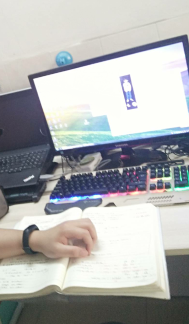

找到落脚点后，就开始了工作的投递，那会真是饥不择食，只要写的招收实习生的公司，基本上都投递，但是也遇到了很多坑：要么面试一家就发现是培训机构，要求你先缴纳培训费，实训完成后给你安排工作；要么就是职场 **PUA**，首先给你特别难的面试题，来摧毁你的面试信心。最后再告诉你，即使不会这些也没关系，有专业的项目经理给你岗前实训，有些说没钱也没关系，可以给你安排先培训，就业后还款。

> 后面我就知道了，可以先通过 [天眼查](https://www.tianyancha.com/)  先查公司的运营范围，如果这家公司运营范围包含了 技能培训，或者计算机培训，那么很大的概率就是培训机构...

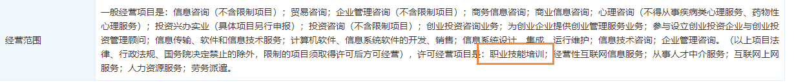

在深圳的半个月里，我陆陆续续参加了 **10** 场面试，其实有 **8** 家面试都是和培训机构有关的，另外两场是因为能力没有满足人家的要求(那会只学了 **JSP**、连 **Spring** 相关的框架都没了解过)。而且因为离南山区比较远，那会也没有通地铁，基本上是坐车 **2** 小时，面试 **10** 分钟，那段时光也是最艰难的时光。不过我心态其实还挺好的，没有找到工作，就当去深圳玩了一阵子~。

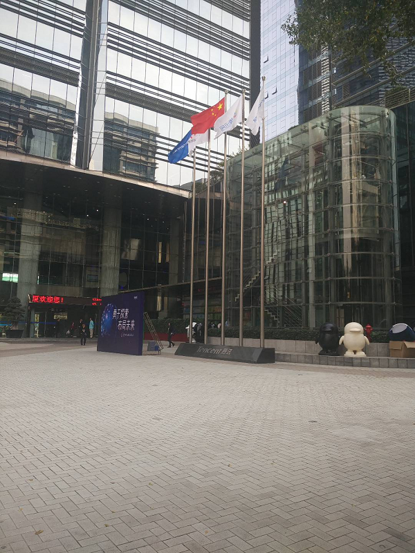

这半个月的深圳找工作之旅，最后以失败告终，想想**可能还是自己能力太弱**呢（现在想想，其实可能是**选错了方式**，因为我走的这条路属于**社招**的道路，如果还没有毕业的小伙伴，还是要多多关注一些**校招平台**，以及对应的公众号：校招优选、校招薪水等，或者直接通过官网投递简历)，在后面的一段日子里，我开始继续强化自己的 **Java** 技能，主要是跟着某马的培训视频进行学习。

> bilibili 某马学习视频：https://space.bilibili.com/441640380
>
> bilibili 某谷学习视频：https://space.bilibili.com/302417610

## 健步如飞

在经过一段时间的**强化学习**后，本科的小伙伴邀请我去**北京试试机会**，后面我又踏上了北上的道路，来到了北京，这个时候只想着能找个管饭的工作，哈哈..

来到了北京，和之前的同学一块去参加招聘，白天参加招聘，晚上就回来一块互相总结经验

其中，中间还回学校参加了校园招聘，不过公司都不太合适，最后还是选择在北京寻找实习机会。大概在北京面试了一个礼拜后，终于通过了一家公司的面试，最后也顺利办理了实习入职手续，正式拥有了自己的工位。

即使那个时候实**习的工资并不高**，但我也格外珍惜这来之不易的机会。所以在工作的时候，也很认真地在学习。公司对于代码这块也有很多规范，每隔一段时间就需要进行代码的 **review**。自己首次提交的代码，也都会经过同事的一轮评审、二轮审核通过后，才能提交成功。

实习的几个月里，我真正了解到了企业级项目是如何开发的，同时加深了**Git、Maven、Spring、Mybatis** 等框架的使用。虽然公司很小，核心开发人员只有 **7** 个人，但做事都很有规范，并且每隔两天就会有一个 **20** 分钟的短会，介绍自己目前做了哪些工作，然后遇到了什么问题，未来将做什么？

> 如果有其它小伙伴遇到问题了，比如我开发某个模块卡住了，那么其它小伙伴可以协助一块进行开发，我也特别感谢另外两个实习小伙伴，帮助我一块解决项目中遇到的问题，尤其是前期在阅读项目时所遇到的。

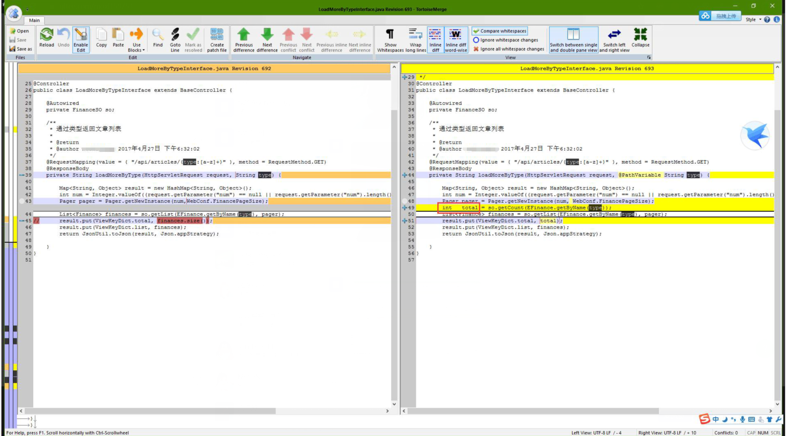

关于每天的生活吃早餐的话，有的时候是在路上来吃的，有的时候会在公司边上的麦当劳

早上七点，排队进地铁站，有的时候人太多的话，可能需要排队半个小时才能进去(排队长度超过了500米..)。所以在北京其实都不容易的，因为实习工资比较低，那会住的都比较远，去上班的话，可能都需要乘坐三种交通工具：公交车 ->地铁 -> 单车，每天早上 **7** 点就要起床，路途花费大概快 **1** 个半小时

下面这里应该是北京地铁最堵的地方了，地铁换乘的时候，也是人山人海

有的时候来早了，公司可能还没开门，所以就在楼下坐着等待一会，看看技术相关的文章

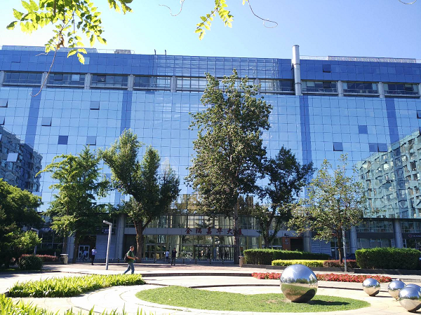

## 卷土重来

后面毕业后，就在公司转正了，虽然工资不高，不过那会儿想着应届生毕业之后**能学到技术就好了**。后面家里人打电话跟我说不要因为一次的考研失败就放弃了，可以再去尝试尝试。我听了他们的话，也没有马上同意或者拒绝，而是静下心来考虑了一段时间。

在后面 **9** 月份的时候，坚定**考研二战**的想法，这个时候就想着在好好努力一下，让自己的人生不留遗憾。所以就离职了，直接收拾东西，在 **2017**年 **9** 月 **28** 日，踏上了回家考研复习的征程...

回到家里后，我哥他们给我接风，邀请一起去附近的景点玩一天，调整一下心态

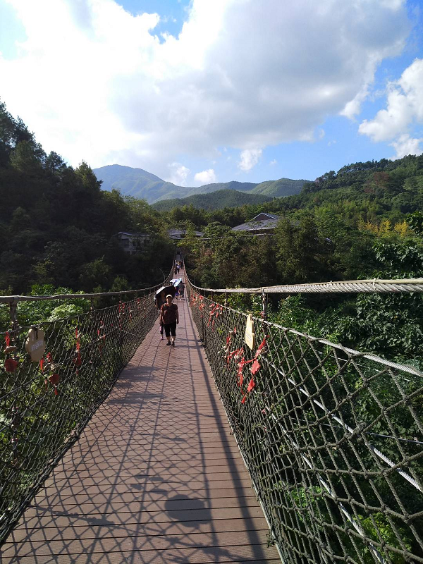

考研的时间是 **12** 月 **25** 日，回到家后已经是 **10**月 **1** 日，距离考研还有 **80** 多天，因为有了之前的经验，所以这次的复习也更加有了针对性，比如数学就跟着张宇、英语跟着刘晓燕，政治跟着肖秀荣，**死死咬住一个人**。专业课因为有往年的真题，所以就结合课本和真题进行复习。下面是我考研时写的每日计划(请忽略我写的这么丑的字，这种独具一格的字，在政治这门估计是吃大亏了)。

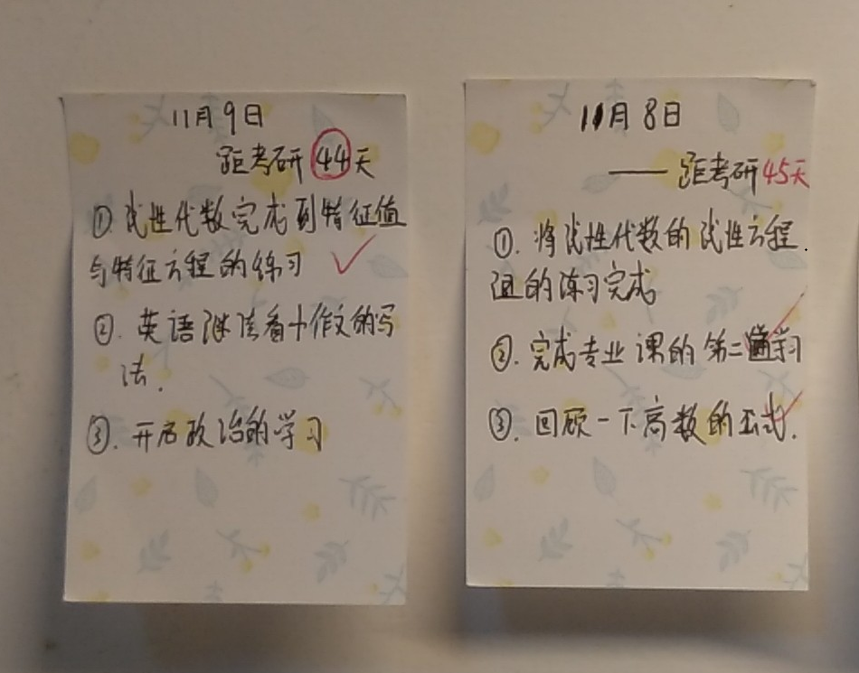

然后开始刷题、背题….

这个状态一直持续到了考试结束。到后面成绩公布，最后出分数线了，我很走运有机会进入复试，所以后面就开始准备复试相关的了，因为之前参加过实习和工作，所以就先把自己的简历好好写写，把握好自己的优势。最后随着复试结果的公布，成功被如今的学校录取，最终考研一事尘埃落定。

## 新的旅途

在考研已经确定被录取后，那个时候是在 **4** 月份，而研究生入学是在 **9** 月份，这个时候有大概 **5** 个月的空窗期，如果是应届生的话，可能还需要回学校写毕业论文，而我属于往届生是没有这些操作的。因此，我又萌生出去打工的想法，找一份工作先做着，等到开学的时候在去入学。

所以后面很快又来到了北京，开始寻找第二份工作，有了之前的经历，后面找工作就轻松了许多，面试了 **10** 天，最后拿了 **3** 家公司的 **Offer** ，最终选择了一家比较近的。

在第二家公司，主要做的是小程序相关的业务，主要由我和另外一个小伙伴负责，但是技术经理考虑到扩展性和后期的维护，要求我们使用**SpringBoot** + **Vue** + **微信小程序** 来做，因为我之前实习的时候用的是 **Spring**，对于这一块比较新的技术还不是特别了解，所以后面就特意花了一段时间来学习。

- **SpringBoot**：来源于 **bilibili**  某谷的视频 ：https://www.bilibili.com/video/BV1Et411Y7tQ
- **Vue**：主要是根据Vue官方文档来学习的，因为中文文档比较友好：https://cn.vuejs.org
- **ElementUi**：**Vue** 的框架，也是直接看文档：https://element.eleme.cn
- **微信小程序**：因为之前毕设是用微信小程序做的，所以还算有点熟悉

项目经理把项目架构的搭建到业务编码开发，以及最后运维部署都交给了我们两个人，我们两个也是互相协同开发，来这四个月里，做到了从 0 ~ 1 完成整条开发流水线的工作。

在新的工作中，没有了之前的迷茫，在做需求的时候，也懂得了如何将需求切分，更好的去完成每一项开发功能

在北京的这几个月里也经历了很多，比如暴雨天的北京

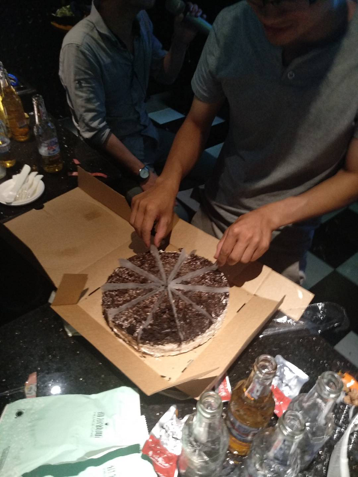

四个月的时光，很快就过去了.....，又到了离开的时候，踏上旅途，开始去读研了，这次的离开，可能以后都很少有机会再回去了..

## 步履矫健

在进入研究生阶段后，我首先明确了自己的目标，比如：**读博** or **就业** ？我的选择是毕业后直接就业，因为之前经历了社招的痛苦，所以现在格外珍惜自己以后的校招机会。

入学后的第一天我就给自己定下目标，能坚持做一款开源软件，用来记录自己学习中遇到的问题，最后经过敲定，决定还是以 **蘑菇博客** 为名。

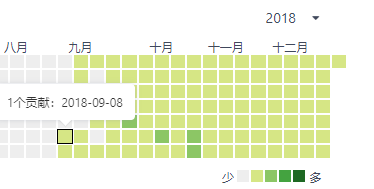

[蘑菇博客](https://gitee.com/moxi159753/mogu_blog_v2) 项目最开始由我一个人开发，中间陆陆续续有一两个小伙伴参与其中，开发了一部分模块，我也想着能尽可能把更多的技术融合进来，毕竟通过自己手把手的操作一遍，也能够算是入门了。

我也很庆幸我成功将自己的项目开源出来了，并且坚持下来，蘑菇博客起源是 **2018** 年 **9** 月，很感谢之前在公司里的同事和领导，是他们带我入门企业级的项目开发，让我养成了很多 **Java** 项目开发的规范，但是到真正在自己手把手搭建一个项目的时候，还是有很多的意外情况。

起初项目开源在码云上，没有多少人关注，在**2019**年**12**月**14**日，蘑菇博客被码云推荐了，后面陆续有一些小伙伴关注了项目，并且参与到开发中，也提供了很多 **issue** ，在这里我也学习到了很多规范和功能的实现。

> 蘑菇博客Gitee地址：https://gitee.com/moxi159753/mogu_blog_v2

然后项目的关注度就开始上升了，有些小伙伴就开始关注，所以我也花费了一些时间，整理了博客的开发、运行、部署的文档，希望每个小伙伴都能够通过本项目一起学习、。

因为更新比较勤快，项目也在码云 "**博客**"  关键字搜索的第一个，不过未来要走得路还很长，我也希望能够认识更多志同道合的小伙伴，然后一起学习和交流。

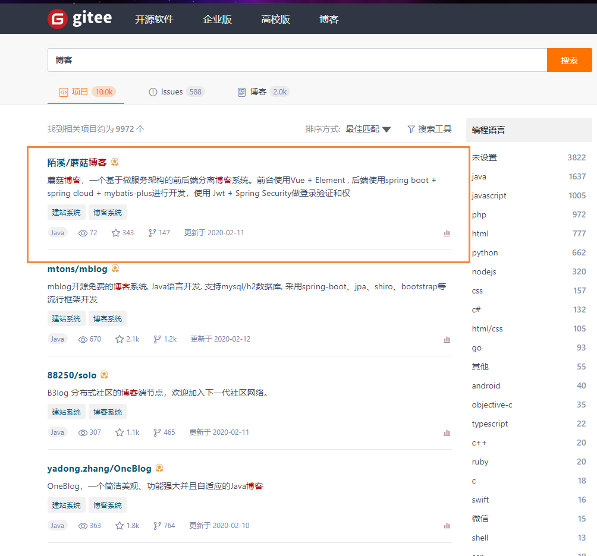

**2020**年**7**月**28**日，蘑菇博客成功达到**1000 Star**，也完成了我之前定下的一个小目标，这也是一个新的起点，后面我还需要更加努力。

**2020**年**9**月**7**号收到了码云邮寄过来的**Gitee 1000 Star**奖杯~

**2020**年**12**月**16**日，到目前为止，蘑菇博客已经**2K Star**了

并且后面开源的 **LearningNotes项目** (学习笔记，记录平时的博客)，也已经收获了 **1.5K Star** 

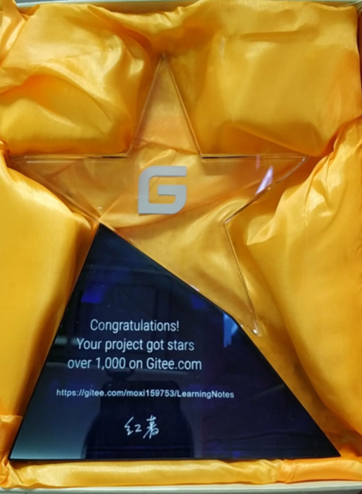

> 学习笔记Gitee地址：https://gitee.com/moxi159753/LearningNotes

## 关于博客

蘑菇博客( **MoguBlog** )，一个基于微服务架构的前后端分离博客系统。**Web**端使用 **Vue** + **Element** , 移动端使用**Uniapp** 和 **ColorUI** 。后端使用 **Spring Cloud** + **Spring boot** + **Mybatis-plus** 进行开发，使用 **Jwt** + **Spring Security** 做登录验证和权限校验，使用 **ElasticSearch** 和 **Solr** 作为全文检索服务，使用 **Github Actions** 完成博客的持续集成，使用ELK收集博客日志，文件支持上传 **七牛云** 和 **Minio**。

欢迎大家能 **Star** 支持一下下哦，同时也可以参与到蘑菇博客的开源贡献中，如果想要体验完整的内容，欢迎关注Gitee中的演示环境，直接登录进行体验~

> 蘑菇博客Gitee地址：https://gitee.com/moxi159753/mogu_blog_v2
>
> 蘑菇博客Github地址：https://github.com/moxi624/mogu_blog_v2

### 摘要

蘑菇博客( **MoguBlog** )，一个基于微服务架构的前后端分离博客系统。**Web**端使用 **Vue** + **Element** , 移动端使用**Uniapp** 和 **ColorUI** 。后端使用 **Spring Cloud** + **Spring boot** + **Mybatis-plus** 进行开发，使用 **Jwt** + **Spring Security** 做登录验证和权限校验，使用 **ElasticSearch** 和 **Solr** 作为全文检索服务，使用 **Github Actions** 完成博客的持续集成，使用ELK收集博客日志，文件支持上传 **七牛云** 和 **Minio**

### 项目起源

蘑菇博客大部分功能是我个人进行开发的，因能力有限，其中很多技术都是一边学习一边使用的，可以说蘑菇博客也是一个我用来熟悉技术的项目，所以很多地方可能考虑不周，故有能改正的地方，还请各位老哥能够指出~

现在挺多是 **SSM** 或者 **SSH** 的博客管理系统，想用 **Spring boot** + **Spring Cloud** + **Vue** 的微服务架构进行尝试项目的构建，里面很多功能可能只是为了满足自己的学习需求而引入的，大家可以根据自己服务器配置来选择启动的服务，因此本博客也是一个非常好的 **SpringBoot** 、**SpringCloud** 以及 **Vue** 技术的入门学习项目。

原来做过 **Vue** + **Element-Ui** 做过管理系统，所以现在打算做一套自己的、基于当前最新技术栈、前后端分离的微服务博客系统。

### 项目特点

- 友好的代码结构及注释，便于阅读及二次开发
- 实现前后端分离，通过 **Json** 进行数据交互，前端再也不用关注后端技术
- 页面交互使用 **Vue2.x**，极大的提高了开发效率。
- 引入**Swagger** 文档支持，方便编写API接口文档。
- 引入 **RabbitMQ** 消息队列，用于邮件发送、更新 **Redis** 、**Solr** 和 **ElasticSearch**
- 引入 **JustAuth** 第三方登录开源库，支持 **Gitee**、**Github** 账号登录。
- 引入**ElasticSearch** 和 **Solr** 作为全文检索服务，并支持可插拔配置
- 引入**Github Actions** 工作流，完成蘑菇博客的持续集成、持续部署。
- 引入 **七牛云** 和 **Minio** 对象存储，同时支持本地文件存储
- 引入**RBAC** 权限管理设计，灵活的权限控制，按钮级别的细粒度权限控制，满足绝大部分的权限需求
- 引入 **Zipkin** 链路追踪，聚合各业务系统调用延迟数据，可以一眼看出延迟高的服务
- 采用自定义参数校验注解，轻松实现后端参数校验
- 采用 **AOP** + **自定义注解** + **Redis** 实现限制IP接口访问次数
- 采用自研的评论模块，实现评论邮件通知
- 采用 **Nacos** 作为服务发现和配置中心，轻松完成项目的配置的维护
- 采用 **Sentinel** 流量控制框架，通过配置轻松实现网站限流
- 采用 **uniapp** 和 **ColorUi** 完成蘑菇博客的移动端门户页面搭建
- 支持多种文本编辑器，**Markdown** 编辑器([Vditor](https://github.com/Vanessa219/vditor))和富文本编辑器([CKEditor](https://github.com/ckeditor/ckeditor4))随心切换
- 采用 **ElasticStack**【ElasticSearch+Beats+Kibana+Logstash】搭建蘑菇博客日志收集
- 采用 **Docker Compose** 完成容器编排，**Portainer** 实现容器可视化，支持一键部署线上环境

### 后端技术

|      技术      |           说明            |
| :------------: | :-----------------------: |
|   SpringBoot   |           MVC框           |
|  SpringCloud   |        微服务框架         |
| SpringSecurity |      认证和授权框架       |
|  MyBatis-Plus  |          ORM框架          |
|   Swagger-UI   |       文档生产工具        |
|     Kibana     |     分析和可视化平台      |
| Elasticsearch  |         搜索引擎          |
|     Beats      |     轻量型数据采集器      |
|    Logstash    | 用于接收Beats的数据并处理 |
|      Solr      |         搜索引擎          |
|    RabbitMQ    |         消息队列          |
|     Redis      |        分布式缓存         |
|     Docker     |        容器化部署         |
|     Druid      |       数据库连接池        |
|     七牛云     |     七牛云 - 对象储存     |
|      JWT       |        JWT登录支持        |
|     SLF4J      |         日志框架          |
|     Lombok     |     简化对象封装工具      |
|     Nginx      |  HTTP和反向代理web服务器  |
|    JustAuth    |     第三方登录的工具      |
|     Hutool     |      Java工具包类库       |
|    阿里大于    |       短信发送平台        |
| Github Actions |        自动化部署         |
|     Zipkin     |         链路追踪          |
| Flexmark-java  |     Markdown转换Html      |
|   Ip2region    |     离线IP地址定位库      |
|     Minio      |     本地对象存储服务      |
| Docker Compose |      Docker容器编排       |
|   Portainer    |     Docker可视化管理      |

### 前端技术

|         技术          |                  说明                   |
| :-------------------: | :-------------------------------------: |
|        Vue.js         |                前端框架                 |
|      Vue-router       |                路由框架                 |
|         Vuex          |            全局状态管理框架             |
|        Nuxt.js        |        创建服务端渲染 (SSR) 应用        |
|        Element        |               前端ui框架                |
|         Axios         |              前端HTTP框架               |
|        Echarts        |                图表框架                 |
|       CKEditor        |              富文本编辑器               |
|     Highlight.js      |            代码语法高亮插件             |
|        Vditor         |             Markdown编辑器              |
|      vue-cropper      |              图片裁剪组件               |
| vue-image-crop-upload |           vue图片剪裁上传组件           |
|   vue-emoji-comment   |          Vue Emoji表情评论组件          |
|     clipboard.js      |            现代化的拷贝文字             |
|      js-beautify      |           美化JavaScript代码            |
|     FileSaver.js      |            保存文件在客户端             |
|      SortableJS       |       功能强大的JavaScript 拖拽库       |
|   vue-side-catalog    |               目录导航栏                |
|        uniapp         |            移动端跨平台语言             |
|        colorUi        |         专注视觉的小程序组件库          |
|       showdown        | 用Javascript编写的Markdown 到Html转换器 |
|       turndown        | 用JavaScript编写的HTML到Markdown转换器  |

### 项目架构图

### 部分截图

此处只是列举了部分截图，如果想要体验完整的内容，欢迎关注Gitee中的演示环境，直接登录进行体验~

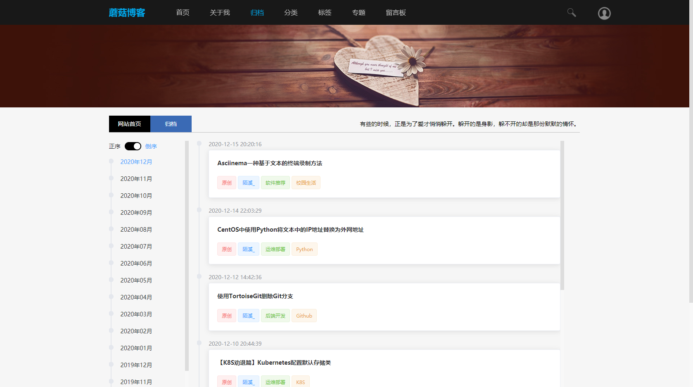

### 关于开源

从开源的过程中，不仅自己的能力能得到提升，同时也能认识非常多志同相合的小伙伴，包括在群里的小伙伴们，也有一些一块参与到项目的维护和开发中，也有一些给我们提供 **issue** 和 **idea** ，同时能够和一些参加多年工作经验的老哥交流，也是受益匪浅的。

通过开源，我也获得了很多工作机会。就本次秋招来讲，其实很多面试官对我做的开源项目比较感兴趣，所以面试上其实很多时间都在聊这个开源项目。同时，我也收到过猎头通过 **Github** 上的邮箱给我发的邮件，期望我去参加他们推荐的工作 ( 哈哈哈，后面因为知道我还没有毕业的事情，就放弃了，因为他们招的是5年工作经验的。就因为这个原因错过了**阿里P6-P7**的岗位了，简直太亏了啊)

## 举目远望

研究生的生涯，基本上在看论文、做实验、写博客中度过...，**2020** 年因为疫情的原因，整个寒假都是在家里度过的，直到 **2020** 年 **5** 月份才开学。在2月份的时候，我就听到有的小伙伴在准备寻找实习了，后面我想了想，正式的秋招大约是在8月份左右，有些公司如果有提前批的话，可能从6月底就开始了(今年字节跳动6月底就开始提前批)。所以从2月到7月，有5个月的时间进行学习，在加上疫情原因，无法正常返校，所以就刚刚好可以开始为面试而学习的阶段。

首先明确自己需要找哪方面的工作，因为我平时都是学习 **Java** 相关的，所以以后打算找后端开发，因此我的投递的岗位基本上都是顶着后台岗位的要求来的，加上我之前编程技术也算可以，所以就没有从头开始学习 **Java**，而是主要关注于java进阶方面的内容。

> 如果想了解基础的学习路线图，可以看下面这篇文章：
>
> https://mp.weixin.qq.com/s/VXH19dQRkNtPbzDMVXwsPQ

因为我都是偏向于从视频中获取知识，虽然有的时候比较慢，但是这个可能会帮助我更快的理解其中的内容，因此，后面的一些推荐，基本上是以视频为主，如果基础较好的，可以直接2倍速刷视频，等待视频学完，时间还充裕的话，可以结合书本进行

### JUC

**JUC** 进阶 **Java** 相关的基础内容，因为我之前一直都做 **Java** 开发这块，所以对于 **JavaSE** 方面的还是比较熟悉，首先学习的就是Java并发包，以及一些大厂常见的面试题。

> 来源Bilibili XX谷周阳老师学习视频：https://www.bilibili.com/video/BV15J4112785
>
> 主要包括Volatile、CAS、JAVA锁、阻塞队列、线程池 等...
>
> 笔记地址：https://gitee.com/moxi159753/LearningNotes

### JVM

在学习完并发包后，接着就是JVM相关的知识了，这是面试的高频点

> 来源Bilibili XX谷宋红康老师JVM教程：https://www.bilibili.com/video/BV1PJ411n7xZ
>
> 主要包括：JVM每个组成部分的作用，垃圾回收算法 和 垃圾回收器
>
> 笔记地址：https://gitee.com/moxi159753/LearningNotes/tree/master/JVM

### Java8新特性

有些可能会问你关于 **Java8** 的新特性，为啥是 **Java8** 呢？因为从 **Java8** 以后的版本就是收费版本了，因此基本上企业的最新版都是基于 **Java8** 来的。

> 来源Bilibili XX谷李贺飞老师学习视频：
>
> https://www.bilibili.com/video/BV1ut411g7E9
>
> 主要包括：HashMap变化、Lambda表达式、Stream流 等
>
> 笔记地址：
>
> https://gitee.com/moxi159753/LearningNotes

### SpringCloud

在复习完 **Java** 进阶的知识后，下面就需要进入到框架的复习了，因为我使用的是微服务框架 **SpringCloud**来开发的蘑菇博客，所以在面试的时候，肯定会问到微服务框架相关的知识，而且不可能只是停留在简单的使用，更多的是需要了解其原理。因此，我又系统性的学习了一下**SpringCloud**，以及最新版的**SpringCloudAlibaba**(以后蘑菇博客就是基于Alibaba版本做迁移的)

> 来源Bilibili XX谷周阳老师学习视频：
>
> https://www.bilibili.com/video/BV18E411x7eT
>
> 主要包括：SpringCloud全家桶组件，服务发现和注册、负载均衡、服务降级和限流、服务网关和配置中心
>
> 笔记地址：
>
> https://gitee.com/moxi159753/LearningNotes/tree/master/SpringCloud/SpringCloud2020

其实这部分也可以选择性的看，因为我个人是打算从中学习到编码的知识，而不是说知识背面试题。这篇教程其实我觉得是非常不错的，它基本上把概念 和 代码 都讲的很清楚，学习完成后，基本上能够对SpringCloud相关的问题都能回答出来~。

### 中间件

中间件的学习，主要就包括 **MQ**(消息队列)、**Redis、MySQL** 等，这个如果只想使用的话，其实挺简单的，调用一下对应的**API**就行，但是这里面的原理其实很多。这里我是跟着视频进行学习，授课老师通过讲解实际案例，非常的通俗易懂。

> 来源Bilibili学习视频：
>
> https://www.bilibili.com/video/BV1UJ411X7M1
>
> 面试扫盲，基本上关于中间件以及在服务开发中遇到的疑难问题都有讲解到(学习到了很多知识)

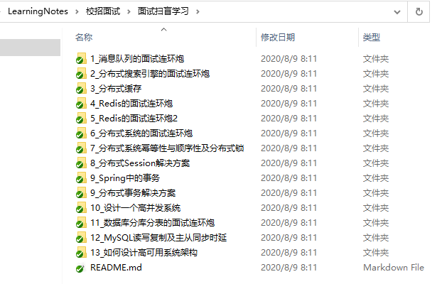

### 算法学习

关于算法这块，其实那在秋招的时候就是准备不太充足，所以在最后就吃亏了，因为现在的面试，基本上都会重点考察你的算法功底，像字节跳动的面试，每一面基本上都会考察。其它的包括 腾讯、阿里都是有的，所以如果你打算冲击大厂，一定要好好的准备算法的知识

首先我推荐的就是剑指**Offer**，里面都是一些经典的题型大概67题(如果小伙伴时间紧迫，那就先把这个刷完。我当初就是因为轻视了算法，所以导致有些题不能很快给出面试官满意的答案..，需要后面的小伙伴不要和我一样犯同样的错误)

> Bilibili视频学习解题思路(Python版本)：
>
> https://www.bilibili.com/video/BV1K4411o7KP
>
> 牛客网剑指offer专题：
>
> https://www.nowcoder.com/ta/coding-interviews

同时，如果剑指Offer的算法题刷完的话，那就可以继续去 **LeetCode** 上刷题了。**LeetCode** 上刷题的话，也是要有针对性，比如，你可以优先选择热门的题目

> leetcode: https://leetcode-cn.com/problemset/all

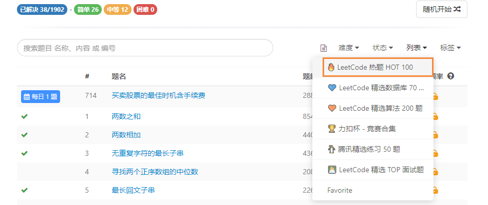

如果时间允许的话，当然可以采用题海战术，把**Leetcode**的中等题目都进行扫盲式的学习。

如果时间不允许的话，那就需要站在别人的肩膀上学习了，比如可以合理的使用 牛客网搜索，根据前面人面试总结出的高频题，来进行突击性的训练(临时抱佛脚...)

> 以字节跳动为例：搜索  字节跳动  高频

看到会有人总结出来，其它小伙伴在面试时候遇到的原题，而且这些题目会反复的出现，大家如果就打算冲某些大厂的话，就需要把他们都了解一遍

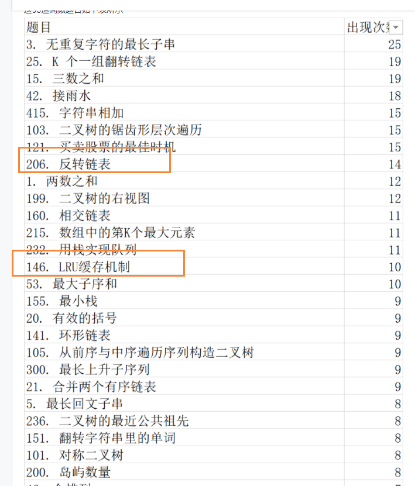

通过别人汇总的，就发现了有几题在我之前面试的时候就出现过.....(不过我面试的早，成功当了炮灰，如果是后面面试的小伙伴，一定要站在前人的肩膀上进行学习）

### 计算机基础课程

前面讲的都是关于Java方面的，但是并不是说计算机基础(数据结构、操作系统、计算机网络、数据库)，就可以放下警惕了，其实他们同样也是高频的考点，非常的重要。

当然如果你有比较丰富的项目经验的话，有些面试可能就会比较弱化计算机基础知识，更多的挖掘你简历中使用的技术，字节跳动的面试很多面试问题就是结合我简历上写的项目来展开的。不过最后也会问到一些基础的知识，看看你的掌握情况。

比如计算机网络：**HTTPS** 和 **HTTP、TCP**和 **UDP** 相关知识点，同时随着面试的内卷化，难度也会不断加深，关于三次握手和四次挥手，要求你能描述每次状态码的变化，可能还会问 为什么**TCP**连接是三次握手，而不是两次；为什么是四次挥手而不是三次.. 等等一系列的连环套路。

计算机网络，主要就是跟着Bilibili韩立刚老师的视频教程和谢希仁老师的计算机网络书籍。

> Bilibili韩立刚老师的视频教程：https://www.bilibili.com/video/BV1WK4y1f71A

关于操作系统，我之前都是根据博客来进行学习的，比如看一些：线程和进程的区别，以及如何通信，然后死锁相关、银行家算法、虚拟内存、磁盘调度等

如果时间充裕，还是推荐进行系统的学习一下，小伙伴推荐的操作系统课程，**B**站第一中文操作系统当之无愧~

> 操作系统(哈工大李治军老师) ：https://www.bilibili.com/video/BV1d4411v7u7

问到数据库的话，可能会叫你写**SQL**语句，或者讲述一下**MySQL**的索引，然后就能讲到**B**树 、**B+**树、聚簇索引和非聚簇索引、**MySQL**索引优化，分析某条**SQL**语句走了那些索引（**explain**)、**MySQL**行锁和表锁 等。

如果是项目做的比较多的话，可能还会问你数据库的分库分表操作，或者**MySQL**的主从复制。

同时关于数据库，可能还会问到你缓存相关，比如**Redis**。从**Redis**就能延伸出很多知识点了，**Redis**底层数据结构、跳跃表的实现、**Redis**的持久化策略**AOF和RDB**、**Redis**的缓存穿透、缓存雪崩、**Redis**的主从复制原理 和 **Redis**的哨兵原理，同时像**Redis**的一致性**Hash**问题都有可能问到。

同时可能还会结合项目来问，比如问你项目中，高并发环境下，先操作数据库还是先删除缓存？或者在**Redis**主备切换时的数据丢失问题，异步复制和集群脑裂等等。

上次字节跳动的时候，就从**Redis**问到了过期策略，最后叫我讲解一下**LRU**算法，并要求我能手动实现。

>  某谷MySQL数据库高级：https://www.bilibili.com/video/BV1KW411u7vy
>
>  某谷超经典Redis教程：https://www.bilibili.com/video/BV1oW411u75R

**Linux** 也会经常在面试中提到，同时在项目部署也会用到，比如**蘑菇博客**其实就是部署在 **CentOS** 下的。因此，在面试的时候，也会根据你的简历情况，而采取不同的面试方式。例如，我简历上写着：熟悉 **Linux** 、**Docker**，能使用 **XShell** ，**Xftp** 等工具进行线上项目部署和调试。那么面试的时候，面试官可能就会比较侧重于实践方面的，比如：生产环境服务器变慢，知道如何排查么？

关于 **Linux** 在面试这块，主要被问到 **Linux**下的一些指令，例如：如何查看日志，查看端口，查看系统负载情况，个人的话，如果想要系统的学习**Linux**，推荐阅读：鸟哥的**Linux**私房菜，这本书我是购买过的。

> 鸟哥的Linux私房菜(在线)：http://cn.linux.vbird.org/

## 收获果实

我整个秋招其实只面试了三家公司：字节跳动、京东、滴滴出行

- 字节跳动：三天走完面试流程，最后拿了Offer
- 京东：两轮技术面通过，HR面挂 (这个挂的莫名其妙，感觉被KPI了..)
- 滴滴出行：一天完成三轮技术面试，最后拿到意向书。

从**2020**年**2**月份开始为秋招而准备，到我们学校开学后，大概在**6**月**20**号左右，就开始准备投递简历了(在这里我特别建议小伙伴们把握好提前批，因为有些公司的提前批是直接免笔试的)。

字节跳动是我面试的第一家公司。当初面试字节很大的原因还是我的本科小伙伴找他同学帮我内推的，在这里特别感谢尧尧和大壮。因为字节跳动的提前批开启的比较早，本来抱着试一试的态度，没想到竟然一下就拿了Offer。

在等待一段时间后，收到了字节跳动 **Data** 广告部门面试的通知。

不得不说，字节跳动的效率还是非常的快，很快就完成了流程：6月28日：第一面 + 第二面；6月30日：第三面 + HR面；7月7日：意向书。

下面是我的一些面试总结，发布在我的蘑菇博客上，感兴趣的小伙伴可以去看看

> 字节跳动后端面经：http://www.moguit.cn/#/info?blogOid=184
>
> 京东零售后端面经：http://www.moguit.cn/#/info?blogOid=26
>
> 滴滴出行后端面经：http://www.moguit.cn/#/info?blogOid=143

其实在拿到字节跳动的**Offer**后，就准备躺平了，因为字节也是之前一直心心念念的公司，这也算了却了一桩心愿。不过，如果想冲击更高的薪资的话，那么我建议你可以多面几家，因为这样在面对公司给予的薪资，才有可以商量的余地。

## 结语

最后我觉得我能够通过字节跳动和滴滴出行的面试，其实很大程度上也得益于我做的开源博客系统。

>  Talk is cheap. Show me the code

在我和面试官之间，还不是和了解的时候，那么像 **Github** 或者 **Gitee** 的主页就很有说服力。在面试字节的一面的时候，面试官全程就在和我聊项目，同时后面的面试也在深挖项目细节。

面试滴滴出行的时候，面试官直接打开我的笔记仓库，然后从里面选出几篇博客，来和我一起探讨，最后面试完后，滴滴面试官觉得这是一件非常有意义的事情，希望我能够坚持下去。

所以我觉得，如果你和我一样，本科出生不好，研究生也读了一个双非的学校。那么我们就更需要趁早准备，学历不行，那么就靠能力吃饭。好在就互联网公司而言，其实不是特别看重学历，只要你拥有本科学历，然后拥有比较强的能力的话，都可以吃上互联网这碗饭。

但是既然选择了从事IT开发 ，那么我们就需要时刻有危机意识。也就是在要求我们需要终生学习，不断的去学习和挑战新的难题。就拿**Java**开发来说，你可能学习了**SpringBoot+MySQL**就可以开发了，但是我们不能仅仅满足于此，我们还需要去尝试着去了解微服务相关的知识。

在我们业务只用**MySQL**的时候，我们可以去学习**Redis、Memcached**相关的知识，只有这样我们才能不断保持自己的核心竞争力，让自己立于不败之地，只有这样我们才能够去冲击高薪，而不是等到 **35** 岁就被优化。我们要知道，**五年工作经验不等于 一年工作经验用五年**，而是在这五年的时光里，不断的去学习新的知识，去解决各种问题，最后积累出来的经验。

最后，如果你和我一样出身不好，家里也没有矿，并且决心从事软件开发，那么我希望你能够和我一起，投入时间，**投入精力去学习，现在多流汗，回头多拿钱**！

## 参考

**基础学习路线图**：

https://mp.weixin.qq.com/s/VXH19dQRkNtPbzDMVXwsPQ

**开源蘑菇博客**：

https://gitee.com/moxi159753/mogu_blog_v2

**开源学习笔记**：

https://gitee.com/moxi159753/LearningNotes

**bilibili X马学习视频**：

https://space.bilibili.com/441640380

**bilibili XX谷学习视频**：

https://space.bilibili.com/302417610

**bilibili SpringBoot视频**：

https://www.bilibili.com/video/BV1Et411Y7tQ

**Vue文档**：

https://cn.vuejs.org

**ElementUI文档**：

https://element.eleme.cn

**周阳老师大厂面试第二季**：

https://www.bilibili.com/video/BV15J4112785

**宋红康老师JVM教程**：

https://www.bilibili.com/video/BV1PJ411n7xZ

**周阳老师SpringCloud2020**：

https://www.bilibili.com/video/BV18E411x7eT

**Java面试突击**：

https://www.bilibili.com/video/BV1UJ411X7M1

**剑指Offer学习视频**：

https://www.bilibili.com/video/BV1K4411o7KP

**韩立刚老师的计算机网络**：

https://www.bilibili.com/video/BV1WK4y1f71A

**哈工大李治老师操作系统**： 

https://www.bilibili.com/video/BV1d4411v7u7

**MySQL数据库高级**：

https://www.bilibili.com/video/BV1KW411u7vy

**超经典Redis教程**：

https://www.bilibili.com/video/BV1oW411u75R

**鸟哥的Linux私房菜(在线)**：

http://cn.linux.vbird.org/

**陌溪**是一个从三本院校一路摸滚翻爬上来的互联网大厂程序员。独立做过几个开源项目，其中**蘑菇博客**在码云上有 **2K Star** 。目前就职于**字节跳动的Data广告部门**，是字节跳动全线产品的商业变现研发团队。本公众号将会持续性的输出很多原创小知识以及学习资源。如果你觉得本文对你有所帮助，麻烦给文章点个「赞」和「在看」。同时欢迎各位小伙伴关注陌溪，让我们一起成长~

