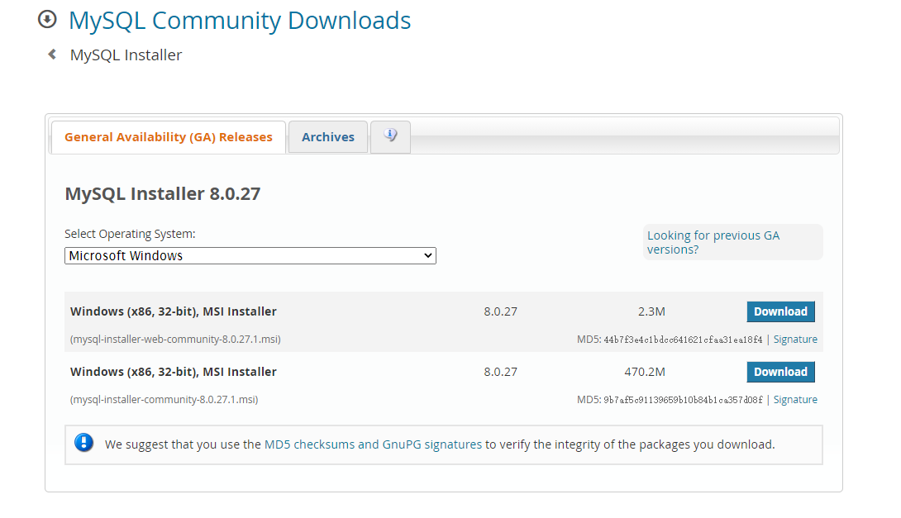
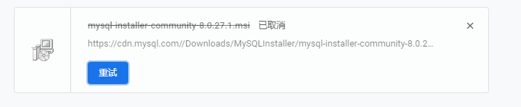
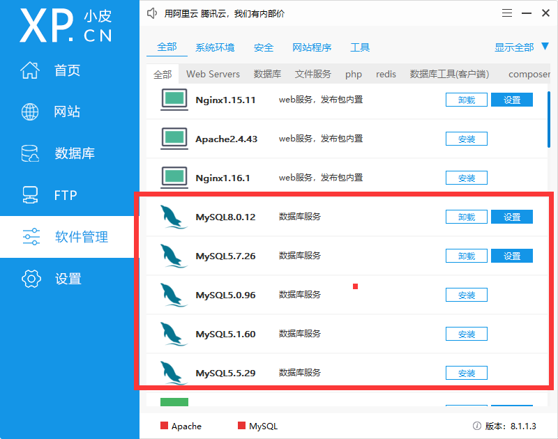
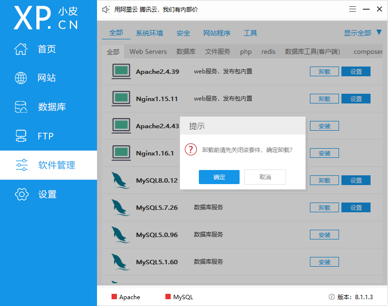
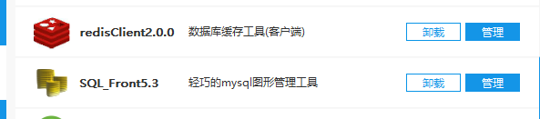
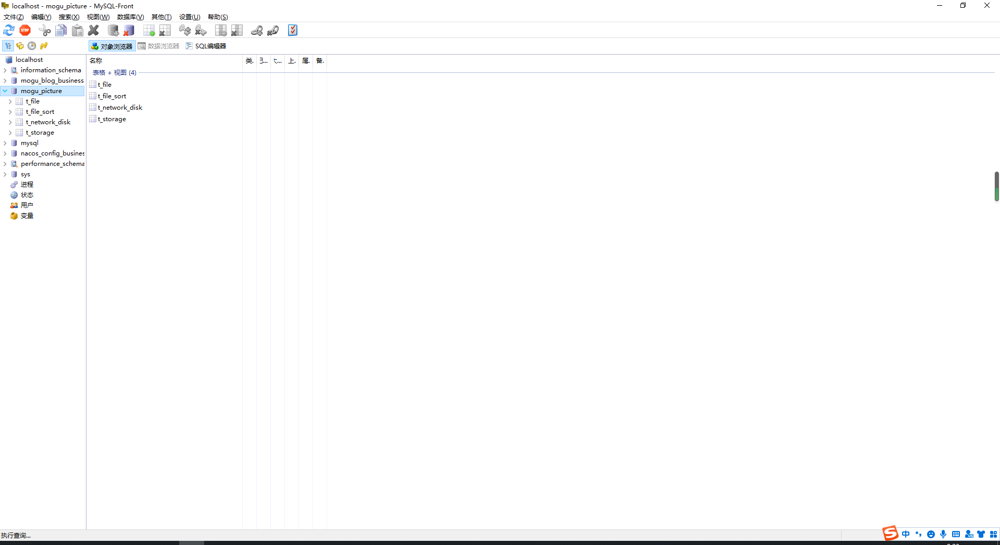

大家好，我是**陌溪**

最近在写蘑菇博客的时候，因为使用到了一些 **MySQL** 的高级语法，导致原来的 **5.6** 版本的 **MySQL** 无法正常使用。

因此就打算给自己的 **MySQL** 升级一下，但是又想保留原来的旧版本，方便以后做不同版本的 **SQL** 的适配问题。

首先，按照惯例，当然是官网上寻找对应的版本安装即可

> https://dev.mysql.com/downloads/windows/installer/

但是，下载安装包的速度，实在是不敢恭维

后面就去寻找更加便捷的安装方式，在群里小伙伴的安利下，我找到了  **小皮** ，一款让天下没有难配的软件环境！

**小皮** 全名是 **PHPStudy**，听名字感觉就是用来学 **PHP** 的（php yyds）

**小皮** 提供了 **Win** 客户端版本，比较适合快速的在 **Windows** 下部署一个 **Web** 开发环境. 有如下优点:

- 安装方便

- 集成了很多实用的工具

> 下载地址：https://www.xp.cn/download.html

点击立即下载，解压并双击 **phpstudy V8.1** 安装包，安装完成后的界面如下所示：

安装完成后，会内置几款通用的软件，比如 **Apache**、**FTP**、**MySQL 5.7** 和 **Nginx**，我们如果想要使用的时候，直接点击启动即可。

同时 **小皮** 的软件管理，还内置了一些比较常见的 **MySQL**。例如，这里有陌溪想要的 **MySQL 8.0**，点击安装即可，一键操作，简直不要太爽。 

安装 **Redis** 也是一样的道理，点击一键即可完成安装

针对一些不想要的应用，我们可以直接点击 **卸载**，也非常快就完成了，

通过打开 **小皮** 的安装目录可以看到，我们刚刚手动安装的软件都是解压版的，点击卸载直接就能把文件夹移除，没有任何残余~。

同时，**小皮** 还提供了 **数据库** 和 **Redis** 的图形化工具 **SQL_Front** 以及 **RedisClient**，点击配置即可打开对应的图形化界面。

陌溪原来用的是 **SQLyog**，不过那个时候还得各个地方下载安装包，比较麻烦。陌溪体验了一下 **MySQL_Front** ，感觉也还行，该有的操作都用，最主要是的安装还方便~。

**RedisClient** 的话，有点像 **RedisDesktopManager**，就是**UI** 看起来不是很 **Nice**。

针对有些场景，我们需要修改对应的配置文件，通过小皮的设置，我们能够修改 **nginx.conf**、**mysql.ini** 以及 **hosts**，可以说是非常方便了，再也不用点开文件夹去一个个寻找了~

最后，说说不足之处吧，就是软件管理的工具不是很丰富，目前比较常用的软件只有 **MySQL**、**Redis**、**Nginx** 等，当然也可以理解为这些也是开发 **PHP** 常用的软件，目前的话暂时也不支持自定义的上传~。

好了，本期的软件安利环节就到这里啦。我是陌溪，我们下期再见~