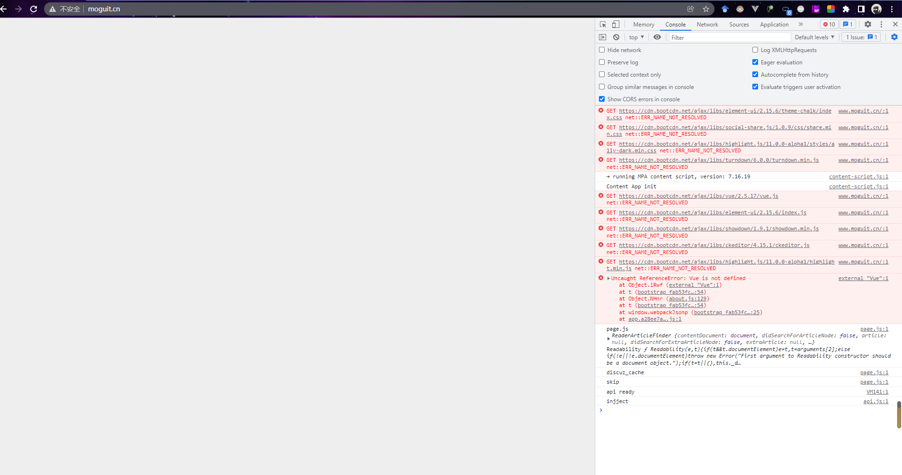
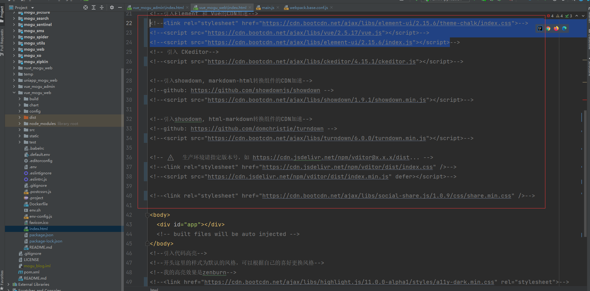
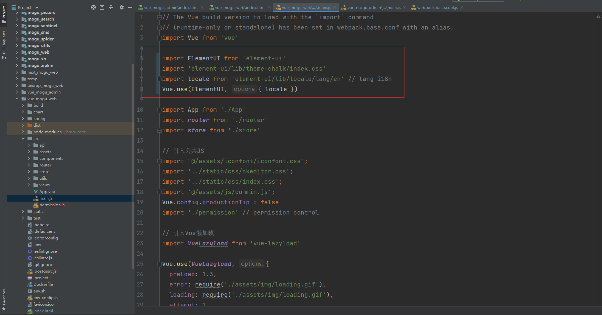
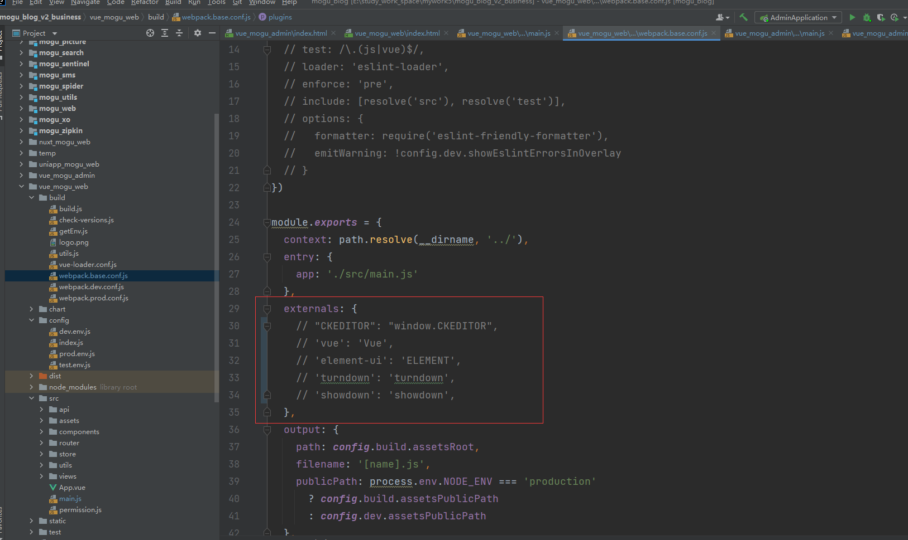

大家好，我是**陌溪**

首先，给各位小伙伴拜年了，祝福大家新年快乐~

大年初一，就看到小伙伴在群里 **@** 我，说蘑菇网站崩了

我打开手机一看，**芭比Q了**，直接白屏了，马上从床上滚起来，打开电脑，打开**Chrome**，F12看了看出错信息



又是这该死的 **CDN** 搞的鬼，**10** 次宕机有 **9** 次是因为 **CDN** 的问题，最近白屏的几率也越来越高了

因为蘑菇目前的带宽有8M了，在没有CDN的情况下，加载也不会很慢

下面就修改蘑菇的源码，移除CDN加速

首先，打开 **vue_mogu_web** 中的 **index.html** 页面，然后把里面用到的 **CDN** 的地方都注释起来

主要包括：**vue**、**element**、**ckeditor**、**vditor** 等等。。



注释完成后，在修改 **main.js** 文件，把原来注释的代码开放，引入 **ElementUI** 和 **VueJs**



然后在修改 **webpack.base.conf**，把 **externals** 中的插件给注释起来



然后重启项目，大功告成~

```BASH
npm run dev
```

好了，本期的解决宕机问题就到这里


