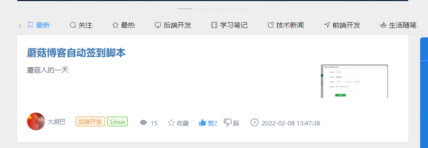
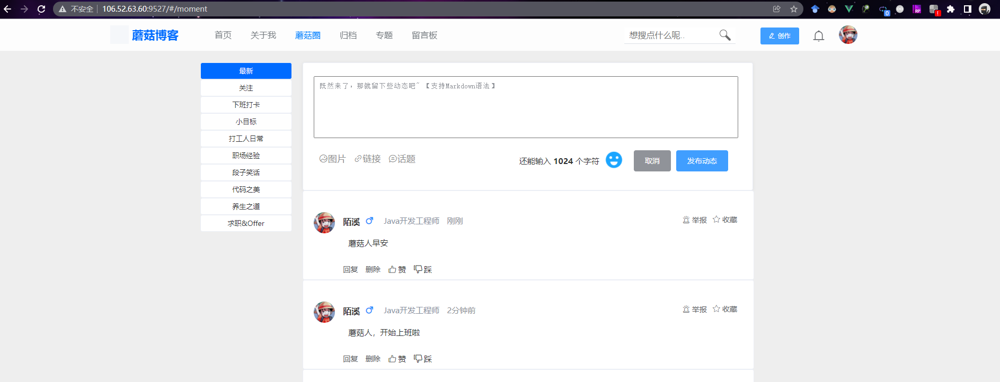
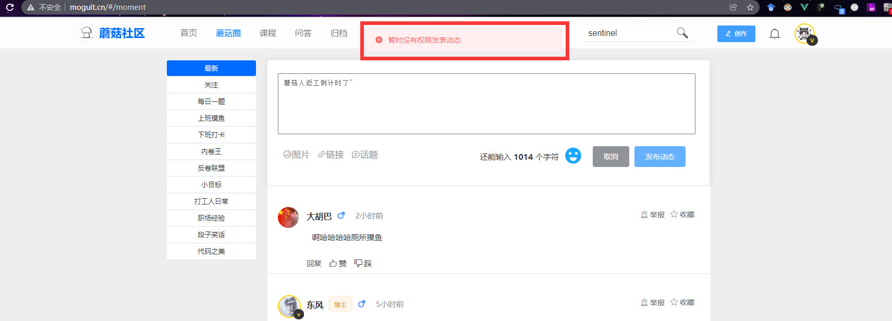

大家好，我是**陌溪**

最近蘑菇不是上线了签到功能嘛，用户每天可以登录蘑菇，然后打卡进行签到。


同时，为了考虑到小伙伴们可能会忘记签到，还特意做了补签功能


每周一只要在蘑菇排行榜的小伙伴，就会发放 **1~2** 张签到卡


目前蘑菇排行榜主要是通过积分来进行排序的，为了鼓励大家多多参与蘑菇贡献学习，分享更多的知识到蘑菇中，同时提高蘑菇社区的活跃度，制定了下面的一些积分获取规则~

- 发表 **1** 篇博客，获得 **3** 积分，上限 **15** 积分 
- 发表 **1** 条动态，获得 **2** 积分，上限 **10** 积分
- 发表 **1** 条问答，获得 2 积分，上限 **10** 积分
- 发表 **1** 条评论，获得 **1** 积分，上限 **10** 积分
- 完成 **1** 次签到，获得 **5** 积分，连续签到达到 **10**、**30**、**50**、**100** 天，分别可以获取 **6**、**7**、**8**、**10** 积分

同时，为了让小伙伴们能够随时随地登录蘑菇进行签到，还适配了移动端，只要打开手机即可完成一键签到~


可是，万万没想到啊，蘑菇人为了获取积分，竟然不讲武德，偷偷开发脚本，来完成蘑菇的自动签到


同时，蘑菇群友写的这个脚本竟然还迭代了好几版，已经支持了自动在蘑菇签到、蘑菇圈发动态了，具备极佳的扩展性！甚至还在蘑菇群推广了起来



看到这个，我只想说：小伙子，你路走窄了


下面，让我们一起来看看这位蘑菇群友，对蘑菇做了什么吧~

首先是蘑菇签到脚本，简单的调用下签到接口就可以了，so easy

```bash
#!/bin/bash
echo '蘑菇人shell签到'
token="----请换成自己的token---"
url="http://106.52.63.60:8607"
api="/mogu-web/about/userSignIn"
curl -X POST "${url}${api}" -H  "accept: */*" -H  "authorization: ${token}"
```

然后是，蘑菇圈发送上班动态 **1.0** 版本

随便加几个上班的动态文本组成上班的动态数组

然后通过随机数求余，从指定的数组中挑选出一个作为上班的蘑菇动态

```BASH
#!/bin/bash
# 蘑菇人shell发布蘑菇圈-上班
my_array=("上班,蘑菇人" "我淦上班吧蘑菇人" "蘑菇人上班了啊 啊啊啊" "我淦 天天好烦 要上班")
msg="${my_array[$[$RANDOM%4]]}"
echo ${msg}
token="----请换成自己的token---"
url="http://106.52.63.60:8607"
api="/mogu-web/userMoment/addUserMoment"
curl -X POST "${url}${api}" -H  "accept: */*" -H  "authorization: ${token}" -H  "Content-Type: application/json" -d "{\"content\":\"${msg}\",\"fileUids\":\"\",\"topicUids\":\"\",\"url\":\"\",\"urlInfo\":\"\"}"
```

同理，下班动态也类似

```bash
#!/bin/bash
# 蘑菇人shell发布蘑菇圈-下班
my_array=("下班,蘑菇人" "我淦下班吧蘑菇人" "蘑菇人下班了啊 啊啊")
msg="${my_array[$[$RANDOM%3]]}"
echo ${msg}
token="----请换成自己的token---"
url="http://106.52.63.60:8607"
api="/mogu-web/userMoment/addUserMoment"
curl -X POST "${url}${api}" -H  "accept: */*" -H  "authorization: ${token}" -H  "Content-Type: application/json" -d "{\"content\":\"${msg}\",\"fileUids\":\"\",\"topicUids\":\"\",\"url\":\"\",\"urlInfo\":\"\"}"
```

然后通过 **F12** 找到 **token** 


嘶，感觉这样发太麻烦了,每次都要改 **shell** ,那么接下来我们在 **root** 目录新建一个目录叫  **moguit** 吧
并且新建两个文件：下班文件 **goOffWork.txt** ， 上班文件 **goToWork.txt**
这样就可以，一行一个词，一天发一个....
首先需要获得当前文件总行数，否则通过取随机行数可能出空指针异常

```bash
#!/bin/bash
# 升级版-蘑菇人shell发布蘑菇圈-上班
#获得总行数
max=`awk '{print NR}' /root/moguit/goToWork.txt|tail -n1`
#随机通过1-max总行数中获得一个索引
index=$((RANDOM%max+1))
#通过随机索引获得一行文本
msg=`sed -n ${index}p /root/moguit/goToWork.txt`
echo ${msg}
#以下是蘑菇博客的apipost
token="----请换成自己的token---"
url="http://106.52.63.60:8607"
api="/mogu-web/userMoment/addUserMoment"
curl -X POST "${url}${api}" -H  "accept: */*" -H  "authorization: ${token}" -H  "Content-Type: application/json" -d "{\"content\":\"${msg}\",\"fileUids\":\"\",\"topicUids\":\"\",\"url\":\"\",\"urlInfo\":\"\"}"
```

嘶~感觉这样发还是太麻烦了，每个操作还得单独运行一个脚本，这里签到、上班、下班就得运行三个脚本

下面来做成一个高可用可扩展的脚本吧

来吧继续升级，最终版本：蘑菇人**2.0** 的 **shell** 自动脚本！

首先，定义两个通用的请求方法，分别是 **Get** 和 **Post**

```bash
#!/bin/bash
# 蘑菇人2.0 shell自动脚本
# by：xcsdn
#通用get
function Get(){
	curl -X GET "${apiurl}" -H  "accept: */*" -H  "authorization: ${token}"
}
#通用post
function Post(){
apiurl=$1
data=$2
if [ $data ]; then
	curl -X POST "${apiurl}" -H  "accept: */*" -H  "authorization: ${token}" -H  "Content-Type: application/json" -d "${data}"
else
	curl -X POST "${apiurl}" -H  "accept: */*" -H  "authorization: ${token}"
fi
}
```

然后在编写功能函数：**签到** 和 **发蘑菇圈**

```bash
#功能-签到
function userSignIn(){
	Post "${url}/mogu-web/about/userSignIn"
}

#功能-发蘑菇圈
#/root/moguit/moyu.txt
#随机在指定的文本中取一行文字发到蘑菇圈里
function addUserMoment(){
	file=$1
	max=`awk '{print NR}' ${file}|tail -n1`
	#随机通过1-max总行数中获得一个索引
	index=$((RANDOM%max+1))
	#通过随机索引获得一行文本
	msg=`sed -n ${index}p ${file}`
	echo ${msg}
	Post "${url}/mogu-web/userMoment/addUserMoment" "{\"content\":\"${msg}\",\"fileUids\":\"\",\"topicUids\":\"\",\"url\":\"\",\"urlInfo\":\"\"}"
}
```

然后，在编写调用方法，通过获取到 **shell** 传递过来的参数，在执行对应的方法

完美！以后蘑菇加了新功能，只需要在这里扩展，就可以完成自动混积分了，蘑菇排行榜指日可待！

```BASH
#设置全局变量 token 和 url
token="----请换成自己的token---"
url="http://106.52.63.60:8607"
case $1 in
    "qiandao")
		#蘑菇签到
		userSignIn
        ;;
    "moguquan")
		#随机发蘑菇圈
		addUserMoment $2
        ;;
    *)
        echo "什么也没有执行"
esac
```

最后，只需要执行下面的命令，就可以完成签到、发蘑菇圈了

```bash
#执行签到
bash /root/mogu.sh qiandao
#执行发送蘑菇圈，创建一个文本，里面存放需要定时发放的内容
bash /root/mogu.sh moguquan /root/moguit/work.txt
```

最后我们来看看效果~



最后，我们只需要制作一个 **Linux Crontab** 定时任务

```bash
vim /etc/crontab
```

设置每天早上10点自动签到和发蘑菇圈

```bash
* 10 * * * root bash /root/mogu.sh qiandao
* 10 * * * root bash /root/mogu.sh moguquan /root/work.txt
```

最后，小伙伴们请珍惜自己的账号，切莫拿蘑菇线上环境来测试，不然可能喜提封号套餐

> 如需要测试，可移步蘑菇社区测试地址：106.52.63.60:9527



好了，本期的入狱教程就到这里了

我是陌溪，我们下期再见~