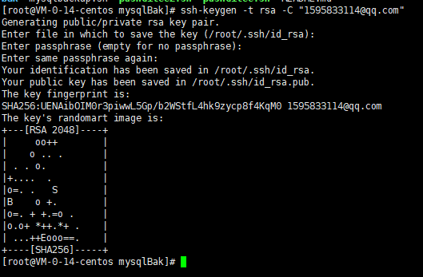
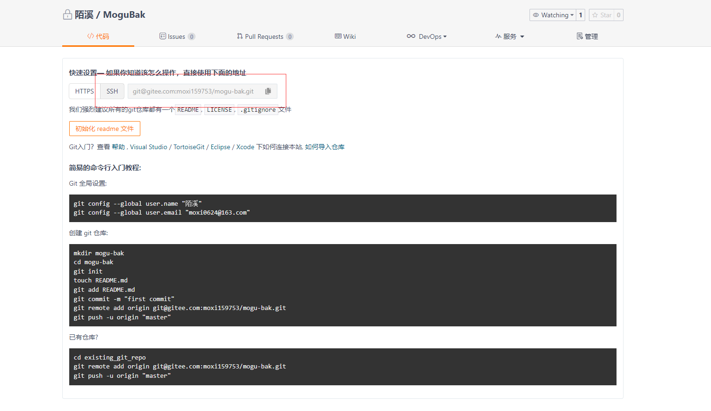
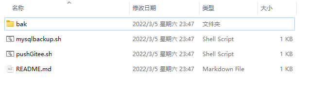

大家好，我是**陌溪**

最近，在群里经常看到小伙伴的服务器被入侵的，数据库被删留下一串索要比特币的信息

目前，无法就是下面几种清空，容易导致服务器被入侵

- MySQL 3306端口，设置弱密码，比如 root  root、root 123456,
- Redis 6379端口，不设置密码，或弱密码
- Docker 2375端口，不加证书，直接暴露公网

以上几种情况，是目前最容易被扫描到，然后植入病毒的。

每次看到群友被删库了，陌溪都会默默的打开 **Sqlyog**，然后默默的把数据库文件备份一次


今天一看，好家伙，已经备份了快 **40** 次了！也就是在这几年的时间里，目睹了快 **40** 个小伙伴的数据库被删了

## 设置密钥

为了防止蘑菇重蹈覆辙，陌溪决定给蘑菇博客做一个定时备份功能

至于备份的数据存哪里呢？开始想到的是通过右键发送到自己的邮箱，当然突然想想这个数据库文件可能比较大，最后可能也不给上传

最后，打算将备份好的数据脚本，能够上传到 Gitee 私有仓库中

首先，就需要创建秘钥，用于配置服务器的无密提交，通过下面命令创建秘钥

```bash
ssh-keygen -t rsa -C "1595833114@qq.com"
```

按几次回车，完成秘钥的生成



然后到ssh目录，查看刚刚生成的秘钥

```bash
cd ~/.ssh
```

看下日期， 23:18分，没错就是刚刚生成的


然后我们把 **id_rsa.pub** 文件的内容拷贝，打开 Gitee 网站

```bash
https://gitee.com/profile/sshkeys
```

添加生成的 **public key** 添加到仓库中


添加完成后，保存即可，然后回到服务器中，使用下面的命令，测试自己刚刚添加是否成功

```bash
ssh -T git@gitee.com
```

首次使用需要确认并添加主机到本机SSH可信列表，回复 **yes** 即可


然后就会提示成功完成校验，并输出自己的 **Gitee** 昵称

同时，细心的同学可能还注意到了后面的一句话

```bash
but GITEE.COM does not provide shell access.
```

这是啥意思呢？为了解答大家的疑惑，陌溪特意去搜素了一下

大致意思是：Gitee不提供shell（ssh）访问/接入权限。ssh -T 选项的意思为，不分配伪终端。

当你在使用ssh协议连接到自己或者其他服务器时，本地终端会显示命令提示符，你可以在上面操作输入命令Is等。

结合上面几点，这句话的意思即为你无法使用 **ssh** 协议直接登录 **Gitee**，在 **Gitee** 服务器上建立一个伪终端，并进行操作。所以，这句提示并不是一个错误，而是Gitee 输出的一句提示语。同样你可以在本地使用 **ssh** 协议进行 **git** 相关操作，并提交到 **Gitee**，没有任何影响。


## 创建私有仓库

配置完秘钥后，就可以创建我们的私有仓库了，取名 **MoguBak**

> tip：千万记得设置成私有仓库！！


配置完成后，选择 **SSH** 的方式



然后，按照上面的步骤

首先在服务器中，配置我们的 **Git** 全局信息

```bash
git config --global user.name "陌溪"
git config --global user.email "moxi0624@163.com"
```

## 下载脚本

然后开始下载陌溪的备份文件 mysqlBak.zip，解压后得到如下内容



- **mysqlbackup.sh** 是我们的备份脚本，用来从 **docker** 镜像中备份数据

- **pushGitee.sh** 脚本是用来推送数据到 **Gitee** 的

- **bak** 目录，存储备份的 **SQL** 脚本

把刚刚下载好的文件，通过xftp工具，丢到 **/root/docker-compose/data** 目录下

给命令配置执行权限

```bash
# 配置执行权限
chmod +x mysqlbackup.sh
chmod +x pushGitee.sh
```

因为蘑菇的 **mysql** 是运行在 **docker** 容器中的，所以我们需要把 **mysqlBak** 这个目录挂载到 **mysql** 容器中

```bash
# 编辑mysql.yml 文件
/root/docker-compose/yaml/mysql.yml
```

然后把 **mysqlBak** 挂载到容器中

```bash
version: '3.1'
services:
  mysql:
    image: registry.cn-shenzhen.aliyuncs.com/mogublog/mysql
    restart: always
    container_name: mysql
    environment:
      MYSQL_ROOT_PASSWORD: mogu2018
    command:
      --default-authentication-plugin=mysql_native_password
      --character-set-server=utf8mb4
      --collation-server=utf8mb4_general_ci
      --explicit_defaults_for_timestamp=true
      --lower_case_table_names=1
    ports:
      - 3306:3306
    volumes:
      - ../data/mysql_data:/var/lib/mysql
      - ./mysql/init/:/docker-entrypoint-initdb.d/
      - ../data/mysqlBak/:/mysqlBak/
    networks:
      - mogu
networks:
  mogu:
    external: true
```

最后，回到 **mysqlBak** 目录中

```bash
cd /root/docker-compose/data/mysqlBak
```

执行下面命令，初始化仓库

```bash
# 初始化仓库
git init 
# 将仓库与远程仓库进行关联
git remote add origin git@gitee.com:moxi159753/mogu-bak.git
```

完事后，执行下面的命令，即可开始进行数据库备份了，同时推送到我们的 **Gitee** 上

```bash
sh pushGitee.sh
```

pushGitee.sh 代码如下

```bash
#!bin/sh
echo start backup mysql
docker exec -i mysql /mysqlBak/mysqlbackup.sh

echo "start push gitee"  

# 将全部信息添加到暂存区
git add *

# 提交
git commit -m "commit"

# push到远程层库
git push -u origin master
```

首先会调用 运行mysql 容器中的 **mysqlbackup.sh** 脚本，从而开始执行 mysqldump 进行备份数据库

```bash
#!bin/bash

dt_now=`date +%Y%m%d`

cd /mysqlBak/bak

mkdir $dt_now

find  /mysqlBak/bak/  -mtime +21 -exec rm -rf {} \;（删除超过21天的备份）

echo "start backup mysql"    #（备份两个数据库）
mysqldump -uroot -pmogu2018 mogu_blog_business > /mysqlBak/bak/$dt_now/mogu_blog_business.sql
mysqldump -uroot -pmogu2018 mogu_picture > /mysqlBak/bak/$dt_now/mogu_picture.sql
```

最终将结果输出到容器的  **/mysqlBak/bak** 目录

## 同步到Gitee仓库

而刚刚我们已经将容器中的 **/mysqlBak** 目录挂载到 **/root/docker-compose/data/mysqlBak** 目录了

所以，最终我们将 **mysqlBak** 目录进行完整的推送到服务器，从而完成数据的备份


然后去 **Gitee** 仓库中，即可看到刚刚备份的内容了


最后，点开 **bak** 目录，可以看到我们所要备份的脚本


## 设置定时任务

最后一步，只需要开启每天定时同步任务即可，这里就需要用到 **crontabs** 

**crond** 是 **linux** 下用来周期性的执行某种任务或等待处理某些事件的一个守护进程，与windows下的计划任务类似，当安装完成操作系统后，默认会安装此服务工具，并且会自动启动 **crond** 进程，**crond** 进程每分钟会定期检查是否有要执行的任务，如果有要执行的任务，则自动执行该任务。

用户定期要执行的工作，比如用户数据备份、定时邮件提醒等。用户可以使用 **crontab** 工具来定制自己的计划任务。所有用户定义的 **crontab** 文件都被保存在  **/var/spool/cron** 目录中。其文件名与用户名一致。

下面是 **crond** 的常用命令

```bash
# 安装
yum install crontabs

# crond启动命令
systemctl start crond

# 关闭
systemctl stop crond

#开启自启
systemctl enable crond
```

那么介绍就到这里了，下面我们需要开始创建定时任务了！

首先使用 **crontab -e** 命令 ，会打开一个创建定时任务的 **vi** 窗口，在上面输入需要执行脚本的命令，

```javascript
10 2 * * * sh /root/docker-compose/data/mysqlBak/pushGitee.sh > /root/bak.log  2>&1 &
```

设置就是每天 **2点10分**，执行 **pushGitee.sh** 文件夹下的定时备份脚本，同步我们的数据库到 **Gitee** 中，再也不怕被删库了

好了，本期的教程就到这里了

我是陌溪，我们下期再见
