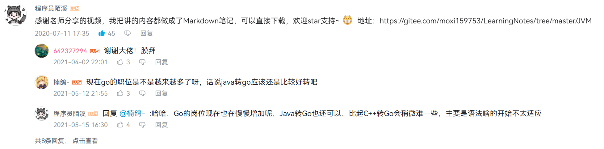
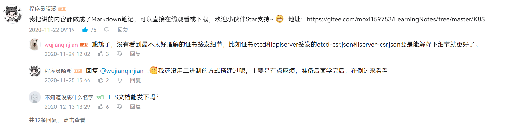
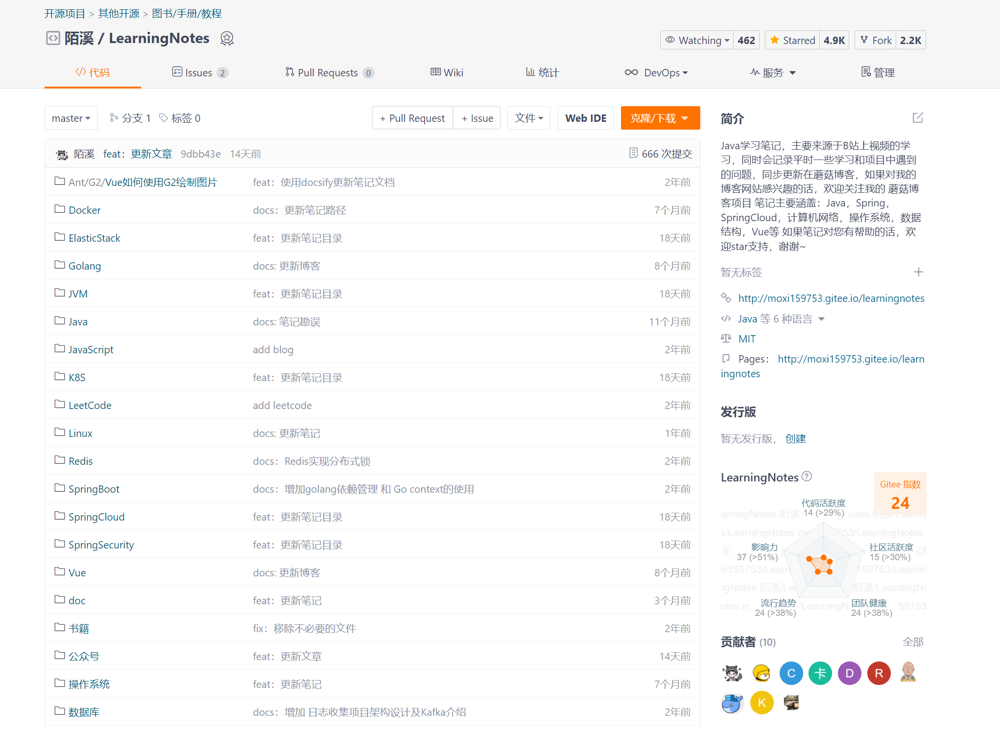
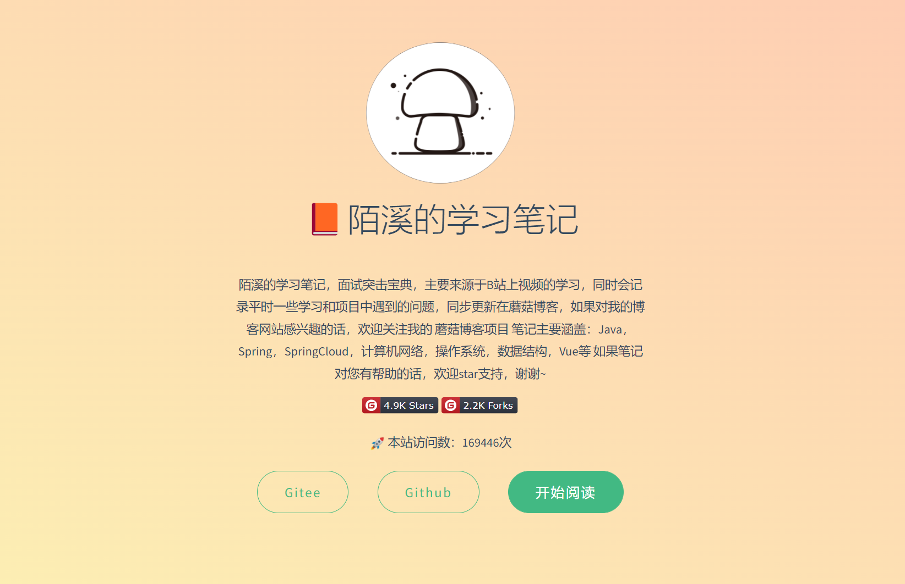
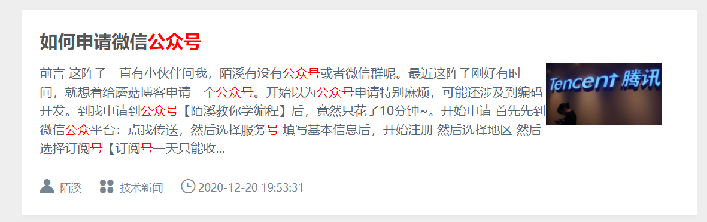

大家好，我是**陌溪**

历经 **14** 个月，我的公众号也终于在 **2022.2.22** 号这天，突破了万粉~（虽然鸽了一个月，才写下这篇文章。。）

在这一年多的时间里，中间有无数次想要放弃，也因为各种各样的事情搁置了，然后停更了。。

不过好在有很多小伙伴的支持，写的文章也能帮助到一部分人，让我能够一路坚持走下来。我答应你们，下次一定不水文~

## 为什么要写公众号？

说实话，在我写公众号之前，其实已经有写文章的习惯了。那会写文章的目的也很简单，就是把自学的内容记录写来，然后放在自己写的开源的博客系统：**蘑菇博客** 上，方便以后打开看看加深印象，因为本人也非常容易对学过的知识遗忘。

目前在蘑菇博客也开放了投稿的入口，欢迎各位小伙伴能够一起来投稿来丰富社区内容~

如果经常在 **B** 站学习的小伙伴，可能会在很多 **Java** 学习类视频下看到我的身影，因为我每次在 **B** 站自学完一个视频后，会把笔记记录下来，然后贴出来~

那会是在 **2020** 年 **4~6** 月，也是校招还没开始的那会，为了准备大厂的校招面试，把面试常考的内容都刷了一遍，当然最后也如愿成功上岸 **字节跳动**

>  愿小伙伴们的每一份努力都不被辜负~

- **尚硅谷Java大厂面试题第2季**

- **尚硅谷宋红康JVM全套教程**

- **【尚硅谷】Kubernetes（k8s）入门到实战教程**

最后我把这些笔记都汇总整理了起来，放到了 **Gitee** 的仓库上，所以 **LearningNotes** 就这样诞生了，目前已在 **Gitee** 积累了 **4.9K Star** 了

> 笔记仓库地址：
>
> https://gitee.com/moxi159753/LearningNotes

本仓库主要来源于 **B** 站上视频的学习，同时会记录平时一些学习和项目中遇到的问题， 笔记主要涵盖：**Java**，**Spring**，**SpringCloud**，计算机网络，操作系统，数据结构，**Vue** 等，当然我也会定期把一些公众号的文章同步到这里，但是公众号的文章都是首发的~

同时，为了方便大家的阅读，陌溪使用 **docsify** 搭建了一套笔记网站：[陌溪在开源社区逛了几个月, 终于写下了蘑菇博客的开源文档](https://mp.weixin.qq.com/s/VXH19dQRkNtPbzDMVXwsPQ)

>  在线阅读：http://note.moguit.cn/

## 什么时候开始的？

陌溪是在 **2020** 年 **12** 月底，在实验室小伙伴 **@拓跋阿秀** 的邀请下，一起开始玩公众号的（**PS**：秀哥的运营能力杠杠的，已经望尘莫及了~ 得好好跟着学习）

那时候秋招 **Offer** 签了三方，小论文也发了，学校的毕业条件也达到了，所以那段时间是最悠闲的校园时光。

**2020** 年 **12** 月 **25** 号，写下了第一篇关于 **Java** 自学的文章：[蘑菇博客从0到2000Star，分享我的Java自学路线图](https://mp.weixin.qq.com/s/3u6OOYkpj4_ecMzfMqKJRw)，里面详细的介绍了作为一个 **Java** 开发应该掌握的一些技术。

**2020** 年 **12** 月 **27** 号，写下了关于我的学习路线：[从三本院校到斩获字节跳动后端研发Offer-讲述我的故事](https://mp.weixin.qq.com/s/c4rR_aWpmNNFGn-mZBLWYg)，里面的我有迷茫，有挫折，也有坚持，最后也庆幸自己能够一路坚持走过来。

在玩公众号的这一年了，我一共写 **69** 篇原创文章，内容主要以：**蘑菇技术学习**、**开源项目**、**校招面试**、**软件推荐**为主，当然也有一丝人间烟火气息~

同时，陌溪也会帮助学弟学妹们提供一些简历修改的意见，分享他们进入大厂的经验，帮助大家树立学习的目标~

- [双非本科，折戟成沙铁未销，九面字节终上岸！](https://mp.weixin.qq.com/s/SRf2f8wFFyjz2BUUXD_pmg)

- [恭喜这位学弟！民办二本九面字节终上岸](https://mp.weixin.qq.com/s/mE8AjQdQP8cgsWPVUbLBHA)

在编程技术类的公众号领域，其实想做起来也是比较难的，因为有的时候费劲心思写了一篇自以为干货满满的文章，发表出去一看阅读量就两位数。

所以，后面我也会不断调整原创文章输出的风格，保证文章诙谐易懂且能帮助小伙伴学到东西，当然如果小伙伴们有好的建议，也可以和我私信提出来呢

## 唠唠嗑

其实，写公众号这件事并不难，之前我也在蘑菇博客写过一篇关于创建公众号的文章，只需要轻轻松松 **10** 分钟，就能快速的创建个人公众号~

> 如何申请公众号：
>
> http://www.moguit.cn/info/579

之前，就有很多小伙伴反馈太难部署，所以我就从：手动部署 -> **Docker** 部署 -> **DockerCompose** 部署 -> 一条命令部署，所以就有了这篇文章：[如何使用一条命令完成蘑菇博客的部署？](https://mp.weixin.qq.com/s/LgRIqdPAGzN1tCPMi0Y8RQ)

部署虽然是容易了，一条命令就能完成部署，从而快速搭建博客系统，但是很多小伙伴整完服务器，部署完后就放着吃灰了。。

写公众号，其实也是一样的道理，如果想要持续不断的创作，并且能坚持下来的话，那确实是很困难的。

因为如果要写一篇原创文章，从构思、撰写、排版、发表都是比较费时费力的，基本上就占据了业余的大部分时间，那为什么我还要坚持走这条路呢？

其实，在网上已经有非常多关于程序员写博客的好处的帖子，但是真正动手去写的人却很少，可能很多人抱着我不是大牛，写出来的文章没有任何价值。

最开始的时候，我也有这个观点，但是后面我尝试把自己在学习过程中遇到的问题，总结出一篇篇的文章，后面发现竟然还有人点赞，这个时候我就发现了，我们所创建的价值，只需要帮助那小小的一批人就可以了~

同时，坚持写文章，也算是给自己的一份总结，通过定期 **Review** 文章的时候，才会发现自己原来写的内容有那些需要提高的。

其实，写文章的过程，也是一个倒逼自己学习的过程，毕竟只有通过不断的学习和输入内容，才能够有动力来输出。

通过写文章和公众号，我也认识了很多志同道合的小伙伴。有比我小的学弟，也有同龄的和工作多年的大佬，都在公众号上玩的风生水起。我们也经常会一起探讨公众号的运营、引流、变现等方式，共同进步~

## 未来的计划

首先，应该是继续维护蘑菇社区的项目，争取接入更丰富的社区内容，目前已经接入的功能模块有：**签到**、**积分**、**面经**、**课程**、**动态**、**私信**、**个人中心**、**SEO**

后面的话，也会这些社区模块进行展开讲解，并输出一些相应的公众号文章~

另外，就是社区小程序的建设，因为目前社区已经加了很多模块了，而现在的小程序还是以文章为主，略显的内容有些单调，后续另外会重构小程序，并推出社区版小程序功能来丰富维度。

然后，是关于蘑菇 **K8S** 建设，之前很多热心的小伙伴赞助蘑菇服务器，用来支持蘑菇 **K8S** 搭建后续我也会整理出一份文档出来，教各位小伙伴们如果在 **K8S** 集群搭建蘑菇博客~

非常感谢以下各位群友小伙伴的服务器捐赠（排名不分先后）

> @网课哥、@冰冰、@向后哥、@touchfish、@炫酷小辉、@泪梦红尘、@wechat小冰

其次，是对笔记仓库 **LearningNotes** 的内容进行梳理，因为原来整理的结构不太适合小伙伴进行系统的学习，后续也会对笔记的目录和样式进行重构，同时会推出一份完整的笔记 **PDF** 版本，方便小伙伴们离线进行学习~

最后，就是公众号未来的方向，大方向还是不会变的，会以 **蘑菇博客** 上的技术讲解文章，然后同时会有 面试相关、生活相关的内容~

好了，蘑菇未来的规划就到这里了，最后再次感谢各位小伙伴的支持~

我是陌溪，我们下期再见~

