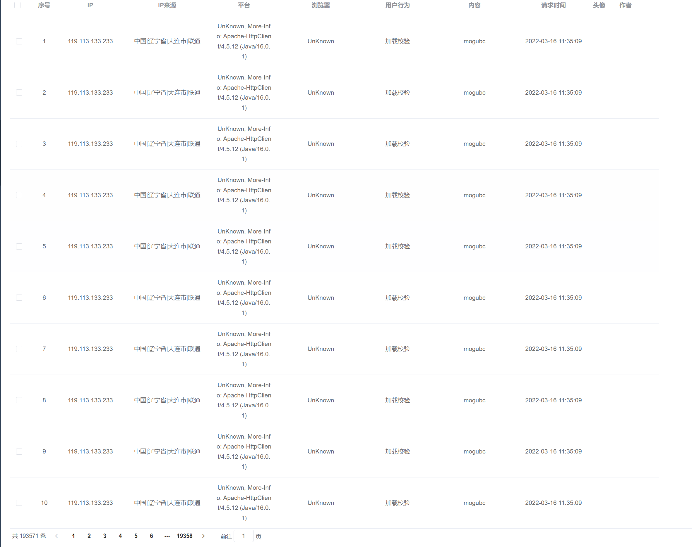
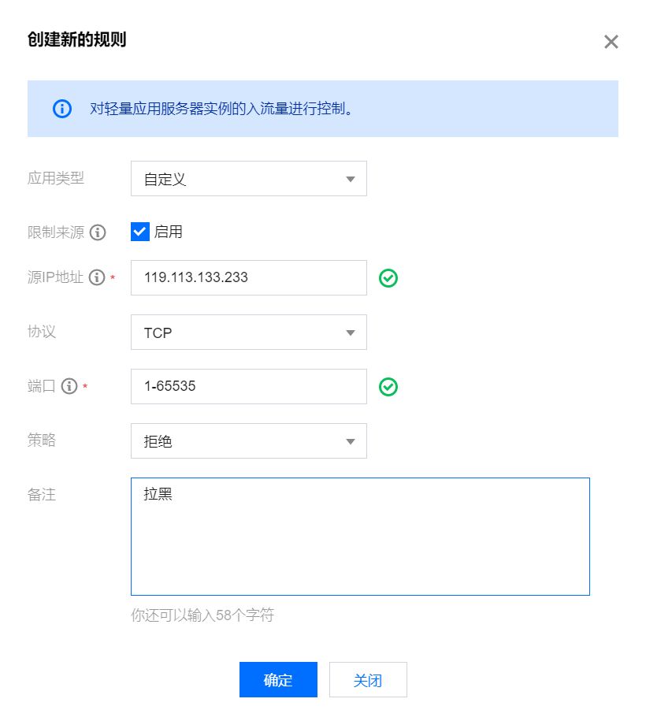
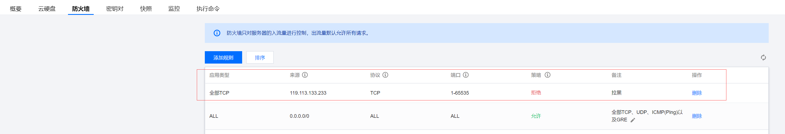
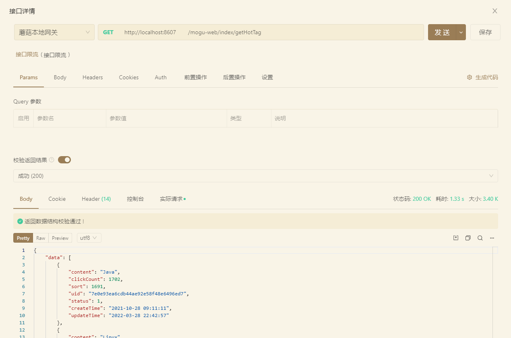
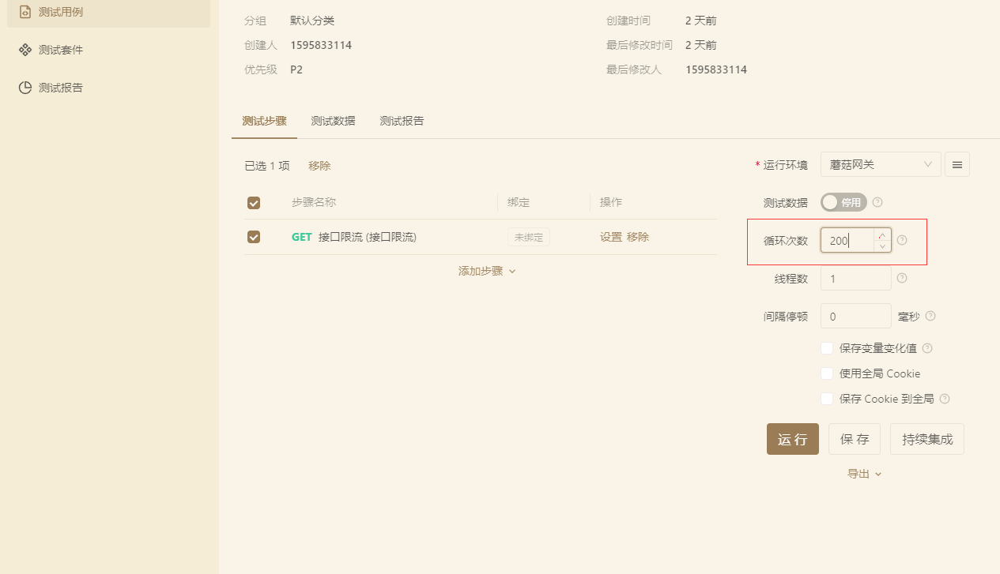
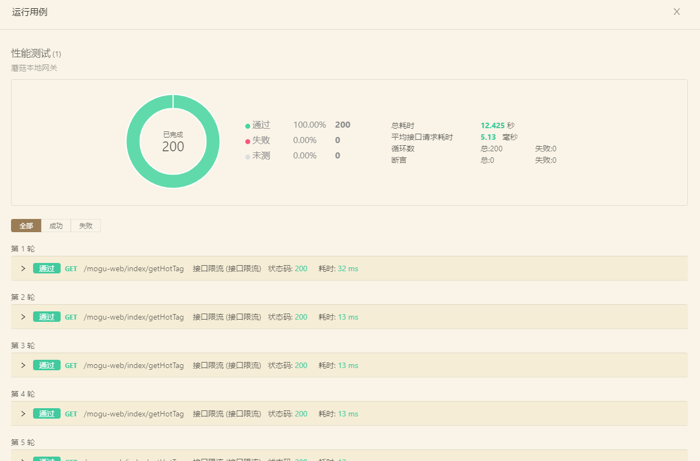
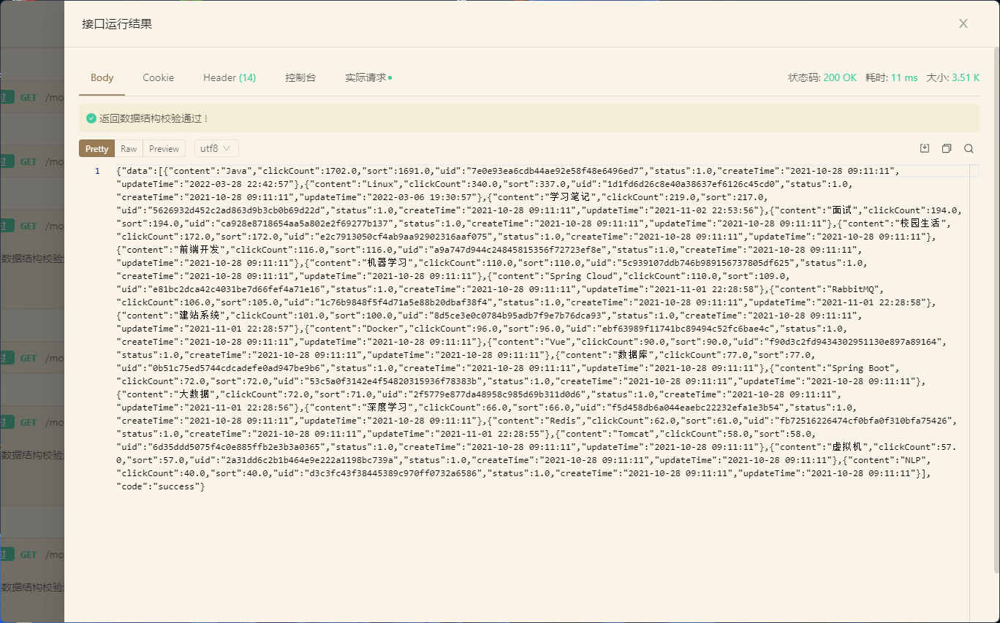
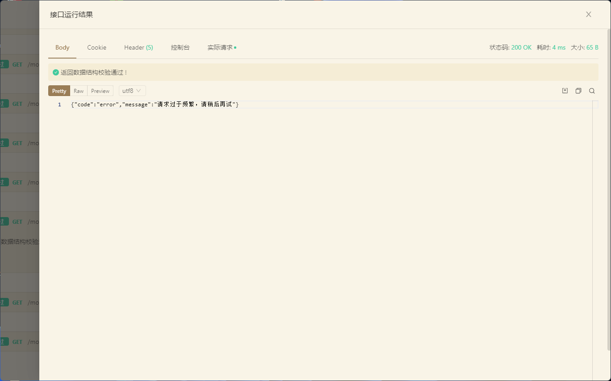
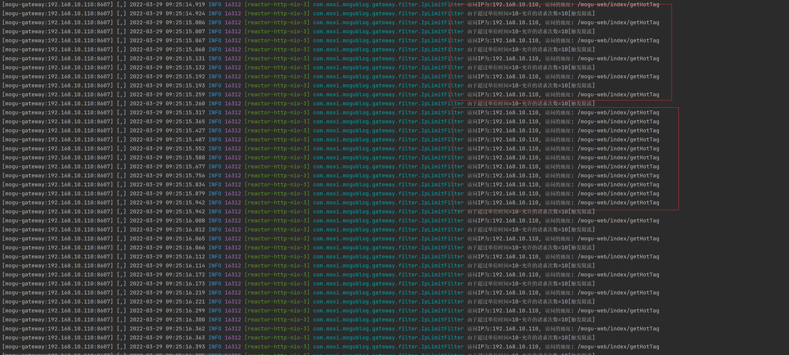

大家好，我是**陌溪**

前阵子，陌溪在快乐搬砖的时候，突然群里小伙伴们疯狂 **@** 我，说蘑菇社区今天打不开了！

遇到事情不要慌，我琢磨着估计可能是网站又宕机了，重启一下就完事了

然后打开了蘑菇后台，顿时吓了一跳，好家伙今天的 **PV** 竟然有 **19w**，要知道蘑菇这个小破站，每天撑死也就几千的访问量，咋突然今天蹦到 **19W** 了，难道蘑菇火了？ 

带着疑惑，看了看下方的 **UV** 数，还是这 260 多的人数，咋就能搞到 **19W** 的 **UV**，难不成每个人把蘑菇文章都看了一遍？


我马上切到了蘑菇后台日志，好家伙原来你这小子，还用 **Jmeter** 在这压测蘑菇呢？直接给干了 **19W** 条记录，把蘑菇服务都给干趴了要



我反手就是复制一波 **IP**，然后打开腾讯云服务器后台，找到防火墙创建新的规则，然后策略改为拒绝，同时这个小伙子的 **ip** 地址给加上去，同时端口选择全部端口，即 **1-65535**



创建完规则后，点击确定即可看到此条规则已经开始生效了



然后切到蘑菇的后台，再也没有看到接口有被刷的迹象，至此恢复了正常。

突然，我又想到了，这个小伙子会不会回头换了一个 **ip** 又卷土重来了？

那我岂不是他来一个 **ip**，就得封杀一个 **ip** ？这也太麻烦了吧


突然想到了，是不是可以在网关上搞点事，原来的蘑菇网关，啥事没做，就只用来转发了一个请求

我们都知道 **Gateway** 是对所有 **API** 服务进行统一管理的平台， 除了最基本的 **路由** 功能外，还可以实现 **安全验证**、**过滤**、**流控** 等策略

所以，就想到了用 **Gateway** 做一个限流功能，当某个 **ip** 访问次数过多的时候，直接给它拦截下来，防止一下把我们的服务给打挂了

## 定义全局过滤器

全局过滤器是作用于所有经过网关转发的请求的，实现 **GlobalFilter** 接口即可

同时 **Gateway** 是通过同时实现 **Ordered** 接口来实现控制过滤器的过滤顺序的，其中 **id** 越小其代表的优先级越高。

完整的文件结构如下所示：


在 **Gateway** 项目中，创建全局拦截器文件 **IpLimitFilter.java**

```bash
/**
 * IP限流
 * @author 陌溪
 * @date 2022年3月28日08:40:37
 */
@Slf4j
@RefreshScope
@Component
public class IpLimitFilter implements GlobalFilter, Ordered {
    @Override
    public Mono<Void> filter(ServerWebExchange exchange, GatewayFilterChain chain) {
  		return null;
  	}

    @Override
    public int getOrder() {
        return 1;
    }
}
```

## 基于 Redis 的分布式限流算法

实现了全局拦截器后， 陌溪在愉快的网上冲浪时，发现了一个 **spring-boot-redis-ip-limiter** 开源项目，使用的是 SpringBoot + Redis 组件，实现一个分布式接口 **IP** 限流功能 。

> Github地址：
>
> https://github.com/yudiandemingzi/spring-boot-redis-ip-limiter

### 项目的场景

为了防止我们的接口被人恶意访问，比如有人通过 **JMeter** 工具频繁访问我们的接口，导致接口响应变慢甚至崩溃,所以我们需要对一些特定的接口进行IP限流,即一定时间内同一 **IP** 访问的次数是有限的。

### 实现原理

用 **Redis** 作为限流组件的核心的原理,将用户的 **IP** 地址当 **Key**,一段时间内访问次数为 **value** ,同时设置该 **Key** 过期时间。

比如某接口设置  相同 **IP** **10** 秒 内请求 **5** 次，超过 **5** 次不让访问该接口。

1. 第一次该 **IP** 地址存入 **Redis** 的时候，key值为 **IP** 地址, **value**值为 **1**，设置 **key** 值过期时间为 **10** 秒。
2. 第二次该 **IP** 地址存入 **Redis** 时，如果 **key** 没有过期,那么更新 **value** 为 **2**。
3. 以此类推当 **value** 已经为 **5** 时，如果下次该 **IP** 地址在存入 **Redis** 同时 **key** 还没有过期，那么该 **Ip** 就不能访问了。
4. 当**10** 秒后，该 **key** 值过期，那么该 **IP** 地址再进来，**value** 又从 **1** 开始，过期时间还是 **10** 秒，这样反反复复。

说明：从上面的逻辑可以看出，是一时间段内访问次数受限,不是完全不让该 **IP** 访问接口。

技术框架：**SpringBoot** + **RedisTemplate** （采用自定义注解完成）

### 实现

因为原来的代码是使用 **AOP + 自定义注解** 的方式实现的，不太适用于网关的场景，所以我们可以把部分的核心代码放到 全局拦截器 **IpLimitFilter.java** 中

首先，引入项目中用到的 **maven** 依赖，因为需要使用 **Redis**，所以将 **Redis** 依赖引入

```pom
<dependency>
	<groupId>org.springframework.data</groupId>
	<artifactId>spring-data-redis</artifactId>
</dependency>

<dependency>
	<groupId>redis.clients</groupId>
	<artifactId>jedis</artifactId>
	<version>3.0.1</version>
</dependency>
```

然后，增加 **RedisTemplate** 的配置文件，**RedisConfig.java**

```java
@Configuration
public class RedisConfig extends CachingConfigurerSupport {

    @Bean
    public KeyGenerator keyGenerator() {
        return new KeyGenerator() {
            @Override
            public Object generate(Object target, java.lang.reflect.Method method, Object... params) {
                StringBuilder sb = new StringBuilder();
                sb.append(target.getClass().getName());
                sb.append(method.getName());
                for (Object obj : params) {
                    sb.append(obj.toString());
                }
                return sb.toString();
            }
        };
    }

    @Bean
    public CacheManager cacheManager(RedisConnectionFactory factory) {
        RedisCacheManager cacheManager = RedisCacheManager.create(factory);
        return cacheManager;
    }

    @Bean
    public RedisTemplate<String, String> redisTemplate(RedisConnectionFactory factory) {
        StringRedisTemplate template = new StringRedisTemplate(factory);
        Jackson2JsonRedisSerializer jackson2JsonRedisSerializer = new Jackson2JsonRedisSerializer(Object.class);
        ObjectMapper om = new ObjectMapper();
        om.setVisibility(PropertyAccessor.ALL, JsonAutoDetect.Visibility.ANY);
        om.enableDefaultTyping(ObjectMapper.DefaultTyping.NON_FINAL);
        jackson2JsonRedisSerializer.setObjectMapper(om);
        template.setValueSerializer(jackson2JsonRedisSerializer);
        template.afterPropertiesSet();
        return template;
    }

}
```

开始在 **IpLimitFilter.java** 的全局拦截器中，实现我们的限流算法

首先，在 **nacos** 中的  **mogu-gateway-dev.yaml** 添加相关的配置

```yml
#spring
spring:
  #redis
  redis:
    host: 127.0.0.1 #redis的主机ip
    port: 6379

# 基于方法的全局IP限流
IpLimiter:
  # 时间，单位秒
  expireTime: 1  
  # 单位时间限制通过请求数  
  limitTimes: 20
```

下面是 **IpLimitFilter** 的完整代码

```java
/**
 * IP限流全局拦截器
 * @author 陌溪
 * @date 2022年3月28日08:40:37
 */
@Slf4j
@RefreshScope
@Component
public class IpLimitFilter implements GlobalFilter, Ordered {

    @Resource
    RedisTemplate redisTemplate;

    // 限流时间(单位：秒)
    @Value(value = "${IpLimiter.expireTime:1}")
    private Integer expireTime;

    // 限流次数
    @Value(value = "${IpLimiter.limitTimes:100}")
    private Integer limitTimes;

    /**
     * getRedisScript 读取脚本工具类
     * 这里设置为Long,是因为ipLimiter.lua 脚本返回的是数字类型
     */
    private DefaultRedisScript<Long> getRedisScript;

    private static String SIGN = ":";

    private static String IP_LIMIT_FILTER = "IP_LIMIT_FILTER:";

    // ip请求黑名单
    private static String IP_LIMIT_BLACK_LIST = "IP_LIMIT_BLACK_LIST:";

    @PostConstruct
    public void init() {
        getRedisScript = new DefaultRedisScript<>();
        getRedisScript.setResultType(Long.class);
        getRedisScript.setScriptSource(new ResourceScriptSource(new ClassPathResource("ipLimiter.lua")));
        log.info("IpLimitHandler[分布式限流处理器]脚本加载完成");
    }

    @Override
    public Mono<Void> filter(ServerWebExchange exchange, GatewayFilterChain chain) {

        log.debug("IpLimitFilter[分布式限流处理器]开始执行限流操作");

        ServerHttpRequest request = exchange.getRequest();
        ServerHttpResponse response = exchange.getResponse();
        String limitIp = IpUtil.getIpAddr(request);
        //获取请求路径
        String url = request.getPath().toString();
        log.info("访问IP为:{}, 访问的地址: {}", limitIp, url);

        /**
         * 执行Lua脚本
         */
        List<String> ipList = new ArrayList();
        // 设置key值为注解中的值
        String key = IP_LIMIT_FILTER.concat(url).concat(SIGN).concat(limitIp);
        ipList.add(key);

        /**
         * 调用脚本并执行
         */
        Long result = (Long) redisTemplate.execute(getRedisScript, ipList, expireTime, limitTimes);
        if (result == 0) {
            // TODO 放进全局黑名单【用于后续观察】
            redisTemplate.opsForValue().set(IP_LIMIT_BLACK_LIST + limitIp, 1, 7, TimeUnit.DAYS);

            String msg = "由于超过单位时间=" + expireTime + "-允许的请求次数=" + limitTimes + "[触发限流]";
            log.info(msg);
            // 达到限流返回给前端信息
            String errMessage = "{\"code\":\"error\",\"message\":\"请求过于频繁，请稍后再试\"}";
            byte[] bits = errMessage.getBytes(StandardCharsets.UTF_8);
            DataBuffer buffer = response.bufferFactory().wrap(bits);
            //指定编码，否则在浏览器中会中文乱码
            response.getHeaders().add("Content-Type", "text/plain;charset=UTF-8");
            return response.writeWith(Mono.just(buffer));
        } else {
            // 直接放行
            return chain.filter(exchange);
        }
    }

    @Override
    public int getOrder() {
        return 1;
    }
}
```

这里为了保证原子性，这边写了 **redis** 脚本 **ipLimiter.lua** 来执行 **redis** 命令，来保证操作原子性。

```lua
--获取KEY
local key1 = KEYS[1]

local val = redis.call('incr', key1)
local ttl = redis.call('ttl', key1)

--获取ARGV内的参数并打印
local expire = ARGV[1]
local times = ARGV[2]

redis.log(redis.LOG_DEBUG,tostring(times))
redis.log(redis.LOG_DEBUG,tostring(expire))

redis.log(redis.LOG_NOTICE, "incr "..key1.." "..val);
if val == 1 then
    redis.call('expire', key1, tonumber(expire))
else
    if ttl == -1 then
        redis.call('expire', key1, tonumber(expire))
    end
end

if val > tonumber(times) then
    return 0
end
return 1
```

获取用户 **IP** 的工具类 **IpUtil.java**

```java
@Slf4j
public class IpUtil {
    public static String getIpAddr(ServerHttpRequest request) {
        HttpHeaders headers = request.getHeaders();
        String ipAddress = headers.getFirst("X-Forwarded-For");
        if (ipAddress == null || ipAddress.length() == 0 || "unknown".equalsIgnoreCase(ipAddress)) {
            ipAddress = headers.getFirst("Proxy-Client-IP");
        }
        if (ipAddress == null || ipAddress.length() == 0 || "unknown".equalsIgnoreCase(ipAddress)) {
            ipAddress = headers.getFirst("WL-Proxy-Client-IP");
        }
        if (ipAddress == null || ipAddress.length() == 0 || "unknown".equalsIgnoreCase(ipAddress)) {
            ipAddress = request.getRemoteAddress().getAddress().getHostAddress();
            if (ipAddress.equals("127.0.0.1") || ipAddress.equals("0:0:0:0:0:0:0:1")) {
                // 根据网卡取本机配置的IP
                try {
                    InetAddress inet = InetAddress.getLocalHost();
                    ipAddress = inet.getHostAddress();
                } catch (UnknownHostException e) {
                    log.error("根据网卡获取本机配置的IP异常", e);
                }

            }
        }

        // 对于通过多个代理的情况，第一个IP为客户端真实IP，多个IP按照','分割
        if (ipAddress != null && ipAddress.indexOf(",") > 0) {
            ipAddress = ipAddress.split(",")[0];
        }

        return ipAddress;
    }
}
```

## 测试

下面，就进入了激动人心的测试环节了

首先，我们随意找一个不需要鉴权的接口，比如 **mogu-web** 的 **getHotTag**



然后设置循环调用 **200** 次，点击启动进行压测



点击启动，就可以看到 **200** 条请求已经完成了，因为这个请求没有编写对应的断言，所以只要返回 **http status = 200** 就代表成功



点开第**7、8**轮的时候，可以发现请求的是有正常返回的



但是到了 **10** 多轮的时候，可以看到接口已经触发了限流了，直接在网关就返回了错误信息


同时，观察日志可以看到，每隔一段时间后，在后台又会重新刷新我们的 **ip** 限流次数



到这里，我们的 **Gateway** 限流算法就已经实现了，细心的小伙伴可能会发现，我们在代码中还留了一个 **TODO**

后续，可以接着这里继续扩展，做一个动态的全局 **IP** 黑名单功能，封掉那些屡屡来压测蘑菇的 **Ip** 地址~

```java
// TODO 放进全局黑名单【用于后续观察】
redisTemplate.opsForValue().set(IP_LIMIT_BLACK_LIST + limitIp, 1, 7, TimeUnit.DAYS);
```

好了，本期的 **Gateway** 限流算法教程就到这里了

我是 **陌溪**，我们下期再见

## 巨人肩膀

- https://blog.csdn.net/chaojunma/article/details/107352526

- https://www.jianshu.com/p/55de48fc484b
- https://github.com/yudiandemingzi/spring-boot-redis-ip-limiter
