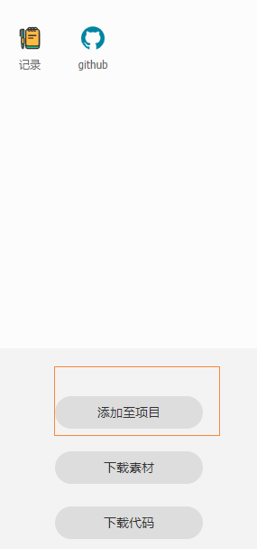
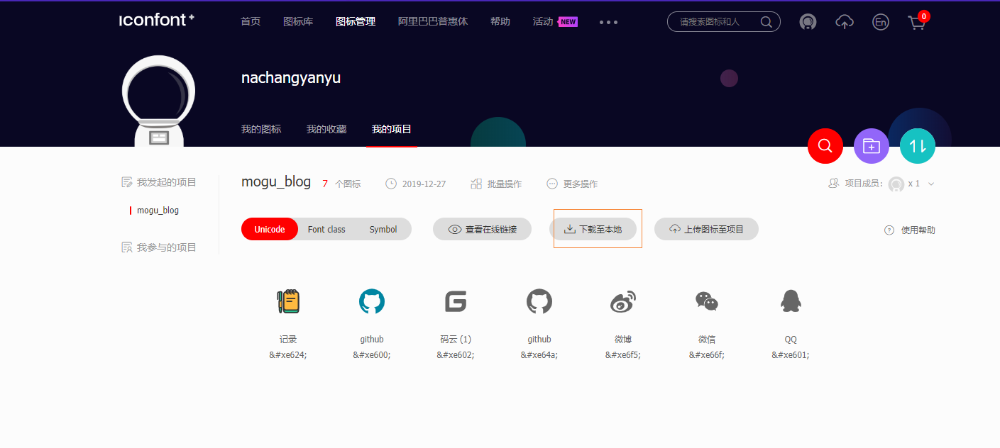
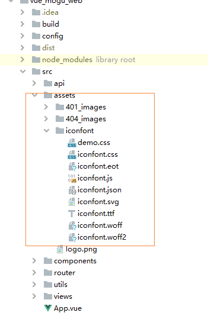

## 前言

大家好，我是**陌溪**

蘑菇博客前端页面最开始使用的图标都是一张张的 **png** 图片，在不同的分辨率上会出现失真的情况，后面在其它小伙伴的介绍下，我了解到了**矢量图标**。

矢量图是根据几何特性来绘制图形，矢量可以是一个点或一条线，矢量图只能靠**软件**生成，文件占用内在空间较小，因为这种类型的图像文件包含独立的分离图像，可以自由无限制的重新组合。它的特点是**放大后图像不会失真**，和**分辨率**无关，适用于图形设计、文字设计和一些标志设计、版式设计等。

因此打算将原来页面中的小图标都使用**矢量图标**来替换，经过调查后，发现目前比较主流的矢量图标库有下面两个

> 阿里巴巴矢量图标库：https://www.iconfont.cn/
>
> Fontawesome：http://www.fontawesome.com.cn/

本文将以阿里巴巴矢量图标为例，开始讲解矢量图标在蘑菇博客中的使用。

## 采购图标

首先进入阿里巴巴矢量图标库的官网 ( https://www.iconfont.cn/ )。然后输入我们需要采购的图标，这里以 **Github** 为例


然后在选中对应的图标，加入购物车，挑选完成后，我们点击购物车，然后点击添加至项目



这个时候，下面会出现有一个弹框，如果没有对应的项目的话，我们需要自己创建一个


然后点击下载到本地



## 引入矢量图标

下载完成后，我们解压文件夹，将得到以下的内容


我们打开 **demo_index.html** 文件，将看到我们刚刚下载的几个图标


同时能看到每个图标对应的Unicode码，我们就安装第一种方式引入到Vue项目中

首先将刚刚文件夹内，除了 **demo_index.html** 的文件都复制到 **vue** 项目的 **assest** 中，创建一个文件夹叫**iconfont**。



需要在 **main.js** 中引入样式文件

```bash
import "@/assets/iconfont/iconfont.css";
```

就可以使用了，注意 `<span>` 标签中的内容，就是个刚刚 **demo_index.html** 中的 **Unicode** 编码，我们引入对应的编码即可得到对应的图标。

```bash
<span class="iconfont">&#xe601;</span>
<span class="iconfont">&#xe66f;</span>
```

同时还可以设置矢量图标的颜色，下面看看最终的效果图


结语
--

**陌溪**是一个从三本院校一路摸滚翻爬上来的互联网大厂程序员。独立做过几个开源项目，其中**蘑菇博客**在码云上有 **2K Star** 。目前就职于**字节跳动的Data广告部门**，是字节跳动全线产品的商业变现研发团队。本公众号将会持续性的输出很多原创小知识以及学习资源。如果你觉得本文对你有所帮助，麻烦给文章点个「赞」和「在看」。同时欢迎各位小伙伴关注陌溪，让我们一起成长~

