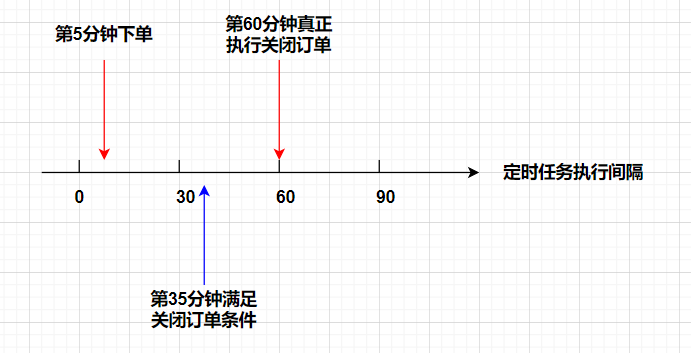
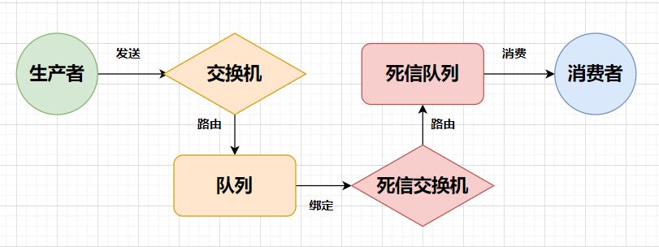
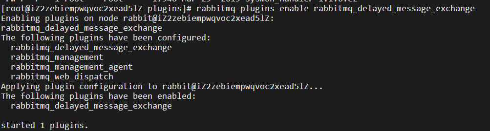
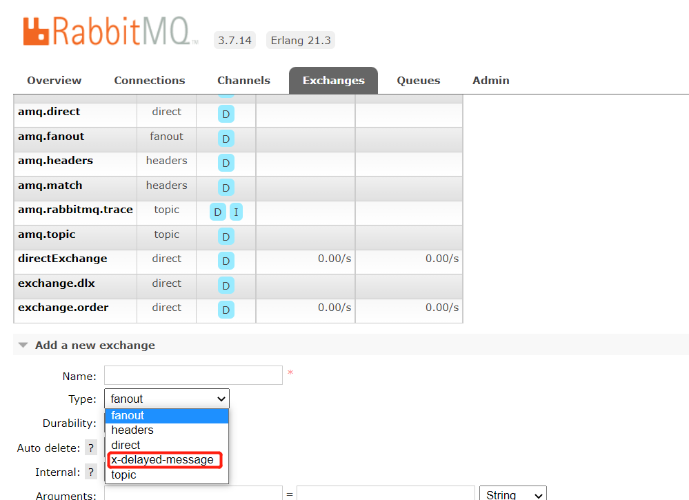

大家好，我是**陌溪**

依旧还记得之前的线上事故 [陌溪让公司损失了100万。。](http://mp.weixin.qq.com/s?__biz=MzkyMzE5NTYzMA==&mid=2247487332&idx=1&sn=404cd8f47bd969ccbd1d7f95ab87c3cc&chksm=c1e98ee5f69e07f3819dff2b7b4111176910f8f88f48b2d8cf688e3f7ffd8a7a70999efd146a&scene=21#wechat_redirect)就是因为采用定时方式实现而导致的，今天分享一篇电商项目中订单超时关闭逻辑的正确打开方式。

前几天领导突然宣布几年前停用的电商项目又重新启动了，带着复杂的心情仔细赏阅“儿时”的代码，心中的酸楚只有自己能够体会。

这不，昨天又被领导叫进了“小黑屋”，让我把代码重构下进行升级。看到这么“可爱”的代码，心中一万只“xx马”疾驰而过。

让我最深恶痛觉的就是里边竟然用**定时任务**实现了“关闭超时订单”的功能，现在想来，哭笑不得。我们先分析一波为什么大家都在抵制用定时任务来实现该功能。

## 定时任务

关闭超时订单是在创建订单之后的一段时间内未完成支付而关闭订单的操作，该功能一般要求每笔订单的超时时间是**一致**的。

如果我们使用定时任务来进行该操作，很难把握定时任务轮询的时间间隔：

- 时间间隔足够小，在误差允许的范围内可以达到我们说的时间一致性问题，但是频繁扫描数据库，执行定时任务，会造成网络IO和磁盘IO的消耗，对实时交易造成一定的冲击；
- 时间间隔比较大，由于每个订单创建的时间不一致，所以上边的一致性要求很难达到，举例如下: 



假设30分钟订单超时自动关闭，定时任务的执行间隔时间为30分钟：

1. 我们在第5分钟进行下单操作；
2. 当时间来到第30分钟时，定时任务执行一次，但是我们的订单未满足条件，不执行；
3. 当时间来到第35分钟时，订单达到关闭条件，但是定时任务未执行，所以不执行；
4. 当时间来到第60分钟时，开始执行我们的订单关闭操作，而此时，误差达到25分钟。

经此种种，我们需要舍弃该方式。

## 延时队列

为了满足领导的需求，我便将手伸向了消息队列：`RabbitMQ`。尽管它本身并没有提供延时队列的功能，但是我们可以利用它的存活时间和死信交换机的特性来间接实现。

首先我们先来简单介绍下什么是存活时间？什么是死信交换机？

#### 存活时间

存活时间的全拼是`Time To Live`，简称 `TTL`。它既支持对消息本身进行设置（延迟队列的关键），又支持对队列进行设置（该队列中所有消息存在相同的过期时间）。

- 对消息本身进行设置：即使消息过期，也不会马上从队列中抹去，因为每条消息是否过期是在即将投递到消费者之前判定的；
- 对队列进行设置：一旦消息过期，就会从队列中抹去；

如果同时使用这两种方法，那么以过期时间**小**的那个数值为准。当消息达到过期时间还没有被消费，那么该消息就“死了”，我们把它称为 **死信** 消息。

消息变为死信的条件：

- 消息被拒绝（`basic.reject/basic.nack`），并且`requeue=false`;
- 消息的过期时间到期了；
- 队列达到最大长度；

**队列设置注意事项**

1. 队列中该属性的设置要在第一次声明队列的时候设置才有效，如果队列一开始已存在且没有这个属性，则要删掉队列再重新声明才可以；
2. 队列的 `ttl` 只能被设置为某个固定的值，一旦设置后则不能更改，否则会抛出异常；

#### 死信交换机

死信交换机全拼`Dead-Letter-Exchange`，简称`DLX`。

当消息在一个队列中变成死信之后，如果这个消息所在的队列设置了`x-dead-letter-exchange`参数，那么它会被发送到`x-dead-letter-exchange`对应值的交换机上，这个交换机就称之为死信交换机，与这个死信交换器绑定的队列就是死信队列。

- `x-dead-letter-exchange`：出现死信之后将死信重新发送到指定交换机；
- `x-dead-letter-routing-key`：出现死信之后将死信重新按照指定的`routing-key`发送，如果不设置默认使用消息本身的`routing-key`

> 死信队列与普通队列的区别就是它的`RoutingKey`和`Exchange`需要作为参数，绑定到正常的队列上。

## 实战教学

先来张图感受下我们的整体思路



1. 生产者发送带有 `ttl` 的消息放入交换机路由到延时队列中；
2. 在延时队列中绑定死信交换机与死信转发的`routing-key`；
3. 等延时队列中的消息达到延时时间之后变成死信转发到死信交换机并路由到死信队列中；
4. 最后供消费者消费。

我们在[上文](https://mp.weixin.qq.com/s?__biz=MzI5MDg2NjEzNA==&mid=2247488055&idx=1&sn=6cc16652a669318a020ca1a8c474192a&scene=21#wechat_redirect)的基础上进行代码实现：

#### 配置类

```
@Configuration
public class DelayQueueRabbitConfig {

    public static final String DLX_QUEUE = "queue.dlx";//死信队列
    public static final String DLX_EXCHANGE = "exchange.dlx";//死信交换机
    public static final String DLX_ROUTING_KEY = "routingkey.dlx";//死信队列与死信交换机绑定的routing-key

    public static final String ORDER_QUEUE = "queue.order";//订单的延时队列
    public static final String ORDER_EXCHANGE = "exchange.order";//订单交换机
    public static final String ORDER_ROUTING_KEY = "routingkey.order";//延时队列与订单交换机绑定的routing-key

 /**
     * 定义死信队列
     **/
    @Bean
    public Queue dlxQueue(){
        return new Queue(DLX_QUEUE,true);
    }

    /**
     * 定义死信交换机
     **/
    @Bean
    public DirectExchange dlxExchange(){
        return new DirectExchange(DLX_EXCHANGE, true, false);
    }


    /**
     * 死信队列和死信交换机绑定
     * 设置路由键：routingkey.dlx
     **/
    @Bean
    Binding bindingDLX(){
        return BindingBuilder.bind(dlxQueue()).to(dlxExchange()).with(DLX_ROUTING_KEY);
    }


    /**
     * 订单延时队列
     * 设置队列里的死信转发到的DLX名称
     * 设置死信在转发时携带的 routing-key 名称
     **/
    @Bean
    public Queue orderQueue() {
        Map<String, Object> params = new HashMap<>();
        params.put("x-dead-letter-exchange", DLX_EXCHANGE);
        params.put("x-dead-letter-routing-key", DLX_ROUTING_KEY);
        return new Queue(ORDER_QUEUE, true, false, false, params);
    }

    /**
     * 订单交换机
     **/
    @Bean
    public DirectExchange orderExchange() {
        return new DirectExchange(ORDER_EXCHANGE, true, false);
    }

    /**
     * 把订单队列和订单交换机绑定在一起
     **/
    @Bean
    public Binding orderBinding() {
        return BindingBuilder.bind(orderQueue()).to(orderExchange()).with(ORDER_ROUTING_KEY);
    }
}
```

#### 发送消息

```
@RequestMapping("/order")
public class OrderSendMessageController {

    @Autowired
    private RabbitTemplate rabbitTemplate;

    @GetMapping("/sendMessage")
    public String sendMessage(){

        String delayTime = "10000";
        //将消息携带路由键值
        rabbitTemplate.convertAndSend(DelayQueueRabbitConfig.ORDER_EXCHANGE, DelayQueueRabbitConfig.ORDER_ROUTING_KEY,
                "发送消息！",message->{
            message.getMessageProperties().setExpiration(delayTime);
            return message;
        });
        return "ok";
    }

}
```

#### 消费消息

```
@Component
@RabbitListener(queues = DelayQueueRabbitConfig.DLX_QUEUE)//监听队列名称
public class OrderMQReciever {

    @RabbitHandler
    public void process(String message){
        System.out.println("OrderMQReciever接收到的消息是："+ message);
    }
}
```

#### 测试

通过调用接口，发现10秒之后才会消费消息


## 问题升级

由于开发环境和测试环境使用的是同一个交换机和队列，所以发送的延时时间都是30分钟。但是为了在测试环境让测试同学方便测试，故手动将测试环境的时间改为了1分钟。

#### 问题复现

接着问题就来了：延时时间为1分钟的消息并没有立即被消费，而是等30分钟的消息被消费完之后才被消费了。至于原因，我们下边再分析，先用代码来给大家复现下该问题。

```
@GetMapping("/sendManyMessage")
public String sendManyMessage(){
    send("延迟消息睡10秒",10000+"");
    send("延迟消息睡2秒",2000+"");
    send("延迟消息睡5秒",5000+"");
    return "ok";
}

private void send(String msg, String delayTime){
 rabbitTemplate.convertAndSend(DelayQueueRabbitConfig.ORDER_EXCHANGE, 
                                  DelayQueueRabbitConfig.ORDER_ROUTING_KEY,
                                  msg,message->{
                                      message.getMessageProperties().setExpiration(delayTime);
                                      return message;
                                  });
}
```

执行结果如下：

```
OrderMQReciever接收到的消息是：延迟消息睡10秒
OrderMQReciever接收到的消息是：延迟消息睡2秒
OrderMQReciever接收到的消息是：延迟消息睡5秒
```

原因就是延时队列也满足队列先进先出的特征，当10秒的消息未出队列时，后边的消息不能顺利出队，造成后边的消息阻塞了，未能达到精准延时。

#### 问题解决

我们可以利用`x-delay-message`插件来解决该问题

> 消息的延迟范围是 Delay > 0, Delay =< ?ERL_MAX_T（在 Erlang 中可以被设置的范围为 (2^32)-1 毫秒）


1. 生产者发送消息到交换机时，并不会立即进入，而是先将消息持久化到 `Mnesia`（一个分布式数据库管理系统）；
2. 插件将会尝试确认消息是否过期；
3. 如果消息过期，消息会通过 `x-delayed-type` 类型标记的交换机投递至目标队列，供消费者消费；

#### 实践

> 官网下载：https://www.rabbitmq.com/community-plugins.html

我这边使用的是`v3.8.0.ez`，将文件下载下来放到服务器的`/usr/local/soft/rabbitmq_server-3.7.14/plugins` 路径下，执行`rabbitmq-plugins enable rabbitmq_delayed_message_exchange`命令即可。





出现如图所示，代表安装成功。

**配置类**

```
@Configuration
public class XDelayedMessageConfig {

    public static final String DIRECT_QUEUE = "queue.direct";//队列
    public static final String DELAYED_EXCHANGE = "exchange.delayed";//延迟交换机
    public static final String ROUTING_KEY = "routingkey.bind";//绑定的routing-key

    /**
     * 定义队列
     **/
    @Bean
    public Queue directQueue(){
        return new Queue(DIRECT_QUEUE,true);
    }

    /**
     * 定义延迟交换机
     * args:根据该参数进行灵活路由，设置为“direct”，意味着该插件具有与直连交换机具有相同的路由行为，
     * 如果想要不同的路由行为，可以更换现有的交换类型如：“topic”
     * 交换机类型为 x-delayed-message
     **/
    @Bean
    public CustomExchange delayedExchange(){
        Map<String, Object> args = new HashMap<String, Object>();
        args.put("x-delayed-type", "direct");
        return new CustomExchange(DELAYED_EXCHANGE, "x-delayed-message", true, false, args);
    }

    /**
     * 队列和延迟交换机绑定
     **/
    @Bean
    public Binding orderBinding() {
        return BindingBuilder.bind(directQueue()).to(delayedExchange()).with(ROUTING_KEY).noargs();
    }

}
```

**发送消息**

```
@RestController
@RequestMapping("/delayed")
public class DelayedSendMessageController {

    @Autowired
    private RabbitTemplate rabbitTemplate;

    @GetMapping("/sendManyMessage")
    public String sendManyMessage(){

        send("延迟消息睡10秒",10000);
        send("延迟消息睡2秒",2000);
        send("延迟消息睡5秒",5000);
        return "ok";
    }

    private void send(String msg, Integer delayTime){
        //将消息携带路由键值
        rabbitTemplate.convertAndSend(
                XDelayedMessageConfig.DELAYED_EXCHANGE,
                XDelayedMessageConfig.ROUTING_KEY,
                msg,
                message->{
                    message.getMessageProperties().setDelay(delayTime);
                    return message;
                });
    }
}
```

**消费消息**

```
@Component
@RabbitListener(queues = XDelayedMessageConfig.DIRECT_QUEUE)//监听队列名称
public class DelayedMQReciever {


    @RabbitHandler
    public void process(String message){
        System.out.println("DelayedMQReciever接收到的消息是："+ message);
    }
}
```

**测试**

```
DelayedMQReciever接收到的消息是：延迟消息睡2秒
DelayedMQReciever接收到的消息是：延迟消息睡5秒
DelayedMQReciever接收到的消息是：延迟消息睡10秒
```

这样我们的问题就顺利解决了。

#### 局限性

延迟的消息存储在一个`Mnesia`表中，当前节点上只有一个磁盘副本，它们将在节点重启后存活。

虽然触发计划交付的计时器不会持久化，但它将在节点启动时的插件激活期间重新初始化。显然，集群中只有一个预定消息的副本意味着丢失该节点或禁用其上的插件将丢失驻留在该节点上的消息。

该插件的当前设计并不适合延迟消息数量较多的场景（如数万条或数百万条），另外该插件的一个可变性来源是依赖于 `Erlang` 计时器，在系统中使用了一定数量的长时间计时器之后，它们开始争用调度程序资源，并且时间漂移不断累积。