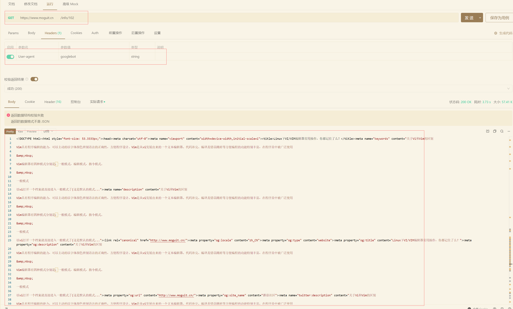
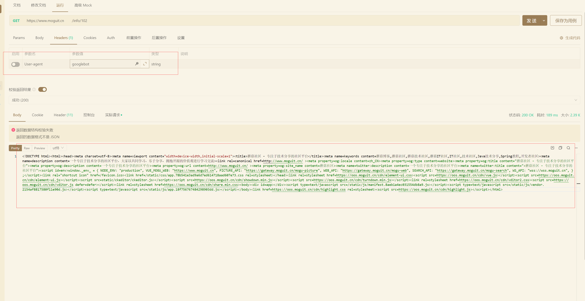

大家好，我是**陌溪**

## 前言

之前一直有小伙伴跑来问我，为啥蘑菇博客上线了这么久，百度出来只有首页？


在聊这个问题之前，我们先谈谈什么是 **SEO**。搜索引擎优化（Search engine optimization，简称 **SEO** ），指为了提升网页在搜索引擎自然搜索结果中（非商业性推广结果）的收录数量以及排序位置而做的优化行为，是为了从搜索引擎中获得更多的免费流量，以及更好的展现形象。

其实蘑菇网站上线快几年了，但是只收录了首页，归根到底还是因为之前项目选型的时候，采用了 **Vue** 作为前端开发框架，而我们知道 **Vue** 作为单页面应用框架，所有的数据都是通过 **axios** 进行返回的，也可以想成是 **ajax** 请求异步返回的，是非常不利于 **SEO** 的。

而百度收录的原理，其实就是百度的爬虫程序去爬取咱们的网站网站，但是因为我们内容都是通过 **axios** 异步返回，所以只能看到下面这样的骨架代码，因此百度也就只会收录咱们的首页了。


一般爬虫抓取页面内容是先从一个页面出发，从中提取出其他页面的链接，然后当作下一个请求的对象，一直重复这个过程。所以要有良好的 **SEO**，需要你在各大网站上拥有外链，这样会提高你的网站被搜索引擎爬虫的几率。

而 **Vue** 为了解决 **SEO** 问题，官方有 **Vue SSR** 方案，后面又推出了 **Nuxt.js** 框架。

蘑菇其实在旧版本中，也是使用 **nuxt.js** 实现了一波，经过测试后也确实能够被百度所收录，但是因为同时维护两份代码，有些耗时耗力，并且切换到 **nuxt.js**后，因为是服务器渲染，网站打开也变慢了很多，因此在种种因素下，也放弃了维护 **nuxt_mogu_web** 项目


同时，后面也在积极的探索更优雅的 **SEO** 实现方案，预期是不会较大的改变现有逻辑的基础上，就能够实现。

回归到原始需求，为了提高用户体验我们用了 **Vue**、**React** 这些 **SPA** 技术、为了 **SEO** 我们用了 **SSR**、预渲染等技术。

不同技术方案有一定差距，不能兼顾优点。但仔细想，需要这些技术优点的 "用户"，其实时不一样的，**SPA** 针对的是浏览器普通用户、**SSR** 针对的是网页爬虫，如 **googlebot**、**baiduspider** 等，那为什么我们不能给不同“用户”不同的页面呢，服务端动态渲染就是这种方案。

后来，陌溪在网上冲浪的时候，在 **Github** 上发现了 **prender-alpine** 这个开源项目

> https://github.com/tvanro/prerender-alpine


**prender-alpine** 的原理，在 **Alpine Linux** 上构建的轻量级 **Prerender** 容器，带有 **Node** 和 **Headless Chrome**

 **Prerender** ：可以当做是一个预渲染的容器，项目的原理其实就是相当于跑了一层 **node.js** 的 **Render** 层，帮助我们做服务器渲染。


服务端对请求的 **user-agent** 进行判断，浏览器端直接给 **SPA** 页面，如果是爬虫，需要通过 **Prerender** 容器动态渲染的 **html** 页面进行返回

完整的流程图如下，我们需要通过 nginx 识别出访问我们网站的用户是否是爬虫，还是普通用户，从而请求不同的页面。


## 蘑菇 **SEO** 改造

为了方便小伙伴们的使用，陌溪也把 **prender-alpine** 项目放到了蘑菇镜像仓库，同时提供了一份 **prerender.yml** 文件

```YML
version: '3.1'
services:
  prerender:
    restart: always
    image: registry.cn-shenzhen.aliyuncs.com/mogublog/prerender
    container_name: prerender
    ports:
      - 3000:3000
    environment:
      MEMORY_CACHE: 1
      CACHE_MAXSIZE: 300
      CACHE_TTL: 6000
    networks:
      - mogu

networks:
  mogu:
    external: true
```

只需要将其拷贝到蘑菇一键部署的 **yaml** 目录下即可，同时使用命令进行启动

```bash
docker-compose -f prerender.yml
```

启动完成后，可以看到项目运行在 **3000** 端口


搭建完成后，我们可以打开浏览器进行测试，打开 172.184.166.150:3000/https://www.moguit.cn 页面，后面挂着的就是你要预渲染的页面，如果能够打开下面的页面，说明已经预渲染成功了


同时，通过查看网页源码，也能够看到页面的文字和链接了，这样爬虫也就能爬取到我们网站的其它信息


下面，我们就需要改造我们的 **nginx** 了，通过 **$http_user_agent** 来识别请求的 **user_agent** 是否属于 **Google**、**百度**、**必应**、**360**....  的爬虫

如果识别成功，那么会跳转到刚刚搭建的 **prerender** 容器中进行预渲染，否则继续返回原来的 **Vue** 页面

下面是完整的 **nginx** 配置文件 **vue_mogu_web.conf**

```bash
server {
        listen       80;
        server_name  localhost;

        add_header Access-Control-Allow-Origin *;
        add_header Access-Control-Allow-Methods 'GET, POST, OPTIONS';
        add_header Access-Control-Allow-Headers 'DNT,X-Mx-ReqToken,Keep-Alive,User-Agent,X-Requested-With,If-Modified-Since,Cache-Control,Content-Type,Authorization,lang,access-token';
        if ($request_method = 'OPTIONS') {
         return 204;
        }

        root   /usr/share/nginx/html/;
        index  index.html;

        location / {
                try_files $uri @render;
        }

    location @render {
      set $render 0;
      if ($http_user_agent ~* "googlebot|bingbot|Baiduspider|360Spider|Sogou web spider|Bytespider") {
        set $render 1;
      }

      if ($uri ~* "\.(js|css|xml|less|png|jpg|jpeg|gif|pdf|doc|txt|ico|rss|zip|mp3|rar|exe|wmv|doc|avi|ppt|mpg|mpeg|tif|wav|mov|psd|ai|xls|mp4|m4a|swf|dat|dmg|iso|flv|m4v|torrent|ttf|woff|svg|eot)") {
        set $render 0;
      }


    if ($render = 1) {
      set $render "172.184.166.150:3000";
      rewrite .* /$scheme://$host:$server_port$request_uri? break;
      proxy_pass http://$render;
    }

    if ($render = 0) {
      rewrite .* /index.html break;
    }

  }
}
```

注意，这个配置需要修改 **vue_mogu_web.yml**，把刚刚创建的配置文件挂载出来

```bash
version: '3'
services:
  #授权服务
  vue_mogu_web:
    image: registry.cn-shenzhen.aliyuncs.com/mogublog_business/vue_mogu_web:latest
    container_name: vue_mogu_web
    restart: always
    ports:
      - 9527:80
    networks:
      - mogu
    env_file:
      - ../config/vue_mogu_web.env
    environment:
      - COMPOSE_PROJECT_NAME=vue_mogu_web
    volumes:
      - ../config/vue_mogu_web.conf:/etc/nginx/conf.d/default.conf

networks:
  mogu:
    external: true
```

修改完成后，就可以开始使用接口工具进行测试了，通过设置 **Headers** 设置请求头信息，加入  **User-agent = googlebot** 用来标识这个请求是爬虫

调用接口可以看到，我们的页面能够把完整的数据给返回 



同时，如果我们把 **User-agent** 删掉，这个时候返回的就是我们正常的 **SPA** 单应用页面了



到这里，网站针对爬虫专属的 **SEO** 就改造完毕了

经过几天测试后，通过 **site:www.moguit.cn** 进行查询，也可以看到被百度收录了好几个页面了~


好了，本期蘑菇 **SEO** 优化讲解就到这里

我是陌溪，我们下期再见~