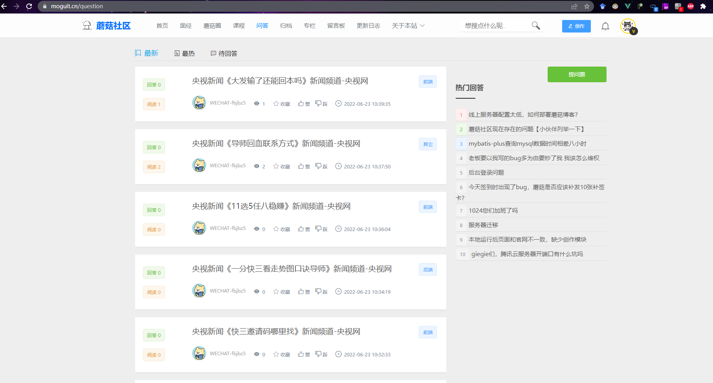

大家好，我是**陌溪**

最近，打开蘑菇社区，好家伙，竟然有人跑到蘑菇问答区发广告，导致蘑菇问答区直接沦陷，让正常的用户提问直接被广告淹没了



点开看了看，都是一些割韭菜的文章，都是直接复制粘贴的，连个排版都不行


陌溪打开蘑菇后台，发现竟然在一段时间内，发了 **100** 多篇的问答。因为之前就考虑到，可能会存在恶意刷文章的情况，所以针对每个用户，只允许发表 **5** 篇问答，没想到呀，竟然注册了10多个号过来。


但是，万万没想到到，这个小伙子竟然不讲武德，直接注册了 **10** 个号来搞蘑菇


至于为啥没有投稿在文章呢？我想可能是因为文章模块针对普通用户是需要审核，只有审核通过后才可以展示出来

而问答模块，之前为了方便小伙伴们能够在蘑菇进行提问交流，所以去除了审核功能，没想到就被有机可乘

先给禁言关小黑屋，防止下次再跑出来继续发广告了


但是想了一下，这样做的话，下次可能又会注册一批号，然后过来发广告帖子，这样显然是不太行的。

陌溪想到很多论坛，都会设置一波新注册的用户需要等待一段时间后，才能够进行回帖功能，就是为了避免新账号注册后就开始发广告的行为。

首先，使用 **@interface** 创建一个 **AOP** 接口，用于在发表动态、发评论的时候进行校验。

```java
/**
 * 用户提交校验接口【是否有权限发文章、发动态、发评论】
 *
 * @author 陌溪
 * @date 2022年6月27日23:16:42
 */
@Target({ElementType.METHOD, ElementType.TYPE})
@Retention(RetentionPolicy.RUNTIME)
public @interface SubmitVerify {

}
```

然后开始定义 **AOP** 切面实现，因为在前置的 **SpringSecurity** 拦截器中，会通过 **token** 解析出用户的信息存储到 **Request** 中，所以我们可以直接拿到用户的创建时间

我们只需要从配置中，获取到当前系统的时间，和用户注册的时间进行比较，判断是否处于新手保护期（24小时内），这里的 24 小时，可以在蘑菇的后台参数配置中进行配置


下面是完整的实现代码

```java
/**
 * 用户提交校验切面实现
 *
 * @author: 陌溪
 * @create: 2022年6月27日23:18:27
 */
@Aspect
@Component
@Slf4j
public class SubmitVerifyAspect {

    @Resource
    private SysParamsService sysParamsService;

    @Pointcut(value = "@annotation(submitVerify)")
    public void pointcut(SubmitVerify submitVerify) {

    }

    @Around(value = "pointcut(submitVerify)")
    public Object doAround(ProceedingJoinPoint joinPoint, SubmitVerify submitVerify) throws Throwable {
        HttpServletRequest request = RequestHolder.getRequest();
        if (request.getAttribute(SysConf.USER_UID) != null) {
            log.info("用户已登录");
            Object createTime = request.getAttribute(SysConf.CREATE_TIME);
            if (createTime != null) {
                // 拉取到用户的创建时间
                String createTimeStr = request.getAttribute(SysConf.CREATE_TIME).toString();
                Date userCreateTime = DateUtils.strToDateTime(createTimeStr);
                Date now = new Date();
                // 新注册用户限制时间【后台配置】
                String newUserLimitTimeStr = sysParamsService.getSysParamsValueByKey(RedisConf.NEW_USER_LIMIT_TIME);
                Long newUserLimitTime = Long.valueOf(newUserLimitTimeStr) * 3600000;
                if (now.getTime() - userCreateTime.getTime() < newUserLimitTime) {
                    return ResultUtil.errorWithMessage("注册时间小于" + newUserLimitTimeStr + "小时，无法使用该功能");
                }
            }
            //执行业务
            return joinPoint.proceed();
        } else {
            log.info("用户未登录");
            return ResultUtil.errorWithMessage("用户未登录");
        }
    }
}

```

如果处于新手保护期的话，那么就直接返回错误即可，不执行业务代码

下面，只需要在需要增加新手校验的方法上，加上 **@SubmitVerify** 注解即可

```java
@SubmitVerify
@BussinessLog(value = "增加问答", behavior = EBehavior.ADD_QUESTION)
@ApiOperation(value = "增加问答", notes = "增加问答", response = String.class)
@PostMapping("/add")
public String add(@Validated({Insert.class}) @RequestBody QuestionVO questionVO, BindingResult result) {
    ThrowableUtils.checkParamArgument(result);
    // 添加问答来源【用户投稿】
    questionVO.setQuestionSource(EContributeSource.USER_PUBLISH);
    log.info("增加问答");
    return questionService.addQuestion(questionVO);
}
```

下面运行蘑菇，看看效果。陌溪刚刚注册了一个小号，发现在发表问答的时候，提示注册未满24小时，无法使用该功能~，非常符合预期


到这里，蘑菇通过 **AOP** 自定义注解，杜绝了一部分刚注册的用户，就来发广告的情况。肯定不可能会有广告提前一天来蘑菇注册账号，然后第二天再发广告的。


好了，我是**陌溪**，我们下期再见~