## 前言

大家好，我是**陌溪**

其实之前我是一直有写技术类文章的习惯，因为我这几年一直在参与**蘑菇博客**项目的维护，在开发新功能或解决 **BUG** 的时候，就肯定会遇到各种各样的问题，每当我遇到问题的时候，我都会把它用笔记的方式记录下来。

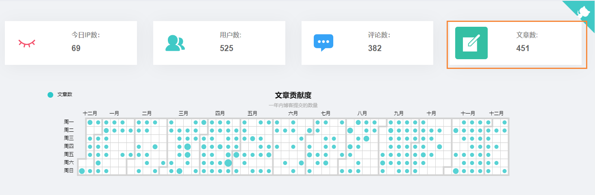

可以看到蘑菇博客在这几年的时间里，已经写了 **400** 篇的文章了....，哈哈，当然这些文章都是非常水的文章了，大部分是**遇到问题时的记录**以及最后**问题的解决方案**，或者是在学习**某门技术时候的学习笔记**。

这阵子因为兴趣使然，开始研究如何在微信公众号上撰写文章，在陌溪摸滚翻爬的这一个月里，也发过几篇文章，同时得到了一些小伙伴的指点( 这里特别表扬 **阿秀** )。虽然谈不上经验之谈，但也是自己摸索和学习出来的小技巧，在这里分享出来，希望大家能够喜欢。

## 工欲善其事必先利其器

其实在开始的使用使用过 **Word** 和 **OneNote** 来记笔记，但是有的时候我们的文章需要**显示代码**，使用这两个工具在**代码可视化**这块就非常糟糕。

因此后面我学习了 **Markdown** ，通过简洁的语法来代替原来 **Word** 复杂的排版。同时使用 **Typora** 作为 **Markdown** 编辑器，它提供的及时渲染技术，让我们更加专注于文章的编写，而不是被繁琐的功能所困扰。

> Typora下载：https://www.typora.io/
>
> Markdown学习：https://www.runoob.com/markdown

在编写文章的时候，也需要引入图片，这个时候就涉及到了两种存储方式

- 本地存储
- 图床存储

### 本地存储

本地存储就是将图片存储在当前目录下，然后地址连接改成**相对地址**，如下所示 **images** 文件夹存储的就是我这篇博客的图片，我是将每篇博客下的图片都存储在当前目录下，这样以后需要修改的时候也是特别方便的。


我们只需要在 **Typora** 打开 **文件** -> **偏好设置**，然后填写如下信息即可


以后我们在复制**网络图片**或者**截图**，都会自动存放在当前文件夹的 **images** 目录下。

本地存储的好处就是**编辑图片**的时候很方便，但是我们在后期排版的时候，还需要将我们的本地图片相对路径转换成网络图片地址。

如果小伙伴部署了蘑菇博客，那么这一步是非常的方便，我们可以直接使用蘑菇博客提供的**本地博客上传**的功能。首先到**博客管理**，然后选择**本地上传**，然后上传我们的**图片**和 **md** 文件


上传完成后，我们在选中该文章，然后导出文章即可


我们再次查看导出的文章，图片地址已经成功被替换成**线上地址**，到这里我们就可以拿着**导出的文章**进行**排版**。

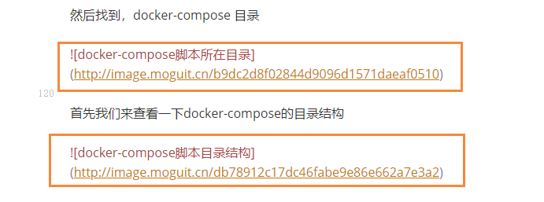

### 使用Gitee图床

上面其实最后使用到了**蘑菇博客**图片存储功能，而对于**没有部署蘑菇博客**的小伙伴，也可以使用 **Gitee** 提供的图床。首先我们可以**创建一个笔记仓库**，然后将我们的全部内容都提交上去。

下图就是我上传后的笔记，我们需要将 **Gitee** 中的图片路径给复制下来。


如下所示，我们得到了图片的地址如下所示，中间为了方便显示，我使用了 ** 代替

```bash
https://gitee.com/moxi159753/LearningNotes/raw/master/**/images/3eb7ca28be7a4cae9ef3fb9632f7d532.jpg
```

我们通过观察图片地址就能发现，下面就是我们 **Gitee** 图床的地址前缀

```bash
https://gitee.com/moxi159753/LearningNotes/raw/master/**/images/
```

我们回到 **Typora** 的博客页，然后将我们的 **images/** 相对地址 替换成 上面 **Gitee** 图床前缀即可。

```bash
# 替换前
images/
# 替换后
https://gitee.com/moxi159753/LearningNotes/raw/master/**/images/
```

下面的图片就是最终被替换后的样子，我们将**本地路径**成功替换成**线上的路径** (需要保证提前上传文章和图片到Gitee)

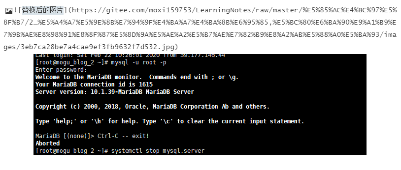

### 使用PicGo+Gitee

**PicGo** 是一个用于快速上传图片并获取图片 URL 链接的工具，目前支持多种平台

> SM.MS图床、腾讯云COS、Github图床、七牛云图床、Imgur图床、阿里云OSS、又拍云图床

同时具备如下特殊功能

- 支持拖拽图片上传
- 支持快捷键上传剪贴板里第一张图片
- Windows 和 macOS 支持右键图片文件通过菜单上传
- 上传图片后自动复制链接到剪贴板
- 支持自定义复制到剪贴板的链接格式

首先到 **Github** 官网，下载最新版本的 **release**

> https://github.com/Molunerfinn/PicGo/releases

然后选择 **Windows** 的 **.exe** 文件

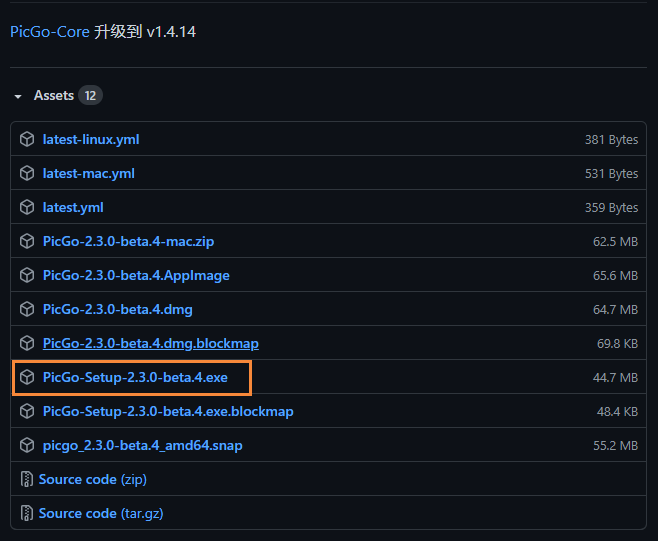

下载完成后，点击安装即可，下面是 **PicGo** 安装完成的截图

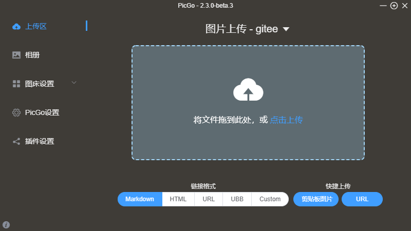

因为官方没有默认支持 **Gitee** 作为图床，不过有小伙伴编写了 **Gitee** 上传插件，选择 **插件设置** 搜索 **Gitee**，然后选择 **gitee-uploader** 插件进行安装

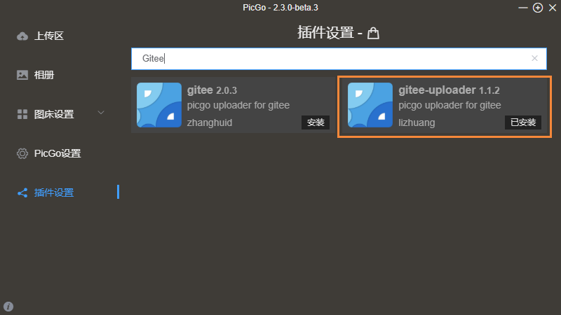

这里我们需要首先在 **Gitee** 创建一个仓库 **wx_picture**，然后在创建一个文件夹 **picture**，如下所示

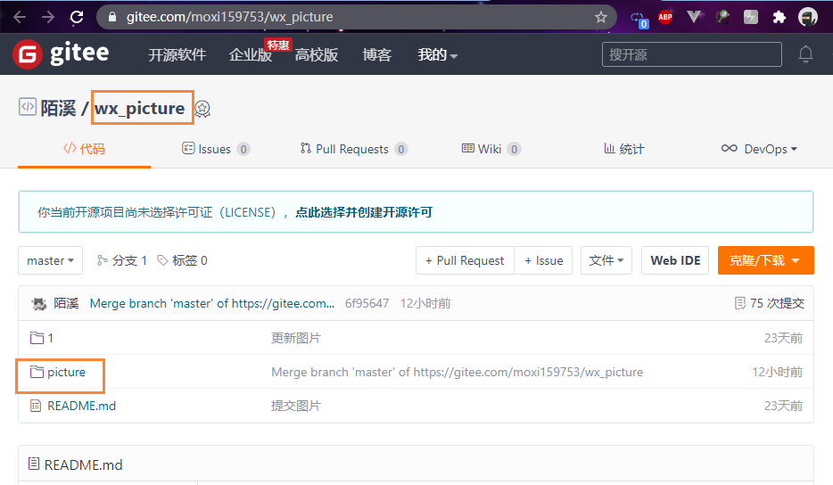

然后到**图床设置**选择 **gitee**

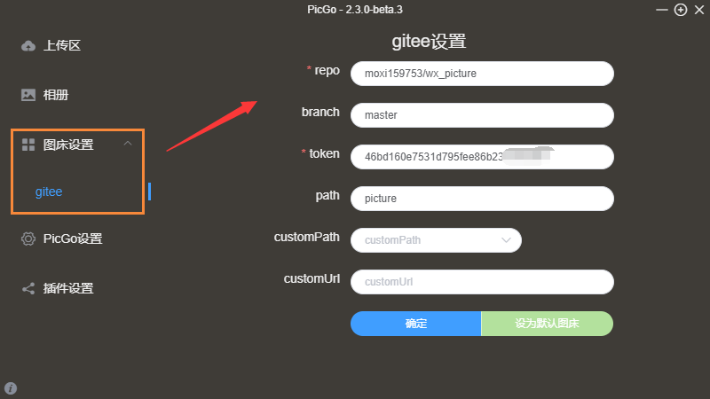

然后设置 **repo** ，这里其实就是 用户名 + 仓库名。


这里还需要注意的就是 **token** 的获取。点击 **Gitee** 头像，打开设置，选择**私人令牌**然后创建

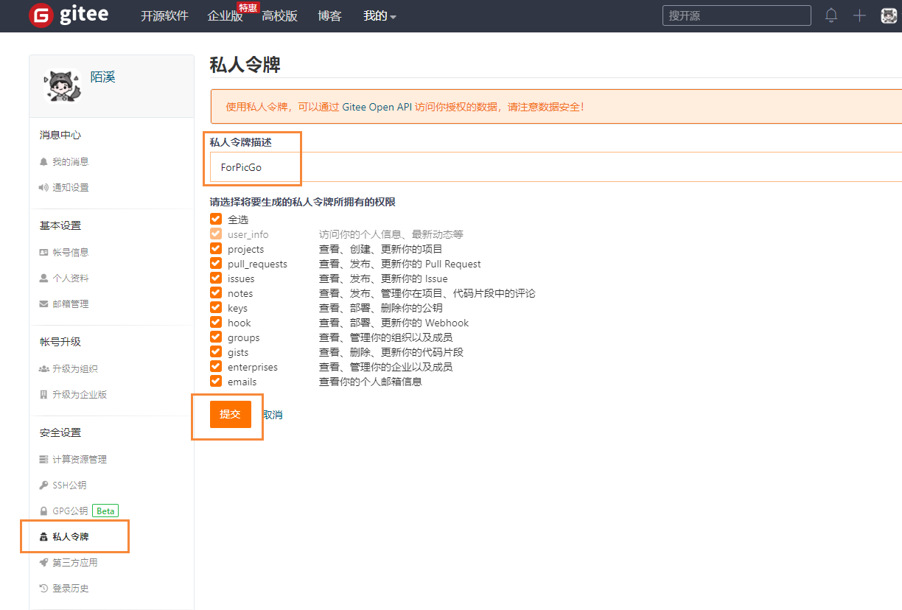 

然后复制生成的 token，粘贴到 **PicGo** 即可。下面我们就可以在 **Typora** 中配置 **PicGo** 的路径即可


下次我们上传图片的时候，将会自动通过 **PicGo** 提交到 **Gitee** 仓库中，如下图所示 **URL** 地址也已经成功切换成了Gitee 上的图床地址。


到目前为止，我们的前置工作已经完成，小伙伴可以根据自己的情况**选择其中一种**即可。

## 文章排版

我们平时在公众号上看到的文章其实都是通过排版后生成的，因为微信平台不支持 **Markdown** 文件。所以这里我推荐的是两个不错的 Markdown 排版网站

> md2all：http://md.aclickall.com/
>
> mdnice：https://www.mdnice.com/

我目前使用的是 **md2all** 进行排版，首先将写好的文章上传到网站左侧 **Markdown** 区域，右边即可看到我们排版后的效果


同时还支持多种排版样式，点击顶部的**一键排版**，然后选择排版样式，挑选出自己喜欢的一款即可，陌溪用的是 **综合示例** 。


同时如果熟悉 **CSS** 样式的小伙伴，也可以修改这里的样式表，做出一份属于自己独一无二的样式。

在小伙伴排完版后，我们就可以点击顶部的 **复制** 按钮，然后粘贴到微信公众平台了。

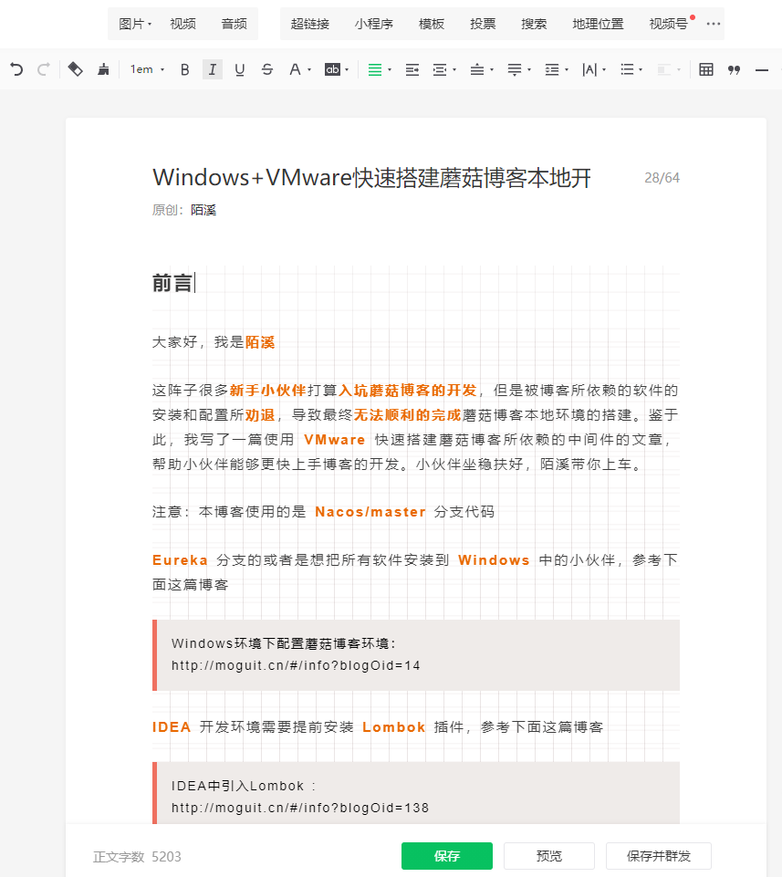

## 制作标题图

**陌溪教你学编程**发布的文章，都是我给每篇文章单独制作的封面，效果图如下

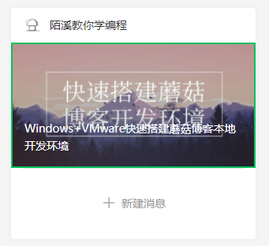

这里我推荐的是 **Canva** 在线平面设计，当然小伙伴也可以使用 **ppt** 制作封面

> Canva：https://www.canva.cn/templates/

然后选择**微信公众号封面图**中的**科技微信公众号封面模板**


然后挑选一款自己喜欢的模板，进行编辑。这里需要注意的是，可能有些字体是收费的，这里我使用的是免费字体 **思源宋体**，在我们编辑好后下载即可。

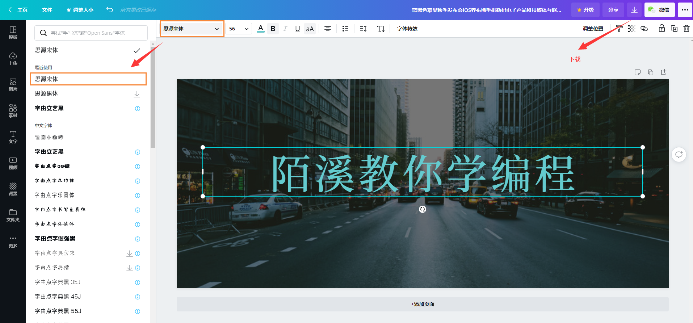

## 留言功能

微信公众号在 **2018** 年就**下架了留言功能**，也就是说后面创建的新的微信公众号都是不具备留言功能的。我们如果想要拥有留言功能只有以下**两种**途径：

- 通过账号迁移继承有留言功能的账号
- 通过打开小程序实现留言功能

首先第一种方式，是需要耗费一定的资金成本，在某宝花费 **3000** 多购买账号迁移服务，这样你的账号就拥有留言功能了。

第二种方式就是通过在页面中引入**留言小程序**，这里用的是**小互动助手**，因为比较简洁且没有广告，最重要的是**不花钱**....

> 小互动助手: https://mp.xiaohudong.com/

然后登录后，选择留言板


然后选择**新增留言板**，因为陌溪之前创建过一些，所以下面有好几篇文章的留言板。

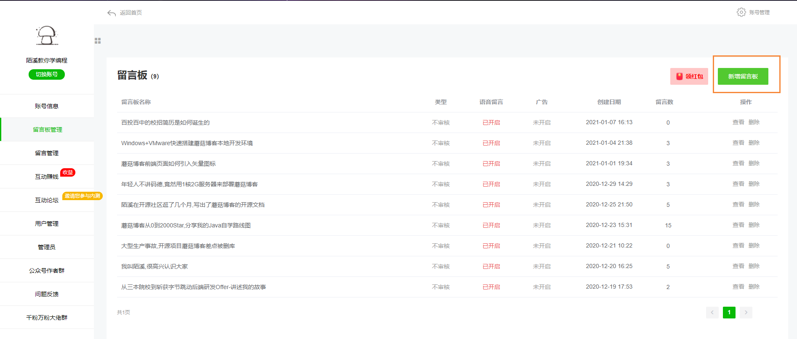

这里只需要输入**留言板名称**，这里最好和文章名一致。其它选项保持默认即可，也可以根据兴趣选择是否开启


创建成功后，我们复制小程序的路径


然后回到微信公众号的**文章编辑**页面，选择插入**小程序**


然后搜索**小互动助手**，点击下一步


把刚刚复制的**小程序路径**粘贴，同时加入文字：**点击进入留言板**


最后的效果图如下所示


文章发表后，点击刚刚的添加的文字，即可进入到留言板开启留言之旅


## 接入微软小冰

下面准备给公众号接入一个 **AI** 机器人**微软小冰**，用于给关注的用户**回复内容**或者**推荐文章**，首先到微软小冰的官网，点击下面地址进行申请

> 微软小冰：https://e.msxiaobing.com/

然后输入手机号，开始注册，然后进入运营方式选择：**自主管理**


然后开始给小冰进行微信公众号授权


授权完成后，选择行业


然后选择聊天风格和文章推荐


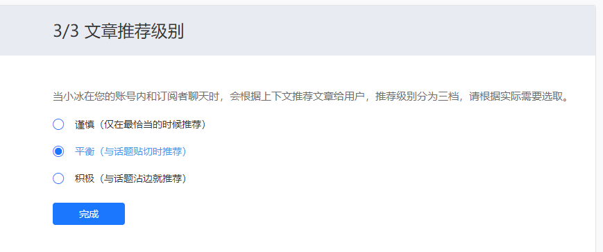

完成后，到达首页


里面还有更多的功能等待你的挖掘，下面是接入小冰后的公众号~


到此为止，公众号的**入门学习**已经完成，下面我们就可以开启愉快的**写作之旅**了~

结语
--

**陌溪**是一个从三本院校一路摸滚翻爬上来的互联网大厂程序员。独立做过几个开源项目，其中**蘑菇博客**在码云上有 **2K Star** 。目前就职于**字节跳动的Data广告部门**，是字节跳动全线产品的商业变现研发团队。本公众号将会持续性的输出很多**原创小知识**以及学习资源。如果你觉得本文对你有所帮助，麻烦给文章点个「赞」和「在看」。同时欢迎各位小伙伴**关注陌溪**，让我们一起成长~

