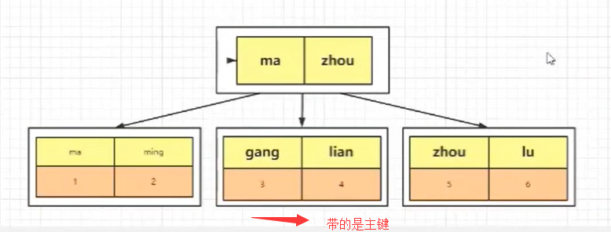
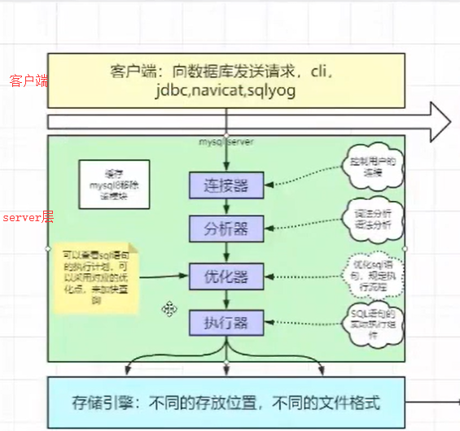
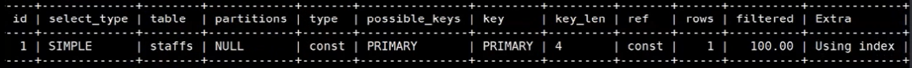
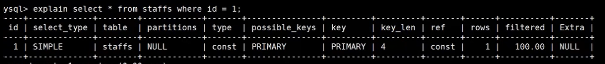
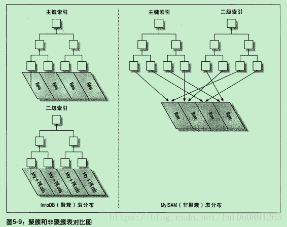
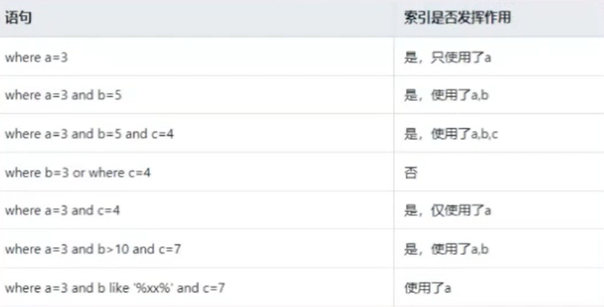

# MySQL索引

## 索引的优点

最典型的例子就是查新华字典，通过查找目录快速定位到查找的字

- 大大减少了服务器需要扫描的数量
- 帮助服务器避免排序和临时表
- 将IO变成顺序IO
  - 尽可能的降低磁盘的寻址时间，也就是局部性原理，就是很大一部分数据在未来的一段时间被连续访问
  - 在复制1G压缩包 和 1G小文件，前者的速度会大于后者
  - 减少IO的量，例如写SQL语句的时候，不要写 select *
  - 减少IO的次数，一次IO能搞定的事，不使用3次IO

## 索引的用处

- 快速查找匹配where子句的行
- 从consideration中消除行，如果可以在多个索引之间进行选择，mysql通常会使用栈找到最少行的索引
- 如果表具有多列索引，则优化器可以使用索引的最左匹配前缀来查找
- 当有表连接的时候，从其他表检测行数据
- 查找特定索引列min或max值
- 如果排序或分组是，在可用索引的最左前缀上完成的，则对表进行排序和分组
- 在某些清空下，可以优化查询以检索值而无需查询数据行

## 索引的分类

### 主键索引

如果你在创建索引的时候，使用的是主键这个值，那么就是主键索引，primary key

我们建表的时候，例如下面这个建表语句

``` sql
CREATE TABLE `t_blog_sort` (
  `uid` varchar(32) NOT NULL COMMENT '唯一uid',
  `sort_name` varchar(255) DEFAULT NULL COMMENT '分类内容',
  `content` varchar(255) DEFAULT NULL COMMENT '分类简介',
  `create_time` timestamp NOT NULL DEFAULT '0000-00-00 00:00:00' COMMENT '创建时间',
  `update_time` timestamp NOT NULL DEFAULT '0000-00-00 00:00:00' COMMENT '更新时间',
  `status` tinyint(1) unsigned NOT NULL DEFAULT '1' COMMENT '状态',
  `sort` int(11) DEFAULT '0' COMMENT '排序字段，越大越靠前',
  `click_count` int(11) DEFAULT '0' COMMENT '点击数',
  PRIMARY KEY (`uid`)
) ENGINE=InnoDB DEFAULT CHARSET=utf8 COMMENT='博客分类表';
```

这里面有使用到    PRIMARY KEY (`uid`)，这就是主键索引

### 唯一索引

唯一索引 类似于普通索引，索引列的值必须唯一

唯一索引和主键索引的区别就是，唯一索引允许出现空值，而主键索引不能为空

```sql
create unique index index_name on table(column)
```

或者创建表时指定

```sql
unique index_name column
```

### 普通索引

当我们需要建立索引的字段，既不是主键索引，也不是唯一索引

那么就可以创建一个普通索引

```sql
create index  index_name on table(column)
```

或者创建表时指定

``` sql
create table(..., index index_name column)
```

### 全文索引

lunce、solr和ElasticSearch就是做全文检索的，里面涉及到了倒排索引的概念，mysql很少使用全文索引。

要用来查找文本中的关键字，不是直接与索引中的值相比较，像是一个搜索引擎，配合 match against 使用，现在只有char，varchar，text上可以创建索引，在数据量比较大时，先将数据放在一个没有全文索引的表里，然后在利用create index创建全文索引，比先生成全文索引在插入数据快很多。

### 组合索引

目前，在业务不是特别复杂的时候，可能使用一个列作为索引，或者直接采用主键索引即可，但是如果业务变得复杂的时候，就需要用到组合索引，通过对多个列建立索引。

组合索引的用处，假设我现在表有个多个字段：id、name、age、gender，然后我经常使用以下的查询条件

```sql
select * from user where name = 'xx' and age = xx
```

这个时候，我们就可以通过组合 name 和 age 来建立一个组合索引，加快查询效率，建立成组合索引后，我的索引将包含两个key值

在多个字段上创建索引，遵循**最左匹配**原则

```sql
alter table t add index index_name(a,b,c);
```

## 索引的使用与否

### 索引的使用

MySQL每次只使用一个索引，与其说 数据库查询只能用一个索引，倒不如说，和全表扫描比起来，去分析两个索引 B+树更耗费时间，所以where A=a and B=b 这种查询使用（A，B）的组合索引最佳，B+树根据（A，B）来排序。

- 主键，unique字段
- 和其他表做连接的字段需要加索引
- 在where 里使用 >, >=, = , <, <=, is null 和 between等字段。
- 使用不以通配符开始的like，where A like ‘China%’
- 聚合函数里面的 MIN()， MAX()的字段
- order by  和 group by字段

### 何时不使用索引

- 表记录太少
- 数据重复且分布平均的字段（只有很少数据的列）；
- 经常插入、删除、修改的表要减少索引
- text，image 等类型不应该建立索引，这些列的数据量大（加入text的前10个字符唯一，也可以对text前10个字符建立索引）
- MySQL能估计出全表扫描比使用索引更快的时候，不使用索引

### 索引何时失效

- 组合索引为使用最左前缀，例如组合索引（A，B），where B = b 不会使用索引
- like未使用最左前缀，where A  like "%China"
- 搜索一个索引而在另一个索引上做 order by， where A = a order by B，只会使用A上的索引，因为查询只使用一个索引。
- or会使索引失效。如果查询字段相同，也可以使用索引。例如  where A = a1 or A = a2（生效），where A=a or B = b （失效）
- 在索引列上的操作，函数upper()等，or、！ = （<>）,not in 等

## 面试技术名词

### 回表

首先我们需要知道，我们建立几个索引，就会生成几棵B+Tree，但是带有原始数据行的B+Tree只有一棵，另外一棵树上的叶子节点带的是主键值。

例如，我们通过主键建立了主键索引，然后在叶子节点上存放的是我们的数据


当我们创建了两个索引时，一个是主键，一个是name，它还会在生成一棵B+Tree，这棵树的叶子节点存放的是主键，当我们通过name进行查找的时候，会得到一个主键，然后在通过主键再去上面的这个主键B+Tree中进行查找，我们称这个操作为 ==**回表**==



当我们的SQL语句使用的是下面这种的时候，它会查找第一颗树，直接返回我们的数据

```mysql
select * from tb where id = 1
```

当我们使用下面这种查询的时候，它会先查找第二棵树得到我们的主键，然后拿着主键再去查询第一棵树

```mysql
select * from tb  where name = 'gang'
```

回表就是通过普通列的索引进行检索，然后再去主键列进行检索，这个操作就是回表

==但是我们在使用检索的时候，尽量避免回表，因为这会造成两次B+Tree的查询，假设一次B+Tree查询需要三次IO操作，那么查询两次B+Tree就需要六次IO操作。==

### 索引覆盖

我们看下面的两个SQL语句，看看它们的查询过程是一样的么？

```SQL
select * from tb where id = 1
select name from tb where name = zhou
```

答案是不一样的，首先我们看第二个语句，就是要输出的列中，就是我们的主键，当我们通过name建立的B+Tree进行查询的时候


我们可以直接找到我们的数据，并得到主键，但是因为我们要返回的就是name，此时说明数据存在了，那么就直接把当前的name进行返回，而不需要通过主键再去主键B+Tree中进行查询。

这样一个不需要进行回表操作的过程，我们称为**索引覆盖**

### 最左匹配

这里提到的 **最左匹配** 和 **索引下推** 都是针对于组合索引的。

例如，我们有这样一个索引

```
name  age：组合索引
```

必须要先匹配name，才能匹配到age。这个我们就被称为最左匹配

例如下面的几条SQL语句，那些语句不会使用组合索引

```sql
where name = ? and age = ?
where name = ?
where age = ?
where age = ? and name = ?
```

根据最左匹配原则，我们的 3 不会使用组合索引的。

那为什么4的顺序不一样，也会使用组合索引呢？

其实内部的优化器会进行调整，例如下面的一个连表操作

```sql
select * from tb1 join tb2 on tb1.id = tb2.id
```

其实在加载表的时候，并不一定是先加载tb1，在加载tb2，而是可能根据表的大小决定的，小的表优先加载进内存中。

### 索引下推

在说索引下推的时候，我们首先在举两个例子

```sql
select * from tb1 where name = ? and age = ?
```

在mysq 5.6之前，会先根据name去存储引擎中拿到所有的数据，然后在server层对age进行数据过滤

在mysql5.6之后，根据name 和 age两个列的值去获取数据，直到把数据返回。

通过对比能够发现，第一个的效率低，第二个的效率高，因为整体的IO量少了，原来是把数据查询出来，在server层进行筛选，而现在在存储引擎层面进行筛选，然后返回结果。我们把这个过程就称为  **索引下推**

### 优化器

#### CBO

基于成本的优化

#### RBO

基于规则的优化




## 索引匹配方式

### 全值匹配

全值匹配指的是和索引中所有的列进行匹配

```sql
explain select * from staffs where name = 'July' and age = 23 and pos = 'dev'
```

而我们建立了一个 包含  name、age、pos的组合索引，使用上面的SQL语句，就会进行全值匹配

### 匹配最左前缀

只匹配前面的几列

```sql
explain select * from staffs where name = 'July' and age = 23
```

这个时候，只使匹配了前面两个列，而没有使用第三个列

现在我们使用下面的SQL语句进行验证，但我们输出值只包含ID的时候

```sql
explain select id from staffs where id = 1
```

我们查看其任务计划，在某尾有 Extra字段，如果是Using index 表示是使用了覆盖索引



然后我们在查看下面这条SQL语句

```sql
explain select * from staffs where id = 1
```

通过查看任务计划，发现extra字段是NULL，说明没有使用覆盖索引



### 匹配列前缀

可以匹配某一列值的开头部分

```sql
explain select * from staffs where name = 'J%'
explain select * from staffs where name = '%y'
```

### 匹配范围值

可以查找某个范围的数据

```sql
explain select * from staffs where name > 'Mary'
```

### 精确匹配某一列并范围匹配另外一列

可以查询某一列的全部和第二列的部分

```sql
explain select * from staffs where name = "July" and age > 25
```

### 只访问索引的查询

查询的时候值需要访问索引，不需要访问数据行，本质上就是索引覆盖

```sql
explain select name,age,pos from staffs where name="July" and age=25 and pos = "dev"
```

## 哈希索引

### 概念

基于哈希的实现，只有精确匹配索引所有的列的查询才有效，在mysql中，只有memory的存储引擎显式支持哈希索引，哈希索引自身只需存储对应的hash值，索引索引的结构十分紧凑，这让哈希索引查找的速度非常快。

### 哈希索引的限制

- 哈希索引值包含哈希值和行指针，而不存储字段值。索引不能使用索引中的值来避免读取行
- 哈希索引数据并不是按照索引值顺序存储的，所以无法进行排序
- 哈希索引不支持部分列匹配查找，哈希索引是使用索引列的全部内容来计算哈希值
- 哈希索引支持等值比较查询，也不支持任何范围查询
- 访问哈希索引的数据非常快，除非有很多哈希冲突，当出现哈希冲突的时候，存储引擎必须遍历链表中的所有行指针，逐行进行比较，知道找到所有符合条件的行
- 哈希冲突比较多的话，维护的代价也会很高

## 聚簇索引和非聚簇索引

### 聚簇索引

InnoDB中，表数据文件本身就是按B+Tree组织的一个索引结构，聚簇索引就是按每张表的主键构造一棵B+树，同时叶子节点中存放的就是整张表的行记录数据，也将聚簇索引的叶子节点称为数据也，这个特性就决定了索引组织表中的数据也是索引的一部分。

==一句话来说：将索引和数据放在一起的，就称为聚簇索引==

我们日常的工作中，根据实际情况自行添加的索引，都是辅助索引或者称为普通索引，辅助索引就是为了查找主键索引的二级索引，先找到主键索引然后再通过主键索引找数据，但是可能会存在**回表**的问题。

### 聚簇索引的优点

- 数据访问更快，因为聚簇索引将索引和数据保存在一个B+树中，因此从聚簇索引中获取数据比非聚簇索引更快
- 聚簇索引对主键的排序和范围查找速度非常快

### 聚簇索引的缺点

- 插入速度严重依赖于排序，按照主键的顺序插入是最快的方式，否者会出现页分裂，严重影响性能。因此，对于InnoDB表，我们一般都会定义一个自增的ID列作为主键
- 更新主键的代价很高，因为将会导致被更新的行移动，因此，对于InnoDB表，我们一般定义主键不可更新
- 二级索引访问需要两次索引查找，第一次找到主键值，第二次 根据主键值查找行数据，一般我们需要尽量避免出现索引的二次查找，这个时候，用到的就是**索引的覆盖**

### 非聚簇索引

非聚簇索引也被称为辅助索引，辅助索引在我们访问数据的时候总是需要两次查找。辅助索引叶子节点存储的不再是行的物理位置，而是主键值。通过辅助索引首先找到主键值，然后在通过主键值找到数据行的数据页，在通过数据页中的Page Directory找到数据行。

InnoDB辅助索引的叶子节点并不包含行记录的全部数据，叶子节点除了包含键值外，还包含了行数据的聚簇索引建。辅助索引的存在不影响数据在聚簇索引中的组织，所以一张表可以有多个辅助索引。在InnoDB中有时也称为辅助索引为二级索引



## 组合索引

当包含多个列为索引，需要注意的是正确的顺序依赖于该索引的查询，同时需要考虑如何更好的满足排序和分组的需要




第4个不走索引，是因为不满足最左匹配原则

第5个，因为跨过了b，所以只走a的索引

## 优化细节

- 当使用索引列进行查询的时候，尽量不要使用表达式，把计算放到业务层而不是数据库层

  ```sql
  select actor_id from actor where actor_id = 4
  select actor_id from actor where actor_id+1 = 5
  ```

  第一条语句走索引

  

  而第二条语句没有走主键索引

  

- 尽量使用主键查询，而不是其它索引，因为主键查询不会触发回表操作

- 使用前缀索引

有时候需要索引很长的字符串，这会让索引变得大且满，通常情况下可以使用某个列开始的部分字符串，这样大大的节约了索引空间，从而提高索引效率，但这会降低索引的选择性，索引的选择性是指不重复的索引值和数据表记录总数的比值，范围从1/#T 到 1 之间，索引的选择性越高，则查询效率越高，因为选择性更高的索引可以让mysql在查找的时候过滤掉更多的行。

一般情况下，某个列前缀的选择性也是足够高的，足以满足查询的性能，但是对应BLOG，TEXT，VARCHAR类型的列，必须要使用前缀索引，因为mysql不允许索引这些列的完整长度，使用该方法的诀窍在于选择足够长的前缀以保证较高的选择性，通过又不能太长 。

- 使用索引扫描来进行排序
- union、all、in、or都能使用索引，但是推荐使用in

```sql
explain select * from actor where actor_id = 1 union all select * from actor where actor_id = 2

explain select * from actor where actor_id in (1,2);

explain select * from actor where actor_id = 1 or actor_id = 2;

-- 关于or到底走不走索引，必须根据实际情况进行考虑
```

- 范围列可以使用到索引

例如 范围条件是：<、<=、>、>=、between

范围列可以用到索引，但是范围列后面的列无法用到索引，索引最多用于一个范围列，所以一般如果我们使用组合索引的时候，最好不要使用范围查找


如倒数第一个所示，因为中间b使用了范围查找，所以后面的c是无法使用索引的，只能是a和b才能使用索引

- 强制类型转换会让索引失效，进行全表查询

例如下面这样一个例子所示，我们对 phone字段进行了强制类型转换

```sql
explain select * from user where phone = 13800001234  -- 不会触发索引（触发了字符串到整型转换）
explain select * from user where phone = '13800001234'  -- 触发索引
```

- 更新十分频繁，数据区分度不高的字段上不宜建立索引

更新会变更B+树，更新 频繁的字段建立索引会大大降低数据库性能

类似于性别这列的区分度不高的字段，建立索引是没有意义的，不能有效的过滤数据

一般区分度在百分80以上的时候，就可以建立索引，区分度可以使用 count(distinct(列名)) / count(*) 来进行计算

- 创建索引的列，不允许为null，可能会得到不符合预期的结果
- 当需要进行表连接的时候，最好不要超过三张表，因为需要join的字段，数据类型必须一致（阿里规约）
  - 允许数据的冗余，从而加快查询的效率
  - 目前是范式和反范式的混合使用
- 能使用limit的时候，尽量使用limit
- 单表索引建议控制在5个以内
- 单索引字段不允许超过5个（组合索引）
- 创建索引的时候应该尽量避免以下错误的概念

索引不是越多越好，不要在不了解系统的情况下进行优化

## 参考

https://www.cnblogs.com/jiawen010/p/11805241.html

https://www.bilibili.com/video/BV1d5411p7MY?from=search&seid=6712050221639355647