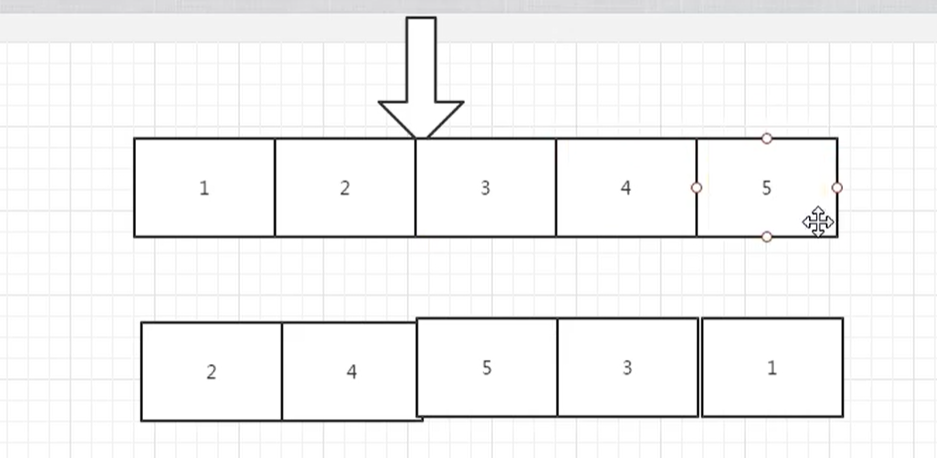

# 栈的压入弹出序列

## 题目描述

输入两个整数序列，第一个序列表示栈的压入顺序，请判断第二个序列是否可能为该栈的弹出顺序。假设压入栈的所有数字均不相等。例如序列1,2,3,4,5是某栈的压入顺序，序列4,5,3,2,1是该压栈序列对应的一个弹出序列，但4,3,5,1,2就不可能是该压栈序列的弹出序列。（注意：这两个序列的长度是相等的）

## 思路

我们以：1 2 3 4 5  进行压入，下面的：2 4 5 3 1 是弹出序列



- 首先我们需要有一个栈，列表
- 按照pushV的方式压入栈
- 弹出的时候，需要循环判断是否需要弹出
- 判断是否需要弹出的时机，刚刚压入过后就弹
- 判断需要弹出的情况的条件，压入栈的顶部 和 弹出栈的顶部数据相等
- 然后我们还需要循环比较


```
class Solution:

    def IsPopOrder(self, pushV, popV):
        # 首先我们需要有一个栈
        if pushV == [] or len(pushV) != len(popV):
            return None
        stack = []
        index = 0
        for item in pushV:
            # 压栈
            stack.append(item)
            # 判断是否需要弹出，也就是插入的值，等于popV的第一个。这里需要循环判断
            while stack != [] and stack[-1] == popV[index]:
                stack.pop()
                index += 1
        # 判断 stack 中是否有元素，如果有，代表着False
        return len(stack) == 0
```

