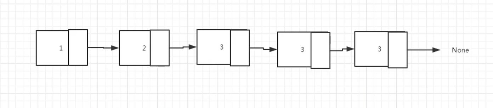
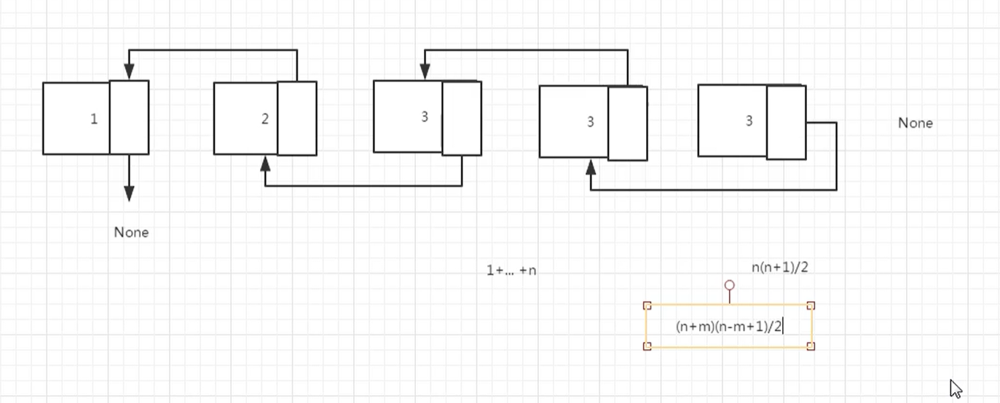

# 反转链表

## 题目描述

来源：https://www.nowcoder.com/practice/75e878df47f24fdc9dc3e400ec6058ca

输入一个链表，反转链表后，输出新链表的表头。

## 思考

这个时候，我们就不能使用上一题的做法了



反转后




步骤：

- 将现有的头换成尾，尾部的next换成None
- 将从第二个指针node开始，循环将next指向前一个
- 需要一直有一个指针指向还没有反转的链表的头部

我们需要有三个指针，一个是左指针，中指针，右指针

```
# 反转链表
# 输入一个链表，反转链表后，输出新链表的表头。

# 链表结构
class ListNode:
    def __init__(self, x):
        self.val = x
        self.next = None

# 打印链表
def printChain(head):
    node = head
    while node:
        print(node.val)
        node = node.next

class Solution:
    def ReverseList(self, pHead):
        if pHead == None:
            return None
        if pHead.next == None:
            return pHead

        leftPointer = pHead
        middlePointer = pHead.next
        rightPointer = pHead.next.next
        leftPointer.next = None

        while rightPointer != None:
            middlePointer.next = leftPointer
            leftPointer = middlePointer
            middlePointer = rightPointer
            rightPointer = rightPointer.next

        middlePointer.next = leftPointer

        return middlePointer

if __name__ == '__main__':
    # 创建链表
    l1 = ListNode(1)
    l2 = ListNode(2)
    l3 = ListNode(3)
    l4 = ListNode(4)
    l5 = ListNode(5)

    l1.next = l2
    l2.next = l3
    l3.next = l4
    l4.next = l5

    print(Solution().ReverseList(l1))
```


