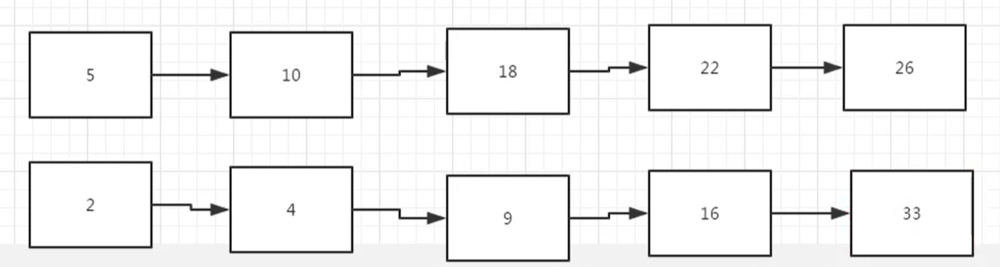
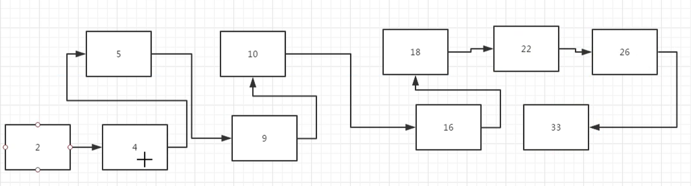

# 合并两个排序的链表

## 描述

来源：https://www.nowcoder.com/practice/d8b6b4358f774294a89de2a6ac4d9337

输入两个单调递增的链表，输出两个链表合成后的链表，当然我们需要合成后的链表满足单调不减规则。

## 思考

先有两个单调递增的链表



合并后



从上图发现，我们一共需要4个指针，第一个是头指针，第二个和第三个分别是控制两个链表的移动的指针，第四个指针是最小值的指针（前面的指针）。

## 代码

```

class Solution:
    # 返回合并后列表
    def Merge(self, pHead1, pHead2):

        if pHead1 == None:
            return pHead2
        if pHead2 == None:
            return pHead1

        # 得到最小的一个头结点
        newHead = pHead1 if pHead1.val < pHead2.val else pHead2
        # 链表1上的指针 和 链表2上的指针
        pTmp1 = pHead1
        pTmp2 = pHead2
        if newHead == pTmp1:
            pTmp1 = pTmp1.next
        if newHead == pTmp2:
            pTmp2 = pTmp2.next

        # 前面的指针
        previousPointer = newHead

        # 链表1 和 链表2 都不为空的时候，开始合并
        while pTmp1 and pTmp2:
            # 找出最小值，放在previousPointer指针后面
            if pTmp1.val < pTmp2.val:
                previousPointer.next = pTmp1
                previousPointer = pTmp1
                pTmp1 = pTmp1.next
            else:
                previousPointer.next = pTmp2
                previousPointer = pTmp2
                pTmp2 = pTmp2.next

        if pTmp1 == None:
            previousPointer.next = pTmp2
        if pTmp2 == None:
            previousPointer.next = pTmp1

        return newHead
```

