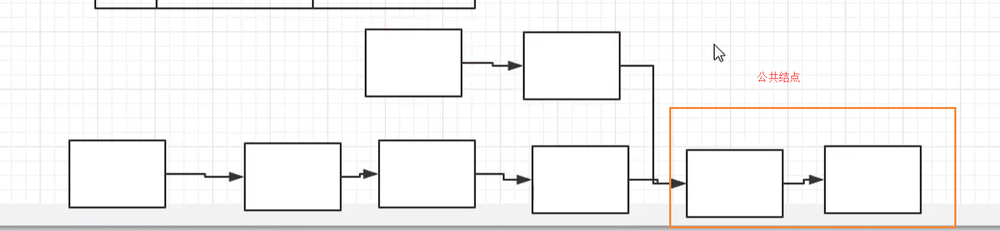

# 两个链表的公共结点

## 描述

来源：https://www.nowcoder.com/practice/6ab1d9a29e88450685099d45c9e31e46

输入两个链表，找出它们的第一个公共结点。（注意因为传入数据是链表，所以错误测试数据的提示是用其他方式显示的，保证传入数据是正确的）

## 思考

也就是说两个链表具有公共的部分



第一种方式就是遍历两个链表，找出公共的节点，并且时间复杂度为： `O(n^2)`

第二种方式，只需要花费 `O(n)`的时间复杂度

首先我们需要准备两个指针，第一个指针指向第一个的头部，另一个指向第二个链表的头部，然后我们同时移动这两个指针，当有一个指针到头的时候，另一个指针还没有到头，我们记录到这个差值N

然后在再次这样指向，但是首先需要保证那个长的链表先执行 N步，然后这两个节点再一次走，直到两个节点相交的时候，就得到了第一个公共节点。

## 代码

```
class Solution:

    # 第一个参数给比较短的链表，第二个参数给长链表的值
    # def findEqual(self,):

    def FindFirstCommonNode(self, pHead1, pHead2):
        
        # 假设输入的两个链表，是同一个链表
        if pHead1 == pHead2:
            return pHead1
        
        pTmp1 = pHead1
        pTmp2 = pHead2

        # 我们通过循环，让其中一个节点走到最后
        while pTmp1 and pTmp2:
            pTmp1 = pTmp1.next
            pTmp2 = pTmp2.next

        # 判断哪个链表先走到最后
        # 假设pTmp1，还没有走完，说明pTmp2是更短的
        if pTmp1:
            k = 0
            # 寻找链表长度之间的差值
            while pTmp1:
                pTmp1 = pTmp1.next
                k += 1
            # 我们让pTmp1先跳N步
            pTmp2 = pHead2
            pTmp1 = pHead1
            for i in range(k):
                pTmp1 = pTmp1.next

            # 当找到节点相等的时候，也就是说明该节点是公共节点
            while pTmp1 != pTmp2:
                pTmp1 = pTmp1.next
                pTmp2 = pTmp2.next
            return pTmp1

        # 假设pTmp2，还没有走完，说明pTmp1是更短的
        if pTmp2:
            k = 0
            while pTmp2:
                pTmp2 = pTmp2.next
                k += 1
            # 我们让pTmp2先跳N步
            pTmp2 = pHead2
            pTmp1 = pHead1
            for i in range(k):
                pTmp2 = pTmp2.next

            while pTmp1 != pTmp2:
                pTmp1 = pTmp1.next
                pTmp2 = pTmp2.next
            return pTmp1
```

