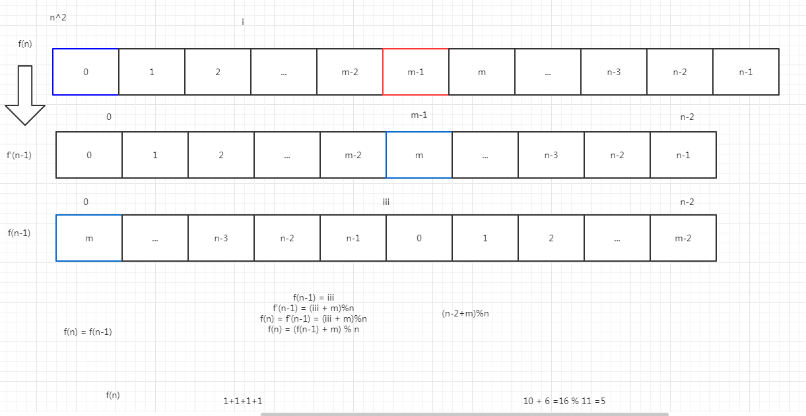
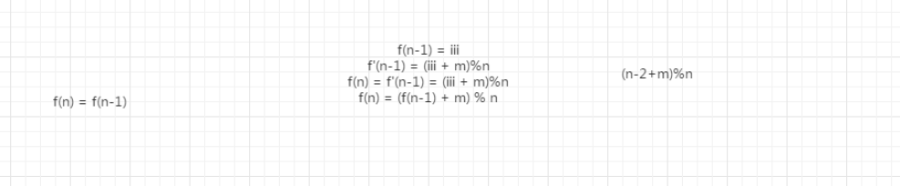

# 孩子们的游戏(圆圈中最后剩下的数)

## 描述

来源：https://www.nowcoder.com/practice/f78a359491e64a50bce2d89cff857eb6

每年六一儿童节,牛客都会准备一些小礼物去看望孤儿院的小朋友,今年亦是如此。HF作为牛客的资深元老,自然也准备了一些小游戏。其中,有个游戏是这样的:首先,让小朋友们围成一个大圈。然后,他随机指定一个数m,让编号为0的小朋友开始报数。每次喊到m-1的那个小朋友要出列唱首歌,然后可以在礼品箱中任意的挑选礼物,并且不再回到圈中,从他的下一个小朋友开始,继续0...m-1报数....这样下去....直到剩下最后一个小朋友,可以不用表演,并且拿到牛客名贵的“名侦探柯南”典藏版(名额有限哦!!^_^)。请你试着想下,哪个小朋友会得到这份礼品呢？(注：小朋友的编号是从0到n-1)

如果没有小朋友，请返回-1

## 方法1

首先第一种方法就是，循环遍历整个链表，每次找到后，把该节点删除，首先我们需要构建一个链表

```python
class ListNode:
    def __init__(self, x):
        self.val = x
        self.next = None              
```

然后在开始移动报数，我们移动 m-1步

```
# 我们找到小朋友
leftHead = None
for i in range(m-1):
    leftHead = head
    head = head.next
```

最后在把 m -1的那个节点移除链表

```
leftHead.next = head.next
head = head.next
```

最后的输出条件，就是链表中只剩下一个结点了

```
# 表示循环链表中，只剩下一个小朋友了
if head == head.next:
	return head.val
```

完整的代码如下

```python
#  孩子们的游戏(圆圈中最后剩下的数)
# 每年六一儿童节,牛客都会准备一些小礼物去看望孤儿院的小朋友,今年亦是如此。HF作为牛客的资深元老,
# 自然也准备了一些小游戏。其中,有个游戏是这样的:首先,让小朋友们围成一个大圈。然后,他随机指定一个数m,
# 让编号为0的小朋友开始报数。每次喊到m-1的那个小朋友要出列唱首歌,然后可以在礼品箱中任意的挑选礼物,
# 并且不再回到圈中,从他的下一个小朋友开始,继续0...m-1报数....这样下去....直到剩下最后一个小朋友,
# 可以不用表演,并且拿到牛客名贵的“名侦探柯南”典藏版(名额有限哦!!^_^)。请你试着想下,哪个小朋友会得到这份礼品呢？
# (注：小朋友的编号是从0到n-1)
# 如果没有小朋友，请返回-1
class ListNode:
    def __init__(self, x):
        self.val = x
        self.next = None

class Solution:
    def LastRemaining_Solution(self, n, m):
        if n == 0 or m == 0:
            return -1

        # 构建一个循环链表
        head = ListNode(0)
        tempHead = head
        for i in range(1, n):
            node = ListNode(i)
            head.next = node
            head = head.next

        head.next = tempHead
        head = tempHead
        while head:
            # 我们找到小朋友
            leftHead = None
            for i in range(m-1):
                leftHead = head
                head = head.next

            leftHead.next = head.next
            head = head.next

            # bakTmp = leftHead.next
            #
            # # while bakTmp.next != head:
            # #     bakTmp = bakTmp.next

            # 表示循环链表中，只剩下一个小朋友了
            if head == head.next:
                return head.val

if __name__ == '__main__':
    print(Solution().LastRemaining_Solution(5, 2))
```

## 方法2





这个题一开始小朋友们每个人自己的编号是确定的，就相当于我们列表里面的索引是确定的一样，然后让编号为0。

链表1：也就是 列表里面的第一个数开始报数，上图第一个链表蓝色的0,开始报数。报到 m-1 的数的 i小朋友 出列，圈里就少了一个数。定义为 f(n).

链表2：这个时候 从 m-1 的下一个 m 开始 下一轮的循环，开始报数，也就是上图第二个链表的蓝色框。再次报到 m-1 的时候，这个ii小朋友会站出来。（但是这个时候 我们链表的 循环顺序  (m-(m-2)) 发生了变化，不再是从第一个数 【链表的表头  开始循环，而是m 这个数作为起始位置的】，与之前第一个 链表循环的时候的 顺序(0-n)不同了【起始位置为链表的表头】。此时表里少了一个小朋友。这个是题意，让我们这样来找的小朋友。所以定义为 f `(n-1).

这样的话，就出现了 上图中的 链表2 ，链表3. 这样的不同的情况，这两个 找出来的第  m-1 个 小朋友 是同一个小朋友，但是 两个顺序却不相同。

链表3：这个图 是 以 m  为起始位置 来寻找第 m-1 个值的，它 就是 f(n-1)

  如果说我们想由  链表3   得到 链表2 的话，那么 我们就需要把作为起始位置的m（下标为0） 移动到 下标为（m） 的位置，那么就是下标值 +  m 。如图，我们需要移动的是 每个数值所对应的 下标 index值。让 m 在一个链表中作为起始位置来开始 报数 找 第 m - 1 个iii小朋友。

但是又由于 我们这样直接加上一个m 以后，这个 index 值有可能会大于 这个链表的长度，如果大于这个链表的长度的话，那么就是说移动到了这个链表的前一部分，所以要对我们的 这个数 对 链表的长的的一个取余：

(iii+m)%n    我们一共是 n 个值，从0-(n-1);

f(n-1) = iii

所以 f(n) = f `(n-1) = (iii+m)%n

所以 f(n) = (f(n-1)+m)

那么这个通项表达式我们就找到了，再去编写代码。

```python
# -*- coding:utf-8 -*-
class Solution:
    def LastRemaining_Solution(self, n, m):
        # write code here
        #通过推导公式可得 f(n) = (f(n-1)+m)%n
        #首先判断，当我们这个链表里没有小朋友的时候，或者找到的小朋友报的数小于1 的时候，这个时候返回一个-1，题中表示 如果测试的是0个小朋友，数0个站出来，那么返回的值应为-1.
        if n < 1 or m < 1:
            return -1
        #只有一个人的时候，说明要找的就是这一个人。那么就返回下标0 编号。
        if n==1:
            return 0
        value = 0
        #时间复杂度 o(n)
        #从 2 开始 一直到 n 个小朋友 来循环，n 个数，所以为 n+1 
        for index in range(2,n+1):
            #现在数到的 m-1 这个值 的索引。对应上上面的公式。
            currentValue = (value+m) % index
            #把找到的这个下标值 赋值给 value
            value = currentValue
        #返回编号
        return value
```

