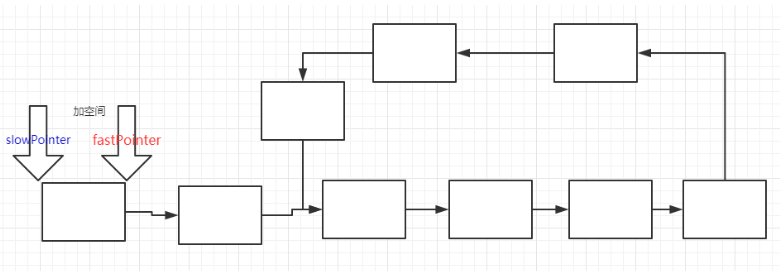

# 链表中环的入口结点

## 描述

来源：https://www.nowcoder.com/practice/253d2c59ec3e4bc68da16833f79a38e4

给一个链表，若其中包含环，请找出该链表的环的入口结点，否则，输出null

## 思考




**如何确定是否有环**

- 把所有出现的点，都放到list中
- 如果下次的节点，在list中出现，说明出现了环
- 但是这种时间复杂度比较高

**第二种方式**

定义：两个 指针，一个是慢指针，一个是快指针

假设 slow 走了 L 步，那么 fast 就走了 2L 步。

 我们 链表的头部 到 链表的环的入口结点处 的距离是 S

那么 从入口结点 到 我们 快慢指针相遇的地点 的距离 为 d。 

链表的环中，慢指针走过的距离是d，那么没走过的距离是M。

我们不确定的是快指针在链表的环里走过了多少圈来与慢指针相遇，因此 将这个参数设置为n。

```
那么 L = s + d
2L = 2(s+d) = n*(m + d) + d + s
由上面公式 推导出 n(m+d) = s + d
得到：s = n(m+d) -d；
s = nm + (n-1)(d)
s = m + (n-1)(m+d)
```

## 完整代码

```
# -*- coding:utf-8 -*-
# class ListNode:
#     def __init__(self, x):
#         self.val = x
#         self.next = None
class Solution:
    def EntryNodeOfLoop(self, pHead):
        # write code here
        #首先需要定义两个指针，其中一个快，跳两步，一个慢跳一步。
        #循环跳
        #要么是快的指针 为 none（没有环），要么是快慢指针相等（有环）。
        if pHead == None:
            return None 
		#定义两个指针，一个快的一个慢的。
        fastPointer = pHead
        slowPointer = pHead
		#当快指针存在时，而且快指针的结点指向的下一个也存在
        while fastPointer and fastPointer.next :
            #那么让快指针走两步
            fastPointer = fastPointer.next.next
            #让慢指针走一步
            slowPointer = slowPointer.next
            #如果慢指针等于快指针时，那么就说明这个链表中有环。有环的话那么就跳出，break
            if fastPointer == slowPointer:
                break
        #如果说两个指针没有相等的时候，快指针就已经走到链表的尽头了，说明这个链表没有环。那么就返回None。
        if fastPointer == None or fastPointer.next == None:
            return None
        #如果slow 走了 l 的长度 那么 fast 就走了 2l 的长度
        #假设 从开始到入口点的长度是 s；slow 在环里面走的长度是 d

        # 那么  L = s + d
        #假设 环内 slow 没走的 长度 是 m; fast 走的长度是多少
        # fast 走的长度 就是 ( m + d ) * n + d + s = 2 L
        #带入 ( m + d ) * n + d + s = 2 （s + d ）
        # s = m + (n-1)(m+d)
		#有环的话，那么就让快指针从头开始走，这次一次走一步，
        fastPointer = pHead
		#此时慢指针还在环里走着，没有走到结点
        while fastPointer != slowPointer:
            fastPointer = fastPointer.next
            slowPointer = slowPointer.next
        #当两个指针相等时，就会相遇，这时返回一个指针的值，就为 入口结点处。
        return fastPointer
```

